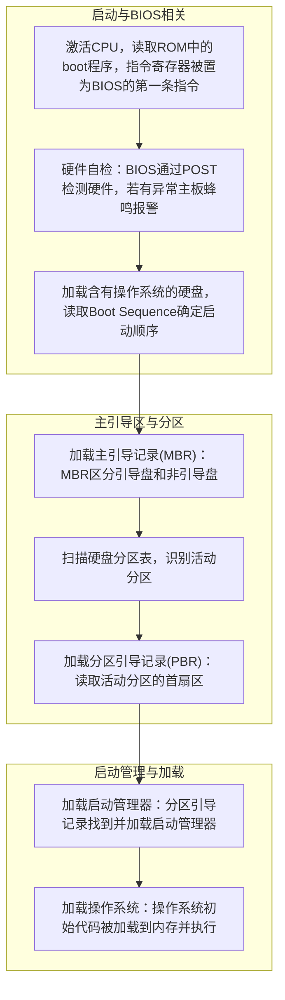
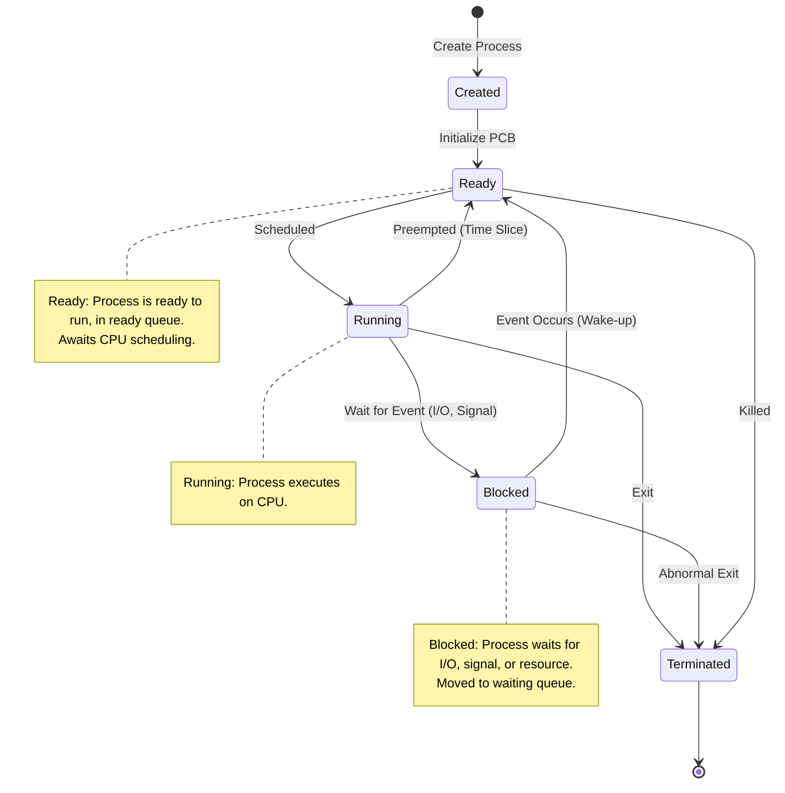
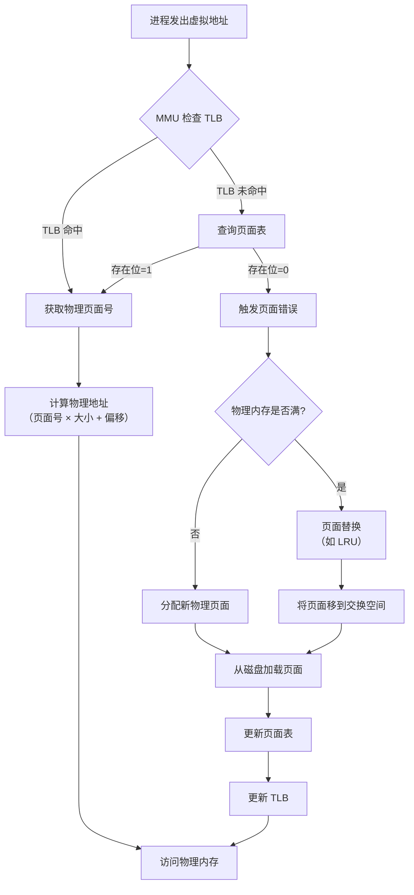
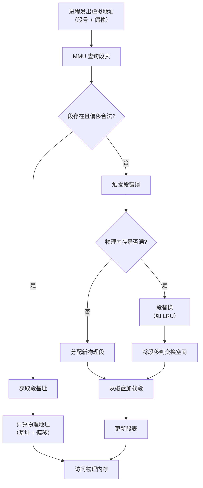
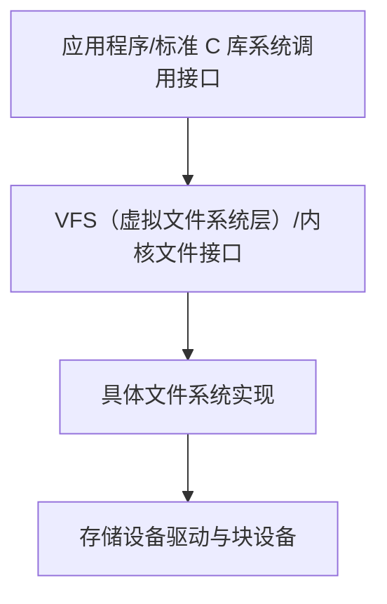
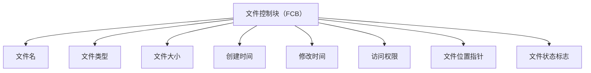

# 概论
## 基本概念
操作系统（OperatingSystem，OS）是指控制和管理整个计算机系统的硬件与软件资源，合理地组织、调度计算机的工作与资源的分配，进而为用户和其他软件提供方便接口与环境的程序集合。操作系统是计算机系统中最基本的系统软件。

操作系统的基本特征包括<u>并发、共享、虚拟和异步</u>：
1. 并发（Concurrence）
2. 共享（Sharing）
3. 虚拟（Virtual）
4. 异步（Asynchronism）

## 发展历程
1. 手工操作阶段（无操作系统）
2. 批处理阶段（操作系统开始出现）
	1. 单道批处理系统
	2. 多道批处理系统
3. 分时操作系统
4. 实时操作系统
5. 网络操作系统和分布式计算机系统
6. 个人计算机操作系统


> [!tip] 
> 此外，还有嵌入式操作系统、服务器操作系统、智能手机操作系统等

## 运行环境
### 处理器运行模式


> [!note] 特权指令和非特权指令的特点
> 1） 特权指令，是指不允许用户直接使用的指令，如 I/O 指令、关中断指令、内存清零指令，存取用于内存保护的寄存器、送 PSW 到程序状态字寄存器等的指令。
> 2） 非特权指令，是指允许用户直接使用的指令，它不能直接访问系统中的软硬件资源，仅限于访问用户的地址空间，这也是为了防止用户程序对系统造成破坏。

内核是计算机上配置的底层软件，它管理着系统的各种资源，可以看作是连接应用程序和硬件的一座桥梁，大多数操作系统的内核包括 4 方面的内容。
1. 时钟管理
2. 中断机制
3. 原语：按层次结构设计的操作系统，底层必然是一些可被调用的公用小程序，它们各自完成一个规定的操作，通常将具有这些特点的程序称为原语（Atomic Operation）。它们的特点如下：
	1. 处于操作系统的底层，是最接近硬件的部分。
	2. 这些程序的运行具有原子性，其操作只能一气呵成（出于系统安全性和便于管理考虑）。
	3. 这些程序的运行时间都较短，而且调用频繁。
	定义原语的直接方法是关中断，让其所有动作不可分割地完成后再打开中断。系统中的设备驱动、CPU 切换、进程通信等功能中的部分操作都可定义为原语，使它们成为内核的组成部分。
4. 系统控制的数据结构和处理

### 中断与异常
中断（Interruption）也称外中断，是指来自 CPU 执行指令外部的事件，通常用于信息输入/输出，如设备发出的 I/O 结束中断，表示设备输入/输出处理已经完成。时钟中断，表示一个固定的时间片已到，让处理机处理计时、启动定时运行的任务等。
异常（Exception）也称内中断，是指来自 CPU 执行指令内部的事件，如程序的非法操作码、地址越界、运算溢出、虚存系统的缺页及专门的陷入指令等引起的事件。异常不能被屏蔽，一旦出现，就应立即处理。关于内中断和外中断的联系与区别如图 1.2 所示。


### 系统调用
系统调用是指用户在程序中调用操作系统所提供的一些子功能，它可被视为特殊的公共子程序。

## 结构
1. 分层法
2. 模块化
3. 宏内核
4. 微内核
5. 外核


## 引导
操作系统（如 Windows、Linux 等）是一种程序，程序以数据的形式存放在硬盘中，而硬盘通常分为多个区，一台计算机中又可能有多个或多种外部存储设备。
操作系统引导是指计算机利用 CPU 运行特定程序，通过程序识别硬盘，识别硬盘分区，识别硬盘分区上的操作系统，最后通过程序启动操作系统，一环扣一环地完成上述过程。




## 虚拟机
虚拟机是指利用虚拟化技术，将一台物理机器虚拟化为多台虚拟机器，通过隐藏特定计算平台的实际物理特性，为用户提供抽象的、统一的、模拟的计算环境。有两类虚拟化方法。
- **第一类虚拟机管理程序**
从技术上讲，第一类虚拟机管理程序就像一个操作系统，因为它是唯一一个运行在最高特权级的程序。它在裸机上运行并且具备多道程序功能。虚拟机管理程序向上层提供若干虚拟机，这些虚拟机是裸机硬件的精确复制品。由于每台虚拟机都与裸机相同，所以在不同的虚拟机上可以运行任何不同的操作系统。


- **第二类虚拟机管理程序**
第二类虚拟机管理程序是一个依赖于 Windows、Linux 等操作系统分配和调度资源的程序，很像一个普通的进程。第二类虚拟机管理程序仍然伪装成具有 CPU 和各种设备的完整计算机。VMware Workstation 是首个 x 86 平台上的第二类虚拟机管理程序。

运行在两类虚拟机管理程序上的操作系统都称为<u>客户操作系统</u>。对于第二类虚拟机管理程序，运行在底层硬件上的操作系统称为<u>宿主操作系统</u>。


# 进程与线程
## 进程与线程
### 进程的概念与特征
从不同的角度，进程可以有不同的定义，比较典型的定义有：
1) 进程是一个正在执行程序的实例。
2) 进程是一个程序及其数据从磁盘加载到内存后，在 CPU 上的执行过程。
3) 进程是一个具有独立功能的程序在一个数据集合上运行的过程。
引入进程实体的概念后，我们可将传统操作系统中的进程定义为：“进程是进程实体的运行过程，是系统进行资源分配和调度的一个独立单位。”

进程具有以下特征：
1) 动态性
2) 并发性
3) 独立性
4) 异步性

### 进程的组成
进程是一个独立的运行单位，也是操作系统进行资源分配和调度的基本单位。它由以下三部分组成，其中最核心的是进程控制块（PCB）。

- **进程控制块**
进程控制块（Process Control Block, PCB） 是操作系统内核中用于管理和跟踪进程的核心数据结构。每个运行的进程都有一个对应的 PCB，存储了描述进程状态、资源分配和执行上下文的关键信息（<u>元信息</u>）。


<table>
	<tr>
		<th> 类别 </th>
		<th> 字段 </th>
		<th> 描述 </th>
		<th> 用途 </th>
	</tr>
	<tr>
		<td rowspan="4" class="category"> 进程标识信息 </td>
		<td> 进程 ID（PID）</td>
		<td> 唯一标识进程的编号 </td>
		<td> 区分不同进程，供内核和用户查询 </td>
	</tr>
	<tr>
		<td> 父进程 ID（PPID）</td>
		<td> 创建该进程的父进程 ID </td>
		<td> 追踪进程关系，管理进程树 </td>
	</tr>
	<tr>
		<td> 用户 ID（UID）</td>
		<td> 运行进程的用户身份 </td>
		<td> 权限控制，限制资源访问 </td>
	</tr>
	<tr>
		<td> 组 ID（GID）</td>
		<td> 进程所属的用户组 </td>
		<td> 支持组级权限管理 </td>
	</tr>
	<tr>
		<td rowspan="3" class="category"> 进程状态信息 </td>
		<td> 状态（State）</td>
		<td> 进程当前状态（如运行、就绪、阻塞）</td>
		<td> 调度器决定进程是否分配 CPU </td>
	</tr>
	<tr>
		<td> 优先级 </td>
		<td> 进程的调度优先级 </td>
		<td> 决定 CPU 分配顺序 </td>
	</tr>
	<tr>
		<td> 时间片 </td>
		<td> 分配的 CPU 时间 </td>
		<td> 支持轮转调度，控制执行时间 </td>
	</tr>
	<tr>
		<td rowspan="3" class="category"> 执行上下文 </td>
		<td> 程序计数器（PC）</td>
		<td> 下一条指令的地址 </td>
		<td> 恢复进程执行位置 </td>
	</tr>
	<tr>
		<td> 寄存器状态 </td>
		<td> CPU 寄存器值（如通用寄存器、标志寄存器）</td>
		<td> 保存进程执行状态，支持上下文切换 </td>
	</tr>
	<tr>
		<td> 堆栈指针（SP）</td>
		<td> 指向进程栈顶 </td>
		<td> 管理函数调用和局部变量 </td>
	</tr>
	<tr>
		<td rowspan="3" class="category"> 内存管理信息 </td>
		<td> 页面表指针 </td>
		<td> 指向进程的虚拟内存页面表 </td>
		<td> 支持虚拟内存地址映射 </td>
	</tr>
	<tr>
		<td> 内存分配信息 </td>
		<td> 分配的内存区域（如代码段、数据段）</td>
		<td> 跟踪内存使用情况 </td>
	</tr>
	<tr>
		<td> 内存限制 </td>
		<td> 最大内存使用量 </td>
		<td> 防止进程过度占用内存 </td>
	</tr>
	<tr>
		<td rowspan="3" class="category"> 资源管理信息 </td>
		<td> 打开文件列表 </td>
		<td> 进程打开的文件描述符 </td>
		<td> 管理文件访问 </td>
	</tr>
	<tr>
		<td> I/O 状态 </td>
		<td> 进程使用的设备信息 </td>
		<td> 协调设备访问（如键盘、网络）</td>
	</tr>
	<tr>
		<td> 信号掩码 </td>
		<td> 进程处理或屏蔽的信号 </td>
		<td> 管理信号处理（如中断、异常）</td>
	</tr>
	<tr>
		<td rowspan="2" class="category"> 调度信息 </td>
		<td> 调度参数 </td>
		<td> 优先级、队列位置等 </td>
		<td> 支持调度算法（如 CFS）</td>
	</tr>
	<tr>
		<td> CPU 使用统计 </td>
		<td> 进程的 CPU 时间消耗 </td>
		<td> 监控性能，优化调度 </td>
	</tr>
	<tr>
		<td rowspan="2" class="category"> 进程间通信信息 </td>
		<td> 消息队列 </td>
		<td> 进程间消息传递数据 </td>
		<td> 支持 IPC（如管道、消息队列）</td>
	</tr>
	<tr>
		<td> 信号量/锁 </td>
		<td> 同步和互斥机制 </td>
		<td> 协调多进程访问共享资源 </td>
	</tr>
	<tr>
		<td rowspan="2" class="category"> 其他信息 </td>
		<td> 创建时间 </td>
		<td> 进程启动时间 </td>
		<td> 监控进程生命周期 </td>
	</tr>
	<tr>
		<td> 退出状态 </td>
		<td> 进程终止时的状态码 </td>
		<td> 报告进程结束原因 </td>
	</tr>
</table>


- **程序段**
程序段就是能被进程调度程序调度到 CPU 执行的程序代码段。注意，程序可被多个进程共享，即多个进程可以运行同一个程序。

- **数据段**
一个进程的数据段，可以是进程对应的程序加工处理的原始数据，也可以是程序执行时产生的中间或最终结果。

### 进程的状态与转换
进程在其生命周期内，由于系统中各个进程之间的相互制约及系统的运行环境的变化，使得进程的状态也在不断地发生变化。通常进程有以下 5 种状态，前 3 种是进程的基本状态。
1) <u>运行态</u>。进程正在 CPU 上运行。在单 CPU 中，每个时刻只有一个进程处于运行态。
2) <u>就绪态</u>。进程获得了除 CPU 外的一切所需资源，一旦得到 CPU，便可立即运行。系统中处于就绪态的进程可能有多个，通常将它们排成一个队列，称为就绪队列。
3) <u>阻塞态</u>，又称等待态。进程正在等待某一事件而暂停运行，如等待某个资源可用（不包括 CPU）或等待 I/O 完成。即使 CPU 空闲，该进程也不能运行。系统通常将处于阻塞态的进程也排成一个队列，甚至根据阻塞原因的不同，设置多个阻塞队列。
4) <u>创建态</u>。进程正在被创建，尚未转到就绪态。创建进程需要多个步骤：首先申请一个空白 PCB，并向 PCB 中填写用于控制和管理进程的信息：然后为该进程分配运行时所必须的资源：最后将该进程转入就绪态并插入就绪队列。但是，如果进程所需的资源尚不能得到满足，如内存不足，则创建工作尚未完成，进程此时所处的状态称为创建态。
5) <u>终止态</u>。进程正从系统中消失，可能是进程正常结束或其他原因退出运行。进程需要结东运行时，系统首先将该进程置为终止态，然后进一步处理资源释放和回收等工作。


### 进程控制
- **进程的创建**
允许一个进程创建另一个进程，此时创建者称为父进程，被创建的进程称为子进程。子进程可以继承父进程所拥有的资源。当子进程被撤销时，应将其从父进程那里获得的资源还给父进程。此外，在撤销父进程时，通常也会同时撤销其所有的子进程。

在操作系统中，终端用户登录系统、作业调度、系统提供服务、用户程序的应用请求等都会引起进程的创建。操作系统创建一个新进程的过程如下（创建原语）：
1) 为新进程分配一个唯一的进程标识号，并申请一个空白 PCB（PCB 是有限的）。若 PCB 申请失败，则创建失败。
2) 为进程分配其运行所需的资源，如内存、文件、I/O 设备和 CPU 时间等（在 PCB 中体现）。这些资源或从操作系统获得，或仅从其父进程获得。如果资源不足（如内存），则并不是创建失败，而是处于创建态，等待内存资源。
3) 初始化 PCB，主要包括初始化标志信息、初始化 CPU 状态信息和初始化 CPU 控制信息，以及设置进程的优先级等。
4) 若进程就绪队列能够接纳新进程，则将新进程插入就绪队列，等待被调度运行。

- **进程的终止**
引起进程终止的事件主要有：
① 正常结束，表示进程的任务已完成并准备退出运行。
② 异常结束，表示进程在运行时，发生了某种异常事件，使程序无法继续运行，如存储区越界、保护错、非法指令、特权指令错、运行超时、算术运算错、1/O 故障等。
③ 外界干预，指进程应外界的请求而终止运行，如操作员或操作系统干预、父进程请求和父进程终止。


- **进程的阻塞与唤醒**
进程的阻塞与唤醒是操作系统中进程管理的核心机制，用于处理进程在等待资源（如 I/O、信号、锁）时的状态切换。

- 阻塞（Blocked）：
    - 定义：进程因等待某事件（如 I/O 完成、信号、资源）而暂停执行，进入阻塞状态，释放 CPU。
    - 触发场景：等待磁盘读写、网络数据、用户输入、信号量或其他进程释放资源。
    - 内核操作：进程控制块（PCB）状态更新为“阻塞”，移出就绪队列，放入等待队列（如设备等待队列）。
    - 目的：避免浪费 CPU，允许其他进程运行。
- 唤醒（Wake-up）：
    - 定义：当等待的事件发生（如 I/O 完成、信号到达），内核将进程从阻塞状态移回就绪状态，等待 CPU 调度。
    - 触发场景：中断（如设备完成 I/O）、信号量释放、定时器触发。
    - 内核操作：更新 PCB 状态为“就绪”，将进程从等待队列移到就绪队列，等待调度器分配 CPU。
    - 目的：恢复进程执行，继续处理任务。
- 关键点：
    - 阻塞是主动的（进程通过系统调用请求等待），唤醒是被动的（由内核或事件触发）。
    - 依赖 PCB 状态管理、等待队列和中断机制。
    - 阻塞/唤醒提高 CPU 利用率，确保多任务高效运行。



### 进程的通信
进程通信是指进程之间的信息交换。PV 操作是低级通信方式，高级通信方式是指以较高的效率传输大量数据的通信方式。高级通信方法主要有以下三类。

- **共享存储**


- **消息传递**


- **管道通信**

### 线程和多线程模型
线程最直接的理解就是轻量级进程，它是一个基本的 CPU 执行单元，也是程序执行流的最小单元，由线程 ID、程序计数器、寄存器集合和堆栈组成。
线程是进程中的一个实体，是被系统独立调度和分派的基本单位，线程自己不拥有系统资源，只拥有一点儿在运行中必不可少的资源，但它可与同属一个进程的其他线程共享进程所拥有的全部资源。一个线程可以创建和撤销另一个线程，同一进程中的多个线程之间可以并发执行。
由于线程之间的相互制约，致使线程在运行中呈现出间断性。
线程也有就绪、阻塞和运行三种基本状态。

- **实现方式**
	- 用户级线程（ULT）
	- 内核级线程（KLT）
	- 组合方式


- **多线程模型**
	- 多对一
	- 一对一
	- 多对多
	


## CPU 调度
### 概念
在多道程序系统中，进程的数量往往多于 CPU 的个数，因此进程争用 CPU 的情况在所难免。
CPU 调度是对 CPU 进行分配，即从就绪队列中按照一定的算法（公平、高效的原则）选择一个进程并将 CPU 分配给它运行，以实现进程并发地执行。
CPU 调度是多道程序操作系统的基础，是操作系统设计的核心问题。

一个作业从提交开始直到完成，往往要经历以下三级调度：


1. 高级调度（作业调度）
2. 中级调度（内存调度）
3. 低级调度（进程调度）


### 实现
调度程序是用于调度和分派 CPU 的组件称为调度程序，它通常由三部分组成：


1. 排队器
2. 分派器
3. 上下文切换器


### 目标
不同的调度算法具有不同的特性，在选择调度算法时，必须考虑算法的特性。为了比较 CPU 调度算法的性能，人们提出了很多评价标准，下面介绍其中主要的几种：
1. CPU 利用率
2. 系统吞吐量
3. 周转时间
4. 等待时间
5. 响应时间

### 进程切换


### 典型的调度算法

- **先来先服务（FCFS）调度算法**

- **短作业优先（SJF）调度算法**

- **高响应比优先调度算法**

- **优先级调度算法**

- **时间片轮转调度算法**

- **多级队列调度算法**


- **多级反馈队列调度算法**

## 同步与互斥
### 基本概念
- **临界资源**
虽然多个进程可以共享系统中的各种资源，但其中许多资源一次只能为一个进程所用，我们将一次仅允许一个进程使用的资源称为临界资源。

- **同步**
同步亦称直接制约关系，是指为完成某种任务而建立的两个或多个进程，这些进程因为需要协调它们的运行次序而等待、传递信息所产生的制约关系。同步关系源于进程之间的相互合作。

- **互斥**
互斥也称间接制约关系。当一个进程进入临界区使用临界资源时，另一个进程必须等待，当占用临界资源的进程退出临界区后，另一进程才允许去访问此临界资源。

### 实现临界区互斥的基本方法
- **软件实现方法**
1. 单标志法
2. 双标志先检查法
3. 双标志后检查法
4. Peterson 算法

- **硬件实现方法**
1. 中断屏蔽方法
2. 硬件指令方法——TestAndSet 指令
3. 硬件指令方法——Swap 指令

### 互斥锁
解决临界区最简单的工具就是互斥锁（mutexlock）。一个进程在进入临界区时调用 acquire() 函数，以获得锁：在退出临界区时调用 release () 函数，以释放锁。每个互斥锁有一个布尔变量 available，表示锁是否可用。如果锁是可用的，调用 acquireO 会成功，且锁不再可用。当一个进程试图获取不可用的锁时，会被阻塞，直到锁被释放。其过程描述如下：
```
acquire(){				//获得锁的定义
	while(!available)	
		;				//忙等待
	available=false;	//获得锁
}
release(){				//释放锁的定义
	available=true;		//释放锁
}
```

### 信号量
信号量机制是一种功能较强的机制，可用来解决互斥与同步问题，它只能被两个标准的原语 wait() 和 signal() 访问，也可简写为 P() 和 V()，或者简称 P 操作和 V 操作。

### 经典同步问题
- **生产者-消费者问题**


- **读者-写者问题**

- **哲学家进餐问题**


- **吸烟者问题**


### 管程


## 死锁
### 概念
所谓死锁，是指多个进程因竞争资源而造成的一种僵局（互相等待对方手里的资源），使得各个进程都被阻塞，若无外力干涉，这些进程都无法向前推进。

**死锁产生的必要条件**：产生死锁必须<u>同时</u>满足下面四个条件
- 互斥条件
- 不可剥夺条件
- 请求并保持条件
- 循环等待条件

### 预防


### 避免

### 检测与解除


# 内存管理
## 内存管理
### 基本原理与要求

### 连续分配管理方式

### 基本分页存储管理
分页存储管理是操作系统内存管理的一种机制，将物理内存和进程的虚拟地址空间划分为固定大小的页面（Page，通常为 4KB），通过页面映射实现虚拟地址到物理地址的转换，支持多任务、内存隔离和高效分配。

- **核心原理**
    - 页面划分：
        - 物理内存分为固定大小的物理页面（Page Frame）。
        - 进程的虚拟地址空间分为等大的虚拟页面。
        - 页面大小相同（如 4KB），便于管理。
    - 地址映射：
        - 虚拟地址分为页面号（Page Number）和页面偏移（Offset）。
        - 内核通过页面表（Page Table）将虚拟页面号映射到物理页面号。
        - 公式：物理地址 = 物理页面号 × 页面大小 + 页面偏移。
    - 页面表：
        - 每个进程有独立的页面表，存储在内核内存，记录虚拟页面到物理页面的映射。
        - 页面表项（PTE）包含：
            - 物理页面号。
            - 权限位（读/写/执行）。
            - 存在位（Present Bit）：页面是否在内存中。
            - 脏位（Dirty Bit）：页面是否被修改。
    - 页面错误（Page Fault）：
        - 当访问的页面不在物理内存中（存在位为 0），触发页面错误。
        - 内核从磁盘（交换空间）加载页面，或分配新页面。
    - 页面替换：
        - 物理内存满时，使用替换算法（如 LRU、FIFO）将不活跃页面移到交换空间。
        - 脏页面需写回磁盘，干净页面可直接覆盖。

- **关键组件**
    1. 虚拟地址（Virtual Address）：
        - 由页面号和页面偏移组成。
        - 示例（32 位系统，4KB 页面）：高 20 位为页面号，低 12 位为偏移。
    2. 页面表（Page Table）：
        - 存储虚拟页面到物理页面的映射。
        - 单级、多级（如 x86 的四级页面表：PML4、PDP、PD、PT）。
        - 存储在内核内存，PCB 中记录页面表指针。
    3. TLB（Translation Lookaside Buffer，转换旁路缓冲区）：
        - 高速缓存，存储最近使用的页面表项，加速地址转换。
        - TLB 未命中时，查询页面表。
    4. 交换空间（Swap Space）：
        - 硬盘或 SSD 上的区域，存储被换出的页面。
        - 配合页面替换算法管理内存不足。
    5. 内存管理单元（MMU）：
        - 硬件组件，执行虚拟地址到物理地址的转换。
        - 结合页面表和 TLB 工作。

- **工作流程**
	1. 进程发出虚拟地址访问请求。
	2. MMU 检查 TLB：
	    - 命中：直接获取物理地址。
	    - 未命中：查询页面表。
	3. 若页面表存在位为 1，获取物理页面号，计算物理地址。
	4. 若存在位为 0，触发页面错误：
	    - 内核分配物理页面或从交换空间加载。
	    - 更新页面表，恢复进程执行。
	5. 若内存满，执行页面替换，移出不活跃页面。



- **优缺点**
    - 优点：
        - 内存隔离：每个进程有独立虚拟地址空间，防止相互干扰。
        - 灵活分配：页面大小固定，减少碎片（外部碎片）。
        - 支持虚拟内存：通过交换空间扩展内存容量。
        - 高效管理：页面表和 TLB 加速地址转换。
    - 缺点：
        - 页面表开销：页面表占用内存，进程多时开销大。
        - 页面错误成本：页面错误导致磁盘 I/O，延迟高（毫秒级）。
        - 内部碎片：页面大小固定，进程数据未填满页面会浪费空间。
        - TLB 限制：TLB 容量有限，未命中增加延迟。


### 基本分段存储管理
- **核心原理**
    - 页面划分：
        - 物理内存分为固定大小的物理页面（Page Frame）。
        - 进程的虚拟地址空间分为等大的虚拟页面。
        - 页面大小相同（如 4KB），便于管理。
    - 地址映射：
        - 虚拟地址分为页面号（Page Number）和页面偏移（Offset）。
        - 内核通过页面表（Page Table）将虚拟页面号映射到物理页面号。
        - 公式：物理地址 = 物理页面号 × 页面大小 + 页面偏移。
    - 页面表：
        - 每个进程有独立的页面表，存储在内核内存，记录虚拟页面到物理页面的映射。
        - 页面表项（PTE）包含：
            - 物理页面号。
            - 权限位（读/写/执行）。
            - 存在位（Present Bit）：页面是否在内存中。
            - 脏位（Dirty Bit）：页面是否被修改。
    - 页面错误（Page Fault）：
        - 当访问的页面不在物理内存中（存在位为 0），触发页面错误。
        - 内核从磁盘（交换空间）加载页面，或分配新页面。
    - 页面替换：
        - 物理内存满时，使用替换算法（如 LRU、FIFO）将不活跃页面移到交换空间。
        - 脏页面需写回磁盘，干净页面可直接覆盖。

- **关键组件**
    1. 虚拟地址（Virtual Address）：
        - 由页面号和页面偏移组成。
        - 示例（32 位系统，4KB 页面）：高 20 位为页面号，低 12 位为偏移。
    2. 页面表（Page Table）：
        - 存储虚拟页面到物理页面的映射。
        - 单级、多级（如 x86 的四级页面表：PML4、PDP、PD、PT）。
        - 存储在内核内存，PCB 中记录页面表指针。
    3. TLB（Translation Lookaside Buffer，转换旁路缓冲区）：
        - 高速缓存，存储最近使用的页面表项，加速地址转换。
        - TLB 未命中时，查询页面表。
    4. 交换空间（Swap Space）：
        - 硬盘或 SSD 上的区域，存储被换出的页面。
        - 配合页面替换算法管理内存不足。
    5. 内存管理单元（MMU）：
        - 硬件组件，执行虚拟地址到物理地址的转换。
        - 结合页面表和 TLB 工作。

- **工作流程**
	1. 进程发出虚拟地址访问请求。
	2. MMU 检查 TLB：
	    - 命中：直接获取物理地址。
	    - 未命中：查询页面表。
	3. 若页面表存在位为 1，获取物理页面号，计算物理地址。
	4. 若存在位为 0，触发页面错误：
	    - 内核分配物理页面或从交换空间加载。
	    - 更新页面表，恢复进程执行。
	5. 若内存满，执行页面替换，移出不活跃页面。



- **优缺点**
    - 优点：
        - 内存隔离：每个进程有独立虚拟地址空间，防止相互干扰。
        - 灵活分配：页面大小固定，减少碎片（外部碎片）。
        - 支持虚拟内存：通过交换空间扩展内存容量。
        - 高效管理：页面表和 TLB 加速地址转换。
    - 缺点：
        - 页面表开销：页面表占用内存，进程多时开销大。
        - 页面错误成本：页面错误导致磁盘 I/O，延迟高（毫秒级）。
        - 内部碎片：页面大小固定，进程数据未填满页面会浪费空间。
        - TLB 限制：TLB 容量有限，未命中增加延迟。

### 段页式存储管理


## 虚拟内存管理


# 文件管理
## 文件系统基础
文件并没有统一的定义，但一般认为文件是存放在外存上的一组相关信息的集合，是对外存上数据的逻辑组织形式，是一组字节流的抽象。
文件系统是操作系统中用于管理文件的子系统，是一组用于组织、命名、访问与保护存储在块设备上的文件的数据结构和算法的集合，负责文件的存储、组织、访问和保护等功能。

除了文件本身的数据，文件系统还包括描述文件属性和文件组织结构的元数据，如文件名、文件类型、文件大小、创建时间、修改时间、访问权限等。

>[!note]
> 与内存一样，外存也是由一个个存储单元组成的，每个存储单元可以存储一定量的数据（如 1B）。每个存储单元对应一个物理地址。
> 类似于内存分为一个个“内存块“，外存会分为一个个“块/磁盘块/物理块”。每个磁盘块的大小是相等的，每块一般包含 2 的整数幂个地址。同样类似的是，文件的逻辑地址也可以分为（逻辑块号，块内地址），操作系统同样需要将逻辑地址转换为外存的物理地址（物理块号，块内地址）的形式。块内地址的位数取决于磁盘块的大小.
> 操作系统以“块”为单位为文件分配存储空间，因此即使一个文件大小只有 10B ，但它依然需要占用 1KB 的磁盘块。外存中的数据读入内存时同样以块为单位。

文件系统的逻辑层次与物理层次并存：逻辑层面提供统一的文件/目录语义和抽象，物理层面则涉及盘块、元数据结构与磁盘布局。

文件系统通常有以下分层结构：

- 用户态对外接口：开放、读写、定位、权限与属性查询等 API。
- 内核 VFS 层：统一访问路径、名称解析、缓存、权限校验等。
- 具体文件系统实现：负责在该特定文件系统下维护元数据和数据块的分配、映射、恢复等，如 ext4、NTFS、FAT32 等。
- 存储设备层：物理盘块、SSD 闪存等，以及对块设备的 I/O 调度和缓存策略。

### 文件控制块与索引节点
文件控制块（File Control Block，FCB）是操作系统用来描述文件属性和管理文件的基本数据结构。每个文件在文件系统中都有一个对应的 FCB，FCB 中包含了文件的各种信息，如文件名、文件类型、文件大小、创建时间、修改时间、访问权限等。一个典型的 FCB 结构可能包括以下字段：


在检索目录时，文件的其他描述信息不会用到，也不需要调入内存。因此，有的系统（如 UNIX，如下表）便采用了文件名和文件描述信息分离的方法，使文件描述信息单独形成一个称为索引节点的数据结构，简称 **i 节点（inode）**。在文件目录中的每个目录项仅由文件名和相应的索引节点号（或索引节点指针）构成。

| 文件名 | 索引节点编号 |
| --- | --- |
| file1.txt | 1024 |
| file2.doc | 1025 |
| image.png | 1026 |
| ... | ... |

>[!tip]
> 假设一个 FCB 为 64B，盘块大小是 1KB，则每个盘块中可以存放 16 个 FCB（FCB 必须连续存放)，若一个文件目录共有 640 个 FCB，则查找文件平均需要启动磁盘 20 次。而在 UNIX 系统中，一个目录项仅占 16B，其中 14B 是文件名，2B 是索引节点号。在 1KB 的盘块中可存放 64 个目录项。这样，可使查找文件的平均启动磁盘次数减少到原来的 1/4，大大节省了系统开销。

数据块指针布局有常见三类结构：
1. 直接指针（Direct Pointers）：直接指向数据块的指针，适用于小文件。
2. 间接指针（Indirect Pointers）：指向包含数据块地址的块，适用于中等大小文件。
3. 多级间接指针（Multi-level Indirect Pointers）：通过多级间接引用数据块地址，适用于大文件。

> [!tip]
> 在 ext4 文件系统中，i 节点结构包含了 15 个指针字段：前 12 个是直接指针，第 13 个是单级间接指针，第 14 个是双级间接指针，第 15 个是三级间接指针。这种设计允许 ext4 文件系统高效地处理从小文件到大文件的各种存储需求。
> 此外，ext4 文件系统还引入了延迟分配（delayed allocation）和 extents（连续块映射）等技术，以进一步优化存储效率和性能。

### 文件的操作
**文件打开的过程**：当用户对一个文件实施多次读/写等操作时，每次都要从检索目录开始。为了避免多次重复地检索目录，大多数操作系统要求，当用户首次对某文件发出操作请求时，须先利用系统调用open将该文件打开。系统维护一个包含所有打开文件信息的表，称为打开文件表。所谓“打开”，是指系统检索到指定文件的目录项后，将该目录项从外存复制到内存中的打开文件表的一个表目中，并将该表目的索引号（也称文件描述符）返回给用户。当用户再次对该文件发出操作请求时，可通过文件描述符在打开文件表中查找到文件信息，从而节省了大量的检索开销。当文件不再使用时，可利用系统调用close关闭它，则系统将会从打开文件表中删除这一表目。

**多进程同时打开文件**：在多个进程可以同时打开文件的操作系统中，通常采用两级表：整个系统表和每个进程表。<u>整个系统的打开文件表包含与进程无关的信息</u>，如文件在磁盘上的位置、访问日期和文件大小。<u>每个进程的打开文件表保存的是进程对文件的使用信息</u>，如文件的当前读写指针、文件访问权限，并包含指向系统表中适当条目的指针。一旦有进程打开了一个文件，系统表就包含该文件的条目。当另一个进程执行调用open时，只不过是在其打开文件表中增加一个条目，并指向系统表的相应条目。通常，系统打开文件表为每个文件关联一个打开计数器（OpenCount)，以记录多少进程打开了该文件。当文件不再使用时，利用系统调用close关闭它，会删除单个进程的打开文件表中的相应条目，系统表中的相应打开计数器也会递减。当打开计数器为0时，表示该文件不再被使用，并且可从系统表中删除相应条目。下图展示了这种结构。


文件名不必是打开文件表的一部分，因为一旦完成对FCB在磁盘上的定位，系统就不再使用文件名。对于访问打开文件表的索引号，UNIX称之为文件描述符，而Windows称之为文件句柄。因此，<u>只要文件未被关闭，所有文件操作都是通过文件描述符（不是文件名）来进行</u>。

每个打开文件都具有如下关联信息：
- 文件指针。系统跟踪上次的读写位置作为当前文件位置的指针，这种指针对打开文件的某个进程来说是唯一的，因此必须与磁盘文件属性分开保存。
- 文件打开计数。计数器跟踪当前文件打开和关闭的数量。因为多个进程可能打开同一个文件，所以系统在删除打开文件条目之前，必须等待最后一个进程关闭文件。
- 文件磁盘位置。大多数文件操作要求系统修改文件数据。查找磁盘上的文件所需的信息保存在内存中，以便系统不必为每个操作都从磁盘上读取该信息。
- 访问权限。每个进程打开文件都需要有一个访问模式（创建、只读、读写、添加等）。该信息保存在进程的打开文件表中，以便操作系统能够允许或拒绝后续的I/O请求。

### 文件保护
对文件的保护可从限制对文件的访问类型中出发。可加以控制的访问类型主要有以下几种：读、写、执行、删除和修改访问权限。不同的操作系统对文件保护的实现方法有所不同，但大致上都包括以下几种方式：
- 基于用户和组的保护。每个文件都与一个用户和一个组相关联，文件的所有者（用户）和所属组可以对文件设置不同的访问权限。
- 访问控制列表（ACL, Access Control List）。ACL 是一种更细粒度的文件保护机制，允许为不同的用户和组设置具体的访问权限。
- 权限位（Permission Bits）。许多操作系统使用权限位来表示文件的访问权限，例如 UNIX 系统使用 rwx（读、写、执行）权限位来控制文件的访问。
- 文件加密。通过加密技术保护文件内容，只有拥有正确密钥的用户才能访问文件内容。

精简的访问控制列表可采用拥有者、组和其他用户三种用户类型：
- 拥有者（Owner）：文件的创建者，通常具有最高权限。
- 组（Group）：与文件相关联的用户组，组内成员可以共享文件访问权限。
- 其他用户（Others）：不属于拥有者或组的所有其他用户。

### 文件的逻辑结构
文件的逻辑结构是指文件在用户和应用程序看来所具有的组织形式。常见的文件逻辑结构有以下两类：
- 无结构文件（Unstructured File）/流式文件（Stream File）：无结构文件是最简单的文件类型，它将文件视为一个字节流，没有特定的组织形式。应用程序可以按需读取和写入字节。由于没有结构，因而对记录的访问只能通过穷举搜索的方式进行，因此这种文件形式对很多应用来说并不十分方便。
- 有结构文件（Structured File）/记录式文件（Record File）：有结构文件具有特定的组织形式，通常由记录（Record）[^record]组成。有结构文件可以进一步分为以下几种类型：
  - 顺序文件（Sequential File）：记录按顺序存储，适用于顺序访问的应用，如日志文件。
  - 索引文件（Indexed File）：在顺序文件的基础上增加了索引结构，允许快速定位记录，适用于需要频繁随机访问的应用。
  - 索引顺序文件（Indexed Sequential File）：结合了顺序文件和索引文件的优点，既支持顺序访问，也支持快速随机访问，适用于需要两种访问方式的应用。
  - 直接文件（Direct File）/散列文件（Hashed File）：记录通过散列函数映射到存储位置，支持快速随机访问，适用于需要高效查找的应用。

[^record]: 记录是文件中的一个基本数据单位，通常由多个字段（Field）组成，每个字段存储特定类型的数据。例如，在一个员工记录中，可能包含姓名、员工编号、职位等字段。它可以分为定长记录和变长记录两种类型。其中，定长记录的每个记录长度相同，便于计算和定位记录的位置，检索记录的速度快，方便用户对文件进行处理，广泛应用于数据处理中；而变长记录的每个记录长度可以不同，适用于存储不规则数据，检索速度只能顺序查找，速度慢。

### 文件的物理结构
文件的物理结构是指文件在外存（如硬盘、SSD）上的实际存储方式。常见的文件物理结构有以下几类：
- 连续分配（Contiguous Allocation）：文件的所有数据块在外存上是连续存储的。这种方式访问速度快，但容易产生外部碎片，且文件大小难以动态调整。
- 链接分配（Linked Allocation）：文件的各个数据块通过指针链接在一起，形成一个链表结构。这种方式可以动态调整文件大小，但访问速度较慢，因为需要通过指针逐块访问。链接分配又可以分为两种方式：
  - 隐式链接分配：目录项中含有文件第一块的指针（盘块号）和最后一块的指针。每个文件对应一个磁盘块的链表，磁盘块分布在磁盘的任何地方。除文件的最后一个盘块外，每个盘块都存有指向文件下一个盘块的指针，这些指针对用户是透明的。
  - 显式链接分配：显式链接是指将用于链接文件各物理块的指针，显式地存放在内存的一张链接表中，该表在整个磁盘中仅设置一张，称为文件分配表（File Allocation Table，FAT）。每个表项中存放指向下一个盘块的指针。文件目录中只需记录该文件的起始块号，后续块号可通过查FAT找到。
- 索引分配（Indexed Allocation）：为每个文件维护一个索引块，索引块中存储文件各个数据块的地址。这种方式结合了连续分配和链接分配的优点，支持快速访问和动态调整文件大小，但索引块本身也占用存储空间。索引分配有多种实现方式，如单级索引、多级索引和混合索引等。

## 目录

## 文件系统
### 文件系统结构

### 文件系统布局
**文件系统在磁盘中的结构**
文件系统存放在磁盘上，多数磁盘划分为一个或多个分区，每个分区中有一个独立的文件系统。文件系统可能包括如下信息：启动存储在那里的操作系统的方式、总的块数、空闲块的数量和位置、目录结构以及各个具体文件等。图 4.18 所示为一个可能的文件系统布局。


1) 主引导记录（Master Boot Record，MBR)，位于磁盘的 0 号扇区，用来引导计算机，MBR 后面是分区表，该表给出每个分区的起始和结束地址。表中的一个分区被标记为活动分区，当计算机启动时，BIOS 读入并执行 MBR。MBR 做的第一件事是确定活动分区，读入它的第一块，即引导块。
2) 引导块（bootblock)，MBR 执行引导块中的程序后，该程序负责启动该分区中的操作系统。为统一起见，每个分区都从一个引导块开始，即使它不含有一个可启动的操作系统，也不排除以后会在该分区安装一个操作系统。Windows 系统称之为分区引导扇区。除了从引导块开始，磁盘分区的布局是随着文件系统的不同而变化的。文件系统经常包含有如图 4.18 所列的一些项目。
3) 超级块（superblock)，包含文件系统的所有关键信息，在计算机启动时，或者在该文件系统首次使用时，超级块会被读入内存。超级块中的典型信息包括分区的块的数量、块的大小、空闲块的数量和指针、空闲的 FCB 数量和 FCB 指针等。
4) 文件系统中空闲块的信息，可以使用位示图或指针链接的形式给出。后面也许跟的是一组 i 结点，每个文件对应一个结点，i 结点说明了文件的方方面面。接着可能是根目录，它存放文件系统目录树的根部。最后，磁盘的其他部分存放了其他所有的目录和文件。


---
**文件系统在内存中的结构**

### 文件系统实现
#### 传统磁盘文件系统
这些文件系统主要设计用于机械硬盘（HDD），也兼容 SSD，但可能未针对闪存优化。
- **FAT（File Allocation Table）**：
    - 变体：FAT12、FAT16、FAT32。
    - 特点：简单，跨平台兼容（Windows、Linux、macOS、嵌入式设备）。FAT32 支持最大 4GB 单文件，2TB 分区。
    - 适用场景：U 盘、SD 卡、老旧设备。
    - 缺点：无日志功能，可靠性低，碎片多。
- **NTFS（New Technology File System）**：
    - 特点：Windows 主流文件系统，支持大文件（最大 16EB）、日志、ACL 权限、压缩、加密。
    - 适用场景：Windows 系统盘、外部硬盘。
    - 缺点：Linux/macOS 支持有限，复杂性高。
- **ext 系列（Extended File System）**：
    - **ext2**：Linux 早期文件系统，无日志，简单高效。
    - **ext3**：增加日志，提高可靠性。
    - **ext4**：Linux 主流，最大 1EB 分区，支持扩展（extents）、延迟分配，性能优。
    - 适用场景：Linux 服务器、桌面系统。
    - 缺点：对闪存优化不足。
- **HFS/HFS+（Hierarchical File System Plus）**：
    - 特点：macOS 老文件系统，支持日志、元数据丰富。
    - 适用场景：macOS 10.12 及更早版本。
    - 缺点：性能较 APFS 差，已被取代。
- **APFS（Apple File System）**：
    - 特点：macOS 现代文件系统，优化闪存，支持快照、加密、空间共享。
    - 适用场景：macOS 10.13+、iOS 设备。
    - 缺点：与老系统兼容性差。
- **UFS（Unix File System）**：
    - 特点：UNIX 传统文件系统，支持大文件，性能稳定。
    - 适用场景：BSD 系统、Solaris。
    - 缺点：功能较老，逐渐被取代。
- **ISO 9660**：
    - 特点：光盘（CD/DVD）文件系统，跨平台。
    - 适用场景：光盘、ISO 镜像。
    - 缺点：只读，扩展性差（Joliet、Rock Ridge 扩展改善）。

#### 闪存、SSD 优化文件系统
专为闪存存储（如 SSD、eMMC、NVMe）设计，考虑擦除块和写放大问题。

- **F2FS（Flash-Friendly File System）**：
    - 特点：三星开发，优化 NAND 闪存，日志结构，支持 TRIM。
    - 适用场景：Android 设备、嵌入式系统。
    - 优点：高性能，延长闪存寿命。
- **JFFS2/YAFFS**：
    - 特点：面向嵌入式设备的日志文件系统，优化小容量 NOR/NAND 闪存。
    - 适用场景：嵌入式 Linux 设备（如路由器）。
    - 缺点：不适合大容量存储。
- **Btrfs（B-tree File System）**：
    - 特点：Linux 下一代文件系统，支持快照、子卷、数据校验、压缩。
    - 适用场景：企业存储、实验性部署。
    - 缺点：稳定性争议，复杂性高。
- **ZFS**：
    - 特点：功能强大，支持快照、数据校验、去重、RAID-Z，混合存储池。
    - 适用场景：FreeBSD、Linux 服务器、高可靠性存储。
    - 缺点：内存需求高，许可复杂。

#### 网络/分布式文件系统

用于跨网络访问或分布式存储环境。

- **NFS（Network File System）**：
    - 特点：UNIX 标准，允许远程挂载文件系统，跨机器共享。
    - 适用场景：Linux/UNIX 服务器集群。
    - 缺点：安全性配置复杂，延迟较高。
- **SMB/CIFS（Server Message Block/Common Internet File System）**：
    - 特点：Windows 网络共享协议，跨平台支持。
    - 适用场景：Windows/Linux 混合网络。
    - 缺点：早期版本安全性差。
- **HDFS（Hadoop Distributed File System）**：
    - 特点：为 Hadoop 设计，分布式、高容错，适合大文件顺序读写。
    - 适用场景：大数据处理。
    - 缺点：不适合小文件或随机写入。
- **GlusterFS/Ceph**：
    - 特点：分布式文件系统，支持扩展到 PB 级，动态扩展。
    - 适用场景：云存储、集群。
    - 优点：高可用，容错。
    - 缺点：配置复杂。
- **AFS（Andrew File System）**：
    - 特点：分布式，强调缓存一致性，跨广域网。
    - 适用场景：学术/研究环境。
    - 缺点：性能较新系统差。

#### 特殊/虚拟文件系统

用于特定用途或内存/虚拟化环境。

- **tmpfs**：
    - 特点：基于内存，速度快，断电丢失。
    - 适用场景：Linux /tmp 目录，临时文件。
    - 优点：极高性能。
    - 缺点：非持久化。
- **procfs/sysfs**：
    - 特点：Linux 虚拟文件系统，提供进程（/proc）或硬件（/sys）信息。
    - 适用场景：系统监控、调试。
    - 缺点：仅限内核交互。
- **squashfs**：
    - 特点：只读、压缩文件系统。
    - 适用场景：Live CD、嵌入式系统。
    - 优点：节省空间。

#### 其他文件系统

- **exFAT**：微软设计，优化大容量闪存，跨平台，支持大文件。
    - 适用场景：大容量 U 盘、SD 卡。
    - 缺点：无日志，可靠性稍差。
- **ReiserFS**：
    - 特点：早期 Linux 文件系统，优化小文件。
    - 适用场景：已逐渐被 ext4 取代。
- **XFS**：
    - 特点：高性能，适合大文件和大数据量。
    - 适用场景：Linux 高性能存储。
    - 缺点：元数据操作稍慢。


### 外存空闲空间管理
一个存储设备可以按整体用于文件系统，也可以细分。例如，一个磁盘可以划分为 4 个分区，每个分区都可以有单独的文件系统。包含文件系统的分区通常称为卷（volume）。卷可以是磁盘的一部分，也可以是整个磁盘，还可以是多个磁盘组成 RAID 集，如图所示。

文件存储设备分成许多大小相同的物理块，并以块为单位交换信息，因此，文件存储设备的管理实质上是对空闲块的组织和管理，它包括空闲块的组织、分配与回收等问题。

- **空闲表法**

- **空闲链表法**

- **位示图法**

- **成组链接法**


# 输入/输出管理
## I/O 管理概述

## 设备独立性软件

## 磁盘和固态硬盘

