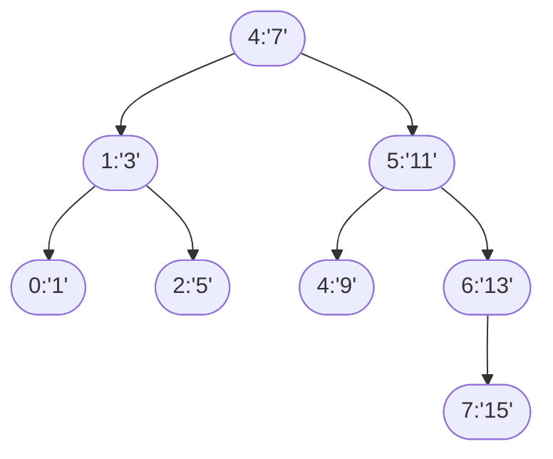

# 查找

查找的目的是在数据集合中定位一个特定的元素，或判断该元素是否存在。它广泛应用于数据库、操作系统、计算机网络等多个领域。

用于查找的数据集合称为<u>查找表</u>（查找结构），它由同一类型的数据元素（或记录）组成，可以是一个数组或链表等数据类型。对查找表经常进行的操作一般有 4 种：

1. 查询某个特定的数据元素是否在查找表中；
2. 检索满足条件的某个特定的数据元素的各种属性
3. 在查找表中插入一个数据元素；
4. 从查找表中删除某个数据元素。

- 静态查找：
  - 查找集合在查找过程中是固定的，不会插入或删除元素。
  - 示例：在一本联系人名册中查找某个名字。
- 动态查找：
  - 查找集合在查找过程中可能进行插入或删除操作。
  - 示例：数据库系统中的数据查找操作。
- 多关键字查找：
  - 数据可能存在多个关键字，查找操作需要指定查询条件。
  - 示例：根据姓名和出生日期共同定位用户。


根据查找的方式或数据结构的特点，查找可以分为以下几类：

1. 顺序查找 (Sequential Search)：
   - 从数据集合的第一个元素开始，逐个比较，直到找到目标元素或达到集合末尾。
   - 适用场景： 数据无序。
2. 二分查找 (Binary Search)：
   - 在有序的集合中找数据，利用 "分而治之" 的策略将搜索空间不断减半。
   - 前提条件： 数据必须是有序的。
   - 时间复杂度： O(log⁡n)O(\log n)O(logn)。
3. 哈希查找 (Hash Search)：
   - 通过哈希函数将关键字映射到存储地址，并直接访问目标。
   - 特点： 查找速度快，平均时间复杂度为 O(1)O(1)O(1)。
   - 适用场景： 快速查找，插入和删除操作频繁的情况。
4. 树形查找：
   - 二叉查找树 (Binary Search Tree): 每个节点的左子树小于根节点，右子树大于根节点。
   - 平衡二叉树： 如 AVL 树和红黑树，可保证查找时间复杂度 O(log⁡n)O(\log n)O(logn)。
   - B 树和 B+树： 一种多路平衡树，用于数据库的高效查找。
5. 图查找：
   - 在图的结构中，可能需要搜索路径（如广度优先搜索 BFS 和深度优先搜索 DFS）。
6. 其它查找：
   - 插值查找： 一种改进的二分查找，查找效率受数据分布规律影响。
   - 后缀树和字典树（Trie）： 适合字符串查找。
   - 跳跃表（Skip List）： 一种多级索引的有序链表数据结构，可用于快速查找。


| 查找算法      | 平均时间复杂度 | 最坏时间复杂度 | 前提条件             |
| ------------- | -------------- | -------------- | -------------------- |
| 顺序查找      | $O (n)$        | $O (n)$        | 无序或有序           |
| 二分查找      | $O (\log n)$   | $O (\log n)$   | 必须有序             |
| 哈希查找      | $O (1)$        | $O (n)$        | 哈希函数设计合理     |
| AVL 树查找    | $O (\log n)$   | $O (\log n)$   | 任意动态数据         |
| B 树/B+树查找 | $O (\log n)$   | $O (\log n)$   | 任意动态数据         |
| 字典树查找    | $O (k)$        | $O (k)$        | 适合字符串长度为 $k$ |

## 静态查找

### 顺序查找

顺序查找（Sequential Search）： 是指从线性表的<u>起始位置</u>开始，逐个扫描元素，直到找到目标值或扫描完整个表。它是一种最简单的查找方法，在无序和有序表中均可使用。

**无序表**
在一个一般线性表（即无序表）中，顺序查找逐步比较每个元素，复杂度较高，但实现简单。

实现步骤：

1. 从表的第一个元素开始，与目标关键字 `key` 进行比较。
2. 如果发现匹配元素，返回其位置；否则继续比较下一个位置的元素。
3. 如果到达表尾仍未找到目标元素，则查找失败。

时间复杂度：

- 若表中有 n 个元素：
  - 平均查找次数： $(n+1)/2$（假设每个元素查找概率相等）。
  - 最坏时间复杂度： $O(n)$ （当目标元素不存在或位于最后一个位置时）。
- 适合场景：当数据表无序，且数据量较小时使用。


可以在表尾添加一个目标值作为 "哨兵"，避免每次查找都需要判断是否越界。改进后无需在循环中检查索引边界条件。

```c
int sequential_search_with_guard(int arr[], int n, int key) {
    arr[n] = key;   // 哨兵，放置在数组最后一个位置
    int i = 0;
    while (arr[i] != key) {
        i++;
    }
    if (i == n) return -1;  // 查找失败（如果扫描到哨兵）
    return i;               // 返回索引位置
}
```


---

**有序表**
在一个有序表中，顺序查找同样逐一比较元素，查找效率和普通线性表相同，但它<u>不需要遍历所有元素</u>——当当前遍历元素大于目标值时，可提前停止查找。

实现步骤（类似普通顺序查找，但加了提前退出机制）：

1. 从表的第一个元素开始，与目标关键字 `key` 进行比较。
2. 如果发现匹配元素，返回其位置。
3. 如果当前元素大于目标关键字，由于表中元素有序，说明目标关键字不存在，查找失败。

时间复杂度：

- 查找时间与无序表相同，均为 $O(n)$，但提前退出机制可在许多情况下节约时间。
- 查找效率视目标元素与表中元素的相对位置而定，平均时间复杂度仍为 $O(n)$。

### 折半查找

折半查找（Binary Search）是搜索算法的一种，也称为二分查找（Binary Search）。它是一种高效的查找算法，用于在<u>有序集合中</u>快速找到指定的目标值。

折半查找基于“分而治之（Divide and Conquer）”的思想，核心是利用有序表的特性，每次将待查找的区间缩小为一半。

步骤：

1. 数据前提：有序表
   - 折半查找只能应用于升序或降序排列好的集合。
2. 确定中间点：
   - 每次取数据表中当前查找范围的中间元素，将该元素与目标值进行比较。
3. 比较并缩小范围：
   - 如果中间元素等于目标值，返回元素的位置。
   - 如果目标值小于中间元素，缩小查找范围到左半区间。
   - 如果目标值大于中间元素，缩小查找范围到右半区间。
4. 重复步骤： 不断重复比较和区间缩减的过程，直到找到目标值或查找区间为空。

迭代实现：

```c
int binarySearch(int arr[], int n, int key) {
    int low = 0, high = n - 1;

    while (low <= high) {  // 保证当前区间非空
        int mid = low + (high - low) / 2; // 计算中间位置，避免溢出
        if (arr[mid] == key) {  // 找到目标值
            return mid;
        } else if (arr[mid] > key) {  // 缩小左区间
            high = mid - 1;
        } else {  // 缩小右区间
            low = mid + 1;
        }
    }
    return -1;  // 查找失败
}
```

递归实现：

```c
int binarySearch(int arr[], int n, int key) {
    int low = 0, high = n - 1;

    while (low <= high) {  // 保证当前区间非空
        int mid = low + (high - low) / 2; // 计算中间位置，避免溢出
        if (arr[mid] == key) {  // 找到目标值
            return mid;
        } else if (arr[mid] > key) {  // 缩小左区间
            high = mid - 1;
        } else {  // 缩小右区间
            low = mid + 1;
        }
    }
    return -1;  // 查找失败
}
```

时间复杂度
折半查找的时间复杂度为 $O(\log_{2}n)$，因为每次查找中都会将搜索区间缩小一半。

- 最坏情况下，需要进行 ⌈ $\log_{2}n$ ⌉ 次比较。
- 举例：对于 1024 个元素的数组，最坏情况下只需比较 $\log_{2}1024=10$ 次。

空间复杂度

- 迭代法： 空间复杂度为 $O(1)$，仅需几个变量记录区间。
- 递归法： 空间复杂度为 $O(\log ⁡n)$，因为搜索树的深度为 ⌈ $\log_{2}n$ ⌉。


| 优点                                   | 缺点                                       |
| -------------------------------------- | ------------------------------------------ |
| 时间复杂度低，适用于大规模数组         | 数组必须有序                               |
| 算法实现简单，适合于静态查找的问题     | 如果数组动态变化，维持有序性会增加时间成本 |
| 比顺序查找更高效，特别是数据规模较大时 | 不适用于链表等结构（无法随机访问）         |

用<u>判定树</u>分析：假设数组长度为 $n=8$（元素为 `[1, 3, 5, 7, 9, 11, 13, 15]`）



只有最后一层不是满的，当 n 很大时，可设 $n=2^h-1$，即 $h=\log_{2}(n+1)$
平均查找长度为：
$$
\text{ASL} = \frac{1}{n}\sum\limits_{i = 1}^{h}2^{i-1}i = \frac{n}{n+1}\log_{2}(n+1) -1 \approx \log_{2}(n+1) -1
$$
其中第 $i$ 层每个节点被查找成功的次数均为 $i$，$2^{i-1}$ 表示第 $i$ 层的节点数量。

### 分块查找

分块查找又称索引顺序查找，它吸取了顺序查找和折半查找各自的优点，既有动态结构，又适于快速查找。

假设有一个包含  𝑛  个元素的线性表，数据满足某种有序性。当需要查找目标值  𝑘𝑒𝑦  时，将这个表分为  𝑏  个块（每个块包含若干个元素）： 

-  块间数据满足<u>有序关系（即后一块的最大值大于前一块的最大值）</u>； 
-  块内数据无需有序，但可以是无序或无序化索引； 
-  每块数据由一个索引结构记录，例如最大值或最小值（统称<u>块索引表</u>）。

查找过程： 

1.  建立块索引： 
    - 从每个块中提取一个<u>标志值</u>（如块内最大值或其他关键数据）； 
    - 索引值组成一个新的索引表，对其进行排序或索引存储。   
2.  块范围查找（索引查找）： 在索引表中定位目标值 𝑘𝑒𝑦 可能存在的块。   
3.  块内顺序查找：在确定的块中进行顺序查找或其他查找操作。

时间复杂度：

整个查询过程分为两个阶段：

1. 查索引表：
   - 需要扫描或折半查找索引表，设表长为 b，其查找时间复杂度为 $O(\log⁡b)$ （若索引表有序并采用二分查找）。
2. 块内查找：
   - 在一个分块中的数据量为 $k=\frac{n}{b}$；
   - 最坏情况下，块内查找需要扫描整个块，时间复杂度为 $O(k)$。

总查找时间复杂度：
$T(n)=O(\log⁡b)+O(k)$
若分块数量 b 和块内元素数量 k 接近，分块查找的平均时间复杂度接近：
$O(\sqrt{n})$
这是因为通常选择 b 和 k 的值使得 $b\times k\approx n$。

✓ 优点：分块查找可以很好地平衡查找效率，特别适合：

- 数据规模大且静态的场景；
- 查找操作频繁但增删操作较少的场景。

✕ 缺点：

- 索引表建立需要额外的空间，索引表的维护消耗时间；
- 如果表内数据动态变化频繁，重新构建分块和索引表的代价较高；
- 分块时，块数量和单块数据大小对查找效率影响较大，分块策略需要合理设计。


## 动态查找树结构

### 二叉堆

二叉堆（Binary Heap）是一种 完全二叉树（Complete Binary Tree），同时满足特定的 堆性质，广泛应用于优先队列和堆排序中。

1. 完全二叉树：

- 二叉堆是一棵完全二叉树，也就是说，叶节点都尽可能靠近树的左侧。
- 如果一棵树的高度为 $h$，则除了最后一层，其他层都必须是满的；最后一层的节点从左到右依次排列。

```
      10
     /  \
    15   30
   / \
  40  50
```

2. 堆性质：

- 最大堆（Max Heap）：对于每个节点 $N$，其值都大于或等于其子节点的值。这意味着根节点包含整个堆中的最大值。
- 最小堆（Min Heap）：对于每个节点 $N$，其值都小于或等于其子节点的值。这意味着根节点包含整个堆中的最小值。


二叉堆通常使用 数组 来表示，而不是用显式的树结构。利用数组实现堆，可以方便地通过索引访问节点的父节点和子节点。

假设堆使用数组 `arr[]` 表示：

在堆中，节点编号从 0 开始。
关系：
父节点索引：`parent(i) = (i - 1) / 2`
左子节点索引：`left(i) = 2 * i + 1`
右子节点索引：`right(i) = 2 * i + 2`


### 二叉查找树

二叉查找树（Binary Search Tree, BST）是一种特殊的二叉树，对于每个节点，满足以下性质：

- 左子树上所有节点的值均小于该节点的值。
- 右子树上所有节点的值均大于该节点的值。
- 左、右子树也分别是二叉查找树。

>[!tip]
>核心思想：利用二叉树的结构特性，通过特定的有序性约束，实现高效的查找、插入和删除操作。

因此 BST 有以下性质：

1. BST 中数据是有序的，可以进行高效的查找、插入和删除操作。
2. <u>中序遍历二叉查找树会得到一个按升序排列的节点值序列</u>。
3. 查找、插入和删除操作的时间复杂度平均为 $O(\log n)$，但在最坏情况下（如树退化为链表）可能达到 $O(n)$。


---

二叉排序树有以下基本操作：
==插入操作==

1. 从根节点开始遍历树，比较要插入的值与当前节点的值：
   - 如果值小于当前节点，则移动到左子树。
   - 如果值大于当前节点，则移动到右子树。
2. 重复比较，直到找到合适的空位置将值插入。
   实现：

```c
BSTNode* insertBST(BSTNode* T, int key) {
    if (T == NULL) { // 找到插入位置
        T = (BSTNode*)malloc(sizeof(BSTNode));
        T->data = key;
        T->left = T->right = NULL;
    } else if (key < T->data) { // 插入左子树
        T->left = insertBST(T->left, key);
    } else if (key > T->data) { // 插入右子树
        T->right = insertBST(T->right, key);
    }
    return T; // 返回根节点指针
}
```

==查找操作==

1. 从根节点查找目标值 key：
   - 如果当前节点值等于目标值 key，查找成功；
   - 如果当前节点值大于 key，转到左子树；
   - 如果当前节点值小于 key，转到右子树。
2. 如果子树为空，查找失败。

递归实现：

```c
BSTNode* searchBST(BSTNode* T, int key) {
    if (T == NULL || T->data == key) { // 若树空或找到目标值则停止
        return T; // 返回找到的节点指针或 NULL
    }
    if (key < T->data) { // 若 key 小于当前节点值，转左子树
        return searchBST(T->left, key);
    } else {             // 否则转右子树
        return searchBST(T->right, key);
    }
}
```

非递归实现：

```c
BSTNode* searchBST(BSTNode* T, int key) {
        while (T != NULL && T->data != key) { // 若树空或找到目标值则停止
        if (key < T->data)  T = T->left; // 若 key 小于当前节点值，转左子树
        else T = T->right;          // 否则转右子树
    }
    return T; // 返回找到的节点指针或 NULL
}
```

==删除操作==
删除节点需要维护二叉排序树的性质，分三种情况：

1. 删除叶子节点（无子树的节点）：直接删除该节点即可。
2. 删除只有一个子树的节点：将该节点的唯一子树连接到其父节点。
3. 删除有两个子树的节点：有两种处理方法：

  - 用中序遍历的直接后继节点（右子树中最小的节点）替代该节点，然后删除这个后继节点；
  - 用中序遍历的直接前驱节点（左子树中最大的节点）替代该节点，然后删除这个前驱节点。

实现：

```c
BSTNode* deleteBST(BSTNode* T, int key) {
    if (T == NULL) return T; // 树为空，直接返回

    if (key < T->data) { // 转左子树
        T->left = deleteBST(T->left, key);
    } else if (key > T->data) { // 转右子树
        T->right = deleteBST(T->right, key);
    } else { // 找到要删除的节点
        if (T->left == NULL) { // 只有右子树或无子树
            BSTNode* temp = T->right;
            free(T);
            return temp;
        } else if (T->right == NULL) { // 只有左子树
            BSTNode* temp = T->left;
            free(T);
            return temp;
        } else { // 有两个子树
            // 找到右子树的最小节点（直接后继）
            BSTNode* temp = T->right;
            while (temp->left != NULL) {
                temp = temp->left;
            }
            T->data = temp->data; // 用后继节点值替代当前节点值
            T->right = deleteBST(T->right, temp->data); // 删除后继节点
        }
    }
    return T; // 返回根节点指针
}
```

>[!note]
>若在二叉排序树中删除并插入某个节点，得到的树结构<u>可能与原树不同</u>，但仍然满足二叉排序树的性质。

---

⏲时间复杂度分析：
查找、插入、删除的时间复杂度依赖于树的高度 $h$：

- 在理想情况下（平衡树）（与折半查找相同），树的高度 $h = O(\log n)$，查找时间复杂度为 $O(\log n)$；
- 在最坏情况下（退化为单链表/单枝树）（与顺序表相同，关键字有序时），树的高度 $h = O(n)$，查找时间复杂度为 $O(n)$。
  二叉排序树平均查找长度为：$O(\log n)$


✓ 优点：

- 动态：树的结构会随数据的插入和删除自动调整。
- 中序遍历有序：<u>二叉排序树的中序遍历是递增序列</u>，特别适合排序操作。
- 查找效率较高（树较平衡时）。

✕ 缺点：

- 不平衡性：二叉排序树本身没有强制平衡的机制，在数据分布不均匀的情况下，可能退化为单链表，导致性能下降。
- 额外存储代价：需要存储节点的左、右子指针。


### 平衡二叉树

BST 的性能高度依赖于树的高度 ($h$)，而它可能会因为插入或删除操作导致高度不平衡（如退化为链表结构），从而对性能造成影响。因此，为了避免退化问题，往往会使用平衡二叉排序树（Balanced Binary Tree）。
"平衡"并没有严格唯一的定义，核心目标是约束树的高度。常见的平衡条件有：

- 高度平衡：对于树中每一个节点，其左子树高度和右子树高度之差（平衡因子 Balance Factor, BF）满足 $|\text{BF}| \leqslant k$（$k$ 是一个小常数，通常是 1 或 2）。例子：AVL 树 ($|\text{BF}| \leqslant 1$)。
- 颜色平衡 (近似高度平衡)：通过给节点附加颜色（如红、黑）并制定规则来间接限制树的高度。例子：红黑树。
- 其他约束：
  - 保证根到叶子节点的所有路径长度（边数）相差不大。
  - 保证树的结构接近完全二叉树或满二叉树。


旋转操作是所有平衡二叉树的核心机制。它们通过在小范围内重新调整节点及其子树的连接方式（改变父子关系），在$O(1)$时间内局部地调整树的结构，以降低高度或平衡因子。基本旋转有两种：

- 左旋（Left Rotation/RR Rotation）：解决右子树过重（右右失衡）。将某节点的右子树提升为该节点的父节点，原节点成为新父节点的左子节点。若右子树有左子树，则该左子树成为原节点的右子树。

```text
  X (失衡点)              Y (新根)
   \                   /    \
    Y      ======>    X      Z
   / \                 \    / \
  T2  Z               T2  T3  T4
     / \
    T3 T4
```

- 右旋（Right Rotation/LL Rotation）：解决左子树过重（左左失衡）。将某节点的左子树提升为该节点的父节点，原节点成为新父节点的右子节点。若左子树有右子树，则该右子树成为原节点的左子树。

```text
      Y (失衡点)          X (新根)
     /                  /   \
    X       ======>    Z     Y
   / \                / \   /
  Z   T2            T0 T1 T2
 / \
T0  T1
```

此外，还有双旋转（Left-Right Rotation/LR Rotation 和 Right-Left Rotation/RL Rotation），用于处理更复杂的失衡情况。

- 左右旋（Left-Right Rotation/LR Rotation）：解决左孩子的右子树导致的失衡。先对左子树进行左旋，再对当前节点进行右旋。

```text
      Z (失衡点)          Z                 Y (新根)
     /                  /                /    \
    X       ======>    Y      ======>   X      Z
     \                / \              / \    / \
      Y              X   T3           T1 T2  T3 T4
     / \              \
   T1  T2             T2
```

- 右左旋（Right-Left Rotation/RL Rotation）：解决右孩子的左子树导致的失衡。先对右子树进行右旋，再对当前节点进行左旋。

```text
    Z (失衡点)            Z                    Y (新根)
      \                  \                  /    \
       X      ======>     Y      ======>   Z      X
      /                  / \              / \    / \
     Y                  T1  X           T0 T1  T2 T3
    / \                   /
  T1  T2                T2
```


==AVL 树==
AVL 树（Adelson-Velsky and Landis Tree）是最早发明的平衡二叉查找树，由苏联数学家 G.M. Adelson-Velsky 和 E.M. Landis 在 1962 年提出。AVL 树通过严格控制每个节点的平衡因子，确保树的高度始终保持在 $O(\log n)$ 范围内，从而实现高效的查找、插入和删除操作。

AVL 树拥有最严格的平衡条件：对于每个节点，其左子树和右子树的高度差（平衡因子 BF）只能是 -1、0 或 1，即 $|\text{BF}| \leqslant 1$。这种严格的平衡保证了 AVL 树在任何情况下都能保持较低的高度。

由定义可知，$n$ 个节点的平衡二叉树的高度 $h$ 满足：
$$h \leq 1.44 \log_2(n + 2) - 1.328$$
因此，平衡二叉树的查找、插入和删除操作的时间复杂度均为 $O(\log n)$。

当插入或删除节点时，AVL 树可能会失去平衡。<u>为了恢复平衡，需要从新插入/删除的节点向上回溯到根节点，找出第一个失衡的祖先节点，然后根据失衡类型 (LL, RR, LR, RL) 进行相应的旋转。</u>

✓ 优点：

1. 高效查询：AVL 树是高度平衡的，查找操作的时间复杂度为 $O(\log n)$（<u>这在所有平衡二叉树中是最优的</u>）。
2. 动态性：与静态的排序数组不同，AVL 树可以动态插入或删除节点，同时保持数据结构的平衡。

✕ 缺点：

1. 插入与删除较复杂
   - 每次插入或删除后需要检测并维护树的平衡，涉及多个旋转操作，增加了额外时间消耗（维护平衡的开销较大）。
   - 插入和删除的时间复杂度为 $O(\log n)$。
2. 存储开销较大：需要存储每个节点的高度信息或平衡因子。


==红黑树==
红黑树（Red-Black Tree）是一种近似平衡的二叉查找树，通过对节点进行颜色标记（红色或黑色）并遵循特定的规则来维持树的平衡。红黑树在插入和删除操作时，通过颜色调整和旋转操作来确保树的高度保持在 $O(\log n)$ 范围内，从而实现高效的查找、插入和删除操作。

红黑树拥有 5 个巧妙的节点着色规则：

1. 颜色属性：每个节点非红即黑。
2. 根属性：根节点必须是黑色的。
3. 叶子属性：所有叶子节点(null/NIL节点，通常不显式存储)都是黑色的。
4. 红色属性：红色节点不能连续相连（红色节点的父节点和子节点都不能是红色）。
5. 路径属性：从任意节点出发，到达其所有后代叶子节点的所有路径上，包含的黑色节点个数相同（这个相同的数量称为节点的黑高 black-height）。

插入和删除操作可能会违反上述规则（尤其是根属性和红色属性，<u>新插入的节点默认为红色</u>），因此<u>需要通过重新着色和旋转操作来恢复红黑树的性质</u>。红黑树的插入和删除操作的时间复杂度均为 $O(\log n)$。

✓ 优点：

- 查找、插入、删除操作的性能都稳定在 $O(\log n)$（树高约束在 $2 \log_2 n$ 左右）。
- 相对于 AVL 树，插入/删除所需的旋转次数通常较少 (平均更优)，维护平衡的开销更低。
- 工程实践首选，广泛应用于需要高效有序关联容器的库中（如 C++ STL 的 `map`, `set`, `multimap`, `multiset`；Java 的 `TreeMap`, `TreeSet`）。

✕ 缺点：

- 查找性能略逊于 AVL 树（因为红黑树允许更大的不平衡）。
- 实现复杂度较高：需要处理节点颜色和多种旋转情况，代码实现相对复杂。


==伸展树==

==Treap==

### B 树和 B+ 树

B 树和 B+ 树是多路平衡查找树（M-ary Balanced Search Tree），广泛应用于数据库和文件系统中，用于高效地存储和检索大量数据。

由于磁盘读取速度远慢于内存，因此每次磁盘 I/O 读取大量数据（通常以块或页为单位，如 4KB 或 16KB）的效率远高于多次读取小块数据。传统的二叉树结构（如 AVL、红黑树）不适合这种场景，因为树的高度高，导致磁盘访问次数过多。
B 树和 B+ 树通过增加每个节点的子节点数量，降低树的高度，从而减少磁盘 I/O 次数，提高查询效率。

B 树和 B+ 树的应用场景十分广泛，主要包括：

- 数据库索引：B 树和 B+ 树是关系型数据库（如 MySQL、PostgreSQL、Oracle）中常用的索引结构，用于加速数据的查找和范围查询。
- 文件系统：许多文件系统（如 NTFS、HFS+）使用 B 树或 B+ 树来管理文件目录和数据块，提高文件访问效率。


#### B 树

B 树是一种自平衡的多路查找树，其每个节点可以有多个子节点，并且所有叶子节点都在同一层。

B 树的阶数（Order）定义了每个节点的最大子节点数。常见的定义方式为：

- Knuth 定义：一个阶为 $m$ 的 B 树
  - 每个节点最多有 $m$ 个子节点。
  - 每个非叶子节点至少有 $\lceil m/2 \rceil$ 个子节点。
  - 如果根节点不是叶子节点，则至少有两个子节点。
  - 有 $k$ 个子节点的非叶子节点包含 $k-1$ 个关键字。
  - 所有叶子节点都在同一层。

B 树有如下性质：

- 除根节点外，所有内部节点和叶子节点的键数至少为 $m/2 - 1$（最小填充度要求）。
- 每个节点的键按升序排列。
- 节点的每个键将子树的键范围划分为多个区间，例如：键为 $k1$, $k2$, ..., $kn$，则对应子树的键范围为 $[−\infty,k1)$, $[k1, k2)$, ..., $[kn, +\infty)$。

---

B 树的操作与二叉查找树类似，但每个操作需要维护节点的最小填充度和树的平衡性。
==查找操作==

1. 从根节点开始，比较目标键与节点中的键。
2. 如果找到匹配键，返回该节点。
3. 如果目标键小于当前节点的最小键，转到左子树；如果大于最大键，转到右子树；否则，找到合适的子树继续查找。

==插入操作==

1. 从根节点开始，找到合适的叶子节点插入新键。
2. 如果叶子节点已满（达到最大键数 $m-1$），则需要分裂该节点：
   - 将中间键提升到父节点，分裂成两个节点。
   - 如果父节点也满，则递归分裂父节点，直到根节点。
3. 如果根节点分裂，则创建一个新的根节点，树的高度增加 1。

==删除操作==

1. 从根节点开始，找到包含要删除键的节点。
2. 如果节点是叶子节点，直接删除键。
3. 如果节点是内部节点，找到前驱或后继键替代删除键，然后删除前驱或后继键。
4. 删除后，如果节点的键数低于最小填充度，则需要进行合并或借键操作：
   - 从兄弟节点借一个键，或者
   - 与兄弟节点合并，并将父节点的一个键下移。

---

✓ 优点：

- 适合磁盘存储：通过增加节点的子节点数，降低树的高度，减少磁盘 I/O 次数。
- 动态平衡：插入和删除操作自动维护树的平衡性。
- 支持范围查询：由于节点中存储多个键，范围查询效率较高。

✕ 缺点：

- 实现复杂：插入和删除操作涉及节点分裂和合并，代码实现较复杂。


#### B+ 树

B+ 树是 B 树的一个重要变种，其设计目标是进一步提升范围查询性能。它是现代数据库（如 MySQL 的 InnoDB、Oracle 索引）的标准数据结构。

B+ 树与 B 树的主要区别在于：

1. 内部节点（非叶子节点）：仅存储键值和子节点指针，不存储实际数据记录。用于导航查找路径。
2. 叶子节点：存储所有数据记录，并且按键值顺序链接形成一个有序链表，便于范围查询。
3. 键的重复：B+ 树允许在叶子节点中存储重复键，而内部节点中的键是唯一的。
4. 叶子节点位置：所有叶子节点都在同一层，且通过指针相连，形成一个有序链表。

---

B+ 树的操作与 B 树类似，但在插入和删除时需要特别处理叶子节点的链接关系。
==查找操作==

1. 从根节点开始，比较目标键与节点中的键。
2. 如果找到匹配键，继续向下查找直到叶子节点。
3. 在叶子节点中找到目标键对应的数据记录。

==插入操作==

1. 从根节点开始，找到合适的叶子节点插入新键。
2. 如果叶子节点已满（达到最大键数 $m-1$），则需要分裂该节点：
   - 将中间键提升到父节点，分裂成两个叶子节点。
   - 更新叶子节点之间的链表指针。
   - 如果父节点也满，则递归分裂父节点，直到根节点。
3. 如果根节点分裂，则创建一个新的根节点，树的高度增加 1。

==删除操作==

1. 从根节点开始，找到包含要删除键的叶子节点。
2. 如果节点是叶子节点，直接删除键。
3. 删除后，如果节点的键数低于最小填充度，则需要进行合并或借键操作：
   - 从兄弟节点借一个键，或者
   - 与兄弟节点合并，并将父节点的一个键下移。

---

✓ 优点：

- 高效范围查询：叶子节点通过链表连接，支持快速的范围查询。
- 适合磁盘存储：与 B 树类似，降低树的高度，减少磁盘 I/O 次数。
- 动态平衡：插入和删除操作自动维护树的平衡性。
- 内存利用率高：由于内部节点只存储键和指针，叶子节点存储实际数据，内存利用率更高。

✕ 缺点：

- 实现复杂：插入和删除操作涉及节点分裂、合并和链表指针更新，代码实现较复杂。

### Trie 树

## 哈希表

哈希表通过一个 散列函数（Hash Function） 将关键字 key 映射到对应的哈希地址 hash(key)，然后将值存放在对应的哈希地址中。

- 数据插入：将关键字通过散列函数映射到哈希表中，对应地址存储数据。
- 数据查找：通过关键字计算其地址，直接跳转到目标地址获取数据。

哈希表由以下几部分构成：

- 关键字集合：需要存储数据对应的关键字集合。
- 散列函数：将关键字映射到表地址的函数。
- 存储空间（数组）：存储结果的固定长度集合。
- 冲突处理方法：当不同关键字映射到同一地址时的冲突处理策略。

### Hash 函数的构造方法

**直接定址法**
直接定址法适用于关键字范围较小且连续的情况。直接使用关键字作为哈希地址。

- ✓ 优点：实现简单，关键字和地址<u>一一对应</u>，查找速度快。
- ✕ 缺点：若关键字集合跨度大则会浪费空间，适用范围有限。

**质数取余法 (除留余数法)**
质数取余法是常用的哈希函数构造方法。选择一个合适的质数 $p$，计算哈希地址为：
$$\text{hash}(\text{key}) = \text{key} \mod p$$
使用质数的原因是质数的数学特性能显著提升哈希函数的分布均匀性，减少冲突的概率。

- ✓ 优点：质数取余法能较好地分散关键字，减少冲突。
- ✕ 缺点：需要选择合适的质数 $p$，否则可能导致冲突增多。

关于选择质数 $p$ 的建议：

1. 质数 $p$ 应接近哈希表大小 $m$，但不等于 $m$。这样可以充分利用表空间。
2. 避免选择过小的质数，以防止冲突过多。

**平方取中法**
平方取中法是另一种常用的哈希函数构造方法。其基本思想是：

1. 计算关键字的平方值。
2. 取平方值的中间部分作为哈希地址。

例如：关键字为 $0100, 0101, 0102$，平方值分别为 $0010000, 0010401, 0010604$，取中间部分后映射为哈希地址 $0100, 0101, 0102$。

- 优点：平方取中法能较好地分散关键字，减少冲突。
- 缺点：实现较复杂，需注意取中部分的位数选择。

### 冲突处理

冲突是指关键字得到的哈希地址已有数据存储，处理冲突是指为该关键字找到新的存储位置的过程。
有以下几种常用的冲突处理方法：

**开放地址法**
开放地址法是在发生冲突时，通过探测其他空闲地址来存储冲突的关键字。常见的探测方法有：

1. 线性探测法（Linear Probing）：依次检查下一个地址，直到找到空闲位置。

- 优点：实现简单，易于理解。
- 缺点：容易产生<u>一次聚集</u>现象，需要线性探测多次才能找到空槽，导致查找效率下降。

2. 二次探测法（Quadratic Probing）：按照二次方的方式探测地址，如 $hash(key) + i^2$。

- 优点：减少了一次聚集现象，分布更均匀。
- 缺点：存在 <u>二次聚集（Secondary Clustering）</u>： 不同的关键字可能会探测到相同的位置。而且需要合适设计常数 c1 和 c2，复杂度比线性探测略高。

3. 双重散列法（Double Hashing）：使用第二个哈希函数计算探测步长。

- 优点：减少了一次聚集和二次聚集，大幅提高了探测的效率。是一种广泛使用的开放地址法。
- 缺点：实现相对复杂，需要合理设计两种哈希函数。

4. 伪随机探测法（Pseudo-random Probing）：使用伪随机数序列确定探测地址。

两个本来不发生冲突的非同义词，也就是哈希地址不同的结点，发生争夺同一个地址的现象称为二次聚集或堆积。


在开放地址法中，哈希表的性能很大程度上取决于装载因子（Load Factor, 通常记为 $\alpha$），它描述了哈希表中已使用槽位的比例：
$$\alpha = \frac{n}{m}$$
其中，$n$ 是哈希表中已存储的元素数量，$m$ 是哈希表的总槽位数。

- 当 $\alpha$ 较小时，哈希表的性能较好，冲突较少，查找和插入操作效率高。
- 当 $\alpha$ 接近 1 时，冲突频繁，查找和插入操作效率下降。


**链地址法**
链地址法是将冲突的关键字存储在同一个地址的链表中。每个哈希地址对应一个链表，所有映射到该地址的关键字都插入到该链表中。

- 优点：实现简单，易于动态扩展，适用于冲突较多的情况。
- 缺点：查找效率受链表长度影响，可能退化为顺序查找。


**再哈希法**
再哈希法是在发生冲突时，使用另一个哈希函数计算新的地址。再哈希法可以有效减少冲突，但需要额外的计算开销。

**建立一个公共溢出区**
建立一个公共溢出区是将所有冲突的关键字存储在一个单独的区域中。哈希表中的每个地址只存储一个关键字，冲突的关键字都存储在溢出区中。

### 变体

==布隆过滤器==

==跳表==

## 工程应用与优化

### 数据库索引设计

（B+树 vs LSM树对比）

### 倒排索引

（搜索引擎关键词-文档映射）

### 缓存优化

（LRU/LFU算法）

## 搜索

### 剪枝

可行性剪枝（直接排除不可行动作）
最优性剪枝（当前路径劣于已知解）
α-β剪枝（博弈树优化）

### 双向 BFS

时间复杂度优化（将指数级变为平方根级）

### 记忆化搜索

动态规划与记忆化递归关系
示例：斐波那契数列、最长公共子序列

### 迭代加深搜索

适用场景：深度未知、空间巨大的树

### 启发式搜索

评估函数设计：g(n)+h(n)
最优性条件（h(n) ≤ h*(n)）
应用：八数码问题、路径规划（Dijkstra vs A*）