[toc]
# 计算机系统概述
## 计算机硬件发展
### 计算机四代变化
从 1946 年世界上第一台电子数字计算机（Electronic NumericalIntegratorAndComputer, ENIAC）问世以来，计算机的发展已经经历了四代。

- 第一代计算机（1946─1957 年）一—电子管时代。特点：逻辑元件采用电子管；使用机器语言进行编程；主存用延迟线或磁鼓存储信息，容量极小；体积庞大，成本高；运算速度较低，一般只有几千次到几万次每秒。
- 第二代计算机（1958 一 1964 年）—晶体管时代。特点：逻辑元件采用晶体管；运算速度提高到几万次到几十万次每秒；主存使用磁芯存储器；计算机软件也得到了发展，开始出现了高级语言及其编译程序，有了操作系统的雏形。
- 第三代计算机（1965—1971 年）—一中小规模集成电路时代。特点：逻辑元件采用中小规模集成电路；半导体存储器开始取代磁芯存储器；高级语言发展迅速，操作系统也进一步发展，开始有了分时操作系统。
- 第四代计算机（1972 年至今）一超大规模集成电路时代。特点：逻辑元件采用大规模集成电路和超大规模集成电路，产生了微处理器；诸如并行、流水线、高速缓存和虚拟存储器等概念用在了这代计算机中。

### 计算机元件的更新换代
1）**摩尔定律**。当价格不变时，集成电路上可容纳的晶体管数目，约每隔 18 个月便会增加一倍，性能也将提升一倍。也就是说，我们现在和 18 个月后花同样的钱买到的 CPU，后者几的性能是前者的两倍。这一定律揭示了信息技术进步的速度。
2）半导体存储器的发展。1970 年，仙童半导体公司生产出第一个较大容量的半导体存储器，至今，半导体存储器经历了 11 代：单芯片 1KB、4KB、16KB、64KB、256KB、1MB、（4MB、16MB、64MB、256MB 和现在的 1GB。
3）微处理器的发展。自 1971 年 Intel 公司开发出第一个微处理器 Intel4004 至今，微处理器经历了 Intel 8008(8 位)、Intel 8086(16 位)、Intel 80386(32 位)、Pentium(32 位)、Pentium IlI(64 位)、Pentium 4(64 位)、Core i7(64 位)等。这里的 32 位、64 位指的是机器字长，是指计算机进行一次整数运算所能处理的二进制数据的位数。

## 计算机硬件层次结构

> [!note] 软件和硬件的逻辑功能等价性
> 在特定条件下，用软件实现的逻辑功能也可以通过硬件电路来实现，反之亦然。
> 对于一些特定的计算或控制任务，可以选择将其使用软件编程来实现，也可以选择设计专用硬件电路来实现，而两者的结果将在功能上等效。
> 
> 软件和硬件的逻辑功能等价性是计算机科学中的一个重要概念，也是计算机体系结构和工程中的基本原则之一。
> 
> 当选择在软件层面实现某些逻辑功能时，这通常意味着使用通用处理器（例如 CPU）来执行程序；而当选择在硬件层面实现这些逻辑功能时，这通常意味着使用专用的硬件电路，例如现场可编程门阵列 FPGA (Field Programmable Gate Aray) 或专用集成电路 ASIC (Application Specific Integrated Circuit) 技术。

### 冯诺依曼机
冯·诺依曼在研究 EDVAC 机时提出了“<u>存储程序</u>”的概念，“存储程序”的思想奠定了现代计算机的基本结构，以此概念为基础的各类计算机通称为冯·诺依曼机，其特点如下：
- 采用“存储程序”的工作方式。
- 计算机硬件系统由运算器、存储器、控制器、输入设备和输出设备 5 大部件组成。
- 指令和数据以同等地位存储在存储器中，形式上没有区别，但计算机应能区分它们。
- 指令和数据均用二进制代码表示。指令由操作码和地址码组成，操作码指出操作的类型，地址码指出操作数的地址。

“存储程序”的基本思想是：将事先编制好的程序和原始数据送入主存后才能执行，一旦程序被启动执行，就无须操作人员的干预，计算机会自动逐条执行指令，直至程序执行结束。

### 计算机功能部件

- **输入设备**
- **输出设备**
- **存储器**

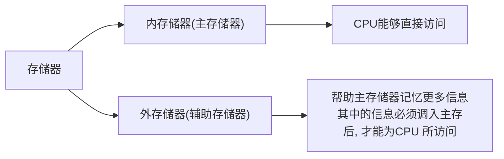

主存储器的工作方式是按存储单元的地址进行存取，这种存取方式称为按地址存取方式。

主存储器的最基本组成如图 1.1 所示。存储体存放二进制信息，地址寄存器（MAR）存放访存地址，经过地址译码后找到所选的存储单元。数据寄存器（MDR）用于暂存要从存储器中读或写的信息，时序控制逻辑用于产生存储器操作所需的各种时序信号。

存储体由许多存储单元组成，每个存储单元包含若干存储元件，每个存储元件存储一位二进制代码“0”或“1”。因此存储单元可存储一串二进制代码，称这串代码为存储字，称这串代码的位数为存储字长，存储字长可以是 1B（8bit）或是字节的偶数倍。

MAR 用于寻址，其位数对应着存储单元的个数，如 MAR 为 10 位，则有 21° = 1024 个存储单元，记为 1K。MAR 的长度与 PC 的长度相等。MDR 的位数和存储字长相等，一般为字节的 2 次幂的整数倍。

>[!caution] 
>MAR 与 MDR 虽然是存储器的一部分，但在现代计算机中却是存在于 CPU 中的；另外，后文提到的高速缓存（Cache)也存在于 CPU 中。

- **运算器**

运算器是计算机的执行部件，用于进行算术运算和逻辑运算。算术运算是按算术运算规则进行的运算，如加、减、乘、除：逻辑运算包括与、或、非、异或、比较、移位等运算。

运算器的核心是算术逻辑单元（Arithmetic and Logical Unit，ALU）。运算器包含若干通用寄存器，用于暂存操作数和中间结果，如累加器（ACC）、乘商寄存器（MQ)、操作数寄存器（X）、变址寄存器（IX）、基址寄存器（BR）等，其中前 3 个寄存器是必须具备的。

运算器内还有程序状态寄存器（PSW），也称标志寄存器，用于存放 ALU 运算得到的一些标志信息或处理机的状态信息，如结果是否溢出、有无产生进位或借位、结果是否为负等。

- **控制器**

控制器是计算机的指挥中心，由其“指挥”各部件自动协调地进行工作。控制器由程序计数器（PC)、指令寄存器（IR）和控制单元（CU）组成。

PC 用来存放当前欲执行指令的地址，具体自动加 1 的功能（这里的“1”指一条指令的长度），即可自动形成下一条指令的地址，它与主存的 MAR 之间有一条直接通路。

IR 用来存放当前的指令，其内容来自主存的 MDR。指令中的操作码 OP(IR)送至 CU，用以分析指令并发出各种微操作命令序列：而地址码 Ad(IR)送往 MAR，用以取操作数。

一般将运算器和控制器集成到同一个芯片上，称为中央处理器（CPU)。CPU 和主存储器共同构成主机，而除主机外的其他硬件装置（外存、1/O 设备等）统称为外部设备，简称外设。

图 1.2 所示为冯·诺依曼结构的模型机。CPU 包含 ALU、通用寄存器组 GPRs、标志寄存器、控制器、指令寄存器 IR、程序计数器 PC、存储器地址寄存器 MAR 和存储器数据寄存器 MDR。图中从控制器送出的虚线就是控制信号，可以控制如何修改 PC 以得到下一条指令的地址，可以控制 ALU 执行什么运算，可以控制主存是进行读操作还是写操作（读/写控制信号）。

CPU 和主存之间通过一组总线相连，总线中有地址、控制和数据 3 组信号线。MAR 中的地址信息会直接送到地址线上，用于指向读/写操作的主存存储单元；控制线中有读/写信号线，指出数据是从 CPU 写入主存还是从主存读出到 CPU，根据是读操作还是写操作来控制将 MDR 中的数据是直接送到数据线上还是将数据线上的数据接收到 MDR 中。

## 计算机软件层次结构

### 系统软件和应用软件
软件按其功能分类，可分为系统软件和应用软件。

系统软件是一组保证计算机系统高效、正确运行的基础软件，通常作为系统资源提供给用户使用。系统软件主要有操作系统（OS)、数据库管理系统（DBMS)、
语言处理程序、分布式软件系统、网络软件系统、标准库程序、服务性程序等。

应用软件是指用户为解决某个应用领域中的各类问题而编制的程序，如各种科学计算类程序、工程设计类程序、数据统计与处理程序等。

### 三个级别的语言
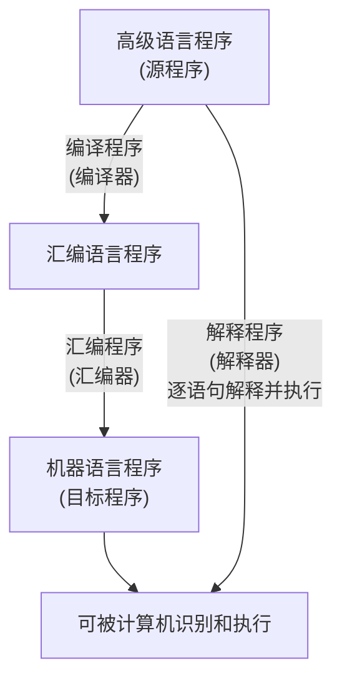

- 机器语言。又称二进制代码语言，需要编程人员记忆每条指令的二进制编码。机器语言是计算机唯一可以直接识别和执行的语言。 
- 汇编语言。汇编语言用英文单词或其缩写代替二进制的指令代码，更容易为人们记忆和理解。使用汇编语言编辑的程序，必须经过一个称为汇编程序的系统软件的翻译，将其转换为机器语言程序后，才能在计算机的硬件系统上执行。
- 高级语言。高级语言（如 C、C++、Java 等）是为方便程序设计人员写出解决问题的处理方案和解题过程的程序。通常高级语言需要经过编译程序编译成汇编语言程序，然后经过汇编操作得到机器语言程序，或直接由高级语言程序翻译成机器语言程序。

由于计算机无法直接理解和执行高级语言程序，需要将高级语言程序转换为机器语言程序，通常把进行这种转换的软件系统称为翻译程序。翻译程序有以下三类：
- 汇编程序（汇编器）。将汇编语言程序翻译成机器语言程序。
- 解释程序（解释器）。将源程序中的语句按执行顺序逐条翻译成机器指令并立即执行。
- 编译程序（编译器）。将高级语言程序翻译成汇编语言或机器语言程序。

## 计算机主要性能指标

- 字长：字长是指计算机进行一次整数运算（即定点整数运算）所能处理的二进制数据的位数，通常与 CPU 的寄存器位数、加法器有关。因此；字长一般等于内部寄存器的大小，字长越长，数的表示范围越大，计算精度越高。计算机字长通常选定为字节（8 位）的整数倍。

>[!caution] 机器字长、指令字长和存储字长的关系
> 在通常所说的“某 16 位或 32 位机器”中，16、32 指的是字长，也称机器字长。所谓字长，通常是指 CPU 内部用于整数运算的数据通路的宽度，因此<u>字长等于CPU内部用于整数运算的运算器位数和通用寄存器宽度</u>，它反映了计算机处理信息的能力。字和字长的概念不同。字用来表示被处理信息的单位，用来度量数据类型的宽度，如 x86 机器中将一个字定义为 16 位。
指令字长：一个指令字中包含的二进制代码的位数。
存储字长：一个存储单元存储的二进制代码的长度。
它们都必须是字节的整数倍。
指令字长一般取存储字长的整数倍，若指令字长等于存储字长的 2 倍，则需要 2 个访存周期来取出一条指令；若指令字长等于存储字长，则取指周期等于机器周期。
早期的存储字长一般与指令字长、字长相等，因此访问一次主存便可取出一条指令或一个数据。随着计算机的发展，指令字长、字长都可变，但必须都是字节的整数倍。

- 数据通路带宽：数据通路带宽是指数据总线一次所能并行传送信息的位数。这里所说的数据通路宽度是指外部数据总线的宽度，它与 CPU 内部的数据总线宽度（内部寄存器的大小）有可能不同。
>[!caution] 
>各个子系统通过数据总线连接形成的数据传送路径称为数据通路

- 主存容量：主存容量是指主存储器所能存储信息的最大容量，通常以字节来衡量，也可用字数 × 字长（如 512K×16 位）来表示存储容量。其中，MAR 的位数反映了存储单元的个数，MDR 的位数反映了存储单元的字长。例如，MAR 为 16 位，表示 216 = 65536，即此存储体内有 65536 个存储单元（可称为 64K 内存，1K = 1024)，若 MDR 为 32 位，表示存储容量为 64K×32 位。
- 运算速度：
	- 吞吐量和响应时间：
		- 吞吐量：指系统在单位时间内处理请求的数量。它取决于信息能多快地输入内存，CPU 能多快地取指令，数据能多快地从内存取出或存入，以及所得结果能多快地从内存送给一台外部设备。几乎每步都关系到主存，因此系统吞吐量主要取决于主存的存取周期。
		- 响应时间。指从用户向计算机发送一个请求，到系统对该请求做出响应并获得所需结果的等待时间。通常包括 CPU 时间（运行一个程序所花费的时间）与等待时间（用于磁盘访问、存储器访问、I/O 操作、操作系统开销等的时间)。
	- 主频和 CPU 时钟周期：
		- CPU 时钟周期。通常为节拍脉冲或 T 周期，即主频的倒数，它是 CPU 中最小的时间单位，执行指令的每个动作至少需要 1 个时钟周期。
		- 主频（CPU 时钟频率）。机器内部主时钟的频率，是衡量机器速度的重要参数。对于同一个型号的计算机，其主频越高，完成指令的一个执行步骤所用的时间越短，执行指令的速度越快。例如，常用 CPU 的主频有 1.8GHz、2.4GHz、2.8GHz 等。

>[!caution] 
>CPU 时钟周期 = 1/主频，主频通常以 Hz（赫兹）为单位，1Hz 表示每秒 1 次。

- CPI（Cycle Per Instruction），即执行一条指令所需的时钟周期数。不同指令的时钟周期数可能不同，因此对于一个程序或一台机器来说，其 CPI 指该程序或该机器指令集中的所有指令执行所需的平均时钟周期数，此时 CPI 是一个平均值。
- CPU 执行时间，指运行一个程序所花费的时间。CPU 执行时间 = CPU 时钟周期数/主频 =(指令条数 $\times$ CPI)/主频   上式表明，CPU 的性能（CPU 执行时间）取决于三个要素：① 主频（时钟频率)② 每条指令执行所用的时钟周期数（CPI)；③ 指令条数。主频、CPI 和指令条数是相互制约的。例如，更改指令集可以减少程序所含指令的条数，但同时可能引起 CPU 结构的调整，从而可能会增加时钟周期的宽度（降低主频）。
- MIPS（Million Instructions Per Second)，即每秒执行多少百万条指令。MIPS = 指令条数(执行时间 ×10%)= 主频(CPI×10)。MIPS 对不同机器进行性能比较是有缺陷的，因为不同机器的指令集不同，指令的功能也就不同，比如在机器 M1 上某条指令的功能也许在机器 M2 上要用多条指令来完成；不同机器的 CPI 和时钟周期也不同，因而同一条指令在不同机器上所用的时间也不同。
- MFLOPS、GFLOPS、TFLOPS、PFLOPS、EFLOPS 和 ZFLOPS。
	- MFLOPS(Million Floating-point Operations Per Second)，即每秒执行多少百万次浮点运算。MFLOPS = 浮点操作次数(执行时间 $\times10^6$)。
	- GFLOPS（Giga Floating-point Operations Per Second)，即每秒执行多少十亿次浮点运算。GFLOPS = 浮点操作次数/执行时间 $\times10^9$)。
	- TFLOPS（Tera Floating-point Operations PerSecond), 即每秒执行多少万亿次浮点运算。TFLOPS = 浮点操作次数/(执行时间 $\times10^{12}$)。
	- 此外，还有 PFLOPS = 浮点操作次数(执行时间 ×10): EFLOPS = 浮点操作次数(执行时间 ×10'8)：ZFLOPS = 浮点操作次数(执行时间 $\times10^{21}$)。

>[!caution] 
> 在描述存储容量、文件大小等时，K、M、G、T 通常用 2 的幂次表示，如 $1\text{Kb}=2^{10}b$; 在描述速率、频率等时，k、M、G、T 通常用 10 的幂次表示，如 $1kb/s=10^3b/s$。通常前者用大写的 K，后者用小写的 k，但其他前缀均为大写，表示的含义取决于所用的场景。

> [!note] 固件
> 将程序固化在 ROM 中组成的部件称为固件。固件是一种具有软件特性的硬件，吸收了软/硬件各自的优点，其执行速度快于软件，灵活性优于硬件，是软/硬件结合的产物。例如，目前操作系统已实现了部分固化（把软件永恒地存储于 ROM 中)。

# 数据的表示和运算

## 数制与编码

计算机内，存储和处理信息的最小单位是位(bit，比特)，它是 **bi** nary digi **t** 的缩写，一个比特的值可以是 0 或 1。

计算机通常不会一次只对一个二进制位进行操作，它会对一组二进制位进行操作，八个二进制位叫做一个字节。现在的微处理器都是面向字节的，其字长为 8 的整数倍，如 64 位处理器就意味着一次可以处理 64 位即 8 个字节的数据。

在计算机系统内部，所有的信息都是用二进制进行编码的，这样做的原因有以下几点。
1)二进制只有两种状态，使用有两个稳定状态的物理器件就可以表示二进制数的每一位，制造成本比较低，例如用高低电平或电荷的正负极性都可以很方便地表示 0 和 1。
2)二进制位 1 和 0 正好与逻辑值“真”和“假”对应，为计算机实现逻辑运算和程序中的逻辑判断提供了便利条件。
3)二进制的编码和运算规则都很简单，通过逻辑门电路能方便地实现算术运算。

---
以下是针对「10 只小白鼠鉴定 999 瓶水和 1 瓶毒药」问题的详细分析与解答。

给出以下规则：
- 毒药瓶的编号可以唯一表示。使用 10 只小白鼠相当于有 10 个独立的检测维度（可以用死活作为二进制状态，0 二进制编码（10 位二进制表示），例如：
	- 第 1 瓶：`0000000001`
	- 第 2 瓶：`0000000010`
	- 第 999 瓶：`1111100111`
- 每个二进制位与 1 只小白鼠对应检测方案：让小白鼠根据瓶子编号的二进制位设计饮水组合。如果第 iii 位是 1，则第 iii 只小白鼠要喝这瓶水；如果是 0，则这只小白鼠不用喝。
- 比如：
    - 第 1 瓶编号是 `0000000001` → 只有第 10 只小白鼠喝；
    - 第 3 瓶编号是 `0000000011` → 第 9 只和第 10 只小白鼠喝；
- 最后观察小白鼠的死亡，例如：
    - 第 9 只和第 10 只小白鼠死亡，对应的二进制是 `0000000011`，表明毒药哪瓶水：
    - 如果二进制的第 iii 位是 1，那么第 iii 只小白鼠喝这瓶水；
    - 若第 iii 位是 0，这只小白鼠不喝这瓶水。
- 等待实验结果（假设实验后时间允许观察哪些小白鼠死了）。
- 小白鼠的死亡情况给出了一组二进制的值，例如：
    - 如果第 1 只小白鼠死了，记作第 1 位为 1；
    - 如果第 2 只小白鼠没死，记作第 2 位为 0；
    - ……
- 根据小白鼠的死亡状态，构造二进制序列，最终将二进制结果转化为十进制数，得到毒药瓶的编号。

方法效率分析：
- 可检测范围：10 只小白鼠能检测 $210=10242^{10} = 1024210=1024$ 瓶水。
- 时间复杂度：实验只需一次安排饮水和一次观察死亡情况，时间复杂度为 $O(N)$（N 为瓶子的数量，用来安排饮水）。
- 空间利用率：通过二进制编码高效分配实验资源，小白鼠的数量需求为 $\log_{2}N$。

### 进位数制法

一个 r 进制数 $(K_n,K_{n-1},\cdots,K_0,K_{-1},\cdots,K_{-m})$ 的数值可以表示成：

$K_nr^n+K_{n-1}r^{n-1}+\cdots+K_0r^0+K_{-1}r^{-1}+\cdots+K_{-m}r^{-m}=\sum\limits_{i=n}^{-m}K_ir^i$

其中，r 是基数，$r^i$ 是第 i 位的位权(整数最低位规定为第 0 位)；$K_i$ 的取值可以是 $0,1,\cdots,r-1$ 共 r 个数码中的任意一个

| 进制              | 数码集合                                  | 表示方法(前缀) |
| --------------- | ------------------------------------- | -------- |
| 十               | $\{0,1,2,3,4,5,6,7,8,9\}$             |          |
| 二(Binary)       | $\{0,1\}$                             | 0B 或 0b    |
| 八(Octal)        | $\{0,1,2,3,4,5,6,7\}$                 | 0x 或 0X    |
| 十六(Hexadecimal) | $\{0,1,2,3,4,5,6,7,8,9,A,B,C,D,E,F\}$ | 0(有些是 0o) |

### 进制转换
1. 二进制转八/十六进制
对于一个二进制数，应该以小数点为界，往左(整数部分)、往右(小数部分)每三位(8 进制)或 4 位(16 进制)分为一组，不足可用 0 补齐，最后分别用相应的八进制或十六进制数表示。

2. 任意进制转化为十进制
按权展开相加即可，即 $K_nr^n+K_{n-1}r^{n-1}+\cdots+K_0r^0+K_{-1}r^{-1}+\cdots+K_{-m}r^{-m}=\sum\limits_{i=n}^{-m}K_ir^i$

3. 十进制转任意进制
用基数乘除法，整数部分<u>除基取余</u>，小数部分<u>乘基取整</u>

> [!note]
>
> 十进制计数法不能准确的表示所有小数，例如 $\frac{1}{3}$ 是 $0.3333...33$，二进制也是如此
>
> 有些能用十进制表示的小数无法用二进制表示，如 $0,1_{10}$ 不能准确的转换成二进制；但是任意一个二进制小数都可以用十进制表示

计算机中，经常将数的符号和数值部分一起编码，这种符号数字化的数称为机器数，常用的有原码、补码和反码表示法

### BCD 码

### 定点数的编码表示

根据小数点的位置是否固定，在计算机中有两种数据格式: 定点表示和浮点表示。在现代计算机中，通常用定点补码整数表示整数，用定点原码小数表示浮点数的尾数部分，用移码表示浮点数的阶码部分。

定点表示法用来表示定点小数和定点整数。

- 定点小数：定点小数是纯小数，约定小数点位置在符号位之后、有效数值部分最高位之前。若数据 X 的形式为 $X=x_0.x_1x_2…x_n$(其中 $x_0$ 为符号位，$x_1-x_n$ 是数值的有效部分，也称尾数，$x_1$ 为最高有效位)，则在计算机中的表示形式如图所示。
- 定点整数：定点整数是纯整数，约定小数点位置在有效数值部分最低位之后。若数据 X 的形式为 $X=x_0.x_1x_2…x_n$(其中 $x_0$ 为符号位，$x_1-x_n$ 是尾数，$x_n$ 为最低有效位)，则在计算机中的表示形式如图所示。

定点数编码表示法主要有以下四种：原码、补码、反码和移码。

#### 原码
用机器数的最高位表示数的符号，其余各位表示数的绝对值

纯小数的原码定义：
$[x]_原=\begin{cases}&x,&0\leqslant x<1\\&1-x=1+|x|,&-1<x\leqslant0\end{cases}([x]_{原}是原码机器数，x是真值)$

若字长为 n+1，则原码小数的表示范围为 $-(1-2^{-n})\leqslant x\leqslant1-2^{-n}$(关于原点对称)

纯整数的原码定义：
$[x]_{原}=\begin{cases}&0,x&0\leqslant x<2^n\\&2^n-x=2^n+|x|&-2^n<x\leqslant0\end{cases}(x是真值,n是整数位数)$

若字长为 n+1，则原码整数的表示范围为 $-(2^n-1)\leqslant x\leqslant2^n-1$(关于原点对称)

优点：与真值的对应关系简单、直观，与真值的转换简单，乘除运算较为简便
缺点：0 的表示不唯一，加减运算比较复杂
#### 补码
补码是现代计算机系统中最常用的负数表示法，它能够统一加减法运算，加法和减法可以通过相同的加法电路来完成
纯小数的补码定义：
$[x]_{补}=\begin{cases}&x,&0\leqslant x<1\\&2+x=2-|x|,&-1\leqslant x<0\end{cases}(\mathrm{mod}\,2)$
若字长为 n+1，则补码的表示范围为 $-1\leqslant x\leqslant1-2^{-n}$(比原码多表示-1)

纯整数的补码定义：
$[x]_{补}=\begin{cases}&0,x,&0\leqslant x<2^n\\&2^{n+1}+x=2^{n+1}-|x|,&-2^n\leqslant x<0\end{cases}(\mathrm{mod}\,2^{n+1})$
若字长为 n+1，则补码的表示范围为 $-2^n\leqslant x\leqslant2^n-1$(比原码多表示 $-2^n$)

>[!note] 
>0 的补码表示是唯一的，即 $[+0]_{补}=[-0]_{补}=0.0000$

变形补码，又称模 4 补码，双符号位的补码小数，其定义为：
$[x]_{补}=\begin{cases}&x,&0\leqslant x<1\\&4+x=4-|x|,&-1\leqslant x<0\end{cases}(\mathrm{mod}\,4)$

模 4 补码双符号位 00 表示正，11 表示负，用在完成算术运算的 ALU 部件中
将 $[x]_{补}$ 的符号位与数值位一起右移并保持原符号位的值不变，可实现除法功能。

对补码而言，正数和负数的转换不同。正数补码的转换方式与原码的相同。
真值转换为补码: 对于正数，与原码的方式一样。对于负数，符号位取 1，其余各位由真值“各位取反，末位加 1”得到。补码转换为真值: 若符号位为 0，与原码的方式一样。若符号位为 1，真值的符号为负，数值部分各位由补码“各位取反，末位加 1”得到。

#### 反码
负数的补码可采用“各位取反，末位加 1”的方法得到，如果仅各位求反而末尾不加 1，那么就可得到负数的反码表示，因此负数反码的定义就是在相应的补码表示中再末位减 1。 
正数反码的定义和相应的补码(或原码)表示相同。
反码相当于一个中间码，一般不会直接使用

|     | 原码        | 反码        | 补码        |
| --- | --------- | --------- | --------- |
| 5   | 0000 0101 | 0000 0101 | 0000 0101 |
| -5  | 1000 0101 | 1111 1010 | 1111 1011 |

>[!note] 
>整数的原码、反码、补码相同
>负数的反码是在原码的基础上，符号位不变，其他取反；补码是在反码的基础上加 1

#### 移码
移码常用来表示浮点数的阶码。它只能表示整数。
移码就是在真值 X 上加上一个常数(偏置值)，通常这个常数取 $2^n$，相当于 X 在数轴上向正方向偏移了若干单位，这就是“移码”一词的由来。
移码定义为：
$[x]_{移}=2^n+x$($-2^n\leqslant x<2^n$，其中机器字长为 n+1)

### 整数的表示
#### 无符号整数的表示
当一个编码的全部二进制位均为数值位而没有符号位时，该编码表示就是无符号整数，也直接称为无符号数。此时，默认数的符号为正。由于无符号整数省略了一位符号位，所以在字长相同的情况下，它能表示的最大数比带符号整数能表示的大。例如，8 位无符号整数，对应的表示范围为 $0\sim2^8-1$，即最大数为 255，而 8 位带符号整数的最大数是 127。
一般在全部是正数运算且不出现负值结果的场合下，使用无符号整数表示。例如，可用无符号整数进行地址运算，或用它来表示指针。

#### 带符号整数的表示
将符号数值化，并将符号位放在有效数字的前面，就组成了带符号整数。虽然前面介绍的原补码、反码和移码都可以用来表示带符号整数，但补码表示有其明显的优势:
① 与原码和反码相比，0 的补码表示唯一。
② 与原码和移码相比，补码运算规则比较简单，且符号位可以和数值位一起参加运算。
③ 与原码和反码相比，补码比原码和反码多表示一个最小负数。
计算机中的带符号整数都用补码表示，故 n 位带符号整数的表示范围是 $-2^{n-1}\sim2^{n-1}-1$。

## 运算方法和运算电路
### 基本运算部件
在计算机中，运算器由算术逻辑单元（Arithmetic Logic Unit，ALU)、移位器、状态寄存器和通用寄存器组等组成。运算器的基本功能包括加、减、乘、除四则运算，与、或、非、异或等逻辑运算，以及移位、求补等操作。ALU 的核心部件是加法器。
#### 一位全加器 (Full Adder)

| 输入                                       | 输出                         |
| ---------------------------------------- | -------------------------- |
| 加数 $A_{i}$，加数 $B_{i}$，低位传进来的进位 $C_{i-1}$ | 本位和 $S_{i}$，向高位的进位 $C_{i}$ |
和表达式：$S_{i}=A_{i}\oplus B_{i}\oplus C_{i-1}$ （$A_{i},B_{i},C_{i-1}$ 中有奇数个 1 时，$S_{i}=1$；否则 $S_{i}=0$）
进位表达式：$C_{i}=A_{i}B_{i}+(A_{i}\oplus B_{i})C_{i-1}$

#### 串行进位加法器
把 n 个全加器相连可得到 n 位加法器，称为串行进位加法器。串行进位又称波进位，每级进位直接依赖于前一级的进位，即进位信号是逐级形成的。

#### 并行进位加法器

#### 带标志加法器

#### 算数逻辑单元 ALU
ALU 是一种功能较强的组合逻辑电路，它能进行多种算术运算和逻辑运算。由于加、减、乘、除运算最终都能归结为加法运算，因此 ALU 的核心是带标志加法器，同时也能执行“与”“或”“非”等逻辑运算。

### 定点数的移位运算

### 定点数的加减运算

### 定点数的乘除运算

### C 语言中的整数类型及类型转换

### 数据的存储与排列

## 浮点数的表示与运算
### 浮点数的表示

- 阶码可采用原码、补码、反码、移码进行表示
- 尾数可采用原码、补码、反码进行表示
- 对应的浮点数表示范围会略有不同

### 浮点数的加减运算

# 存储系统
## 存储器概述
### 存储器的分类
- 按在计算机中的作用（层次）分类
	- 1）主存储器。简称主存，又称内存储器（内存），用来存放计算机运行期间所需的程序和数据，CPU 可以直接随机地对其进行访问，也可以和高速缓冲存储器（Cache）及辅助存储器交换数据。其特点是容量较小、存取速度较快、每位的价格较高。
	- 2）辅助存储器。简称辅存，又称外存储器（外存)，用来存放当前暂时不用的程序和数据，以及一些需要永久性保存的信息。辅存的内容需要调入主存后才能被 CPU 访问。其特点是容量大、存取速度较慢、单位成本低。
	- 3) 高速缓冲存储器。简称 Cache，位于主存和 CPU 之间，用来存放当前 CPU 经常使用的指令和数据，以便 CPU 能高速地访问它们。Cache 的存取速度可与 CPU 的速度相匹配，但存储容量小、价格高。现代计算机通常将它们制作在 CPU 中。
- 按存储介质分类：按存储介质，存储器可分为磁表面存储器（磁盘、磁带)、磁芯存储器、半导体存储器（MOS 型存储器、双极型存储器）和光存储器（光盘）。
- 按存取方式分类：
	- 1）随机存储器（RAM)。存储器的任何一个存储单元都可以随机存取，而且存取时间与存储单元的物理位置无关。其优点是读写方便、使用灵活，主要用作主存或高速缓冲存储器。RAM 又分为静态 RAM 和动态 RAM。
	- 2）只读存储器（ROM)。存储器的内容只能随机读出而不能写入。信息一旦写入存储器就固定不变，即使断电，内容也不会丢失。因此，通常用它存放固定不变的程序、常数和汉字字库等。它与随机存储器可共同作为主存的一部分，统一构成主存的地址域。由 ROM 派生出的存储器也包含可反复重写的类型，ROM 和 RAM 的存取方式均为随机存取。广义上的只读存储器已可通过电擦除等方式进行写入，其“只读”的概念没有保留，但仍保留了断电内容保留、随机读取特性，但其写入速度比读取速度慢得多。
	- 3）串行访问存储器。对存储单元进行读/写操作时，需按其物理位置的先后顺序寻址，包括顺序存取存储器（如磁带）与直接存取存储器（如磁盘、光盘）。

### 存储器的性能指标
1）存储容量 = 存储字数 × 字长（如 1 Mx 8 位)。单位换算: 1 B（Byte, 字节).= 8 b (bit，位)。存储字数表示存储器的地址空间大小，字长表示一次存取操作的数据量。
2）单位成本：每位价格 = 总成本/总容量。
3）存储速度：数据传输率 = 数据的宽度/存取周期（或称存储周期)。
① 存取时间（T)：存取时间是指从启动一次存储器操作到完成该操作所经历的时间，分为读出时间和写入时间。
② 存取周期（T)：存取周期又称读写周期或访问周期。它是指存储器进行一次完整的读写操作所需的全部时间，即连续两次独立访问存储器操作（读或写操作）之间所需的最小时间间隔。
③ 主存带宽（Bm)：主存带宽又称数据传输率，表示每秒从主存进出信息的最大数量，单位为字/秒、字节/秒 (B/s) 或位/秒 (b/s)。

### 多级层次的存储系统
为了解决存储系统大容量、高速度和低成本 3 个相互制约的矛盾，在计算机系统中，通常采用多级存储器结构，如图 3.2 所示。在图中由上至下，位价越来越低，速度越来越慢，容量越来越大，CPU 访问的频度也越来越低。

实际上，存储系统层次结构主要体现在 Cache-主存层和主存一辅存层。前者主要解决 CPU 和主存速度不匹配的问题，后者主要解决存储系统的容量问题。在存储体系中，Cache、主存能与 CPU 直接交换信息，辅存则要通过主存与 CPU 交换信息；主存与 CPU、Cache、辅存都能交换信息，如图 3.3 所示。

## 主存储器
主存储器由 DRAM 实现，靠处理器的那一层 (Cache）则由 SRAM 实现，它们都属于易失性存储器，只要电源被切断，原来保存的信息便会丢失。DRAM 的每位价格低于 SRAM，速度也慢于 SRAM，价格差异主要是因为制造 SRAM 需要更多的硅。ROM 属于非易失性存储器。

### 主存储器的基本组成

### 多模块存储器
多模块存储器（Multi-module Memory，也称为多体存储器、交叉存储器、interleaved memory）是一种为了提高存储器带宽和并行处理能力而设计的存储体系结构。其基本思想是将主存储器划分为若干个独立的存储模块（memory modules），每个模块都可以独立访问和操作。

#### 单体多字存储器
单体多字系统的特点是存储器中只有一个存储体，每个存储单元存储 m 个字，总线宽度也为 m 个字。一次并行读出 m 个字，地址必须顺序排列并处于同一存储单元。

单体多字系统在一个存取周期内，从同一地址取出 m 条指令，然后将指令逐条送至 CPU 执行，即每隔 $1/m$ 存取周期，CPU 向主存取一条指令。这显然提高了单体存储器的工作速度。

> [!example] 
> 常见的多通道内存技术（双通道、三通道、四通道等）采用的就是单体多字技术。

> [!failure] 缺点
> 指令和数据在主存内必须是连续存放的，一旦遇到转移指令，或操作数不能连续存放，这种方法的效果就不明显。

#### 多体并行存储器
多体并行存储器由多体模块组成。每个模块都有相同的容量和存取速度，各模块都有独立的读写控制电路、地址寄存器和数据寄存器。它们既能并行工作，又能交叉工作。
多体并行存储器分为高位交叉编址和低位交叉编址两种。

| 特性    | 高位交叉            | 低位交叉             |
| ----- | --------------- | ---------------- |
| 地址分配  | 高位选模块，连续地址在同一模块 | 低位选模块，连续地址分布不同模块 |
| 适合场景  | 随机访问（如多处理器、多线程） | 顺序访问（如指令流水线）     |
| 并行性   | 高，适合独立模块访问      | 高，适合流水线访问        |
| 冲突情况  | 同一模块的地址范围冲突     | 同一模块的连续地址冲突      |
| 控制复杂性 | 较低（模块独立性强）      | 较高（需流水线控制）       |
| 典型应用  | 多核系统、分布式存储      | DRAM Bank、指令获取   |

- **高位交叉编址（顺序方式，高位交错，High-order Interleaving）**：高位交叉存储器是指存储器地址的高位（最高有效位，MSB）用于选择存储模块，而地址的低位用于定位模块内的具体存储单元。每个模块像一个独立的存储器，适合非连续或随机访问。
- **低位交叉编址（交叉方式，低位交错，Low-order Interleaving）**：低位交叉存储器是指存储器地址的低位（最低有效位，LSB）用于选择存储模块（Module），而地址的高位用于定位模块内的具体存储单元。这种方式将连续的内存地址分配到不同的模块，以实现并行或流水线访问。

### SRAM 与 DRAM

|       | SRAM            | DRAM         |
| ----- | --------------- | ------------ |
| 存储信息  | 触发器             | 电容           |
| 单元结构  | 6 个晶体管          | 1 个晶体管+1 个电容 |
| 破坏性读出 | ✘               | √            |
| 需要刷新  | ✘（只要不断电，信息一直保存） | √            |
| 功耗    | 较低              | 较高（因刷新）      |
| 送行列地址 | 同时送             | 分两次送         |
| 运行速度  | 快               | 慢            |
| 集成度   | 低               | 高            |
| 存储成本  | 高               | 低            |
| 主要用途  | 高速缓存            | 主机内存         |

静态随机存取存储器 SRAM (Static Random-Access Memory) 是随机存取存储器 RAM 的一种。所谓“静态”，是指这种 RAM 只要保持通电，其内部所存储的数据就可以保持不变，而不需要进行周期性地刷新。相比之下，动态随机存取存储器 DRAM (Dynamic Random-Access Memory）则需要。

> [!caution] 
> 一旦断电，SRAM 和 DRAM 内部存储的数据还是会消失的，也就是说 SRAM 和 DRAM 属于易失性存储器，这与属于非易失性存储器的只读存储器 ROM (Read-OnlyMemory）是不同的。

目前，SRAM 内部的存储元（存储 1 个二进制位的单元）一般采用多个金属-氧化物半导体场效应晶体管 MOSFET (Metal-Oxide-Semiconductor Field-Effect Transistor) 来构建，MOSFET 常简称为 MOS 管。

### ROM
ROM 和 RAM 都是支持随机访问的存储器, 其中 SRAM 和 DRAM 均为易失性半导体存储器。而 ROM 中一旦有了信息，就不能轻易改变，即使掉电也不会丢失，它在计算机系统中是只供读出的存储器。ROM 器件有两个显著的优点：
1) 结构简单，所以位密度比可读写存储器的高。
2) 具有非易失性，所以可靠性高。

根据制造工艺的不同，ROM 可分为掩模式只读存储器（MROM)、一次可编程只读存储器(PROM)、可擦除可编程只读存储器（EPROM)、Flash 存储器和固态硬盘（SSD)。
- 掩模式只读存储器：MROM 的内容由半导体制造厂按用户提出的要求在芯片的生产过程中直接写入，写入以后任何人都无法改变其内容。优点是可靠性高，集成度高，价格便宜；缺点是灵活性差。
- 一次可编程只读存储器：PROM 是可以实现一次性编程的只读存储器。允许用户利用专门的设备（编程器）写入自己的程序，一旦写入，内容就无法改变。
- 可擦除可编程只读存储器：EPROM 不仅可以由用户利用编程器写入信息，而且可以对其内容进行多次改写。EPROM 虽然既可读又可写，但它不能取代 RAM，因为 EPROM 的编程次数有限，且写入时间过长。
- 可擦除可编程只读存储器：E²PROM 可多次写入，写入方式与 EPROM 相同，但不需要先擦除后写入。因为擦除时不用紫外线照射，采用电可擦除方式（根据命令，内部自动完成），可以精准地擦除某一个存储元，而非全片擦除。
- Flash 存储器：Flash 存储器是在 EPROM 与 E²PROM 的基础上发展起来的，其主要特点是既可在不加电的情况下长期保存信息，又能在线进行快速擦除与重写。Flash 存储器既有 EPROM 的价格便宜、集成度高的优点，又有 E²PROM 电可擦除重写的特点，且擦除重写的速度快。
-  固态硬盘 (Solid State Drives，SSD)：基于闪存的固态硬盘是用固态电子存储芯片阵列制成的硬盘，由控制单元和存储单元（Flash 芯片）组成。保留了 Flash 存储器长期保存信息、快速擦除与重写的特性。对比传统硬盘也具有读写速度快、低功耗的特性，缺点是价格较高。

## 主存储器与 CPU 的连接
### 连接原理
1 ）主存储器通过数据总线、地址总线和控制总线与 CPU 连接。
2）数据总线的位数与工作频率的乘积正比于数据传输率。
3）地址总线的位数决定了可寻址的最大内存空间。
4）控制总线（读/写）指出总线周期的类型和本次输入/输出操作完成的时刻。

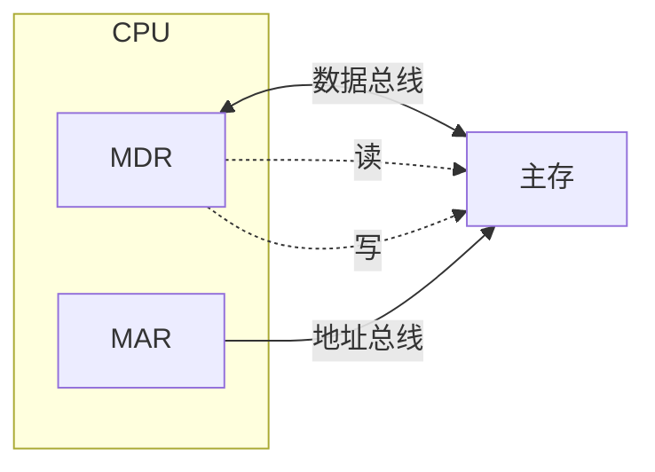

### 主存容量的扩展
主存容量扩展是指通过硬件或组织方式增加计算机主存储器的总容量，以满足更高的存储需求或提高系统性能。主存通常由 DRAM 芯片组成，容量扩展涉及增加存储单元、优化访问机制或改进存储器组织。
#### 位扩展法
当存储芯片的数据总线位宽小于 CPU 数据总线位宽时，采用位扩展的方式进行扩展。

- 将所有存储芯片的地址引脚、写使能引脚 WE 分别并联后再分别与 CPU 的地址引脚和读写控制引脚 R/W 连接；
- 将各存储芯片的数据引脚依次与 CPU 的数据引脚进行相应连接；
- 将所有存储芯片的片选引脚 CS 并联后与 CPU 的存储器请求控制引脚 MREQ 相连。

综上所述，位扩展又称为数据总线扩展或字长扩展。
#### 字扩展法
当存储芯片的存储容量不能满足存储器对存储容量的需求时，采用字扩展的方式进行扩展。

- 将所有存储芯片的数据引脚、地址引脚、写使能引脚 WE 各自并联后再分别与 CPU 的数据引脚地址引脚、读写控制引脚 R/W 连接；
- 各存储芯片的片选引脚 CS 可以由 CPU 多余的地址引脚通过译码器产生

综上所述，字扩展又称为容量扩展或地址总线扩展。
#### 字位同时扩展法
当存储芯片的数据位宽和存储容量均不能满足存储器的数据位宽和存储总容量要求时，采用字位同时扩展。

## 外部存储器

## 高速缓冲存储器
### 基本原理
**程序局部性原理**：程序局部性是指，在一段时间内，整个程序的执行仅限于一个较小的局部范围内。具体来说，程序的局部性又表现为以下两种：
- 时间局部性：若程序在某个时刻访问了一个存储位置，该位置在未来可能会被多次访问。
- 空间局部性：若程序访问了某个存储位置，则其附近的存储位置也可能被访问。

**工作流程**：
    1. CPU 访问数据时，首先查找 Cache 中是否存在（命中）。
    2. 如果命中，则直接使用 Cache 中的数据，速度快。
    3. 如果未命中（缺失），则从主存中获取数据，并将其复制到 Cache 中。

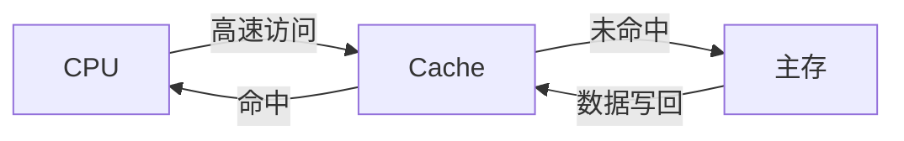

> [!note] 
> 命中（Hit）：CPU 访问的数据在 Cache 中找到，访问速度快。
> 未命中（Miss）：CPU 访问的数据不在 Cache 中，需要从主存读取，速度慢。
> 未命中率（Miss Rate）：未命中次数/总访问次数。
> 命中率（Hit Rate）：命中次数/总访问次数。

**分类**：
- 按位置分：
	- 一级缓存（L1 Cache）：集成在 CPU 内部，速度最快，容量最小（如 32KB~128KB）。
	- 二级缓存（L2 Cache）：可在 CPU 内部或外部，容量较大（如 256KB~2MB），速度稍慢于 L1。
	- 三级缓存（L3 Cache）：通常为多核 CPU 共享，容量更大（几 MB 到几十 MB），速度慢于 L2 但仍快于主存。
- 按用途分：
	- 数据 Cache（Data Cache）：缓存数据。
	- 指令 Cache（Instruction Cache）：缓存 CPU 指令。
	- 统一 Cache：数据和指令混合缓存。

### 映射方式
Cache 行中的信息是主存中某个块的副本，地址映射是指把主存地址空间映射到 Cache 地址空间，即把存放在主存中的信息按照某种规则装入 Cache。缓存映射方式直接影响缓存的性能、命中率和实现复杂度。

| 特性    | 直接映射          | 全相联映射    | 组相联映射      |
| ----- | ------------- | -------- | ---------- |
| 映射规则  | 每个主存块映射到固定缓存行 | 任意缓存行    | 固定组内的任意行   |
| 硬件复杂度 | 最低            | 最高       | 中等         |
| 命中率   | 最低            | 最高       | 中等         |
| 查找速度  | 最快            | 最慢       | 中等         |
| 冲突未命中 | 高             | 低        | 中等         |
| 替换策略  | 无需（固定映射）      | 需要（如 LRU） | 组内需要（如 LRU） |
| 典型应用  | 嵌入式系统         | 高性能服务器   | 通用处理器      |
#### 直接映射
直接映射是最简单的缓存映射方式，每个主存块只能映射到缓存中的特定一行。
**原理**：
- 缓存被划分为多个缓存行（Cache Line），每行有一个唯一的索引（Index）。
- 主存地址分为：
    - Tag（标记）：标识主存块。
    - Index（索引）：决定主存块映射到缓存的哪一行。
    - Offset（偏移）：决定主存块内具体字节的位置。
- 映射公式：Cache Line Index = (主存块号) mod (缓存行数)。
- 每个主存块只能映射到固定的缓存行，类似哈希表中的直接哈希。

**优点**：
- 实现简单：硬件设计简单，索引直接计算，比较器少。
- 低功耗：只需检查一个缓存行。
- 访问速度快：由于映射固定，查找开销低。

**缺点**：
- 冲突率高：多个主存块可能映射到同一缓存行，导致频繁替换（冲突未命中，Conflict Miss）。
- 利用率低：缓存空间可能未充分利用。

#### 全相联映射
全相联映射允许主存块映射到缓存中的任意一行，类似于哈希表中的开放寻址。
**原理**：
- 缓存没有固定的索引，主存块可以存储在缓存的任何一行。
- 主存地址分为：
    - Tag（标记）：标识主存块。
    - Offset（偏移）：定位块内字节。
- 查找时，需要将主存地址的 Tag 与缓存中所有行的 Tag 进行比较。

**优点**：
- 灵活性高：主存块可以映射到任意缓存行，最大限度减少冲突未命中。
- 命中率高：充分利用缓存空间，适合局部性强的程序。

**缺点**：
- 硬件复杂：需要大量比较器同时比较所有缓存行的 Tag，硬件成本高。
- 查找时间长：全比较增加了延迟。
- 功耗高：每次访问都要检查所有缓存行。
#### 组相联映射
组相联映射是直接映射和全相联映射的折中方案，缓存被分为多个组（Set），每个主存块可以映射到特定组内的任意一行。

**原理**：
- 缓存被划分为多个组，每组包含固定数量的缓存行（称为 N 路组相联，N-Way Set Associative）。
- 主存地址分为：
    - Tag（标记）：标识主存块。
    - Index（索引）：定位到缓存的某个组。
    - Offset（偏移）：定位块内字节。
- 映射公式：Set Index = (主存块号) mod (组数)。
- 在组内，类似全相联映射，主存块可以存储在该组的任意一行。
**优点**：
- 平衡性好：结合了直接映射的简单性和全相联映射的灵活性。
- 命中率较高：组内多行减少了冲突未命中。
- 硬件复杂度适中：只需比较组内的 N 个 Tag，远少于全相联映射。

**缺点**：
- 复杂度高于直接映射：需要组内 Tag 比较和替换策略。
- 命中率低于全相联：仍然可能发生组内冲突。

---

**缓存映射方式会影响未命中的类型**：
- 强制未命中（Compulsory Miss）：首次访问数据，缓存中没有数据。
- 容量未命中（Capacity Miss）：缓存空间不足，无法容纳所有活跃数据。
- 冲突未命中（Conflict Miss）：多个主存块竞争同一缓存行或组，常见于直接映射和组相联映射。

全相联映射可以显著减少冲突未命中，但无法完全消除强制未命中和容量未命中。
### 替换算法
在采用全相联映射或组相联映射方式时，从主存向 Cache 传送一个新块，当 Cache 或 Cache 组中的空间已被占满时，就需要使用替换算法置换 Cache 行。而采用直接映射时，一个给定的主存块只能放到唯一的固定 Cache 行中，所以在对应 Cache 行已有一个主存块的情况下，新的主存块毫无选择地把原先已有的那个主存块替换掉，因而无须考虑替换算法。

常用的替换算法有随机（RAND）算法、先进先出 (FIFO) 算法、近期最少使用 (LRU) 算法和最不经常使用（LFU）算法。其中最常考查的是 LRU 算法。
1) 随机算法：随机地确定替换的 Cache 块。它的实现比较简单，但未依据程序访问的局部性原理，因此可能命中率较低。
2) 先进先出算法：选择最早调入的行进行替换。它比较容易实现，但也未依据程序访问的局部性原理，因为最早进入的主存块也可能是目前经常要用的。
3) 近期最少使用算法（LRU)：依据程序访问的局部性原理，选择近期内长久未访问过的 Cache 行作为替换的行，平均命中率要比 FIFO 的高，是堆栈类算法。

### Cache 写策略
因为 Cache 中的内容是主存块副本，当对 Cache 中的内容进行更新时，就需选用写操作策略使 Cache 内容和主存内容保持一致。此时分两种情况。

对于 Cache 写命中（write hit)，有两种处理方法。
1) 全写法（写直通法、write-through)。当 CPU 对 Cache 写命中时, 必须把数据同时写入 Cache 和主存。当某一块需要替换时, 不必把这一块写回主存，用新调入的块直接覆盖即可。这种方法实现简单，能随时保持主存数据的正确性。缺点是增加了访存次数，降低了 Cache 的效率。写缓冲：为减少全写法直接写入主存的时间损耗，在 Cache 和主存之间加一个写缓冲 (Write Buffer)，如下图所示。CPU 同时写数据到 Cache 和写缓冲中，写缓冲再控制将内容写入主存。写缓冲是一个 FIFO 队列，写缓冲可以解决速度不匹配的问题。但若出现频繁写时，会使写缓冲饱和溢出。
2) 回写法 (write-back)。当 CPU 对 Cache 写命中时，只把数据写入 Cache，而不立即写入主存，只有当此块被换出时才写回主存。这种方法减少了访存次数，但存在不一致的隐患。为了减少写回主存的开销，每个 Cache 行设置一个修改位（脏位)。若修改位为 1，则说明对应 Cache 行中的块被修改过，替换时需要写回主存：若修改位为 0，则说明对应 Cache 行中的块未被修改过，替换时无须写回主存。
对于 Cache 写不命中，也有两种处理方法。
3) 写分配法 (write-allocate)。加载主存中的块到 Cache 中，然后更新这个 Cache 块。它试图利用程序的空间局部性，但缺点是每次不命中都需要从主存中读取一块。
4) 非写分配法 (not-write-allocate)。只写入主存, 不进行调块。非写分配法通常与全写法合用，写分配法通常和回写法合用。

| 特性    | 写直达（Write-Through） | 写回（Write-Back） |
| ----- | ------------------ | -------------- |
| 数据一致性 | 强，缓存与主存同步          | 弱，需一致性协议       |
| 写性能   | 低，需访问主存            | 高，仅更新缓存        |
| 主存访问  | 频繁，增加总线负载          | 较少，仅在替换时       |
| 硬件复杂度 | 低，无需脏位             | 高，需脏位和替换逻辑     |
| 功耗    | 高，主存访问多            | 低，主存访问少        |
| 适用场景  | 多核、嵌入式             | 高性能单核/多核       |
## 虚拟存储器
### 基本概念
虚拟存储器将主存或辅存的地址空间统一编址，形成一个庞大的地址空间，在这个空间内，用户可以自由编程，而不必在乎实际的主存容量和程序在主存中实际的存放位置。
用户编程允许涉及的地址称为虚地址或逻辑地址，虚地址对应的存储空间称为虚拟空间或程序空间。实际的主存单元地址称为实地址或物理地址，实地址对应的是主存地址空间，也称实地址空间。虚地址比实地址要大很多。虚拟存储器的地址空间如图 3.24 所示。

### 页式
#### 页表

#### 快表 TLB

#### 具有 TLB 和 Cache 的多级存储系统

### 段式

### 段页式

# 指令系统

## 指令系统
指令（机器指令）是指示计算机执行某种操作的命令。一台计算机的所有指令的集合构成该机的指令系统，也称指令集。
指令系统是指令集体系结构 （ISA）中最核心的部分，ISA 完整定义了软件和硬件之间的接口，是机器语言或汇编语言程序员所应熟悉的。
ISA 规定的内容主要包括：指令格式，数据类型及格式，操作数的存放方式，程序可访问的寄存器个数、位数和编号，存储空间的大小和编址方式，寻址方式，指令执行过程的控制方式等。
### 指令的基本格式
一条指令就是机器语言的一个语句，它是一组有意义的二进制代码。一条指令通常包括操作码字段和地址码字段两部分。
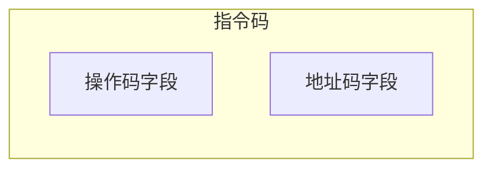
其中，操作码指出指令中该指令应该执行什么性质的操作以及具有何种功能。操作码是识别指令、了解指令功能及区分操作数地址内容的组成和使用方法等的关键信息。例如，指出是算术加运算还是算术减运算，是程序转移还是返回操作。
地址码给出被操作的信息（指令或数据）的地址，包括参加运算的一个或多个操作数所在的地址、运算结果的保存地址、程序的转移地址、被调用的子程序的入口地址等。

根据指令中操作数地址码的数目的不同，可将指令分成以下几种格式。

==零地址指令==
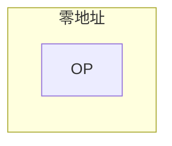
只给出操作码 OP，没有显式地址。这种指令有两种可能：
1）不需要操作数的指令，如空操作指令、停机指令、关中断指令等。
2）零地址的运算类指令仅用在堆栈计算机中。通常参与运算的两个操作数隐含地从栈顶和次栈顶弹出，送到运算器进行运算，运算结果再隐含地压入堆栈。

---

==一地址指令==
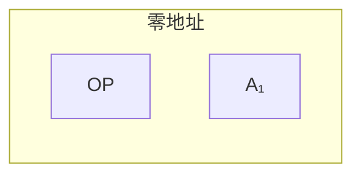
这种指令也有两种常见的形态，要根据操作码的含义确定究竟是哪一种。
1） 只有目的操作数的单操作数指令，按 $\mathrm{A}_{1}$ 地址读取操作数，进行 OP 操作后，结果存回原地址。
指令含义：$\text{OP}(\mathrm{A}_{1})\to A_{1}$
如操作码含义是加 1、减 1、求反、求补等。
2）隐含约定目的地址的双操作数指令，按指令地址 $\mathrm{A}_{1}$ 可读取源操作数，指令可隐含约定另一个操作数由 ACC（累加器）提供，运算结果也将存放在 ACC 中。
指令含义: $(\text{ACC}) \text{OP} (\mathrm{A}_{1})\to\text{ACC}$
若指令字长为 32 位，操作码占 8 位，1 个地址码字段占 24 位，则指令操作数的直接寻址范围为 $2^{24}=16\text{M}$。

---

==二地址指令==
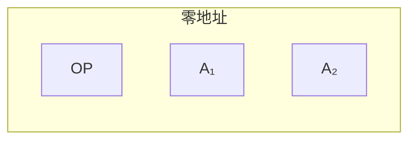
指令含义：$(\mathrm{A}_{1})\mathrm{OP}(\mathrm{A}_{2})\to \mathrm{A_{1}}$
对于常用的算术和逻辑运算指令，往往要求使用两个操作数，需分别给出目的操作数和源操作数的地址，其中目的操作数地址还用于保存本次的运算结果。
若指令字长为 32 位，操作码占 8 位，两个地址码字段各占 12 位，则指令操作数的直接寻址范围为 $2^{12}=4\mathrm{K}$。

---

==三地址指令==
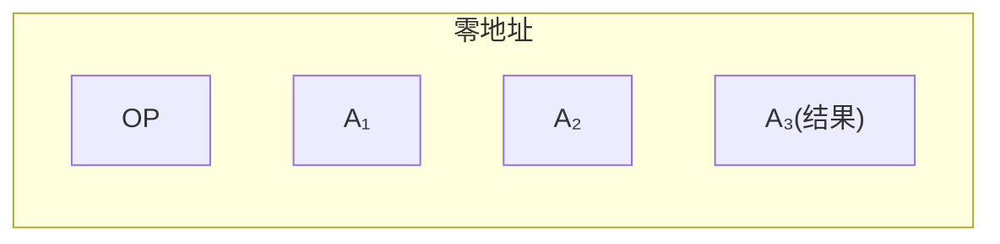
指令含义：$(\mathrm{A}_{1})\mathrm{OP}(\mathrm{A}_{2})\to \mathrm{A_{3}}$
若指令字长为 32 位，操作码占 8 位，3 个地址码字段各占 8 位，则指令操作数的直接寻址范围为 $2^8=256$。若地址字段均为主存地址，则完成一条三地址需要 4 次访问存储器（取指令 1 次，取两个操作数 2 次，存放结果 1 次)。

---

==四地址指令==
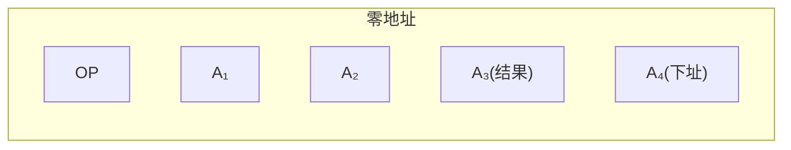
指令含义：$(\mathrm{A}_{1})\mathrm{OP}(\mathrm{A}_{2})\to \mathrm{A_{3}},\mathrm{A}_{4}=\text{下一条将要执行指令的地址}$
若指令字长为 32 位，操作码占 8 个地址码字段各占 6 位，则指令操作数的直接寻址范围为 $2^6=64$。

### 定长操作码指令格式
定长操作码指令在指令字的最高位部分分配固定的若干位（定长）表示操作码。一般 n 位操作码字段的指令系统最大能够表示 $2^n$ 条指令。定长操作码对于简化计算机硬件设计，提高指令译码和识别速度很有利。当计算机字长为 32 位或更长时，这是常规用法。

### 扩展操作码指令格式

### 指令的操作类型
1. 数据传送：传送指令通常有寄存器之间的传送（MOV）、从内存单元读取数据到 CPU 寄存器（LOAD）、从 CPU 寄存器写数据到内存单元（STORE）等。
2. 算术和逻辑运算：这类指令主要有加（ADD)、减（SUB)、比较 (CMP)、乘（MUL)、除 (DIV)、加 1 (INC)、减 1 (DEC)、与（AND)、或 (OR)、取反 (NOT)、异或 (XOR) 等。
3. 移位操作：移位指令主要有算术移位、逻辑移位、循环移位等。
4. 转移操作：转移指令主要有无条件转移（JMP)、条件转移（BRANCH)、调用（CALL)、返回 (RET)、陷阱（TRAP）等。无条件转移指令在任何情况下都执行转移操作，而条件转移指令仅在特定条件满足时才执行转移操作，转移条件一般是某个标志位的值，或几个标志位的组合。 调用指令和转移指令的区别：执行调用指令时必须保存下一条指令的地址（返回地址），当子程序执行结束时，根据返回地址返回到主程序继续执行；而转移指令则不返回执行。
5. 输入输出操作：这类指令用于完成 CPU 与外部设备交换数据或传送控制命令及状态信息。

## 指令的寻址方式
寻址方式是指寻找指令或操作数有效地址的方式，即确定本条指令的数据地址及下一条待执行指令的地址的方法。
寻址方式分为指令寻址和数据寻址两大类。

### 指令寻址与数据寻址

### 常见的数据寻址方式

## 程序的机器级代码表示
### 常见汇编指令

### 过程调用的机器级表示

### 选择语句的机器级表示

### 循环语句的机器级表示

## CISC 与 RISC
指令系统朝两个截然不同的方向的发展：
1. 一是增强原有指令的功能，设置更为复杂的新指令实现软件功能的硬化，这类机器称为 **复杂指令系统计算机（CISC，Complex Instruction Set Computing)**，典型的有采用 $\times86$ 架构的计算机；
2. 二是减少指令种类和简化指令功能，提高指令的执行速度，这类机器称为 **精简指令系统计算机（RISC，Reduced Instruction Set Computing)**，典型的有 ARM、MIPS 架构的计算机。

| 架构名称 | 指令集类型 | 主导厂商/机构 | 核心特点 | 主要应用领域 |
|------|---------|----------------|---------|-------------|
| x86 | CISC | Intel, AMD | 高性能、复杂指令、生态完善、功耗较高 | 个人电脑、服务器、工作站 |
| ARM | RISC | ARM 公司（授权） | 低功耗、高能效、授权模式、生态系统庞大 | 移动设备（手机、平板）、嵌入式系统、物联网 |
| RISC-V | RISC | RISC-V International（开源基金会） | 开源免费、模块化、简洁灵活、可扩展性强 | 嵌入式系统、物联网、AI、高性能计算（新兴） |
| MIPS | RISC | MIPS 公司（现属 Wave Computing） | 设计简洁、多发射技术、历史悠久 | 网络设备（路由器、交换机）、数字家庭（机顶盒） |
| PowerPC | RISC | IBM, Freescale（现 NXP）等 | 高性能、可扩展性好、双处理器架构 | 游戏主机（经典）、汽车电子、工业控制、通信设备 

**x86** 架构由 Intel 在 1978 年随着 8086 处理器推出，是全球个人电脑产业的基石 。它以复杂指令集计算机（CISC） 为设计核心，拥有可变长度的指令，单个指令就能完成复杂操作。具有以下技术特点：
- 向后兼容：这是 x86 最强大的护城河。从最初的 8086 到今天最新的酷睿处理器，都保持指令集兼容，确保了海量旧软件的可用性 。
- 高性能设计：为了弥补 CISC 架构解码复杂的短板，现代 x86 处理器（如 Intel Core 和 AMD Ryzen）采用了极其复杂的微架构，包括超标量、乱序执行、深度流水线、分支预测等先进技术，以榨取最高性能 。
- 向 64 位演进：为了突破 32 位寻址限制（最大 4GB 内存），AMD 发明了 x86-64（AMD64），Intel 随后推出 EM64T（即 Intel 64），将 x86 架构无缝扩展到 64 位。
它统治个人电脑和服务器市场超过 40 年。几乎所有 Windows PC、Mac（在转向 Apple Silicon 之前）以及数据中心的海量服务器都基于 x86 架构。根据 2023 年的数据，其全球 PC 处理器市场份额高达 77.3%。

**ARM（Advanced RISC Machine）** 源自英国 Acorn 公司，后独立为 ARM 公司。它采用精简指令集计算机（RISC） 设计，不生产芯片，而是通过 IP 授权的模式将架构卖给其他厂商（如苹果、高通、三星）。ARM 处理器以其高能效和低功耗著称，成为移动设备的首选架构。其技术特点包括：
- 低功耗与高能效：这是 ARM 最核心的优势。其 RISC 内核设计简洁，晶体管数量少，功耗控制极佳，非常适合电池供电的设备 。正如有分析指出的，ARM 容易通过关闭子模块和时钟来省电，而 x86 为了高性能不得不保持大部分模块开启，导致功耗更高。
- 丰富的产品线：ARM 架构针对不同应用场景进行了细分，形成了三大系列 ：
  - Cortex-A 系列：应用处理器，主打高性能，用于智能手机、平板电脑、智能电视等运行复杂操作系统的设备。
  - Cortex-R 系列：实时处理器，主打高可靠性和实时响应，用于汽车制动、硬盘控制器等对时序要求严苛的系统。
  - Cortex-M 系列：微控制器，主打超低功耗和低成本，用于物联网传感器、智能家居、可穿戴设备等。
  它在移动设备和嵌入式领域占据绝对主导地位，占据了全球 32 位嵌入式处理器 75% 的份额 。近年来，苹果推出的 M 系列芯片，证明了 ARM 架构在笔记本和桌面端同样能提供强大性能，开始向 x86 的传统领地发起挑战。

**RISC-V** 于 2010 年诞生于加州大学伯克利分校，旨在设计一个开源、免费的指令集架构 。它不是由单一公司控制，而是由非盈利组织 RISC-V International 管理。RISC-V 采用模块化设计，基本指令集非常简洁（仅包含约 40 条指令），但通过可选的扩展（如整数乘除法、原子操作、浮点运算等）可以满足各种应用需求。其技术特点包括：
- 开源与模块化：这是它最大的杀手锏。任何人都可以免费使用、修改和扩展 RISC-V 指令集，无需支付高昂的授权费 。其设计是模块化的，由一个极小且必备的基础整数指令集和多个可选的标准扩展（如浮点运算、原子操作等）组成，开发者可以根据需求自由组合，定制自己的处理器 。
- 简洁与清晰：RISC-V 架构非常简洁，抛弃了历史包袱，其指令集规范和说明文档清晰易懂，非常适合学术研究和教学，也便于工业界快速实现 。
- 权限模式：支持机器模式（M-mode）、监督模式（S-mode）、用户模式（U-mode） 等多种权限级别，能够完整支持现代操作系统（如 Linux）和复杂的虚拟化场景。
目前主要从嵌入式领域起步（如 MCU、物联网），但凭借其开放性和可扩展性，正迅速向 AI 加速器、数据中心、甚至高性能计算领域进军，被视为 x86 和 ARM 之外的重要第三极。

**MIPS（Microprocessor without Interlocked Pipeline Stages）** 与 ARM 同期出现的商业 RISC 架构之一，起源于斯坦福大学。MIPS 公司同样采用 IP 授权的商业模式。MIPS 处理器以其设计简洁、性能稳定而闻名，曾经在学术界和工业界都非常流行。其技术特点包括：
- 设计哲学：MIPS 的设计非常简洁优雅，强调高效的流水线处理。其名称本身就是“无内部互锁流水级的微处理器”的缩写，意味着它通过软件（编译器）来避免流水线冲突，简化了硬件设计 。
- 多发射技术：在高性能应用方面，MIPS 曾大力推广其多发射技术（如 34K 系列），通过在一个时钟周期内发射多条指令来提高效率，相当于在单核心内实现了一定程度的指令级并行 。
它曾在嵌入式领域与 ARM 分庭抗礼，尤其在网络通信设备中表现突出，被 Cisco 等公司大量采用在高端路由器中。在数字机顶盒、游戏机（如早期的 PlayStation）领域也应用广泛。不过近年来，其市场份额受到 ARM 和 RISC-V 的挤压。

**PowerPC** 是由 IBM、苹果和摩托罗拉（统称 AIM 联盟）在 1991 年联合开发的 RISC 架构，旨在挑战 x86 在个人电脑市场的统治地位。它采用了高性能的设计，支持双处理器架构，并且具有良好的可扩展性。其技术特点包括：
- 高性能与可扩展性：PowerPC 架构具有很好的可伸缩性，能从嵌入式微控制器一直扩展到大型服务器处理器。IBM 曾率先将铜芯片技术应用于 PowerPC，大幅提升了性能和功耗表现 。
- 双核设计：经典的 PowerQUICC 系列（如 MPC860、MPC8260）采用了独特的双处理器架构：一个高性能的 PowerPC 内核用于处理复杂计算，另一个独立的通信处理模块（CPM） 专门处理通信协议，这种分工使其在通信领域极具优势 。
虽然已退出个人电脑和服务器市场（苹果于 2005 年放弃 PowerPC 转向 x86），但在汽车电子（如信息娱乐系统）、工业控制和通信基础设施（如华为、中兴的通信设备）中仍有广泛应用。

### 复杂指令系统计算机

### 精简指令系统计算机

### 两者比较
和 CISC 相比，RISC 的优点主要体现在以下几点:
1) RISC 更能充分利用 VLSI 芯片的面积。CISC 的控制器大多采用微程序控制，其控制存储器在 CPU 芯片内所占的面积达 50%以上，而 RISC 控制器采用组合逻辑控制，其硬布线逻辑只占 CPU 芯片面积的 10%左右。
2) RISC 更能提高运算速度。RISC 的指令数、寻址方式和指令格式种类少，又设有多个通用寄存器，采用流水线技术，所以运算速度更快，大多数指令在一个时钟周期内完成。
3) RISC 便于设计，可降低成本，提高可靠性。RISC 指令系统简单，因此机器设计周期短；其逻辑简单，因此可靠性高。
4) RISC 有利于编译程序代码优化。RISC 指令类型少，寻址方式少，使编译程序容易选择更有效的指令和寻址方式，并适当地调整指令顺序，使得代码执行更高效化。

| 特性     | CISC                              | RISC                                   |
| ------ | --------------------------------- | -------------------------------------- |
| 指令数量   | 较多（数百条），包括复杂指令                    | 较少（几十到百条），简单指令                         |
| 指令复杂性  | 复杂，单条指令可执行多步操作（如 `ADD [mem], reg`） | 简单，每条指令执行单一操作（如 `LOAD`, `ADD`, `STORE`） |
| 指令长度   | 可变长度（如 x86 指令 1-15 字节）                | 固定长度（通常 4 字节，如 ARM、RISC-V）                |
| 寻址模式   | 多种复杂寻址模式（如寄存器、内存、间接寻址）            | 简单寻址模式（通常寄存器和立即数）                      |
| 内存访问   | 指令可直接访问内存（如 `MOV [mem], reg`）      | 仅 `LOAD`/`STORE` 指令访问内存，其他指令操作寄存器        |
| 指令执行时间 | 可变，复杂指令需多个时钟周期                    | 统一，通常单周期或接近单周期                         |
| 操作类型   | 多功能指令（如乘加、字符串操作）                  | 基本算术、逻辑和控制指令                           |
| 硬件复杂性  | 复杂，需解码多种指令和寻址模式                   | 简单，指令格式统一，解码逻辑简单                       |
| 控制单元   | 通常使用微码（Microcode）控制，解码复杂          | 硬连线控制，解码简单快速                           |
| 寄存器    | 较少（如 x86 早期 8 个通用寄存器）                 | 较多（如 ARM、RISC-V 通常 32 个寄存器）                |
| 流水线    | 流水线复杂，指令长度和执行时间可变，易出现流水线阻塞        | 流水线友好，固定长度和单周期指令优化流水线效率                |
| 功耗     | 较高，复杂指令和频繁内存访问增加功耗                | 较低，简单指令和寄存器操作减少功耗                      |
| 指令密度   | 高，单条指令完成更多工作，程序代码量较小              | 低，需多条指令完成复杂操作，代码量较大                    |
| 执行效率   | 复杂指令执行时间长，流水线效率较低                 | 简单指令执行时间短，流水线效率高                       |
| 编译器依赖  | 较低，复杂指令减少编译器优化需求                  | 较高，依赖编译器优化指令调度                         |
| 时钟频率   | 早期较低，现代 x86 通过优化接近 RISC              | 较高，简单设计支持高频运行                          |
| 内存访问   | 频繁，增加延迟                           | 较少，寄存器操作减少延迟                           |

| 架构   | 应用场景                       | 代表处理器                                       |
| ---- | -------------------------- | ------------------------------------------- |
| CISC | 桌面、服务器、传统 PC，强调向下兼容性和复杂计算   | Intel x86, AMD x64                          |
| RISC | 移动设备、嵌入式系统、高性能计算，强调低功耗和高效率 | ARM (手机、平板), RISC-V (IoT、开源硬件), SPARC (服务器) |

# 中央处理器
## CPU 的功能与基本结构
中央处理器（CPU）<u>由运算器和控制器组成</u>。其中，控制器的功能是负责协调并控制计算机各部件执行程序的指令序列，包括取指令、分析指令和执行指令；运算器的功能是对数据进行加工。CPU 的具体功能包括：
1) 指令控制。完成取指令、分析指令和执行指令的操作，即程序的顺序控制。
2) 操作控制。一条指令的功能往往由若干操作信号的组合来实现。CPU 管理并产生由内存取出的每条指令的操作信号，把各种操作信号送往相应的部件，从而控制这些部件按指令的要求进行动作。
3) 时间控制。对各种操作加以时间上的控制。时间控制要为每条指令按时间顺序提供应有的控制信号。
4) 数据加工。对数据进行算术和逻辑运算。
5) 中断处理。对计算机运行过程中出现的异常情况和特殊请求进行处理。

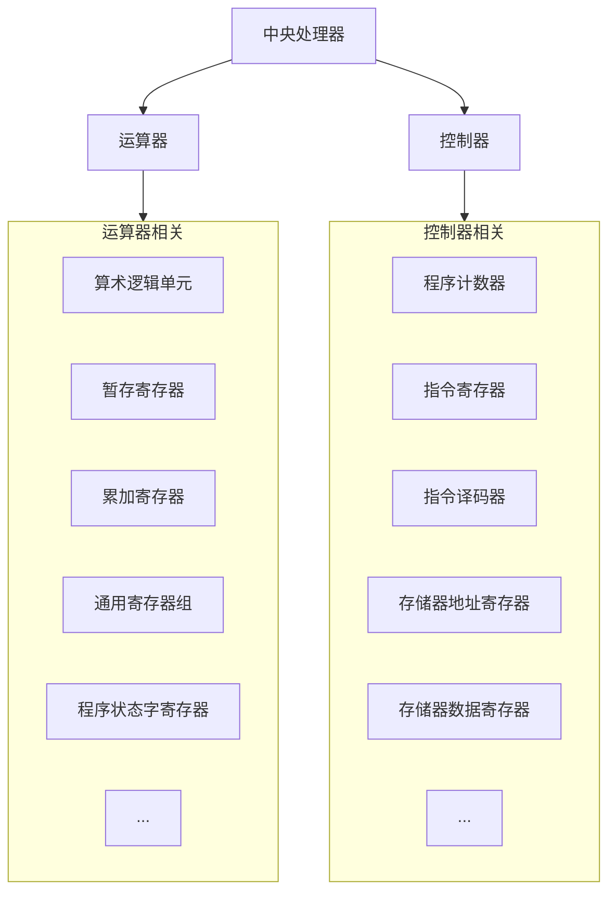

## 指令执行过程
### 指令周期

### 指令周期的数据流

### 指令执行方案

## 数据通路的功能与基本结构
<u>数据在功能部件之间传送的路径称为数据通路</u>，包括数据通路上流经的部件，如 ALU、通用寄存器、状态寄存器、异常和中断处理逻辑等。数据通路描述了信息从什么地方开始，中间经过哪个寄存器或多路开关，最后传送到哪个寄存器，这些都需要加以控制。

数据通路由控制部件控制，控制部件根据每条指令功能的不同生成对数据通路的控制信号。数据通路的功能是实现 CPU 内部的运算器与寄存器及寄存器之间的数据交换。

## 控制器的功能和工作原理
### 结构与功能
从图 5.8 可以看到计算机硬件系统的五大功能部件及其连接关系。它们通过数据总线、地址总线和控制总线连接在一起，其中点画线框内的是控制器部件。
现对其主要连接关系简单说明如下：
1) 运算器部件通过数据总线与内存储器、输入设备和输出设备传送数据。
2) 输入设备和输出设备通过接口电路与总线相连接。
3) 内存储器、输入设备和输出设备从地址总线接收地址信息，从控制总线得到控制信号，通过数据总线与其他部件传送数据。
4) 控制器部件从数据总线接收指令信息，从运算器部件接收指令转移地址，送出指令地址到地址总线，还要向系统中的部件提供它们运行所需要的控制信号。

控制器是计算机系统的指挥中心，控制器的主要功能有：
1) 从主存中取出一条指令，并指出下一条指令在主存中的位置。
2) 对指令进行译码或测试，产生相应的操作控制信号，以便启动规定的动作。
3) 指挥并控制 CPU、主存、输入和输出设备之间的数据流动方向。
根据控制器产生微操作控制信号的方式的不同，控制器可分为硬布线控制器和微程序控制器，两类控制器中的 PC 和 IR 是相同的，但确定和表示指令执行步骤的办法以及给出控制各部件运行所需要的控制信号的方案是不同的。

### 硬布线控制器

### 微程序控制器

## 异常和中断机制
### 基本概念
由 CPU 内部产生的意外事件被称为异常，有些教材中也称内中断；
由来自 CPU 外部的设备向 CPU 发出的中断请求被称为中断，通常用于信息的输入和输出，有些教材中也称外中断。
异常是 CPU 执行一条指令时，由 CPU 在其内部检测到的、与正在执行的指令相关的同步事件；
中断是一种典型的由外部设备触发的、与当前正在执行的指令无关的异步事件。

### 分类
异常是由 CPU 内部产生的意外事件，分为硬故障中断和程序性异常。
硬故障中断是由硬连线出现异常引起的，如存储器校验错、总线错误等。
程序性异常也称软件中断，是指在 CPU 内部因执行指令而引起的异常事件。如整除 0、溢出、断点、单步跟踪、非法指令、栈溢出、地址越界、缺页等。按异常发生原因和返回方式的不同，可分为故障、自陷和终止。

中断是指来自 CPU 外部、与 CPU 执行指令无关的事件引起的中断，包括 I/O 设备发出的 I/O 中断（如键盘输入、打印机缺纸等)，或发生某种特殊事件（如用户按 Esc 键、定时器计数时间到) 等。外部 I/O 设备通过特定的中断请求信号线向 CPU 提出中断请求，CPU 每执行完一条指令就检查中断请求信号线，如果检测到中断请求，则进入中断响应周期。
中断可分为可屏蔽中断和不可屏蔽中断。
### 响应过程

## 指令流水线

## 多处理器
### SISD、SIMD、MIMD
基于指令流的数量和数据流的数量，将计算机体系结构分为 SISD、SIMD、MISD 和 MIMD 四类。常规的单处理器属于 SISD，而常规的多处理器属于 MIMD。
1. 单指令流单数据流 (SISD) 结构
SISD 是传统的串行计算机结构，这种计算机通常仅包含一个处理器和一个存储器，处理器在一段时间内仅执行一条指令，按指令流规定的顺序串行执行指令流中的若干条指令。为了提高速度，有些 SISD 计算机采用流水线的方式，因此，SISD 处理器有时会设置多个功能部件，并且采用多模块交叉方式组织存储器。
2. 单指令流多数据流 (SIMD）结构

3. 多指令流单数据流 (MISD) 结构
MISD 是指同时执行多条指令，处理同一个数据，实际上不存在这样的计算机。
4. 多指令流多数据流 (MIMD) 结构

### 硬件多线程

### 多核处理器

### 共享内存多处理器

# 总线

## 总线概述
总线是一组能为多个部件分时共享的公共信息传送线路。<u>分时和共享是总线的两个特点</u>。
分时是指同一时刻只允许有一个部件向总线发送信息，若系统中有多个部件，则它们只能分时地向总线发送信息。
共享是指总线上可以挂接多个部件，各个部件之间互相交换的信息都可通过这组线路分时共享，多个部件可同时从总线上接收相同的信息。

总线上所连接的设备，按其对总线有无控制功能可分为主设备和从设备两种。
- 主设备：指获得总线控制权的设备。
- 从设备：指被主设备访问的设备，它只能响应从主设备发来的各种总线命令。

总线特性是指机械特性（尺寸、形状、电气特性（传输方向和有效的电平范围、功能特性（每根传输线的功能）和时间特性（信号和时序的关系）。

---
总线有多种分类方式：
- 按功能与层次分类：
  - 片总线（元件级总线/C-Bus）：连接同一芯片内的各个功能模块的总线，如 CPU 内部的寄存器之间、ALU 与寄存器之间等。实例有 I²C 总线、SCI 总线、SPI 总线等。
  - 内总线（系统总线/板级总线/I-Bus）：连接计算机系统内部各个模块的总线，如 CPU 模块和内存模块之间的总线。实例有 ISA 总线、PCI 总线、EISA 总线等。
  - 外总线（通信总线/E-Bus）：连接计算机系统与外部设备之间的总线，如 CPU 模块和 I/O 设备之间的总线。实例有 RS-232C、IEEE-488、USB 等。
- 按传输数据方式分类：
  - 并行总线：数据位数大于 1 位的总线，如 8 位、16 位、32 位、64 位等。实例有 PCI 总线、ISA 总线等。
  - 串行总线：数据位数为 1 位的总线，如 USB、PCIe 等。
- 按时序控制方式分类：
  - 同步总线：总线上的数据传输由时钟信号控制，所有设备共享同一个时钟，如 PCI、ISA 等。
  - 异步总线：总线上的数据传输不依赖于时钟信号，而是通过握手信号进行控制，如 USB、RS-232C 等。

---
总线有以下结构：
1. 单总线结构

2. 双总线结构

3. 三总线结构

## 系统总线
系统总线是连接计算机系统内部各个模块的总线，如 CPU 模块和内存模块之间的总线。系统总线又称为板级总线或 I-Bus，是计算机系统中最重要的总线之一。系统总线的主要功能是传送指令、数据和控制信号，连接 CPU 模块、内存模块和 I/O 模块等各个功能部件。

系统总线有三大核心组件：
- 数据总线（Data Bus）
  - 功能：传送数据信息。数据是广义的，可以是真正的数据、指令代码或状态信息。
  - 方向：双向三态。既可以把 CPU 的数据传送到存储器或 I/O 接口，也可以将其他部件的数据传送到 CPU。
  - 宽度：数据总线的位数是微型计算机的重要指标，通常与微处理器的字长相一致。总线的宽度决定了每次传送的数据量，如 8 位数据总线每次传送 1 字节数据，16 位数据总线每次传送 2 字节数据，32 位数据总线每次传送 4 字节数据等。
- 地址总线（Address Bus）
  - 功能：专门用来传送地址，指出数据总线上的源数据或目的数据所在的主存单元或 I/O 端口的地址。
  - 方向：单向三态。地址只能从 CPU 传向外部存储器或 I/O 端口。
  - 寻址能力：地址总线的位数决定了 CPU 可直接寻址的内存空间大小。若地址总线为 $n$ 位，则可寻址空间为 $2^n$ 字节。例如，20 位地址总线可寻址 1MB 内存，32 位地址总线可寻址 4GB 内存等。
- 控制总线（Control Bus）
  - 功能：传送控制信号和时序信号。包括 CPU 送出的控制命令（读/写信号、片选信号、中断响应信号）和其他部件反馈给 CPU 的信号（中断申请信号、复位信号、总线请求信号）等。
  - 方向：双向，具体方向由控制信号本身决定。

>[!note]
> 有的系统中，数据总线和地址总线是复用的，即同一组线在不同时刻传输地址或数据（如 51 系列单片机）。这样可以减少总线数量，节省空间和成本，但速度会下降，至少需要 2 个总线周期。

## 常见标准
总线标准是国际上公布的互连各个模块的标准，是把各种不同的模块组成计算机系统时必须遵守的规范。
典型的总线标准有 ISA、EISA、VESA、PCI、AGP、PCI-Express、USB 等。
它们的主要区别是总线宽度、带宽、时钟频率、寻址能力、是否支持突发传送等。
<table border="1" cellpadding="8" cellspacing="0">
    <thead>
        <tr style="background-color: #f5f5f5;">
            <th> 分类 </th>
            <th> 总线标准 </th>
            <th> 功能 </th>
            <th> 带宽（示例）</th>
            <th> 特点 </th>
            <th> 主要应用 </th>
        </tr>
    </thead>
    <tbody>
        <!-- 片内总线 -->
        <tr>
            <td rowspan="4"> <strong> 片内总线 </strong> </td>
            <td> AXI </td>
            <td> 连接处理器与外设/内存（ARM AMBA 规范）</td>
            <td> 灵活（视实现，如 128 位、数百 MHz）</td>
            <td> 高性能点对点，支持突发传输，多主机/从机 </td>
            <td> ARM SoC（智能手机、嵌入式设备）</td>
        </tr>
        <tr>
            <td> AXI4 </td>
            <td> AMBA 4 高级可扩展接口 </td>
            <td> 可配置（如 512 位）</td>
            <td> 支持 QoS、多主机仲裁、低功耗模式 </td>
            <td> 现代 ARM SoC、异构系统 </td>
        </tr>
        <tr>
            <td> AMBA (APB/AHB/ASB)</td>
            <td> 片上外设连接（低速 APB，高速 AHB、ASB）</td>
            <td> 灵活（APB 几十 MB/s，AHB 数百 MB/s）</td>
            <td> 模块化架构，外设总线/系统总线分离 </td>
            <td> ARM 嵌入式系统、FPGA 设计 </td>
        </tr>
        <tr>
            <td> Wishbone </td>
            <td> 开源片上互连标准 </td>
            <td> 可配置（32-256 位）</td>
            <td> 简洁接口，支持标准化 IP 集成 </td>
            <td> FPGA、开源硬件项目 </td>
        </tr>
        <!-- 系统总线 -->
        <tr>
            <td rowspan="5"> <strong> 系统总线 </strong> </td>
            <td> FSB </td>
            <td> 连接 CPU 与北桥/内存控制器 </td>
            <td> 3.2-12.8 GB/s（视代数）</td>
            <td> 并行传输，传统设计，逐步淘汰 </td>
            <td> 早期 x86 PC（Intel Core 2 Duo）</td>
        </tr>
        <tr>
            <td> QPI </td>
            <td> 连接 CPU 与内存/其他 CPU </td>
            <td> 25.6 GB/s（6.4 GT/s）</td>
            <td> 点对点，双向，差分信号，多主机 </td>
            <td> Intel Xeon、Core i7/i9（第 1 代至 3 代）</td>
        </tr>
        <tr>
            <td> UPI </td>
            <td> Ultra Path Interconnect（QPI 升级版）</td>
            <td> 38.4 GB/s（9.6 GT/s）或更高 </td>
            <td> 改进的编码和可靠性 </td>
            <td> Intel Xeon Scalable（第 2 代及后续）</td>
        </tr>
        <tr>
            <td> HyperTransport </td>
            <td> 连接 CPU、内存控制器及其他设备 </td>
            <td> 51.2 GB/s（HT 3.1）</td>
            <td> 点对点，NUMA 支持，高带宽，多链路 </td>
            <td> AMD Opteron、Ryzen、EPYC </td>
        </tr>
        <tr>
            <td> Infinity Fabric </td>
            <td> AMD 新一代互连 </td>
            <td> 视代数（如 Ryzen 5000：PCIe 4.0 带宽）</td>
            <td> 高效率、低延迟、可扩展 </td>
            <td> AMD Ryzen、EPYC、Radeon 芯片 </td>
        </tr>
        <!-- I/O 总线 -->
        <tr>
            <td rowspan="6"> <strong> I/O 总线 </strong> </td>
            <td> ISA </td>
            <td> Industry Standard Architecture（传统并行总线）</td>
            <td> 8-16 MB/s（16 位）</td>
            <td> 低速，并行，历史地位重要 </td>
            <td> 早期 PC（286-Pentium 时代）</td>
        </tr>
        <tr>
            <td> EISA </td>
            <td> Extended ISA </td>
            <td> 32 MB/s（32 位，33 MHz）</td>
            <td> 向后兼容 ISA，过渡性设计 </td>
            <td> 1990 年代 PC 工作站 </td>
        </tr>
        <tr>
            <td> VESA </td>
            <td> Video Electronics Standards Association（VL-Bus）</td>
            <td> 160 MB/s（32 位，40 MHz）</td>
            <td> 高速本地总线，支持显卡加速 </td>
            <td> 早期显卡加速系统 </td>
        </tr>
        <tr>
            <td> PCI </td>
            <td> Peripheral Component Interconnect </td>
            <td> 133-533 MB/s（32/64 位，33-66 MHz）</td>
            <td> 标准化 IP 核，广泛支持 </td>
            <td> PC 主板、工业设备 </td>
        </tr>
        <tr>
            <td> AGP </td>
            <td> Accelerated Graphics Port </td>
            <td> 2.1-8.5 GB/s（AGP 1x-8x）</td>
            <td> 专为显卡设计，带宽动态分配 </td>
            <td> 2000 年代显卡扩展 </td>
        </tr>
        <tr>
            <td> DMI </td>
            <td> Direct Media Interface </td>
            <td> 1-3.93 GB/s（DMI 2.0/3.0）</td>
            <td> 基于 PCIe 物理层，连接北南桥 </td>
            <td> Intel 桌面/笔记本平台 </td>
        </tr>
        <!-- 通信总线 -->
        <tr>
            <td rowspan="16"> <strong> 通信总线 </strong> </td>
            <td> PCIe </td>
            <td> PCI Express（高速串行总线）</td>
            <td> 64 GB/s（PCIe 5.0 x16）</td>
            <td> 点对点，可扩展，热插拔，低功耗 </td>
            <td> GPU、NVMe SSD、网卡、扩展卡 </td>
        </tr>
        <tr>
            <td> PCIe 6.0 </td>
            <td> 下一代 PCIe 标准 </td>
            <td> 128 GB/s（x16）</td>
            <td> 改进编码效率，支持光学链路 </td>
            <td> 数据中心、高性能计算 </td>
        </tr>
        <tr>
            <td> USB </td>
            <td> Universal Serial Bus </td>
            <td> 5-40 Gb/s（USB 2.0/3.x/4.0）</td>
            <td> 通用，热插拔，供电，成本低 </td>
            <td> 消费电子、外设、存储 </td>
        </tr>
        <tr>
            <td> SATA </td>
            <td> Serial ATA </td>
            <td> 600 MB/s（SATA 3.0/600）</td>
            <td> 串行，成本低，存储专用，简洁 </td>
            <td> HDD、SSD、光驱 </td>
        </tr>
        <tr>
            <td> NVMe </td>
            <td> Non-Volatile Memory Express </td>
            <td> 8 GB/s（PCIe 4.0 x4）</td>
            <td> 基于 PCIe，低延迟，高 IOPS，并发 </td>
            <td> 高性能 SSD、企业存储 </td>
        </tr>
        <tr>
            <td> M.2 </td>
            <td> 物理形态标准（基于 NVMe/SATA）</td>
            <td> 3.5 GB/s（NVMe）或 600 MB/s（SATA M.2）</td>
            <td> 小型，易安装 </td>
            <td> 笔电、台式机 SSD </td>
        </tr>
        <tr>
            <td> Thunderbolt </td>
            <td> 显示/数据/电源集成总线 </td>
            <td> 40-80 Gb/s（TB 3/4）</td>
            <td> 基于 PCIe/DisplayPort，菊花链，高功率 </td>
            <td> MacBook、外置设备、显示器 </td>
        </tr>
        <tr>
            <td> DisplayPort </td>
            <td> 显示接口标准 </td>
            <td> 8-80 Gb/s（DP 1.2-2.1）</td>
            <td> 支持多显示器，无损音频 </td>
            <td> 显示器、GPU、便携设备 </td>
        </tr>
        <tr>
            <td> InfiniBand </td>
            <td> 高性能数据中心互连 </td>
            <td> 300 Gb/s（HDR 12x）</td>
            <td> 低延迟，高带宽，RDMA 支持 </td>
            <td> 超级计算机、数据中心、GPU 集群 </td>
        </tr>
        <tr>
            <td> RapidIO </td>
            <td> 点对点互连标准 </td>
            <td> 100 Gb/s（RapidIO 3.x）</td>
            <td> 低延迟，支持 QoS，关键系统级互连 </td>
            <td> 电信、国防、工业控制 </td>
        </tr>
        <tr>
            <td> Ethernet </td>
            <td> 网络通信标准 </td>
            <td> 10-400 Gb/s（10GbE 至 400GbE）</td>
            <td> 有损传输，但可靠性高，应用广 </td>
            <td> 网络连接、数据中心互联 </td>
        </tr>
        <tr>
            <td> CXL </td>
            <td> Compute Express Link </td>
            <td> 32 Gb/s（CXL 1.x）或 68 Gb/s（CXL 2.x）</td>
            <td> CPU-Accelerator 互连，内存共享性能 </td>
            <td> AI 加速器、GPU、内存扩展 </td>
        </tr>
        <tr>
            <td> I2C </td>
            <td> Inter-Integrated Circuit </td>
            <td> 100-400 kbit/s（标准/快速）</td>
            <td> 低速，低成本，多主机 </td>
            <td> 传感器、EEPROM、电源管理芯片 </td>
        </tr>
        <tr>
            <td> I2S </td>
            <td> Inter-IC Sound </td>
            <td> 音频应用 </td>
            <td> 同步串行，专为音频数据流 </td>
            <td> 音频编解码器、DSP、CODEC </td>
        </tr>
        <tr>
            <td> SPI </td>
            <td> Serial Peripheral Interface </td>
            <td> 十几 MB/s-几百 MB/s </td>
            <td> 主从模型，全双工，高速通信 </td>
            <td> Flash、传感器、触屏、存储卡 </td>
        </tr>
        <tr>
            <td> UART </td>
            <td> Universal Asynchronous Receiver Transmitter </td>
            <td> 几百 kbit/s-几 Mbit/s </td>
            <td> 异步，简单，调试通信常用 </td>
            <td> 串口通信、嵌入式调试 </td>
        </tr>
    </tbody>
</table>

## 性能指标

## 实例

### 视频总线发展
视频总线接口的发展经历了从模拟信号到数字信号、从单一功能到多功能融合的演进历程。这一演变反映了显示技术从 CRT 显像管到 LCD 液晶面板，再到如今 8K/高刷新率时代的深刻变革。

==模拟时代==
- **AV 接口**（Audio Video）：复合视频（Composite Video）和分量视频（Component Video）是早期模拟视频接口，分别使用单根或三根 RCA 连接器传输模拟信号，带宽有限，图像质量较差。现已被淘汰。
  - 时间背景：20 世纪 80 年代至 90 年代初，主要用于 VCR、DVD 等消费电子设备，是最早普及的民用视频接口。
  - 特征：红、白、黄三色 RCA 插头（黄 = 视频，白 = 左声道，红 = 右声道），仅传输模拟视频和音频信号，无法支持高分辨率和数字显示设备。
  - 技术原理：亮度/色度（Y/C）混合的单路模拟视频传输。
  - 缺点：色彩信号损失大，用于数字设备需数模转换，信噪比损失严重；图像质量不稳定，无法满足现代显示需求。
    
- **S-端子接口**（Separate Video）出现于 1987 年，采用 4 针 Mini-DIN 连接器，分离亮度（Y）和色度（C）信号传输，带宽提升，图像质量较复合视频有明显改善，但仍属于模拟接口，无法满足数字显示设备的需求。
  - 技术改进：通过分离亮度（Y）和色度（C）信号，减少了信号干扰，提高了图像质量，适用于 DVD、游戏主机等设备。
    
- **VGA 接口**（Video Graphics Array）出现于 1987 年，由 IBM 公司提出，采用 15 针 D-Sub 连接器，传输三路 0.7V 峰峰值的 RGB 模拟信号。VGA 的优势在于实现简单、兼容性好，在 CRT 显示器时代实现了广泛应用，但其模拟信号容易受干扰，长距离传输衰减严重，且无法传输音频信息。随着液晶显示器的出现，VGA 需要经过模数转换才能驱动数字显示设备，这一转换过程会造成信息丢失，显示效果下降。
  - 技术原理：RGB 模拟信号传输，每个颜色通道独立传输亮度信息。
  - 接口形式：15 针 D-Sub 连接器，分为三排，每排五针，带有手拧螺母固定装置。
  - 标准分辨率：640×480@60Hz，最高支持 2048×1536@85Hz（视显示器和线材质量而定）。
  - 缺点：模拟信号易受干扰，长距离传输衰减严重；无法传输音频；不适用于数字显示设备。
  - 历史地位：CRT 显示器时代的绝对主流，兼容性极强（Windows 开机画面仍使用 VGA 模式）。

==数字时代==
- **DVI 接口**（Digital Visual Interface）于 1999 年面世，采用 **TMDS**（最小化传输差分信号）技术实现数字信号传输。DVI 分为三种类型：DVI-D 仅支持数字信号、DVI-A 支持模拟信号（兼容 VGA）、DVI-I 集成两者。单通道 DVI 带宽为 3.96Gbps（支持 1920×1200）、双通道达 7.92Gbps。DVI 标志着视频接口从模拟迈向数字的关键一步，但它仍然无法传输音频，需要额外的音频线材，这对一体化设计造成了障碍。
  - 技术原理：TMDS 编码将数字视频数据转换为差分信号，减少电磁干扰，提高传输质量。
  - 接口形式：24 针连接器，分为三排，每排八针，部分版本带有四个额外的引脚用于模拟信号。
  - 标准分辨率：单通道支持最高 1920×1200@60Hz，双通道支持更高分辨率。
  - 缺点：无法传输音频；接口较大，不适合便携设备；逐渐被 HDMI 和 DisplayPort 取代。
  - 历史地位：数字显示时代的过渡标准，广泛应用于早期 LCD 显示器和显卡。
- **HDMI 接口**（High-Definition Multimedia Interface）于 2002 年推出，首次实现了<u>音视频和控制信号的统一传输</u>。HDMI 采用单根电缆传输未压缩的数字视音频和控制信号，从 1.0 版本的 4.95Gbps 发展到 2.1 版本的 48Gbps，支持 8K@60Hz。HDMI 拥有多种接头规格（Type A 标准、Type C 迷你、Type D 微型），成为消费类显示设备的全球标准。
  - 技术原理：基于 TMDS 技术，支持多通道音频和视频数据传输，同时集成 CEC（Consumer Electronics Control）功能实现设备间控制。
  - 接口形式：Type A（19 针标准）、Type C（19 针迷你，mini-HDMI）、Type D（19 针微型，micro-HDMI），均采用单排针脚设计（Type-B 为 29pin（双链路），未实际应用）。
  - 版本演化
      - HDMI 1.0（2002 年）：4.95Gbps，支持 1080p 视频和 8 声道音频。
      - HDMI 1.3（2006 年）：10.2Gbps，支持 1440p 视频、Deep Color 和 Dolby TrueHD。
      - HDMI 1.4（2009 年）：10.2Gbps，支持 4K@30Hz、3D 视频、以太网通道。
      - HDMI 2.0（2013 年）：18Gbps，支持 4K@60Hz、HDR、32 声道音频。
      - HDMI 2.1（2017 年）：48Gbps，支持 8K@60Hz、4K@120Hz、动态 HDR。
  - 商业机制
    - HDMI 采用专利授权模式，制造商需支付专利费，这推动了 HDMI 的广泛采用，但也限制了某些厂商的使用。
    - HDCP（High-bandwidth Digital Content Protection）是 HDMI 的数字版权保护机制，限制了内容的复制和传输，影响了某些用户的使用体验。
  - 优点：统一音视频传输，广泛兼容，支持高分辨率和高刷新率显示设备。
  - 历史地位：现代显示设备的主流接口，广泛应用于电视、显示器、游戏主机等领域。
  
- **DisplayPort 接口** 由 VESA 组织推出，采用<u>基于数据包的传输机制和MST（多流传输）技术</u>，相比 HDMI 更具灵活性。DP 标准实现了无版权费收费（而 HDMI 需要支付专利费），这使得许多厂商更倾向于 DP。DP 2.1 版本带宽达 80Gbps，支持 8K@60Hz 甚至 16K 分辨率，并支持 DP-AE 标准用于汽车应用。
  - 技术原理：基于数据包的传输机制，支持多流传输（MST）允许通过单一接口连接多个显示器。
  - 接口形式：20 针连接器，分为两排，每排十针，部分版本带有锁定机制确保连接稳定。
  - 版本演化
    - DP 1.0（2006 年）：8.64Gbps，支持 2560×1600@60Hz。
    - DP 1.2（2010 年）：17.28Gbps，支持 4K@60Hz、MST。
    - DP 1.4（2016 年）：25.92Gbps，支持 8K@60Hz、HDR、DSC（Display Stream Compression）。
    - DP 2.0（2019 年）：80Gbps，支持 16K@60Hz、4K@120Hz、HDR10+。
  - 关键技术优势
    - 多流传输（MST）：单根 DP 线连接多个显示器（菊花链）。
    - 链路训练透明性（LTTPR）：支持多级中继，适合长距离和汽车应用。
    - 自适应同步：VRR 技术减少画面撕裂（游戏优势）。
    - 更高带宽：始终保持对 HDMI 的领先。
  - 历史地位：专业显示领域的首选接口，广泛应用于高端显示器和工作站。
    
- **USB-C 接口**（基于 USB 3.1/3.2/4.0）通过 Alternate Mode（Alt Mode）支持视频输出，兼容 HDMI、DisplayPort 等多种视频标准。USB-C 的优势在于其小型化设计、双向传输能力和集成电源功能，使其成为现代笔记本电脑、智能手机和平板电脑的首选接口。
  - 技术原理：通过 Alternate Mode（Alt Mode）允许 USB-C 接口复用为 HDMI、DisplayPort 等视频输出，同时支持数据传输和供电。
  - 接口形式：24 针双排连接器，支持正反插拔设计。
  - 标准分辨率：取决于 Alt Mode 协议，如 DisplayPort Alt Mode 可支持最高 8K@60Hz。
  - 优点：小型化设计，双向传输，集成电源功能，适用于多种设备。
  - 历史地位：现代移动设备和笔记本电脑的主流接口，推动了视频接口的融合发展。

>[!note]
> 模拟向数字转变的本质是减少转换损失。模拟接口在传输过程中容易受到电磁干扰，而数字接口通过编码方式将干扰风险从幅度域转移到时间域，提高了抗干扰能力。

当前，HDMI 和 DisplayPort 形成了并行发展的格局。消费类显示器以 HDMI 为主，专业显示器倾向 DP，而高端笔记本电脑和新兴设备越来越多地采用 Thunderbolt 或集成音视频功能的 USB-C 接口。视频接口从单一功能（仅视频）发展到多功能融合（视频+音频+充电+数据），这个演进过程充分体现了总线标准不断整合优化的趋势。

### 硬盘总线发展
硬盘接口的发展历程是计算机存储子系统演进的缩影。其核心脉络可以概括为：传输方式从并行到串行（解决信号同步与干扰问题）、物理接口从大到小（适应设备轻薄化趋势）、传输协议从适配机械硬盘到为闪存原生设计（突破性能瓶颈）。

>[!note]
> ATA（Advanced Technology Attachment）接口是 1980 年代初期为连接硬盘而设计的并行总线标准，后来发展为 IDE（Integrated Drive Electronics）。

- **IDE 接口**（Integrated Drive Electronics，也称为 PATA，parallel ATA）于 1986 年由康柏等公司推出。
  - 核心理念：将硬盘控制器与盘体集成在一起，减少了接口电缆数目与长度，增强了数据传输可靠性。
  - 物理特征：采用 40 针或 80 针连接器，数据线为扁平带状电缆，支持单主机双设备（主盘和从盘）。
  - 技术局限：采用 16 位并行数据总线，工作频率为 5-16MHz，最高传输速率仅为 66-133MB/s。随着频率提升，线间干扰（crosstalk）问题日益严重，限制了 IDE 总线频率无法超过 200MHz。
  - 历史地位：IDE 接口统治了 PC 存储领域近 15 年，但随着 SATA 技术在 2001 年确立标准，IDE 逐渐退出历史舞台。如今在主流 PC 市场已被完全淘汰，仅在老旧设备和工业维护场景中可见。
- **SATA 接口**（Serial ATA）于 2003 年面世，采用差分信号的两对串行传输通道。
  - 核心技术特性
    - 串行传输：每条 SATA 通道只传输一位数据，但通过高频率（从 150MB/s 到 600MB/s）和差分信号技术实现更高的带宽和更远的传输距离。
    - 点对点连接：每条 SATA 接口只能连接一个设备，消除了 IDE 的主从盘配置问题，提高了性能和可靠性。
    - 热插拔支持：SATA 支持设备在系统运行时插拔，增强了系统的灵活性和维护便利性。
    - CRC 校验：SATA 协议内置了循环冗余校验（CRC）机制，确保数据传输的完整性。
  - 技术演进：SATA 1.0（150MB/s）、SATA 2.0（300MB/s）、SATA 3.0（600MB/s），最新的 SATA Express 甚至支持 16Gbps。
  - NCQ（Native Command Queuing）技术：SATA 2.0 引入的关键技术。允许硬盘内部优化命令执行顺序，提高多任务处理效率，尤其在机械硬盘中效果显著。
  - 物理接口形态
    - 标准 SATA 接口：7 针数据线和 15 针电源线，连接器小巧，布线整洁。
    - eSATA 接口：外部 SATA 接口，采用更坚固的连接器，适用于外置存储设备。
    - mSATA 接口：迷你 SATA 接口，适用于笔记本电脑和小型设备。mSATA 曾在 2010-2013 年的超极本中广泛应用，但随着 M.2 接口的推出，mSATA 已完成其历史使命。当前已被 M.2 接口完全取代，退出主流市场。
  - 历史地位：SATA 成为桌面和笔记本电脑的主流存储接口，广泛应用于机械硬盘和入门级固态硬盘领域，但面临着挑战。在固态硬盘领域，SATA 3.0 的 6Gb/s 带宽已成为性能瓶颈。随着 NVMe 固态硬盘价格下探，SATA 在高端市场正被逐步替代，但在成本敏感和机械硬盘领域仍将长期存在。
    
- **M.2 接口**（Next Generation Form Factor，NGFF）于 2012 年推出，最初设计用于笔记本电脑的固态硬盘，支持 SATA 和 NVMe 协议。M.2 接口采用更小巧的连接器和更灵活的物理尺寸（如 2242、2260、2280 等），适应了设备轻薄化的趋势。M.2 接口的关键创新在于其支持 PCIe 通道直连，使得 NVMe 固态硬盘能够充分发挥性能潜力，成为高性能存储设备的首选接口。
  - 钥位：M.2 接口通过 "钥位"（缺口位置）来区分不同功能的模块，防止插入不兼容插槽。
    - B-key：缺口位置在第 12-19 针之间，支持 PCIe x2 和 SATA，适用于入门级 SSD 和无线网卡。B-key 带宽限制：即使插在 M-key 插槽上，B-key 模块也只能使用 PCIe x2 通道。
    - M-key：缺口位置在第 59-66 针之间，支持 PCIe x4，适用于高性能 NVMe SSD。M-key 是高性能的标志，只有 M-key 才能支持 PCIe x4 通道，实现 NVMe 固态硬盘的满速运行。
    - B+M-key：同时具有 B-key 和 M-key 的缺口位置，兼容性更强，但性能受限于 PCIe x2。M Key 插槽可以接受 B+M Key 模块，但反之不一定。
  - 尺寸规范：M.2 模块的尺寸命名规则为：宽度（mm）+ 长度（mm）。如 2280 表示宽 22mm，长 80mm。常见尺寸包括 2242、2260、2280 和 22110 等。
  - 两种协议类型
    - M.2 SATA：通过 SATA 协议连接，性能受限于 SATA 3.0 的 6Gb/s 带宽，适用于入门级固态硬盘。
    - M.2 NVMe：通过 PCIe 通道直连，性能远超 SATA，适用于高性能固态硬盘。
  - 历史地位：M.2 接口成为现代笔记本电脑和高性能台式机的主流存储接口，支持 SATA 和 NVMe 协议，满足了不同性能需求的用户。随着 NVMe 固态硬盘的普及，M.2 接口在高端市场的地位日益巩固，而在入门级市场仍有一定应用空间。
    

>[!note]
> NVMe（Non-Volatile Memory Express）是一种逻辑设备接口协议，而非物理接口或外形规格，由 PCI-SIG（PCI Special Interest Group）标准化。NVMe 协议专为闪存设计，支持更高的并发队列和更低的延迟，突破了 SATA 接口的性能瓶颈。
> 在 NVMe 出现之前，SSD 使用的是 AHCI 协议（Advanced Host Controller Interface）。AHCI 是为机械硬盘设计的，存在先天局限：
> | 对比维度 | AHCI 协议 | NVMe 协议 |
> |-|-|-|
> | 队列数量	| 1 个命令队列	| 最多 65535 个队列 |
> | 队列深度	| 每条队列 32 条命令	| 每条队列 65535 条命令 |
> | 并行性	| 无法充分利用多核 CPU	| 队列可映射到不同 CPU 核心 |
> | 延迟	| 软件栈开销大	| 精简指令集，延迟更低 |

>[!note]
> 为什么从并行改为串行反而速度更快？核心在于频率提升的能力。IDE 在 133MHz 时已达技术极限，而 SATA 通过 6Gbps（相当于 6000MHz 的有效传输）轻松超越。这背后的原因是并行总线随着频率提高信号完整性下降，需要驱动能力更强的芯片，成本和功耗增加；串行总线虽然单条线路的工作频率很高，但线路简单，驱动简单，功耗反而更低。

### RJ45

**RJ45 连接器**（Registered Jack 45）是以太网最常用的物理接口标准，由 8 根铜质接触片组成的 8P8C 连接器实现。RJ45 看似简单，但其背后体现了现代网络通信的精妙设计。

---
在 10/100Mbps 以太网中，实际起作用的只有 4 根线（1、2、3、6 脚）：
| 引脚 | 信号定义 | 功能 |
|------|----------|------|
| 1 | TX+ | 发送数据+ |
| 2 | TX- | 发送数据- |
| 3 | RX+ | 接收数据+ |
| 6 | RX- | 接收数据- |
| 4、5、7、8 | - | 不使用 |

>[!tip]
> RJ45 接口采用差分传输方式，TX+和 TX-是一对双绞线，拧在一起可以减少干扰 。

千兆以太网需要使用全部 4 对线（8 根）进行双向传输：

| 引脚 | 信号定义 | 
|------|----------|
| 1 | DA+ |
| 2 | DA- |
| 3 | DB+ |
| 4 | DC+ |
| 5 | DC- |
| 6 | DB- |
| 7 | DD+ |
| 8 | DD- |

---
国际标准规定了两种 RJ45 接线方案：
- T568A 线序：绿白-绿-橙白-蓝-蓝白-橙-棕白-棕
- T568B 线序（最常用）：橙白-橙-绿白-蓝-蓝白-绿-棕白-棕

---
为了理解直连线与交叉线，先区分两种设备：
- DTE（Data Terminal Equipment，数据终端设备）：如计算机、路由器等，通常使用 T568B 线序。
- DCE（Data Communication Equipment，数据通信设备）：如交换机、集线器等，通常使用 T568A 线序。

连接规则：
- 直连线（Straight-through Cable）：两端使用相同的线序（如 T568B-T568B），用于连接 DTE 与 DCE 设备（如计算机与交换机）。
- 交叉线（Crossover Cable）：两端使用不同的线序（如 T568A-T568B），用于连接同类设备（如计算机与计算机，交换机与交换机）。交叉线将发送和接收信号线交叉连接，使得两台计算机的发送线连接到对方的接收线。

>[!tip]
> 现在许多设备支持自动翻转（Auto-MDI/MDIX）功能，可以自动识别并适应线缆类型，因此在实际使用中对直连/交叉线的区分已不那么严格。

---
分类（Cable Category）标准决定了 RJ45 的传输能力，它主要规范了线缆的衰减延迟（ACR）、串扰、返回损耗等电气特性，分类越高，线缆的屏蔽和绞合密度越高，外界干扰越难侵入。

| 类别 | 连接器类型 | 最大传输速率 | 最大传输距离 | 应用场景 |
|------|--------------|--------------|----------|----------|
| Cat 5 (五类) | RJ45 | 100Mbps | 100m | 早期以太网 |
| Cat 5e (超五类) | RJ45 | 1Gbps | 100m | 家庭和企业网络 |
| Cat 6 (六类) | RJ45 | 10Gbps | 55m | 数据中心、企业网络 |
| Cat 6a (超六类) | RJ45 | 10Gbps | 100m | 数据中心、企业网络 |
| Cat 7 (七类) | GG45 | 10Gbps 以上 | 100m | 高性能数据中心 |

>[!note]
> RJ45 为何能在几十年间始终占据主导地位，而其他接口层出不穷？因为 RJ45 的设计充分低耦合：物理形态稳定（连接器规格标准化），传输协议演进（从 100Base-T 到 1GBase-T 再到 10GBase-T）而线缆形态基本不变。向后兼容性极强，新设备可直接插入旧网络运行在低速率。

---
标准以太网（802.3）最初定义在 10Mbps，通过 RJ45 连接器传输曼彻斯特编码的信号。Fast Ethernet（802.3u，100Mbps）改进了编码方式，采用 4B5B 加速摩登编码；Gigabit Ethernet（802.3ab，1Gbps）充分利用 RJ45 的全 8 根线缆，采用 5 级 PAM 调制和 Tomlinson-Harashima 预编码技术，实现了在普通电话线距离（100m）上的吉比特传输。10 Gigabit Ethernet（802.3an，10Gbps）要求 Cat 6A 线缆，实现成本陡增但仍保持 RJ45 物理形态。

当代数据中心为追求更高速率，衍生出光纤以太网标准（如 10G-LR、100G-LR4），这类接口使用 LC、MTP 等光纤连接器，但在 LAN 主干网中 100Gbps 仍可采用 QSFP28 光模块+光纤+RJ45 管理口的混合方案。对于普通用户，<u>RJ45仍是无可替代的网络接口</u>，其能胜任从家庭宽带到企业园区网的所有应用场景。

### USB

**USB**（Universal Serial Bus，通用串行总线）定义于 1996 年，目标是统一计算机与外设的连接标准，替代当时繁杂的 RS-232、并口、SCSI 等接口。USB 采用了<u>主从式拓扑结构，其中计算机充当主从控制器（Host），外设作为从设备（Device）</u>，这种非对称设计大大简化了外设的复杂度。

- USB 接口类型（Type）：指物理连接器的形状、引脚定义和机械结构。
  - Type-A：最常见的矩形连接器，通常用于主机端（如电脑、充电器）。
  - Type-B：方形连接器，常用于打印机、扫描仪等外设端。
  - Type-C：新型对称连接器，支持正反插，适用于现代设备。
- 协议版本（Gen）：指数据传输的技术标准。
  - USB 1.1（1998 年）：定义了三种速率：低速 1.5Mbps、满速 12Mbps。1.1 版本使用 4 针连接器（D-Sub 型），包括 VBUS（+5V 电源）、GND（地）、DM/DP（两根差分数据线）。
  - USB 2.0（2000 年）：引入了高速模式 480Mbps，保持了与 USB 1.1 的物理兼容性。USB 2.0 的连接器增加了一个额外的引脚（ID），用于区分主机和从设备。
  - USB 3.0/3.1（2008/2013 年）：引入了 SuperSpeed 传输模式，USB 3.0 达 5Gbps、USB 3.1 达 10Gbps，同时保留了旧版的兼容性引脚（成为 Type-A 接口的后缀为蓝色）。USB 3.x 的最大功率提升至 100W，使得可以直接为笔记本电脑充电。当 USB 进入 3.0 时代（5Gbps），原有的 4 引脚设计无法满足高速传输需求，USB-IF 协会对 Type-A 接口进行了扩展。USB 3.0 Type-A 在原有 4 引脚的后方增加了 5 个新引脚，实现了对 USB 2.0 设备的向后兼容。
  - USB 4.0（基于 Thunderbolt 3 的商用化）支持 40Gbps 带宽，采用 Type-C 连接器，集成 PCIe、DisplayPort 和 PD 快充功能。USB 4.0 完全采用 Type-C 连接器，取消了旧版 Type-A 和 Type-B 接口，标志着 USB 接口形态的统一。
  - USB 4 2.0（2022 年）在 USB 4.0 的基础上提升了数据传输速率至 80Gbps，进一步增强了视频输出和充电能力，继续使用 Type-C 连接器。
>[!tip]
> USB 2.0 Type-A：内部塑料舌片通常为黑色或白色；
> USB 3.0/3.1 Type-A：内部塑料舌片通常为蓝色，以区分不同版本。

USB Type-C 是 2014 年推出的全新连接器标准，设计目标是实现更高的性能和更广泛的应用。Type-C 接口采用 24 针双排设计，支持正反插功能，最大功率达 100W（USB PD 标准），数据传输速率最高可达 40Gbps（USB 4.0）。
USB-C 接口采用完全对称设计，拥有 24 个引脚，这是其强大功能的基础：

| 面 | 引脚编号 | 信号名称 | 功能说明 |
|---|---|---|---|
| A 面 | A1, A12 | GND | 电源地（4 个 GND 引脚分布四角） |
| A 面 | A4, A9 | VBUS | +5V 电源（4 个 VBUS 引脚提供大电流） |
| A 面 | A2, A3 | SSTXp1, SSTXn1 | SuperSpeed 发送差分对 1 |
| A 面 | A10, A11 | SSRXp1, SSRXn1 | SuperSpeed 接收差分对 1 |
| A 面 | A6, A7 | Dp1, Dn1 | USB 2.0 差分对（兼容） |
| A 面 | A5 | CC1 | 配置通道 1（关键控制引脚） |
| A 面 | A8 | SBU1 | 边带使用通道 1（备用模式） |
| B 面 | B12, B1 | GND | 电源地 |
| B 面 | B4, B9 | VBUS | +5V 电源 |
| B 面 | B2, B3 | SSTXp2, SSTXn2 | SuperSpeed 发送差分对 2 |
| B 面 | B10, B11 | SSRXp2, SSRXn2 | SuperSpeed 接收差分对 2 |
| B 面 | B6, B7 | Dp2, Dn2 | USB 2.0 差分对 2 |
| B 面 | B5 | CC2 | 配置通道 2 |
| B 面 | B8 | SBU2 | 边带使用通道 2 |

- 对称性：A 面和 B 面完全对称，这是正反插的物理基础。
- GND/VBUS 四角分布：4 个 GND 和 4 个 VBUS 引脚确保在插拔过程中先接通地线后断开电源（热插拔安全）。
- 两套 SuperSpeed 通道：可实现双通道 20Gbps（USB 3.2 Gen 2x2）或 40Gbps（USB4）传输。
- CC 引脚核心作用：
  - 检测连接方向（决定哪组 TX/RX 通道启用）
  - 识别设备角色（主机/设备）
  - 通过 PD 协议协商供电电压和电流
- SBU 引脚：用于备用模式（如 DisplayPort 视频传输）。

USB 采用中断轮询机制。主机周期性地向设备发出报道（poll）请求，询问设备是否有数据要传输；设备收到报道后立即响应。<u>这种机制相比随意中断方式削减了复杂度，但也引入了固定的轮询延迟</u>。USB 事务以 "包" 为单位，包括建立、数据、握手三个阶段，握手阶段设备返回 ACK（确认）、NAK（无数据）或 STALL（错误）。

USB 接口的功率分配是有限的：总线功率 500mA@5V（USB 2.0）、900mA@5V（USB 3.0）、最高 240W（USB PD 标准）。因此<u>大功率设备（如外置硬盘、打印机）通常需要独立电源</u>。

### PCIe

**PCIe**（PCI Express，起初称作 3GIO）是现代计算机系统中的核心互连标准，2004 年版本确立，用于替代老旧的 PCI/PCI-X 并行总线。PCIe 采用<u>点对点串行连接拓扑</u>，相比 PCI 的共享总线架构，PCIe 的每条链路只连接两个设备（或经主机桥接），这消除了总线仲裁的复杂度，实现了全双工通信，是现代计算机互连的主要标准。

==PCIe 的架构基础==

PCIe 系统包含三个核心层次：
- 物理层（PHY）：处理信号完整性、差分对驱动、阻抗匹配；PCIe 3.0 及更早版本采用非常高频率的时钟信号（GHz 级别），新版本改为频率稍低但使用高阶调制
- 数据链路层（DLL）：实现错误检测与纠正、序列号管理、流控制（Flow Control），采用 CRC32 校验和
- 应用层：消息格式、地址翻译、中断处理，对应 PCI 兼容配置空间

PCIe 的拓扑由根复杂体（Root Complex）、交换机（Switch）和端点（EndPoint）组成。根复杂体通常位于 CPU/芯片组内部，作为 PCIe 总线的发起者；交换机负责路由数据包，使得多个设备可以并行通信而不互相阻塞（相比 PCI 总线上所有设备共享一条总线，这是质的提升）；端点是显卡、网卡、存储设备等实际外设。

==PCIe 的链路与速率演进==

PCIe 的链路宽度采用 "lane"（通道）为单位，标准配置有 x1、x4、x8、x16。一条 x1 链路包含两对差分信号（TX+/TX-、RX+/RX-），其中每对信号以约 100Ω 阻抗传输，能独立实现全双工通信。多条 lane 可以组合使用（如将 4 条 x4 通道合并为 1 条 x16 通道），这称为 "lane 聚合"（lane bonding）。

| PCIe 版本 | 每通道速率 | x16 总带宽 | 发布时间 | 编码方案 | 典型应用 |
| --- | --- | --- | --- | --- | --- |
| PCIe 1.0 | 2.5 Gbps | 8 GB/s | 2003 | 8b10b | 初代消费级应用 |
| PCIe 2.0 | 5 Gbps | 16 GB/s | 2007 | 8b10b（80%效率） | 主流 PC、服务器基础配置 |
| PCIe 3.0 | 8 Gbps | 32 GB/s | 2010 | 8b10b（80%效率） | 高端 GPU、SSD 的标准 |
| PCIe 4.0 | 16 Gbps | 64 GB/s | 2017 | 128b130b（98.46%效率） | NVMe 4.0、高端消费级应用 |
| PCIe 5.0 | 32 Gbps | 128 GB/s | 2019 | 128b130b + PAM-4 | 专业工作站、数据中心 |
| PCIe 6.0 | 64 Gbps | 256 GB/s | 2023 | 128b130b + PAM-4 | 超大规模计算集群 |

编码方案演进的细节：
- 8b10b 编码（用于 PCIe 1.0-3.0）：每 8 比特数据编码成 10 比特线缆信号，增加冗余用于时钟恢复和错误检测，编码效率 80%
- 128b130b 编码（PCIe 4.0 起）：每 128 比特编码成 130 比特，效率提升至 98.46%；采用分块设计，每块包含 "同步头" 和 "有效载荷"，更容易在物理链路出现噪声时恢复
- PAM-4 调制（PCIe 5.0/6.0）：四值脉冲幅度调制，每条时钟周期上可以表示 4 个信号电平（00、01、10、11），相比二进制 NRZ 信号（只有高低两态），单位时间内传输信息翻倍；代价是对信号质量要求更严格，需要芯片和线路的高精度设计

==PCIe 的链接训练与速率协商==

当 PCIe 设备接入插槽时，自动进行链接训练过程：
1. 检测阶段（Detection）：Root Complex 检测到新设备连接
2. 配置阶段（Configuration）：设备上电，两端设置初始速率通常为 PCIe 1.0（2.5 Gbps）
3. 翻转阶段（Flip）：高层主机驱动程序探测设备支持的最高速率
4. 恢复阶段（Recovery）：协商共同支持的速率，逐步提升至最高可用速率
5. 激活阶段（Active）：在协商好的速率下稳定运行

这个过程通常只需毫秒级时间，但保证了向后兼容性——新设备可以连到旧主板上降速运行，旧设备也能接入新主板。从系统日志中可以看到这类信息："Device detected at PCIe 5.0 x16 (negotiated to PCIe 4.0 x16 due to card limitation)"。

==PCIe 在系统中的应用与资源分配==

在 PC 主板上，PCIe 插槽的分配极具代表性：GPU（显卡）通常占用 x16 插槽从而获得最大带宽（PCIe 4.0 x16 可达 64GB/s）；NVMe 固态硬盘接口（M.2 插槽）通常为 x4（PCIe 4.0 x4 约 8GB/s，足以饱和大多数消费级 SSD）；其他扩展卡（网卡、声卡等）可能为 x1 或 x4。

整个系统的 PCIe 通道总数由 CPU 和芯片组共同提供并分配：
- Intel 13 代酷睿（Raptor Lake）：CPU 提供 28 条 PCIe 5.0 通道，其中 20 条分配给 GPU（x16+x4），8 条给存储；芯片组 Z790 额外提供 48 条 PCIe 4.0 通道用于其他 I/O
- AMD Ryzen 7000（Zen 4）：CPU 提供 24 条 PCIe 5.0 通道（x16 GPU + x4 NVMe + x4 扩展），芯片组 X770 提供更多 PCIe 4.0 通道

这种分层设计确保了关键设备（GPU、NVMe SSD）通过 CPU 直连获得最低延迟和最高带宽。

当监测到多设备竞争同一插槽时，主板可以自动 "降级" 某些通道——例如插入第二块 NVMe SSD 时，某些主板会从 GPU 的 x16 通道中 "分割" 出 x4 给新 SSD，此时 GPU 降为 x12 运行。

==PCIe 的设备枚举与热插拔==

PCIe 的热插拔（Hot Plug）能力源于其完善的设备枚举机制：
- 计算机启动时，BIOS/UEFI 固件执行初始总线扫描，遍历所有 PCIe 设备
- 对每个新设备，查询其配置空间（256 字节的标准化信息区），获取：
  - 厂商 ID（Vendor ID）、设备 ID（Device ID）
  - 类别码（Class Code）：如 0x030000 表示 VGA 显卡、0x010802 表示 NVMe 控制器
  - 基址寄存器（Base Address Register，BAR)：定义该设备在主机内存/I/O 地址空间中的位置
- 操作系统加载对应驱动程序，分配中断号、地址空间范围
- 设备进入就绪状态

在系统运行中，如果插入新设备，主机会发送热插拔中断，触发系统重新枚举新设备附近的总线；如果移除设备，驱动程序先卸载，设备从地址空间移出，这比传统 IDE/SATA 盲拔硬盘安全得多。

==PCIe 的流控制与 QoS==

与共享总线的 PCI 不同，点对点的 PCIe 可以实现细粒度的流控制：
- 设备可以暂停接收数据包（通过 Flow Control Credits 机制），防止接收缓冲溢出
- 支持虚拟通道（Virtual Channel, VC）：在同一条物理链路上可以多路复用不同优先级的流量，例如实时视频流与后台数据传输可以独立调度

这为 PCIe 奠定了支持 QoS 的基础，特别是在数据中心场景中尤为重要。

==向后兼容性设计==

PCIe 的一个杰出设计是严格的向后兼容性：
- PCIe 2.0 设备可以完全工作在 PCIe 3.0 插槽上（以 PCIe 2.0 速率运行）
- PCIe 3.0 显卡可以插入 PCIe 4.0 主板的 x4 插槽上（自动识别为 x4 工作）
- 即使物理链路支持 PCIe 5.0，但插入 PCIe 3.0 设备时会自动协商到 PCIe 3.0 速率

这种兼容性通过标准化的配置空间查询和速率协商实现，既保护了用户的投资（旧硬件不淘汰），又鼓励升级（新硬件获得带宽提升）。

>[!note]
> PCIe vs. PCI 对比：
> 
> | 特性 | PCI | PCIe |
> |---|---|---|
> | 拓扑 | 共享总线 | 点对点星形 |
> | 通信 | 半双工（单向） | 全双工（双向同时） |
> | 速率 | 33/66 MHz clock | 2.5-64 Gbps per lane |
> | 总线仲裁 | 复杂，所有设备竞争 | 交换机路由，无竞争 |
> | 热插拔 | 不支持 | 完全支持 + 热移除 |
> | 功耗管理 | 基础 | 高级（ASPM 等） |
> | 可扩展性 | 有限（受总线宽度限制） | 优秀（lane 聚合、switch 扩展） |
> 
> PCIe 成功的关键：① 点对点连接消除仲裁复杂度和瓶颈，② 支持 QoS 和优先级，③ 天然支持热插拔和设备热移除，④ 编码方案持续演进保证向后兼容，⑤ 单一标准降低芯片设计难度和制造成本，⑥ 支持链路训练自动协商，用户无需手动配置。

==高端应用中的 PCIe 扩展==

在数据中心和高端计算领域，PCIe 进一步延伸出了多项扩展标准：

- PCIe ASP（Access and Scaling Protocol）：支持远程 PCIe 设备访问，使得 GPU 或加速器卡可以物理位置上远离 CPU（可达数百米），通过光纤或高速电缆连接到汇聚交换机，这对于数据中心的模块化设计极为关键

- CXL（Compute Express Link）：基于 PCIe 5.0 物理层，添加了内存一致性和缓存一致性支持，使 CPU 和加速器可以像共享内存系统一样透明地共享数据：
  - CXL 1.0 支持最高 32 Gbps（与 PCIe 5.0 同速）
  - 支持动态内存扩展（CXL.mem）：能将加速卡上的大容量内存作为 "远程 DRAM" 挂载到 CPU 的地址空间
  - 广泛用于 AI 加速卡（如 Cerebras 晶圆级计算机）与高端 GPU 互连

- NVLink（NVIDIA 专有）：用于 NVIDIA GPU 间的前向链接，支持 NVSwitch 交换矩阵，实现所有 GPU 对所有 GPU 的全连接；带宽远超 PCIe（Hopper 架构 NVLink 4 支持 900 GB/s 对等带宽），但仅限 NVIDIA 生态

- CCIX（Coherent Computing Initiative Exchange, Consortium 标准）：与 CXL 类似的缓存一致性互连，支持 ARM、x86、MIPS 等多种 ISA 的 CPU 互连

- Infinity Fabric Link（AMD）：用于 EPYC CPU 间和 GPU（MI 系列）的高速互连，类似功能于 NVLink

==PCIe 电源管理==

PCIe 标准定义了多种功率管理策略以支持节能设计：
- ASPM（Active State Power Management）：设备在空闲时自动降低链路功率（从 L0 全速状态降至 L1、L2、L3 等）
- L1 sub-states：进一步细分功率等级，可在微秒级时间内切换，最小化唤醒延迟
- PME（Power Management Event）：设备可以在低功率状态下监听外部事件（如网络包到达），需要时唤醒 CPU

这对于笔记本和移动设备的续航时间改善显著，也是现代 SoC 设计中必不可少的部分。

## 总线事务与定时

# 输入输出系统
## I/O 系统基本概念

## I/O 接口
I/O 接口（I/O 控制器）是主机和外设之间的交接界面，通过接口可以实现主机和外设之间的信息交换。主机和外设具有各自的工作特点，它们在信息形式和工作速度上具有很大的差异，接口正是为了解决这些差异而设置的。

### 功能

### 结构

### 类型

### 端口及其编址

## I/O 方式
输入/输出系统实现主机与 I/O 设备之间的数据传送，可以采用不同的控制方式，各种方式在代价、性能、解决问题的着重点等方面各不相同。
常用的 I/O 方式有程序查询、程序中断、DMA 和通道等，其中前两种方式更依赖于 CPU 中程序指令的执行。

## I/O 设备
### 显示设备概览