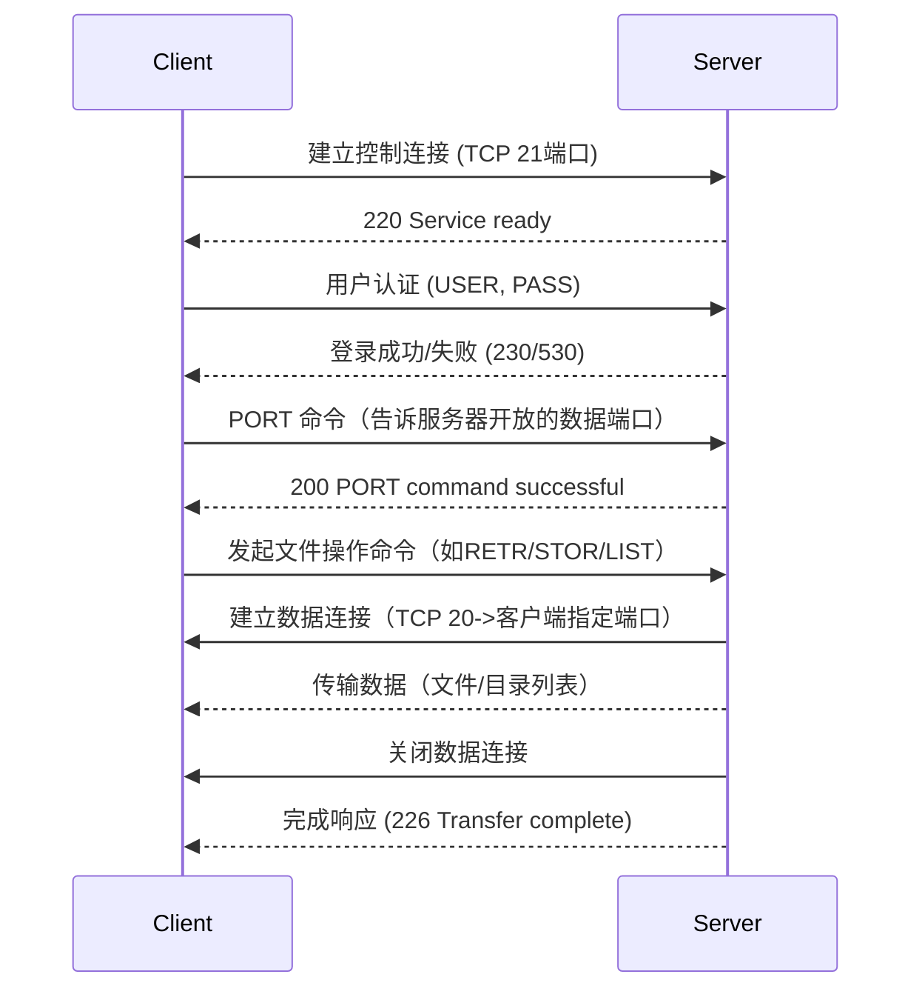
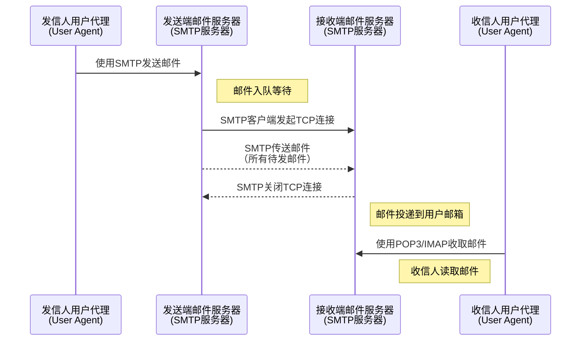

# 计算机网络系统结构与设计
## 计算机网络概述
### 概念

计算机网络就是一些互连的、自治的计算机系统的集合。

在计算机网络发展的不同阶段，人们对计算机网络给出了不同的定义，这些定义反映了当时网络技术发展的水平。这些定义可分为以下三类。
1. 广义观点
这种观点认为，只要是能实现远程信息处理的系统或能进一步达到资源共享的系统，都是计算机网络。广义的观点定义了一个计算机通信网络，它在物理结构上具有计算机网络的雏形，但资源共享能力弱，是计算机网络发展的低级阶段。

2. 资源共享观点
这种观点认为，计算机网络是“以能够相互共享资源的方式互连起来的自治计算机系统的集合”。该定义包含三层含义：①目的一一资源共享；②组成单元→分布在不同地理位置的多台独立的“自治计算机”；③网络中的计算机必须遵循的统一规则——网络协议。该定义符合目前计算机网络的基本特征。

3. 用户透明性观点
这种观点认为，存在一个能为用户自动管理资源的网络操作系统，它能够调用用户所需要的资源，而整个网络就像一个大的计算机系统一样对用户是透明的。用户使用网络就像使用一台单一的超级计算机，无须了解网络的存在、资源的位置信息。用户透明性观点的定义描述了一个分布式系统，它是网络未来发展追求的目标。

### 组成
从不同的角度，可以将计算机网络的组成分为如下几类。

- 从组成部分上看，一个完整的计算机网络主要由硬件、软件、协议三大部分组成，缺一不可。
硬件主要由主机（也称端系统)、通信链路（如双绞线、光纤)、交换设备（如路由器、交换机等）和通信处理机（如网卡）等组成。软件主要包括各种实现资源共享的软件和方便用户使用的各种工具软件（如网络操作系统、邮件收发程序、FTP程序、聊天程序等）。软件部分多属于应用层。协议是计算机网络的核心，如同交通规则制约汽车驾驶一样，协议规定了网络传输数据时所遵循的规范。

- 从工作方式上看，计算机网络（这里主要指 Intermet，即因特网）可分为边缘部分和核心部分。
边缘部分由所有连接到因特网上、供用户直接使用的主机组成，用来进行通信（如传输数据、音频或视频）和资源共享；核心部分由大量的网络和连接这些网络的路由器组成，它为边缘部分提供连通性和交换服务。下图给出了这两部分的示意图。


- 从功能组成上看，计算机网络由通信子网和资源子网组成。
通信子网由各种传输介质、通信设备和相应的网络协议组成，它使网络具有数据传输、交换、控制和存储的能力，实现联网计算机之间的数据通信。资源子网是实现资源共享功能的设备及其软件的集合，向网络用户提供共享其他计算机上的硬件资源、软件资源和数据资源的服务。

### 功能
计算机网络的功能很多，现今的很多应用都与网络有关。主要有以下五大功能。
1. 数据通信
它是计算机网络最基本和最重要的功能，用来实现联网计算机之间各种信息的传输，并将分散在不同地理位置的计算机联系起来，进行统一的调配、控制和管理。例如，文件传输、电子邮件等应用，离开了计算机网络将无法实现。

2. 资源共享
资源共享可以是软件共享、数据共享，也可以是硬件共享。它使计算机网络中的资源互通有无、分工协作，从而极大地提高硬件资源、软件资源和数据资源的利用率。

3. 分布式处理
当计算机网络中的某个计算机系统负荷过重时，可以将其处理的某个复杂任务分配给网络中
的其他计算机系统，从而利用空闲计算机资源以提高整个系统的利用率。

4. 提高可靠性
计算机网络中的各台计算机可以通过网络互为替代机。

5. 负载均衡
将工作任务均衡地分配给计算机网络中的各台计算机。


除以上几大主要功能外，计算机网络还可以实现电子化办公与服务、远程教育、娱乐等功能，满足了社会的需求，方便了人们学习、工作和生活，具有巨大的经济效益。

### 分类
- **按分布范围分类**
1）广域网（Wide Area Network, WAN）。广域网的任务是提供长距离通信，运送主机所发送的数据，其覆盖范围通常是直径为几十千米到几千千米的区域，因而有时也称远程网。广域网是因特网的核心部分。连接广域网的各结点交换机的链路一般都是高速链路，具有较大的通信容量。

2）城域网（Metropolitan Area Network, MAN）。城域网的覆盖范围可以跨越几个街区甚至整个城市，覆盖区域的直径范围是5～50km。城域网大多采用以太网技术，因此有时也常并入局域网的范围讨论。

3）局域网（Local Area Network, LAN)。局域网一般用微机或工作站通过高速线路相连，覆盖范围较小，通常是直径为几十米到几千米的区域。局域网在计算机配置的数量上没有太多的限制，少的可以只有两台，多的可达几百台。传统上，局域网使用广播技术，而广域网使用交换技术。


4）个人区域网（Personal Area Network, PAN）。个人区域网是指在个人工作的地方将消费电子设备（如平板电脑、智能手机等）用无线技术连接起来的网络，也常称为无线个人区域网（WPAN)，覆盖区域的直径约为10m。

>[!caution] 
> 若中央处理器之间的距离非常近（如仅1m的数量级或甚至更小)，则一般称为多处理器系统，而不称为计算机网络。


- **按传输技术分类**
1）广播式网络。所有联网计算机都共享一个公共通信信道。当一台计算机利用共享通信信道发送报文分组时，所有其他的计算机都会“收听”到这个分组。接收到该分组的计算机将通过检查目的地址来决定是否接收该分组。局域网基本上都采用广播式通信技术，广域网中的无线、卫星通信网络也采用广播式通信技术。
2）点对点网络。每条物理线路连接一对计算机。若通信的两台主机之间没有直接连接的线路，则它们之间的分组传输就要通过中间结点进行接收、存储和转发，直至目的结点。是否采用分组存储转发与路由选择机制是点对点式网络与广播式网络的重要区别，广域网基本都属于点对点网络。


- **按拓扑结构分类**
网络拓扑结构是指由网中结点（路由器、主机等）与通信线路（网线）之间的几何关系（如总线形、环形）表示的网络结构，主要指通信子网的拓扑结构。

按网络的拓扑结构，主要分为总线形、星形、环形和网状网络等，如图1.2所示。<u>星形、总线形和环形网络多用于局域网，网状网络多用于广域网。</u>


1）总线形网络。用单根传输线把计算机连接起来。总线形网络的优点是建网容易、增/减结点方便、节省线路。缺点是重负载时通信效率不高、总线任意一处对故障敏感。
2）星形网络。每个终端或计算机都以单独的线路与中央设备相连。中央设备早期是计算机，现在一般是交换机或路由器。星形网络便于集中控制和管理，因为端用户之间的通信必须经过中央设备。缺点是成本高、中央设备对故障敏感。
3）环形网络。所有计算机接口设备连接成一个环。环形网络最典型的例子是令牌环局域网。环可以是单环，也可以是双环，环中信号是单向传输的。
4）网状网络。一般情况下，每个结点至少有两条路径与其他结点相连，多用在广域网中。其有规则型和非规则型两种。其优点是可靠性高，缺点是控制复杂、线路成本高。

以上4种基本的网络拓扑结构可以互连为更复杂的网络。


- **按使用者分类**
1）公用网（PublicNetwork)。指电信公司出资建造的大型网络。“公用”的意思是指所有愿意按电信公司的规定交纳费用的人都可以使用这种网络，因此也称公众网。
2）专用网（PrivateNetwork)。指某个部门为满足本单位特殊业务的需要而建造的网络。这种网络不向本单位以外的人提供服务。例如铁路、电力、军队等部门的专用网。


- **按交换技术分类**
交换技术是指各台主机之间、各通信设备之间或主机与通信设备之间为交换信息所采用的数据格式和交换装置的方式。按交换技术可将网络分为如下几种。
1）电路交换网络。在源结点和目的结点之间建立一条专用的通路用于传送数据，包括建立连接、传输数据和断开连接三个阶段。最典型的电路交换网是传统电话网络。
该类网络的主要特点是整个报文的比特流连续地从源点直达终点，好像是在一条管道中传送。
优点是数据直接传送、时延小。
缺点是线路利用率低、不能充分利用线路容量、不便于进行差错控制。
2）报文交换网络。用户数据加上源地址、目的地址、校验码等辅助信息，然后封装成报文。整个报文传送到相邻结点，全部存储后，再转发给下一个结点，重复这一过程直到到达目的结点。每个报文可以单独选择到达目的结点的路径。
报文交换网络也称存储一转发网络，主要特点是整个报文先传送到相邻结点，全部存储后查找转发表，转发到下一个结点。
优点是可以较为充分地利用线路容量，可以实现不同链路之间不同数据传输速率的转换，可以实现格式转换，可以实现一对多、多对一的访问，可以实现差错控制。
缺点是增大了资源开销（如辅助信息导致处理时间和存储资源的开销，增加了缓冲时延，需要额外的控制机制来保证多个报文的顺序不乱序，缓冲区难以管理（因为报文的大小不确定，接收方在接收到报文之前不能预知报文的大小）。
3）分组交换网络，也称包交换网络。其原理是，将数据分成较短的固定长度的数据块，在每个数据块中加上目的地址、源地址等辅助信息组成分组（包），以存储-转发方式传输。其主要特点是单个分组（它只是整个报文的一部分）传送到相邻结点，存储后查找转发表，转发到下一个结点。
除具备报文交换网络的优点外，分组交换网络还具有自身的优点：缓冲易于管理；包的平均时延更小，网络占用的平均缓冲区更少；更易于标准化；更适合应用。
现在的主流网络基本上都可视为分组交换网络。


- **按传输介质分类**
传输介质可分为有线和无线两大类，因此网络可以分为有线网络和无线网络。有线网络又分为双绞线网络、同轴电缆网络等。无线网络又可分为蓝牙、微波、无线电等类型。

### 标准化工作
计算机网络的标准化对计算机网络的发展和推广起到了极为重要的作用。
因特网的所有标准都以RFC（RequestForComments）的形式在因特网上发布，但并非每个RFC都是因特网标准，RFC要上升为因特网的正式标准需经过以下4个阶段。

1)因特网草案(Intermet Draft)。这个阶段还不是RFC文档。
2)建议标准（Proposed Standard)。从这个阶段开始就成为RFC文档。
3)草案标准(Draft Standard)。
4)因特网标准(Internet Standard)。
此外，还有试验的RFC和提供信息的RFC。各种RFC之间的关系如图所示。


在国际上，负责制定、实施相关网络标准的标准化组织众多，主要有如下几个：
- 国际标准化组织（ISO)。其制定的主要网络标准或规范有OSI参考模型、HDLC等。
- 国际电信联盟（ITU)。其前身为国际电话电报咨询委员会（CCITT)，其下属机构ITU-T制定了大量有关远程通信的标准。
- 国际电气电子工程师协会（IEEE)。世界上最大的专业技术团体，由计算机和工程学专业人士组成。IEEE在通信领域最著名的研究成果是802标准。
### 性能指标
性能指标从不同方面度量计算机网络的性能。常用的性能指标如下。

1）带宽（Bandwidth）。本来表示通信线路允许通过的信号频带范围，单位是赫兹（Hz)。而在计算机网络中，带宽表示网络的通信线路所能传送数据的能力，是数字信道所能传送的“最高数据传输速率”的同义语，单位是比特/秒（b/s)。

2）时延（Delay）。指数据（一个报文或分组）从网络（或链路）的一端传送到另一端所需要的总时间，它由4部分构成：发送时延、传播时延、处理时延和排队时延。
- 发送时延。结点将分组的所有比特推向（传输）链路所需的时间，即从发送分组的第一个比特算起，到该分组的最后一个比特发送完毕所需的时间，因此也称传输时延。计算公式为：**发送时延=分组长度/信道宽度**
- 传播时延。电磁波在信道中传播一定的距离需要花费的时间，即一个比特从链路的一端传播到另一端所需的时间。计算公式为：**传播时延=信道长度/电磁波在信道上的传播速率**
- 处理时延。数据在交换结点为存储转发而进行的一些必要的处理所花费的时间。例如，分析分组的首部、从分组中提取数据部分、进行差错检验或查找适当的路由等。
- 排队时延。分组在进入路由器后要先在输入队列中排队等待处理。路由器确定转发端口后，还要在输出队列中排队等待转发，这就产生了排队时延。

因此，数据在网络中经历的总时延就是以上4部分时延之和：**总时延=发送时延+传播时延+处理时延+排队时延**

>[!tip]
>做题时，排队时延和处理时延一般可忽略不计（除非题目另有说明)。另外，对于高速链路，提高的仅是数据发送速率而非比特在链路上的传播速率。提高数据的发送速率只是为了减少数据的发送时延。

3）时延带宽积。指发送端发送的第一个比特即将到达终点时，发送端已经发出了多少个比特，因此又称以比特为单位的链路长度，即时延带宽积=传播时延×信道带宽。
如图1.4所示，考虑一个代表链路的圆柱形管道，其长度表示链路的传播时延，横截面积表示链路带宽，则时延带宽积表示该管道可以容纳的比特数量。


4）往返时延（Round-TripTime，RTT)。指从发送端发出一个短分组，到发送端收到来自接收端的确认（接收端收到数据后立即发送确认），总共经历的时延。在互联网中，往返时延还包括各中间结点的处理时延、排队时延及转发数据时的发送时延。

5）吞吐量（Throughput)。指单位时间内通过某个网络（或信道、接口）的数据量。吞吐量受网络带宽或网络额定速率的限制。

6）速率（Speed）。网络中的速率是指连接到计算机网络上的主机在数字信道上传送数据的速率，也称数据传输速率、数据率或比特率，单位为b/s（比特/秒)或bit/s，有时也写为bps)。数据率较高时，可用kb/s(k=10²)、Mb/s(M=10°)或Gb/s(G=10°)表示。
在计算机网络中，通常把最高数据传输速率称为带宽。

7）信道利用率。指出某一信道有百分之多少的时间是有数据通过的，即信道利用率=有数据通过时间/(有+无)数据通过时间。


## 计算机网络体系结构与参考模型
### 分层结构
我们把计算机网络的各层及其协议的集合称为网络的体系结构（Architecture）。换言之，计算机网络的体系结构就是这个计算机网络及其所应完成的功能的精确定义，它是计算机网络中的层次、各层的协议及层间接口的集合。需要强调的是，这些功能究竟是用何种硬件或软件完成的，则是一个遵循这种体系结构的实现（Implementation）问题。体系结构是抽象的，而实现是具体的，是真正在运行的计算机硬件和软件。

依据一定的规则，将分层后的网络从低层到高层依次称为第1层、第2层第n层，通常还为每层取一个特定的名称，如第1层的名称为物理层。

在计算机网络的分层结构中，第n层中的活动元素通常称为第n层实体。具体来说，实体指任何可发送或接收信息的硬件或软件进程，通常是一个特定的软件模块。不同机器上的同一层称为对等层，同一层的实体称为对等实体。第n层实体实现的服务为第n+1层所利用。在这种情况下，第n层称为服务提供者，第n+1层则服务于用户。

每一层还有自己传送的数据单位，其名称、大小、含义也各有不同。

在计算机网络体系结构的各个层次中，每个报文都分为两部分：一是数据部分，即SDU；二是控制信息部分，即PCI，它们共同组成PDU。

- 服务数据单元（SDU)：为完成用户所要求的功能而应传送的数据。第n层的服务数据单元记为 n-SDU。 
- 协议控制信息（PCI)：控制协议操作的信息。第n层的协议控制信息记为n-PCI。 
- 协议数据单元（PDU)：对等层次之间传送的数据单位称为该层的PDU。第n层的协议数据单元记为n-PDU。在实际的网络中，每层的协议数据单元都有一个通俗的名称，如物理层的PDU称为比特，数据链路层的PDU称为帧，网络层的PDU称为分组，传输层的PDU称为报文段。

在各层间传输数据时，把从第n+1层收到的PDU作为第n层的SDU，加上第n层的PCI，就变成了第n层的PDU，交给第n-1层后作为SDU发送，接收方接收时做相反的处理，因此可知三者的关系为n-SDU+ n-PCI=n-PDU=(n-1)-SDU,其变换过程如图所示。 


### 协议、接口、服务
- **协议**
协议，就是规则的集合。在网络中要做到有条不紊地交换数据，就必须遵循一些事先约定好的规则。这些规则明确规定了所交换的数据的格式及有关的同步问题。这些为进行网络中的数据交换而建立的规则、标准或约定称为网络协议（NetworkProtocol)，它是控制两个（或多个）对等实体进行通信的规则的集合，是水平的。不对等实体之间是没有协议的，比如用TCP/IP协议栈通信的两个结点，结点A的传输层和结点B的传输层之间存在协议，但结点A的传输层和结点B的网络层之间不存在协议。网络协议也简称为协议。
协议由语法、语义和同步三部分组成。语法规定了传输数据的格式；语义规定了所要完成的功能，即需要发出何种控制信息、完成何种动作及做出何种应答；同步规定了执行各种操作的条件、时序关系等，即事件实现顺序的详细说明。一个完整的协议通常应具有线路管理（建立、释放连接、差错控制、数据转换等功能。

- **接口**
接口是同一结点内相邻两层间交换信息的连接点，是一个系统内部的规定。每层只能为紧邻的层次之间定义接口，不能跨层定义接口。在典型的接口上，同一结点相邻两层的实体通过服务访问点（Service Access Point，SAP）进行交互。服务是通过SAP提供给上层使用的，第n层的SAP就是第n+1层可以访问第n层服务的地方。每个SAP都有一个能够标识它的地址。SAP是一个抽象的概念，它实际上是一个逻辑接口（类似于邮政信箱），但和通常所说的两个设备之间的硬件接口是很不一样的。

- **服务**
服务是指下层为紧邻的上层提供的功能调用，它是垂直的。对等实体在协议的控制下，使得本层能为上一层提供服务，但要实现本层协议还需要使用下一层所提供的服务。上层使用下层所提供的服务时必须与下层交换一些命令，这些命令在OSI参考模型中称为服务原语。OSI参考模型将原语划分为4类：
1)请求（Request)。由服务用户发往服务提供者，请求完成某项工作。
2)指示（Indication)。由服务提供者发往服务用户，指示用户做某件事情。
3)响应（Response)。由服务用户发往服务提供者，作为对指示的响应。
4)证实（Confirmation)。由服务提供者发往服务用户，作为对请求的证实。
这4类原语用于不同的功能，如建立连接、传输数据和断开连接等。有应答服务包括全部4类原语，而无应答服务则只有请求和指示两类原语。4类原语的关系如图1.6所示。


### ISO/OSI参考模型和TCP/IP模型
- **ISO/OSI参考模型**
国际标准化组织（ISO）提出的网络体系结构模型，称为开放系统互连参考模型（OSI/RM)，通常简称为OSI参考模型。OSI参考模型有7层，自下而上依次为物理层、数据链路层、网络层、传输层、会话层、表示层、应用层。低三层统称为通信子网，它是为了联网而附加的通信设备，完成数据的传输功能；高三层统称为资源子网，它相当于计算机系统，完成数据的处理等功能。传输层承上启下。OSI参考模型的层次结构如图1.8所示。 


>[!caution] 
>传输信息所利用的一些物理媒体，如双绞线、光缆、无线信道等，并不在物理层协议之内而在物理层协议下面。因此，有人把物理媒体当作第0层。


  
  
- **TCP/IP模型**
ARPA在研究ARPAnet时提出了TCP/IP模型，模型从低到高依次为网络接口层（对应OSI参考模型中的物理层和数据链路层入、网际层、传输层和应用层（对应OSI参考模型中的会话层、表示层和应用层）。TCP/IP由于得到广泛应用而成为事实上的国际标准。TCP/IP模型的层次结构及各层的主要协议如图1.11所示。 


# 物理层
## 通信基础
### 基本概念
通信的目的是传送信息，如文字、图像和视频等。

数据是指传送信息的实体。信号则是数据的电气或电磁表现，是数据在传输过程中的存在形式。
数据和信号都可用“模拟的”或“数字的”来修饰：
①连续变化的数据（或信号）称为模拟数据（或模拟信号)；
②取值仅允许为有限的几个离散数值的数据（或信号）称为数字数据（或数字信号)。

数据传输方式可分为串行传输和并行传输。
串行传输是指 1 比特 1 比特地按照时间顺序传输（远距离通信通常采用串行传输），并行传输是指若干比特通过多条通信信道同时传输开）

码元是指用一个固定时长的信号波形（数字脉冲）表示一位 k 进制数字，代表不同离散数值的基本波形，是数字通信中数字信号的计量单位，这个时长内的信号称为 k 进制码元，而该时长称为码元宽度。
1 码元可以携带若干比特的信息量。例如，在使用二进制编码时，只有两种不同的码元：一种代表 0 状态，另一种代表 1 状态。

数据通信是指数字计算机或其他数字终端之间的通信。一个数据通信系统主要划分为信源、信道和信宿三部分。

图 2.1 所示为一个单向通信系统的模型。实际的通信系统大多为双向的，即往往包含一条发送信道和一条接收信道，信道可以进行双向通信。

信道按传输信号形式的不同，可分为传送模拟信号的模拟信道和传送数字信号的数字信道两大类；
信道按传输介质的不同可分为无线信道和有线信道。

信道上传送的信号有基带信号和宽带信号之分。
基带信号将数字信号 1 和 0 直接用两种不同的电压表示，然后送到数字信道上传输（称为基带传输）；
宽带信号将基带信号进行调制后形成频分复用模拟信号，然后送到模拟信道上传输（称为宽带传输）。

从通信双方信息的交互方式看，可分为三种基本方式：
1) 单向通信。只有一个方向的通信而没有反方向的交互，仅需要一条信道。例如，无线电广播、电视广播就属于这种类型。
2) 半双工通信。通信的双方都可以发送或接收信息，但任何一方都不能同时发送和接收信息，此时需要两条信道。
3) 全双工通信。通信双方可以同时发送和接收信息，也需要两条信道。信道的极限容量是指信道的最高码元传输速率或信道的极限信息传输速率。

速率也称数据率，指的是数据传输速率，表示单位时间内传输的数据量。可以用码元传输速率和信息传输速率表示。
1) 码元传输速率。又称波特率，它表示单位时间内数字通信系统所传输的码元个数（也可称为脉冲个数或信号变化的次数），单位是波特（Baud)。1 波特表示数字通信系统每秒传输一个码元。码元可以是多进制的，也可以是二进制的，码元速率与进制数无关。
2) 信息传输速率。又称信息速率、比特率等它表示单位时间内数字通信系统传输的二进制码元个数（即比特数），单位是比特/秒（b/s)。

### 奈奎斯特定理和香农定理
- **奈奎斯特定理**
奈奎斯特（Nyquist）定理又称奈氏准则，它规定：在理想低通（没有噪声、带宽有限）的信道中，为了避免码间串扰，极限码元传输速率为 2 W 波特，其中 W 是理想低通信道的带宽。若用 V 表示每个码元离散电平的数目（码元的离散电平数目是指有多少种不同的码元，比如有16 种不同的码元，则需要 4 个二进制位，因此数据传输速率是码元传输速率的 4 倍)，则极限数据率为
$$理想低通信道下的极限数据传输速率=2 W\log_{2}V\quad(单位为 b/s)$$


- **香农定理**
$$信道的极限数据传输速率＝W\log_{2} \left( 1+\frac{S}{N} \right)\quad(单位为 b/s)$$
式中，W 为信道的带宽，S 为信道所传输信号的平均功率，N 为信道内部的高斯噪声功率。S/N 为信噪比，即信号的平均功率与噪声的平均功率之比，$信噪比＝10 \log_{10} \left( \frac{S}{N} \right)\quad(单位为 dB)$

### 编码与调制
数据无论是数字的还是模拟的，为了传输的目的都必须转变成信号。
把数据变换为模拟信号的过程称为调制，把数据变换为数字信号的过程称为编码。

### 电路交换、报文交换与分组交换

### 数据报与虚电路

## 传输介质
### 双绞线
双绞线是最常用的古老传输介质，它由两根采用一定规则并排绞合的、相互绝缘的铜导线组成。绞合可以减少对相邻导线的电磁干扰。为了进一步提高抗电磁干扰的能力，可在双绞线的外面再加上一层，即用金属丝编织成的屏蔽层，这就是屏蔽双绞线（STP，shielded twisted pair）。无屏蔽层的双绞线称为非屏蔽双绞线（UTP)。


双绞线的价格便宜，是最常用的传输介质之一，在局域网和传统电话网中普遍使用。
双绞线的带宽取决于铜线的粗细和传输的距离。模拟传输和数字传输都可使用双绞线，其通信距离一般为几千米到数十千米。
距离太远时，对于模拟传输，要用放大器放大衰减的信号；对于数字传输，要用中继器将失真的信号整形。
### 同轴电缆
同轴电缆由内导体、绝缘层、网状编织屏蔽层和塑料外层构成。
按特性阻抗数值的不同，通常将同轴电缆分为两类：50Ω同轴电缆和 75Ω同轴电缆。
其中，50Ω同轴电缆主要用于传送基带数字信号，又称基带同轴电缆，它在局域网中应用广泛；75Ω同轴电缆主要用于传送宽带信号，又称宽带同轴电缆，主要用于有线电视系统。

由于外导体屏蔽层的作用，同轴电缆具有良好的抗干扰特性，被广泛用于传输较高速率的数据，其传输距离更远，但价格较双绞线贵。

### 光纤
光纤通信就是利用光导纤维（简称光纤）传递光脉冲来进行通信。有光脉冲表示 1，无光脉冲表示 0。可见光的频率约为 10°MHz，因此光纤通信系统的带宽范围极大。

光纤主要由纤芯和包层构成（见图 2.9)，纤芯很细，其直径只有 8 至 100μm，光波通过纤芯进行传导，包层较纤芯有较低的折射率。当光线从高折射率的介质射向低折射率的介质时，其折射角将大于入射角。因此，只要入射角大于某个临界角度，就会出现全反射，即光线碰到包层时就会折射回纤芯，这个过程不断重复，光也就沿着光纤传输下去。


利用光的全反射特性，可以将从不同角度入射的多条光线在一根光纤中传输，这种光纤称为多模光纤（见图 2.10)，多模光纤的光源为发光二极管。光脉冲在多模光纤中传输时会逐渐展宽，造成失真，因此多模光纤只适合于近距离传输。


光纤的直径减小到只有一个光的波长时，光纤就像一根波导那样，可使光线一直向前传播，而不会产生多次反射，这样的光纤就是单模光纤（见图 2.11)。单模光纤的纤芯很细，直径只有几微米，制造成本较高。同时，单模光纤的光源为定向性很好的半导体激光器，因此单模光纤的衰减较小，可传输数公里甚至数十千米而不必采用中继器，适合远距离传输。


光纤不仅具有通信容量非常大的优点，还具有如下特点：
1) 传输损耗小，中继距离长，对远距离传输特别经济。
2) 抗雷电和电磁干扰性能好。这在有大电流脉冲干扰的环境下尤为重要。
3) 无串音干扰，保密性好，也不易被窃听或截取数据。
4) 体积小，重量轻。这在现有电缆管道已拥塞不堪的情况下特别有利。

### 无线传输介质
- **无线电波**


- **微波、红外线与激光**
目前高带宽的无线通信主要使用三种技术：微波、红外线和激光。它们都需要发送方和接收方之间存在一条视线（Line-of-sight）通路，有很强的方向性，都沿直线传播，有时统称这三者为视线介质。
不同的是，红外通信和激光通信把要传输的信号分别转换为各自的信号格式，即红外光信号和激光信号，再直接在空间中传播。


### 物理层接口的特性


## 物理层设备
### 中继器
定义：中继器是网络通信中的物理层设备，用于再生和放大信号，延长网络传输距离。它接收输入信号，增强其强度后转发，克服信号在长距离传输中的衰减。

功能与特点：中继器工作在 OSI 模型的物理层（Layer 1），不解析数据内容，仅处理电信号或光信号。支持单一网络协议（如以太网），无智能过滤，广播所有接收信号。常见于早期局域网（如 10BASE5）。

应用场景：用于扩展网络覆盖范围，如连接远距离网段或修复信号衰减。现代网络中因光纤和交换机的普及使用较少。

优缺点：优点是简单、低成本；缺点是无数据过滤，易造成网络拥堵，且不支持不同协议或速率的网络。

> [!note] 
> 放大器和中继器都起放大作用，只不过放大器放大的是模拟信号，原理是将衰减的信号放大，而中继器放大的是数字信号，原理是将衰减的信号整形再生。

### 集线器
定义：集线器是网络物理层设备，连接多个网络设备（如计算机、打印机），形成单一网段。它接收来自任一端口的数据包，广播到所有其他端口。

功能与特点：工作在 OSI 模型的物理层（Layer 1），不解析数据帧，仅复制信号。所有设备共享带宽，工作在半双工模式，易发生冲突。支持以太网协议（如 10/100 Mbps）。

应用场景：用于小型局域网（如家庭或小型办公室），连接多台设备。现多被交换机取代，因后者性能更优。

优缺点：优点是易于安装、成本低；缺点是广播机制导致带宽浪费和冲突，网络效率低，不适合大型网络。


# 数据链路层
## 数据链路层的功能
- **为网络层提供服务**

- **链路管理**


- **帧定界、帧同步和透明传输**

- **流量控制**

- **差错控制**

## 组帧
数据链路层之所以要把比特组合成帧为单位传输，是为了在出错时只重发出错的帧，而不必重发全部数据，从而提高效率。
为了使接收方能正确地接收并检查所传输的帧，发送方必须依据一定的规则把网络层递交的分组封装成帧（称为组帧）。
组帧主要解决帧定界、帧同步、透明传输等问题。
通常有以下 4 种方法实现组帧。

- **字符计数法**

- **字符填充的首尾定界符法**

- **零比特填充的首尾标志法**

- **违规编码法**
## 差错控制

## 流量控制与可靠传输机制

## 介质访问控制

## 局域网
### 局域网的基本概念与体系结构
局域网（LocalAreaNetwork，LAN）是指在一个较小的地理范围（如一所学校）内，将各种计算机、外部设备和数据库系统等通过双绞线、同轴电缆等连接介质互相连接起来，组成资源和信息共享的计算机互连网络。主要特点如下：

- 局域网的地理范围和站点数目有限，一般属于一个单位所有，易于建立、维护与扩展。
- 所有站点共享较高的总带宽（即较高的数据传输速率，10Mbit/s~10Gbit/s）。
- 较低的时延和较低的误码率。
- 各站为平等关系而非主从关系。
- 能进行广播和组播。

局域网的特性主要由三个要素决定：拓扑结构、传输介质、介质访问控制方式，其中最重要的是介质访问控制方式，它决定着局域网的技术特性。

从介质访问控制方法的角度来看，局域网可以分为共享介质式局域网与交换式局域网；
而从使用的传输介质类型的角度来看，局域网又可以分为使用有线介质的有线局域网与使用无线通信信道的无线局域网。

常见的局域网拓扑结构主要有以下4大类：①星形结构；②环形结构；③总线形结构；④星形和总线形结合的复合型结构。
局域网可以使用双绞线、铜缆和光纤等多种传输介质，其中双绞线为主流传输介质。
局域网的介质访问控制方法主要有CSMA/CD、令牌总线和令牌环，其中前两种方法主要用于总线形局域网，令牌环主要用于环形局域网。

三种特殊的局域网拓扑实现如下：
- 以太网（目前使用范围最广的局域网）。逻辑拓扑是总线形结构，物理拓扑是星形或拓展星形结构。
- 令牌环（TokenRing，IEEE802.5)。逻辑拓扑是环形结构，物理拓扑是星形结构。
- FDDI（光纤分布数字接口，IEEE802.8)。逻辑拓扑是环形结构，物理拓扑是双环结构。

>[!important] 
> 局域网通过电话交换网、有线电视网、无线城域网或无线局域网方式连接到地区级主干网的城域网，然后城域网通过路由器和光纤接入到作为国家级或区域主干网的广域网

### 以太网与 IEEE 802.3
IEEE 802.3 标准是一种基带总线形的局域网标准，它描述物理层和数据链路层的 MAC 子层的实现方法。随着技术的发展，该标准又有了大量的补充与更新，以支持更多的传输介质和更高的传输速率。

严格来说，以太网应当是指符合 DIXEthernetV 2 标准的局域网，但 DIXEthernetV 2 标准与IEEE 802.3 标准只有很小的差别，因此通常将 802.3 局域网简称为以太网。


>[!note] 
>传统以太网的物理层标准命名方法：IEEE802.3 x Type-y Name
>x：数据传输速率（单位Mbps)
>Type：传输方式（基带/频带）
>y：网段的最大长度（单位100m)
> Name：局域网名称


### IEEE 802.11 无线局域网
无线局域网可分为两大类：有固定基础设施的无线局域网和无固定基础设施的移动自组织网络。所谓“固定基础设施”，是指预先建立的、能覆盖一定地理范围的固定基站。

- **有固定基础设施的无线局域网**
对于有固定基础设施的无线局域网，IEEE 制定了无线局域网的 802.11 系列协议标准，包括802.11 a/b/g/n 等。
802.11 使用星形拓扑，其中心称为接入点（Access Point, AP)，在 MAC 层使用 CSMA/CA 协议。
使用 802.11 系列协议的局域网又称 Wi-Fi 。

802.11 标准规定无线局域网的最小构件是基本服务集 BSS (BasicServiceSet，BSS)。
一个基本服务集包括一个接入点和若干移动站。各站在本 BSS 内之间的通信，或与本 BSS 外部站的通信，都必须通过本 BSS 的 AP。上面提到的 AP 就是基本服务集中的基站 (base station)。
安装 AP 时，必须为该 AP 分配一个不超过 32 字节的服务集标识符（Service SetIDentifier，SSID）和一个信道。
SSID 是指使用该 AP 的无线局域网的名字。
一个基本服务集覆盖的地理范围称为一个基本服务区（BasicServiceArea，BSA），无线局域网的基本服务区的范围直径一般不超过 100 m。

- **无固定设施的无线局域网**
另一种无线局域网是无固定基础设施的无线局域网，又称自组网络（ad hoc network）。
自组网络没有上述基本服务集中的 AP，而是由一些平等状态的移动站相互通信组成的临时网络。各结点之间地位平等，中间结点都为转发结点，因此都具有路由器的功能。


---
**802.11 无线局域网的 MAC 帧**

### VLAN


## 城域网
IEEE802委员会最初对城域网的定义是这样的：城域网是以光纤为传输介质，能够提供45~150Mbit/s高传输速率，支持数据、语音、图形与视频综合业务数据传输，覆盖50~100km的城市范围内，实现高速宽带传输的数据通信网络。

>[!note] 
> 由于城域网介于广域网与局域网之间，成为城市范围内大量用，接入Internet的汇接点。所以，城域网的结构、服务要比广域网、局域网更为复杂

早期城域网的首选技术是光纤环网，其典型产品是光纤分布式数据接口（FDDI）。FDDI可以实现高速、高可靠性和大范围内局域网的连接。

FDDI以光纤为传输介质，传输速率为100Mbit/s，用于100km范围内的局域网互联。它支持双环结构，具备快速环自愈能力，在基本技术上与局域网的IEEE802.5令牌环网络有很多相同之处。FDDI的MAC子层使用了802.5单令牌环网络介质访问控制MAC协议，LLC子层使用IEEE802.2协议，能够适应城域网主干网建设的需要。

**宽带城域网的结构**：
完整的宽带城域网主要包括“<u>三个平台与一个出口</u>”，即网络平台、业务平台、管理平台与一个城市宽带出口。宽带城域网的总体结构如图所示。


宽带城域网的网络平台在逻辑上又可以进一步分为<u>核心交换层（核心层）、边缘汇聚层（汇聚层）、用户接入层（接入层）</u>。下图给出了典型的宽带城域网的网络平台层次结构示意图。

宽带城域网网络平台的<u>核心层主要承担高速数据交换的功能，汇聚层主要承担路由与流量汇聚的功能，接入层主要承担用户接入与本地流量控制的功能</u>。
(1)核心交换层的基本功能。
核心交换层的基本功能如下。

核心交换层实现与主干网络的互联，提供城市宽带IP数据出口。
核心交换层提供宽带城域网的用户访问Intermet所需要的路由服务。
核心交换层将多个汇聚层连接起来，为汇聚层的网络提供高速分组转发，为整个城域网提供一个高速、安全与具有QoS保障能力的数据传输环境。

(2）汇聚层的基本功能。
汇聚层处于宽带城域网核心交换层的边缘，它的基本功能如下。

根据处理结果把用户流量转发到核心交换层或在本地进行路由处理。
汇接接入层的用户流量，进行数据分组传输的汇聚、转发与交换。
根据接入层的用户流量，进行本地路由、过滤、流量均衡、QOS优先级管理，以及安全控制、IP地址转换、流量整型等处理。

（3)接入层的基本功能。
接入层解决的是“最后一公里”问题。它通过各种接入技术，连接最终用户，并为它所覆盖范围内的用户提供访问Intermet以及其他信息服务。
将终端用户计算机接入到网络之中，并按MAC地址进行数据过滤传输。

城域网设计的一个重要出发点是：在降低网络造价的前提下，系统能够满足当前的数据交换量、接入的用户数与业务类型的要求，并具有可扩展的能力。


## 广域网
### 广域网的基本概念
广域网通常是指覆盖范围很广（远超一个城市的范围）的长距离网络。广域网是因特网的核心部分，其任务是长距离运送主机所发送的数据。连接广域网各结点交换机的链路都是高速链路，它可以是长达几千千米的光缆线路，也可以是长达几万千米的点对点卫星链路。因此广域网首要考虑的问题是通信容量必须足够大，以便支持日益增长的通信量。
广域网不等于互联网。互联网可以连接不同类型的网络（既可以连接局域网，又可以连接广域网），通常使用路由器来连接。下图显示了由相距较远的局域通过路由器与广域网相连而成的一个覆盖范围很广的互联网。因此，局域网可以通过广域网与另一个相隔很远的局域网通信。


广域网由一些结点交换机（注意不是路由器，结点交换机和路由器都用来转发分组，它们的工作原理也类似。<u>结点交换机在单个网络中转发分组，面路由器在多个网络构成的互联网中转发分组）及连接这些交换机的链路组成。</u>结点交换机的功能是将分组存储并转发。结点之间都是点到点连接，但为了提高网络的可靠性，通常一个结点交换机往往与多个结点交换机相连。

从层次上考虑，广域网和局域网的区别很大，因为<u>局域网使用的协议主要在数据链路层（还有少量在物理层），而广域网使用的协议主要在网络层</u>。怎么理解“局域网使用的协议主要在数据链路层，而广域网使用的协议主要在网络层”这句话呢？如果网络中的两个结点要进行数据交换，那么结点除要给出数据外，还要给数据“包装”上一层控制信息，用于实现检错纠错等功能。如果这层控制信息是数据链路层协议的控制信息，那么就称使用了数据链路层协议，如果这层控
制信息是网络层的控制信息，那么就称使用了网络层协议。


相对于局域网的易于建立、维护和成本低的特点，广域网的建设投资与管理要庞大与复杂得多，往往由电信运营商负责。由于广域网的组建管理、用户接入广域网的服务与技术支持，均由电信运营商负责，所以广域网是一种公共数据网络（Public DataNetwork，PDN)。

目前，构成广域网的典型网络类型和技术主要有以下几种。
- 综合业务数字网(ISDN)。
- 公共电话交换网（PSTN)。
- 数字数据网（DDN)。
- X.25分组交换网。
- 帧中继（Frame Replay,FR)网。
- 异步传输模式（AsynchronousTransferMode，ATM)网。
- 千兆以太网(GigabitEthernet,GE)与10GE的光以太网(Optical Ethernet)。

为了在电信网络的基础上实现传统的语音传输业务和数据传输业务的结合，出现了ISDN、X.25以及WDM的研究与应用。

广域网中的一个重要问题是路由选择和分组转发。路由选择协议负责搜索分组从某个结点到目的结点的最佳传输路由，以便构造路由表，然后从路由表再构造出转发分组的转发表。分组是通过转发表进行转发的。

常见的两种广域网数据链路层协议是PPP协议和HDLC协议。PPP目前使用得最广泛，而HDLC已很少使用。

### PPP协议
点对点协议 (Point-to-PointProtocol，PPP) 是使用串行线路通信的面向字节的协议，该协议应用在直接连接两个结点的链路上。设计的目的主要是用来通过拨号或专线方式建立点对点连接发送数据，使其成为各种主机、网桥和路由器之间简单连接的一种共同的解决方案。

PPP 协议有三个组成部分：
1）链路控制协议（LCP）。一种扩展链路控制协议，用于建立、配置、测试和管理数据链路。
2）网络控制协议（NCP)。PPP 协议允许同时采用多种网络层协议，每个不同的网络层协议要用一个相应的 NCP 来配置，为网络层协议建立和配置逻辑连接。
3）一个将 IP 数据报封装到串行链路的方法。IP 数据报在 PPP 帧中就是其信息部分，这个信息部分的长度受最大传送单元（MTU）的限制。


### HDLC协议
高级数据链路控制（HDLC）协议是面向比特的数据链路层协议。该协议不依赖于任何一种字符编码集；数据报文可透明传输，用于实现透明传输的“0 比特插入法”易于硬件实现；全双工通信，有较高的数据链路传输效率；所有帧采用 CRC 检验，对信息帧进行顺序编号，可防止漏收或重发，传输可靠性高；传输控制功能与处理功能分离，具有较大的灵活性。


## 数据链路层设备
### 网桥
两个或多个以太网通过网桥连接后，就成为一个覆盖范围更大的以太网，而原来的每个以太网就称为一个网段。网桥工作在链路层的MAC子层，可以使以太网各网段成为隔离开的碰撞域（又称冲突域）。如果把网桥换成工作在物理层的转发器，那么就没有这种过滤通信量的功能。由于各网段相对独立，因此一个网段的故障不会影响到另一个网段的运行。网桥必须具有路径选择的功能，接收到帧后，要决定正确的路径，将该帧转送到相应的目的局域网站点。

网络1和网络2通过网桥连接后，网桥接收网络1发送的数据帧，检查数据帧中的地址，如果是网络2的地址，那么就转发给网络2；如果是网络1的地址，那么就将其丢弃，因为源站和目的站处在同一个网段，目的站能够直接收到这个帧而不需要借助网桥转发。
### 局域网交换机
局域网交换机，又称以太网交换机，以太网交换机实质上就是一个多端口的网桥，它工作在数据链路层。

局域网交换机是一种基于MAC地址识别，完成转发数据帧功能的一种网络连接设备。根据进入端口数据帧中的MAC地址进行数据帧的过滤、转发。交换机作为汇聚中心，能将多台数据终端设备连接在一起，构成星状结构的网络。

建立和维护一个表示MAC地址与交换机端口对应关系的交换表。
在发送节点和接收节点之间建立一条<u>虚连接</u>（即发送方所连接的交换机端口（源端口）到接收方所连的交换机端口（目的端口）之间建立虚连接）完成数据帧的转发或过滤。

以太网交换机的每个端口都直接与单台主机或另一个交换机相连，通常都工作在全双工方式。交换机能经济地将网络分成小的冲突域，为每个工作站提供更高的带宽。

以太网交换机的原理是，它检测从以太端口来的数据帧的源和目的地的MAC（介质访问层）地址，然后与系统内部的动态查找表进行比较，若数据帧的源MAC地址不在查找表中，则将该地址加入查找表，并将数据帧发送给相应的目的端口。以太网交换机对工作站是透明的，因此管理开销低廉，简化了网络结点的增加、移动和网络变化的操作。利用以太网交换机还可以方便地实现虚拟局域网VLAN，VLAN不仅可以隔离冲突域，而且可以隔离广播域。


---
**交换机表**
小型交换机的交换表（35系列），交换机通过在超级用户模式下，使用 `show mac-address-table` 命令查看。


大型交换机的交换表（40/65系列），交换机通过在超级用户模式下，使用`show cam dynamic`命令查看。

---
**交换模式**
交换机的交换方式有静态交换和动态交换两种。

静态交换是由人工来完成端口之间传输通道的建立。
动态交换方式中依据目的MAC地址查询交换表，根据表中给出的输出端口来临时建立传输通道，这个传输通道在一个数据帧传送完成后自动断开。

交换机最常采用的交换方式是动态交换方式。动态交换模式主要有存储转发和直通两种模式。而直通模式又有快速转发交换和碎片丢弃交换两种方式。归纳起来，交换机主要有快速转发、碎片丢弃和存储转发三种交换模式。

（1）**快速转发交换模式**
快速转发交换模式，也称作直通交换模式，它是在交换机接收了帧的前14个字节，即接收到帧中6个字节的目的地址后便立即转发数据帧。该交换模式会在整个数据帧到之前就开始转发。

优点在于端口交换时间短、时延小，交换速度快；
缺点是不能进行检错纠错、速度匹配和流量控制，可靠性较差。

因此，它适合于小型交换机。

（2）**碎片丢弃交换模式**
碎片丢弃交换模式也称为无分段交换模式。这种交换模式是在开始转发数据帧前先过滤掉造成大部分数据报错误的冲突片。

采用这种交换模式的交换机在转发数据时，先检查数据包的长度是否够64字节。如果帧的长度小于64，则被视为碎片，交换机直接丢弃；而任何大于64字节的数据帧都被交换机视为有效帧，进行转发

碎片丢弃交换模式的优点是过滤掉了冲突碎片，提高了网络传速的效率和带宽的利用率。

（3）**存储转发交换模式**
存储转发交换模式将接收到的整个数据帧保存在缓冲区中，然后进行循环冗余码校验检查，在对错误数据帧进行处理后，才取出数据帧的目的地址，进行转发操作。

存储转发交换模式的不足之处在于其进行数据处理的延时大、交换速度相对较慢。
但是它可以对数据帧进行链路差错检验，可靠性较高，能有效地址改善网络性能；同时它可以支持不同速率的端口，保持高速端口与低速端口之间的协同工作。

---
**虚拟局域网技术**
VLAN（VirtualLAN）即虚拟局域网，它是在交换式网络的基础上，将连接在网络中用户的终端设备划分为多个逻辑工作组，每个逻辑工作组就是一个VLAN，如图所示。


**VLAN的特征**
VLAN工作在数据链路层，即OSI参考模型的第二层。

VLAN可隔离广播信息，每个VLAN为一个广播域，VLAN中的广播信息只能发送给这个VLAN内部的成员，并不发送给其他VLAN成员。

一个VLAN就是一个独立的逻辑网络，每个VLAN都具有唯一的子网号。不同VLAN中的主机之间必须通过路由器或者三层交换机，才能实现相互通信。

**VLAN的标识**
VLAN通常用VLAN ID(VIan号)和VLAN name(VIan名）标识。

IEEE802.1Q协议规定，VLANID用12位(bit)表示，可以支持4096个VLAN。

其中1~ 1005是标准范围，1006~ 1024为保留范围，1025~4096是扩展范围，但并不是所有交换机都能支持4096个VLAN。

一部分交换机只支持标准范围1~1005，其中能用于以太网的VLANID为1 ~ 1000，而1002~1005为FDDI和令牌环网使用的VLANID。

VLAN name用32个字符表示，可以是字母和数字。

若创建一个VLAN时，没有给定名字，则系统按默认方式，自动给出命名，默认为VLAN00 XXX（"XXX"即为该VLAN的VLANID)，如VLANID为111，其默认
的VLAN名为VLAN 00111。

划分VLAN的方法：
- 基于端口划分；
- 基于MAC地址划分；
- 基于第三层协议划分。


# 网络层
## 网络层的功能

- **异构网络互连**

 
- **路由与转发**

- **SDN**


- **拥塞控制**

## 路由算法
路由器转发分组是通过路由表转发的，而路由表是通过各种算法得到的。从能否随网络的通信量或拓扑自适应地进行调整变化来划分，路由算法可以分为如下两大类。

静态路由算法（又称非自适应路由算法）。指由网络管理员手工配置的路由信息。当网络的拓扑结构或链路的状态发生变化时，网络管理员需要手工去修改路由表中相关的静态路由信息。它不能及时适应网络状态的变化，对于简单的小型网络，可以采用静态路由。

动态路由算法（又称自适应路由算法）。指路由器上的路由表项是通过相互连接的路由器之间彼此交换信息，然后按照一定的算法优化出来的，而这些路由信息会在一定时间间隙里不断更新，以适应不断变化的网络，随时获得最优的寻路效果。

静态路由算法的特点是简便和开销较小，在拓扑变化不大的小网络中运行效果很好。
动态路由算法能改善网络的性能并有助于流量控制；但算法复杂，会增加网络的负担，有时因对动态变化的反应太快而引起振荡，或反应太慢而影响网络路由的一致性，因此要仔细设计动态路由算法，以发挥其优势。常用的动态路由算法可分为两类：距离-向量路由算法和链路状态路由算法：
- 距离-向量路由算法

- 链路状态路由算法


## IPv4
IPv4即现在普遍使用的IP协议（版本4)。IP协议定义数据传送的基本单元——IP分组及其确切的数据格式。IP协议也包括一套规则，指明分组如何处理、错误怎样控制。特别是IP协议还包含非可靠投递的思想，以及与此关联的分组路由选择的思想。

### IPv4分组

### IPv4地址与NAT
连接到因特网上的每台主机（或路由器）都分配一个 32 比特的全球唯一标识符，即 IP 地址。
IP 地址由互联网名字和数字地址分配机构 ICANN 进行分配。
互联网早期采用的是分类的 IP 地址，如图 4.6 所示。


网络号标志主机（或路由器）所连接到的网络。一个网络号在整个因特网范围内必须是唯一的。
主机号标志该主机（或路由器）。一台主机号在它前面的网络号所指明的网络范围内必须是唯一的。
由此可见，一个 IP 地址在整个因特网范围内是唯一的。

在各类 IP 地址中，有些 IP 地址具有特殊用途，不用做主机的 IP 地址：
- 主机号全为 0 表示本网络本身，如 202.98.174.0。
- 主机号全为 1 表示本网络的广播地址，又称直接广播地址，如 202.98.174.255。
- 127.x.×.×保留为环回自检（LoopbackTest）地址，此地址表示任意主机本身，目的地址为环回地址的 IP 数据报永远不会出现在任何网络上。
- 32 位全为 0，即 0.0.0.0 表示本网络上的本主机。
- 32 位全为 1，即 255.255.255.255 表示整个 TCP/IP 网络的广播地址，又称受限广播地址。实际使用时，由于路由器对广播域的隔离，255.255.255.255 等效为本网络的广播地址。

NAT（Network Address Translation，网络地址转换）是一种在路由器或防火墙等网络设备上实现的技术。它的主要作用是在<u>私有网络（内网）和公有网络（互联网）之间进行IP地址转换</u>，使得多个内网设备能够通过一个或少数几个公网IP访问互联网。

NAT 的类型：
- 静态 NAT：一一对应：一个私有IP始终对应一个公网IP，适用于需要公网访问内网主机的场景（如内部服务器）
- 动态 NAT：有一组公有IP池，内网主机动态分配公网IP，并发连接数受公网IP数量限制
- PAT（端口地址转换，也叫 NAPT 或端口多路复用）：最常见，即“多对一”NAT。多个内网主机共用一个公网IP，通过端口号区分不同会话。路由器维护IP+端口号的映射表。

### 子网划分与子网掩码
两级 IP 地址的缺点：IP 地址空间的利用率有时很低；给每个物理网络分配一个网络号会使路由表变得太大而使网络性能变坏；两级的 IP 地址不够灵活。

从 1985 年起，在 IP 地址中又增加了一个“子网号字段”，使两级 IP 地址变成了三级 IP 地址。这种做法称为子网划分。子网划分已成为因特网的正式标准协议。

为了告诉主机或路由器对一个 A 类、B 类、C 类网络进行了子网划分，使用子网掩码来表达对原网络中主机号的借位。

子网掩码是一个与 IP 地址相对应的、长 32 bit 的二进制串，它由一串 1 和跟随的一串 0 组成。
其中，1 对应于 IP 地址中的网络号及子网号，而 0 对应于主机号。计算机只需将 IP 地址和其对应的子网掩码逐位“与”（逻辑 AND 运算)，就可得出相应子网的网络地址。

现在的因特网标准规定：所有的网络都必须使用子网掩码。如果一个网络未划分子网，那么就采用默认子网掩码。A、B、C 类地址的默认子网掩码分别为 255.0.0.0、255.255.0.0、255.255.255.0。

CIDR（Classless Inter-Domain Routing，无类域间路由）是一种IP地址分配和路由聚合的方法。  它打破了传统的A、B、C类IP地址“固定子网掩码”的限制，用“可变长度子网掩码”来实现更灵活、高效的IP地址管理。

CIDR 使用“斜杠记法”（Slash notation），格式为：`IP地址/网络前缀长度`

### ARP、DHCP与ICMP

- **地址解析协议（ARP)**
无论网络层使用什么协议，在实际网络的链路上传送数据帧时，最终必须使用硬件地址。所以需要一种方法来完成IP地址到MAC地址的映射，这就是地址解析协议（Address Resolution Protocol，ARP)。每台主机都设有一个ARP高速缓存，用来存放本局域网上各主机和路由器的IP地址到MAC地址的映射表，称ARP表。使用ARP来动态维护此ARP表。

- **动态主机配置协议(DHCP)**
动态主机配置协议（Dynamic Host Configuration Protocol，DHCP)常用于给主机动态地分配IP地址，它提供了即插即用的联网机制，这种机制允许一台计算机加入新的网络和获取IP地址而不用手工参与。DHCP是应用层协议，它是基于UDP的。

- **网际控制报文协议(ICMP)**
为了提高IP数据报交付成功的机会，在网络层使用了网际控制报文协议（Internet Control Message Protocol，ICMP）来让主机或路由器报告差错和异常情况。ICMP报文作为IP层数据报的数据，加上数据报的首部，组成IP数据报发送出去。ICMP是网络层协议。

## IPv6
解决“IP 地址耗尽”问题的措施有以下三种：
①采用无类别编址 CIDR，使 IP 地址的分配更加合理；
②采用网络地址转换（NAT）方法以节省全球 IP 地址；
③采用具有更大地址空间的新版本的 IPv 6。
其中前两种方法只是延长了 IPv 4 地址分配完毕的时间，只有第三种方法从根本上解决了 IP 地址的耗尽问题。

| 类型               | 描述                        | 举例              |
| ---------------- | ------------------------- | --------------- |
| 单播（Unicast）      | 唯一标识一个网络接口，类似IPv4的主机地址    | 2001:db8::1     |
| 多播（Multicast）    | 一组主机的集合，消息会发送到所有组成员       | ff02::1         |
| 任播（Anycast）      | 分配给多个接口，数据包发送到最近的一个成员     | 无专用前缀，取决于路由器    |
| 回环（Loopback）     | 本地回环接口，类似IPv4的127.0.0.1   | ::1             |
| 链路本地（Link-local） | 仅在本地链路有效，自动生成，前缀fe80::/10 | fe80::abcd:1234 |
IPv6 特点
- 地址空间极大：128位地址长度，可分配的地址数量高达2¹²⁸（约3.4×10³⁸个）。
- 简化的报文头：头部结构更精简，处理效率更高。
- 内置安全性：原生支持IPSec，提升数据安全。
- 自动配置支持：支持无状态自动配置（SLAAC），设备可自动获取IP。
- 无需网络地址转换（NAT）：每个设备都能有全球唯一地址，提升端到端通信能力。
- 更好的多播和任播：提升组播、多播性能。
- 更强的扩展性与移动性：便于网络扩展和移动设备接入。

## 路由协议
### 自治系统
自治系统（AutonomousSystem，AS）：单一技术管理下的一组路由器，这些路由器使用一种AS内部的路由选择协议和共同的度量来确定分组在该AS内的路由，同时还使用一种AS之间的路由选择协议来确定分组在AS之间的路由。

一个自治系统内的所有网络都由一个行政单位（如一家公司、一所大学、一个政府部门等）管辖，一个自治系统的所有路由器在本自治系统内都必须是连通的。

### 域内路由与域间路由
自治系统内部的路由选择称为域内路由选择，自治系统之间的路由选择称为域间路由选择。
因特网有两大类路由选择协议。
1. **内部网关协议(Interior GatewayProtocol,IGP)**
内部网关协议即在一个自治系统内部使用的路由选择协议，它与互联网中其他自治系统选用什么路由选择协议无关。目前这类路由选择协议使用得最多，如RIP和OSPF

2. **外部网关协议（External Gateway Protocol，EGP)**
若源站和目的站处在不同的自治系统中，当数据报传到一个自治系统的边界时（两个自治系统可能使用不同的IGP)，就需要使用一种协议将路由选择信息传递到另一个自治系统中。这样的协议就是外部网关协议（EGP）。目前使用最多的外部网关协议是BGP-4。

图4.10是两个自治系统互连的示意图。每个自治系统自己决定在本自治系统内部运行哪个内部路由选择协议（例如，可以是RIP，也可以是OSPF)，但每个自治系统都有一个或多个路由器（图中的路由器R1和R2）。除运行本系统的内部路由选择协议外，还要运行自治系统间的路由选择协议（如BGP-4)。


### 路由信息协议(RIP)
路由信息协议（Routing Information Protocol，RIP)是内部网关协议(IGP)中最先得到广泛应用的协议。RIP是一种分布式的基于距离向量的路由选择协议，其最大优点就是简单。

1. **RIP规定**
1)网络中的每个路由器都要维护从它自身到其他每个目的网络的距离记录（因此这是一组距离，称为距离向量)。
2)距离也称跳数(HopCount)，规定从一个路由器到直接连接网络的距离（跳数）为1。而每经过一个路由器，距离（跳数）加1。
3)RIP认为好的路由就是它通过的路由器的数目少，即优先选择跳数少的路径。
4)RIP允许一条路径最多只能包含15个路由器（即最多允许15跳）。因此距离等于16时，它表示网络不可达。可见RIP只适用于小型互联网。距离向量路由可能会出现环路的情况，规定路径上的最高跳数的目的是为了防止数据报不断循环在环路上，减少网络拥塞的可能性。
5)RIP默认在任意两个使用RIP的路由器之间每30秒广播一次RIP路由更新信息，以便自动建立并维护路由表（动态维护）。
6)在RIP中不支持子网掩码的RIP广播，所以RIP中每个网络的子网掩码必须相同。但在新的RIP2中，支持变长子网掩码和CIDR。

2. **RIP的特点**
1)仅和相邻路由器交换信息。
2)路由器交换的信息是当前路由器所知道的全部信息，即自己的路由表。
3)按固定的时间间隔交换路由信息，如每隔30秒。

RIP通过距离向量算法来完成路由表的更新。最初，每个路由器只知道与自己直接相连的网络。通过每30秒的RIP广播，相邻两个路由器相互将自己的路由表发给对方。于是经过第一次RIP广播，每个路由器就知道了与自己相邻的路由器的路由表（即知道了距离自己跳数为1的网络的路由）。同理，经过第二次RIP广播，每个路由器就知道了距离自已跳数为2的网络的路由……·因此，经过若干RIP广播后，所有路由器都最终知道了整个IP网络的路由表，称为RIP最终是收敛的。通过RIP收敛后，每个路由器到每个目标网络的路由都是距离最短的（即跳数最少，最短路由），哪怕还存在另一条高速（低时延）但路由器较多的路由。


路由刷新报文主要内容是由若干个(V,D)组成的表。
V：表示该路由器可以达到的目的网络或者目的主机；
D：对应该路由上的“跳数”
RIP规定，路由器每30秒向外广播一个（V,D）报文（周期性）
RIP规定，一条有限的路径长度不得超过15.

3. **距离向量算法**
每个路由表项目都有三个关键数据：$<目的网络N，距离d，下一跳路由器地址X>$。对于每个相邻路由器发送过来的RIP报文，执行如下步骤：
1）对地址为X的相邻路由器发来的RIP报文，先修改此报文中的所有项目：把“下一跳”字段中的地址都改为X，并把所有“距离”字段的值加1。
2）对修改后的RIP报文中的每个项目，执行如下步骤：
①当原来的路由表中没有目的网络N时，把该项目添加到路由表中。
②当原来的路由表中有目的网络N，且下一跳路由器的地址是X时，用收到的项目替换原路由表中的项目。
③当原来的路由表中有目的网络N，且下一跳路由器的地址不是X时，如果收到的项目中的距离d小于路由表中的距离，那么就用收到的项目替换原路由表中的项目；否则什么也不做。
3）如果180秒（RIP默认超时时间为180秒）还没有收到相邻路由器的更新路由表，那么把此相邻路由器记为不可达路由器，即把距离设置为16（距离为16表示不可达）。
4）返回。

RIP最大的优点是实现简单、开销小、收敛过程较快。RIP的缺点如下：
1）RIP限制了网络的规模，它能使用的最大距离为15（16表示不可达）。
2）路由器之间交换的是路由器中的完整路由表，因此网络规模越大，开销也越大。
3）网络出现故障时，会出现慢收敛现象（即需要较长时间才能将此信息传送到所有路由器)，俗称“坏消息传得慢”，使更新过程的收敛时间长。RIP是应用层协议，它使用UDP传送数据（端口520)。RIP选择的路径不一定是时间最短的，但一定是具有最少路由器的路径。因为它是根据最少跳数进行路径选择的。

### 开放最短路径优先(OSPF)协议
1. **OSPF协议的基本特点**
开放最短路径优先（OSPF）协议是使用分布式链路状态路由算法的典型代表，也是内部网关协议（IGP）的一种。OSPF与RIP相比有以下4点主要区别：
1)OSPF向本自治系统中的所有路由器发送信息，这里使用的方法是洪泛法。而RIP仅向自己相邻的几个路由器发送信息。
2)发送的信息是与本路由器相邻的所有路由器的链路状态，但这只是路由器所知道的部分信息。“链路状态”说明本路由器和哪些路由器相邻及该链路的“度量”（费用、距离、延时、带宽等）（或代价）。而在RIP中，发送的信息是本路由器所知道的全部信息，即整个路由表。
3)只有当链路状态发生变化时，路由器才用洪泛法向所有路由器发送此信息，并且更新过程收敛得快，不会出现RIP“坏消息传得慢”的问题。而在RIP中，不管网络拓扑是否发生变化，路由器之间都会定期交换路由表的信息。
4)OSPF是网络层协议，它不使用UDP或TCP，而直接用IP数据报传送（其IP数据报首部的协议字段为89)。而RIP是应用层协议

除以上区别外，OSPF还有以下特点：
1)OSPF对不同的链路可根据IP分组的不同服务类型（TOS)而设置成不同的代价。因此，OSPF对于不同类型的业务可计算出不同的路由，十分灵活。
2)如果到同一个目的网络有多条相同代价的路径，那么可以将通信量分配给这几条路径。这称为多路径间的负载平衡。
3)所有在OSPF路由器之间交换的分组都具有鉴别功能，因而保证了仅在可信赖的路由器之间交换链路状态信息。
4)支持可变长度的子网划分和无分类编址CIDR。
5)OSPF协议的路由器之间频繁地交换链路状态信息，因此所有路由器最终都会建立一个链路状态数据库，也就是全网拓扑结构图。
6)为了适应规模很大的网络，并使更新过程收敛的更快，OSPF协议将一个自治系统再划分为若干个更小的范围，叫做区域。
7)每个区域有一个32位区域标识符（用点分十进制表示），在一个区域内的路由器数不超过200个。

2. **OSPF的基本工作原理**
由于各路由器之间频繁地交换链路状态信息，因此所有路由器最终都能建立一个链路状态数据库。这个数据库实际上就是全网的拓扑结构图，它在全网范围内是一致的（称为链路状态数据库的同步）。然后，每个路由器根据这个全网拓扑结构图，使用Dijkstra最短路径算法计算从自己到各目的网络的最优路径，以此构造自己的路由表。此后，当链路状态发生变化时，每个路由器重新计算到各目的网络的最优路径，构造新的路由表。

>[!note] 
>虽然使用Dijkstra算法能计算出完整的最优路径，但路由表中不会存储完整路径，而只存储“下一跳”（只有到了下一跳路由器，才能知道再下一跳应当怎样走)。为使OSPF能够用于规模很大的网络，OSPF将一个自治系统再划分为若干更小的范围，称为区域。划分区域的好处是，将利用洪泛法交换链路状态信息的范围局限于每个区域而非整个自治系统，减少了整个网络上的通信量。在一个区域内部的路由器只知道本区域的完整网络拓扑，而不知道其他区域的网络拓扑情况。这些区域也有层次之分。处在上层的域称为主干区域，负责连通其他下层的区域，并且还连接其他自治域。


3. **OSPF的五种分组类型**
OSPF共有以下五种分组类型：
1）问候分组，用来发现和维持邻站的可达性。
2）数据库描述分组，向邻站给出自己的链路状态数据库中的所有链路状态项目的摘要信息。
3）链路状态请求分组，向对方请求发送某些链路状态项目的详细信息。
4）链路状态更新分组，用洪泛法对全网更新链路状态。
5）链路状态确认分组，对链路更新分组的确认。

通常每隔10秒，每两个相邻路由器要交换一次问候分组，以便知道哪些站可达。在路由器刚开始工作时，OSPF让每个路由器使用数据库描述分组和相邻路由器交换本数据库中已有的链路状态摘要信息。然后，路由器使用链路状态请求分组，向对方请求发送自己所缺少的某些链路状态项目的详细信息。经过一系列的这种分组交换，就建立了全网同步的链路数据库。图4.11给出了OSPF的基本操作，说明了两个路由器需要交换的各种类型的分组。

在网络运行的过程中，只要一个路由器的链路状态发生变化，该路由器就要使用链路状态更新分组，用洪泛法向全网更新链路状态。其他路由器在更新后，发送链路状态确认分组对更新分组进行确认。

为了确保链路状态数据库与全网的状态保持一致，OSPF还规定每隔一段时间（如30分钟）就刷新一次数据库中的链路状态。由于一个路由器的链路状态只涉及与相邻路由器的连通状态，因而与整个互联网的规模并无直接关系。因此，当互联网规模很大时，OSPF要比RIP好得多，而且OSPF协议没有“坏消息传播得慢”的问题。

>[!note] 
>教材上说OSPF协议不使用UDP数据报传送，而是直接使用IP数据报传送，在此解释一下什么称为用UDP传送，什么称为用IP数据报传送。用UDP传送是指将该信息作为UDP报文的数据部分，而直接使用IP数据报传送是指将该信息直接作为IP数据报的数据部分。RIP报文是作为UDP数据报的数据部分。

### 边界网关协议(BDP)
边界网关协议（BorderGatewayProtocol，BGP)是不同自治系统的路由器之间交换路由信息的协议，是一种外部网关协议。边界网关协议常用于互联网的网关之间。

内部网关协议主要设法使数据报在一个AS中尽可能有效地从源站传送到目的站。在一个AS内部不需要考虑其他方面的策略。然而BGP使用的环境却不同，主要原因如下：
1)因特网的规模太大，使得自治系统之间路由选择非常困难。
2)对于自治系统之间的路由选择，要寻找最佳路由是很不现实的。
3)自治系统之间的路由选择必须考虑有关策略。

边界网关协议（BGP）只能力求寻找一条能够到达目的网络且比较好的路由（不能兜圈子)，而并非寻找一条最佳路由。BGP采用的是路径向量路由选择协议，它与距离向量协议和链路状态协议有很大的区别。BGP是应用层协议，它是基于TCP的。BGP的工作原理如下：每个自治系统的管理员要选择至少一个路由器（可以有多个）作为该自治系统的“BGP发言人”。一个BGP发言人与其他自治系统中的BGP发言人要交换路由信息，就要先建立TCP连接（可见BGP报文是通过TCP传送的，也就是说BGP报文是TCP报文的数据部分)，然后在此连接上交换BGP报文以建立BGP会话，再利用BGP会话交换路由信息。当所有BGP发言人都相互交换网络可达性的信息后，各BGP发言人就可找出到达各个自治系统的较好路由。

每个BGP发言人除必须运行BGP外，还必须运行该AS所用的内部网关协议，如OSPF或RIP。BGP所交换的网络可达性信息就是要到达某个网络（用网络前缀表示）所要经过的一系列AS。图4.12给出了一个BGP发言人交换路径向量的例子。


BGP的特点如下：
1)BGP交换路由信息的结点数量级是自治系统的数量级，比这些自治系统中的网络数少很多。
2)每个自治系统中BGP发言人（或边界路由器）的数目是很少的。这样就使得自治系统之间的路由选择不致过分复杂。
3)BGP支持CIDR，因此BGP的路由表也就应当包括目的网络前缀、下一跳路由器，以及到达该目的网络所要经过的各个自治系统序列。
4)在BGP刚运行时，BGP的邻站交换整个BGP路由表，但以后只需在发生变化时更新有变化的部分。这样做对节省网络带宽和减少路由器的处理开销都有好处。

BGP-4共使用4种报文：
1)打开（Open）报文。用来与相邻的另一个BGP发言人建立关系。
2)更新（Update）报文。用来发送某一路由的信息，以及列出要撤销的多条路由。
3)保活（Keepalive）报文。用来确认打开报文并周期性地证实邻站关系。
4)通知（Notification）报文。用来发送检测到的差错。

RIP、OSPF与BGP的比较如表4.3所示。


## IP组播

## 移动IP

## 网络层设备

### 冲突域和广播域


### 路由器
#### 路由器的组成和功能
路由器是一种具有多个输入/输出端口的专用计算机，其任务是连接不同的网络（连接异构网络）并完成路由转发。在多个逻辑网络（即多个广播域）互连时必须使用路由器。

当源主机要向目标主机发送数据报时，路由器先检查源主机与目标主机是否连接在同一个网络上。如果源主机和目标主机在同一个网络上，那么直接交付而无须通过路由器。如果源主机和目标主机不在同一个网络上，那么路由器按照转发表（路由表）指出的路由将数据报转发给下一个路由器，这称为间接交付。可见，在同一个网络中传递数据无须路由器的参与，而跨网络通信必须通过路由器进行转发。例如，路由器可以连接不同的LAN，连接不同的VLAN，连接不同的WAN，或者把LAN和WAN互连起来。路由器隔离了广播域。

>[!important] 
>直接转发：同一网络
>间接转发：不同网络

从结构上看，路由器由路由选择和分组转发两部分构成，如图所示。而从模型的角度看，路由器是网络层设备，它实现了网络模型的下三层，即物理层、数据链路层和网络层。


>[!note] 
>如果一个存储转发设备实现了某个层次的功能，那么它就可以互连两个在该层次上使用不同协议的网段（网络)。如网桥实现了物理层和数据链路层，那么网桥可以互连两个物理层和数据链路层不同的网段；但中继器实现了物理层后，却不能互连两个物理层不同的网段，这是因为中继器不是存储转发设备，它属于直通式设备。

路由选择部分也称控制部分，其核心构件是路由选择处理机。路由选择处理机的任务是根据所选定的路由选择协议构造出路由表，同时经常或定期地和相邻路由器交换路由信息而不断更新和维护路由表。

分组转发部分由三部分组成：交换结构、一组输入端口和一组输出端口。
输入端口在从物理层接收到的比特流中提取出数据链路层帧，进而从帧中提取出网络层数据报。
输出端口则执行恰好相反的操作。
交换结构是路由器的关键部件，它根据转发表对分组进行处理，将某个输入端口进入的分组从一个合适的输出端口转发出去。有三种常用的交换方法：通过存储器进行交换、通过总线进行交换和通过互联网络进行交换。交换结构本身就是一个网络。

>[!tip] 
>注意：在数据分组通过每一个路由器转发时，分组中的目的MAC地址是变化的，但是它的目的网络地址始终不变。


---

路由器主要完成两个功能：一是分组转发，二是路由计算。前者处理通过路由器的数据流，关键操作是转发表查询、转发及相关的队列管理和任务调度等；后者通过和其他路由器进行基于路由协议的交互，完成路由表的计算。

路由器和网桥的重要区别是：网桥与高层协议无关，而路由器是面向协议的，它依据网络地址进行操作，并进行路径选择、分段、帧格式转换、对数据报的生存时间和流量进行控制等。现今的路由器一般都提供多种协议的支持，包括OSI、TCP/IP、IPX等。

---

路由器有硬件和软件组成，路由器软件主要由路由器的操作系统（互联网操作系统组成），用于控制和实现路由器的全部功能。

路由器硬件组成部分有：中央处理器（CPU）、内存(Memory）、存储器(Storage)、接口(Interface);

CPU是路由器的心脏，是路由器的处理中心，负责实现路由协议，路径选择计算、交换路由信息、查找路由表、分发路由表和维护各种表格，以及转发数据包等功能。CPU的能力直接影响路由器的路由表查找时间、吞吐量和路由器的性能。

路由器内存用于保存路由器配置、路由器操作系统、路由协议软件等。主要的类型有：只读内存(ROM）、随机存储器（RAM）、非易失性随机存储器 (NVRAM)和闪存(Flash）。

只读内存(ROM)用来永久保存路由器的开机诊断程序、引导程序和操作系统软件。ROM的主要任务是完成路由器的初始化进程，具体包括路由器启动时硬件诊断、装入路由器操作系统IOS等。ROM是只读存储器，不能修改其中保存的内容。

随机存储器(RAM)是可读可写存储器。在路由器操作系统运行期间，RAM主要存储路由表、快速交换缓存、ARP缓存、数据分组缓冲区和缓存队列、运行配置文件，以及正在执行的代码和一些临时数据信息等。在关机和重启路由器之后，RAM里的数据会自动丢失。

非易失性随机存储器(NVRAM)也是一个可读可写存储器。主要用于存储启动配置文件（startup-config）或备份配置文件。NVRAM容量较小，通常存储量只有32KB~128KB，但是存取速度非常快，而且保存的数据不会丢失。

闪存(Flash)是可擦写的ROM，主要用于存储路由器当前使用的操作系统映像文件和一些微代码。闪存的容量比较大，可以用来保存备份的配置文件，也不丢失保存数据。


#### 路由表与路由转发
路由表是根据路由选择算法得出的，主要用途是路由选择。从历年统考真题可以看出，标准的路由表有4个项目：目的网络IP地址、子网掩码、下一跳IP地址、接口。在如图4.16所示的网络拓扑中，R1的路由表见表4.4，该路由表包含到互联网的默认路由。


转发表是从路由表得出的，其表项和路由表项有直接的对应关系。但转发表的格式和路由表的格式不同，其结构应使查找过程最优化（而路由表则需对网络拓扑变化的计算最优化）。转发表中含有一个分组将要发往的目的地址，以及分组的下一跳（即下一步接收者的目的地址，实际为MAC地址）。为了减少转发表的重复项目，可以使用一个默认路由代替所有具有相同“下一跳”的项目，并将默认路由设置得比其他项目的优先级低，如图4.17所示。路由表总是用软件来实现的；转发表可以用软件来实现，甚至也可以用特殊的硬件来实现。


>[!note] 
>注意转发和路由选择的区别：“转发”是路由器根据转发表把收到的IP数据报从合适的端口转发出去，它仅涉及一个路由器。而“路由选择”则涉及很多路由器，路由表是许多路由器协同工作的结果。这些路由器按照复杂的路由算法，根据从各相邻路由器得到的关于网络拓扑的变化情况，动态地改变所选择的路由，并由此构造出整个路由表。

>[!note] 
>注意，在讨论路由选择的原理时，往往不去区分转发表和路由表的区别，但要注意路由表不等于转发表。分组的实际转发是靠直接查找转发表，而不是直接查找路由表。


---

路由表中记录着所有路由信息，路由表的内容主要包括目的网络地址及其所对应的目的端口或下一跳路由器地址或缺省路由的信息。
```
Cateway of last resirt is not set
	10.0.0.0/8 is variably subnetted,2 subnets,2 masks
C		10.1.1.0/24 is directly connected,GigabitEthernetO/1
L		10.1.1.1/32 is directly connected,GigabitEthernetO/1
		192.168.1.0/24 is variably subnetted,2 subnets,2 masks
C		192.168.1.0/24 is directly connected,GigabitEthernetO/0
L		192.168.1.1/32 is directly connected,GigabitEthernetO/0
S		202.33.3.0/24 [1/0] via 10.1.1.2
```

三层交换机：
```
C	202.112.38.16 is directly connected,POS3/0
O	E1 202.112.38.72 [110/21] via 202.112.62.242,2w6d,vlan62
S	202.112.236.0/24 [1/0] via 202.112.41.8
O	E2 202.205.255.0/24 [110/20] via 202.112.62.242,7w0d,vlan255
162.105.0.0/16 is variably subnetted,209 subnets,4 masks
O	162.105.139.64/26 [110/3] via 162.105.250.118,10:35:25,vlan250
B	168.160.0.0/16 [200/70] via 202.112.63.254,1w0d
B	210.74.144.0/24 [200/70] via 202.112.63.254,1w0d
S*	0.0.0.0/0 [1/0] via 202.112.38.17
```

第1列表示路由表项的来源，标识这个路由表项是通过什么方式或者通过何种路由选择协议建立的。
"C"表示直连路由（conected），表示目的网络直接与路由器端口相连；
"S”表示为静态(static)路由;`S*`是缺省路由，0.0.0.0/0
“I”表示使用IGRP内部网关路由协议学习到的路由信息；
“O”表示使用OSPF开放最短路径优先协议学习到的路由信息；

第2列表示的是目的网络的地址和掩码长度；
第3列表示目的端口或者下一跳路由器的地址；
`[]`中的前半部分为管理距离，后半部分为权值；


>[!note] 
>判断路由表正确标准：
>1、路由器后跟端口名：三层交换机后跟虚拟局域网号；
>2、via+具体IP;
>3、管理距离值对应是否正确。

**路由器的工作模式**
1、用户模式：`Router> (User EXEC)`
在该模式下，用户只能运行少数的命令（如ping、showversion、telnet等），有限度地查看路由器的相关信息，但不能对路由器的配置做任何修改，也不能查看路由器的配置信息，只能对路由器做一些简单的操作，因而它是一个只读模式。

2、特权模式:`Router#(Privileged EXEC)`
在用户模式下，输入"enable”命令后按回车键，即可进入超级权限模式（如果设置了口令，还需要在回车后按提升输入口令）。该模式下，最常用的操作包括管理系统时钟、进行错误检测、查看和保存配置文件、清除闪存、处理并完成路由器的冷启动等操作。

3、全局配置模式：`Router(config)# (Global Configuration)`
在特权模式下，输入“config terminal”命令后回车，即可以进入全局配置模式。全局配置模式用于配置路由器的全局性参数（主机名，口令，TFTP服务器，静态路由，访问控制列表等）

4、其他配置模式
包括接口配置模式、虚拟终端配置模式、路由协议配置模式
接口配置模式：`Router(config)#interface f0/1`
`Router(config-if)#`
虚拟终端配置模式:`Router(config)#linevty015`
`Router(config-line)#`
路由协议配置模式：`Router(config)#router ospf`
`Router(config-router)#`


# 传输层
## 传输层提供的服务
从通信和信息处理的角度看，传输层向它上面的应用层提供通信服务，它属于面向通信部分的最高层，同时也是用户功能中的最低层。

传输层位于网络层之上，它为运行在不同主机上的进程之间提供了逻辑通信，而网络层提供主机之间的逻辑通信。显然，即使网络层协议不可靠（网络层协议使分组丢失、混乱或重复)，传输层同样能为应用程序提供可靠的服务。

传输层的功能如下：
1）传输层提供应用进程之间的逻辑通信（即端到端的通信）。与网络层的区别是，网络层提供的是主机之间的逻辑通信。
2）复用和分用。复用是指发送方不同的应用进程都可使用同一个传输层协议传送数据；分用是指接收方的传输层在剥去报文的首部后能够把这些数据正确交付到目的应用进程。

端口是用来标识主机上不同应用程序的逻辑编号。每台主机的每个IP地址有0~65535（16位无符号整数）个端口号。

| 分类                             | 范围                            |
| ------------------------------ | ----------------------------- |
| 知名端口（Well-known Ports）         | 0~1023（如80、443、22等，系统和常见服务占用） |
| 注册端口（Registered Ports）         | 1024~49151（分配给用户进程、第三方服务）     |
| 动态/私有端口（Dynamic/Private Ports） | 49152~65535（临时通信、客户端端口）       |

套接字（Socket）是一种通信端点，由<u> IP 地址+协议+端口号</u>三元组唯一标识。套接字用于网络进程间的数据收发。建立在传输层协议（TCP/UDP）之上，一端是应用程序，一端是网络。

一个典型的TCP套接字由本地 IP、本地端口、远程 IP、远程端口、协议类型组成。例如：`192.168.1.2:5000`（本地） <-> `93.184.216.34:80`（远程），协议为TCP。

## UDP 协议
UDP是TCP/IP协议族中的一种传输层协议，与TCP协议并列。 UDP为应用程序提供了一种无连接、简单、高效的数据传输方式。

- 无连接：发送数据前不需要建立连接，数据包直接发出。
- 不保证可靠性：不保证数据一定送达，也不保证顺序和无重复。
- 面向报文：发送方怎么分包，接收方就怎么收包，<u>不合并、不拆分</u>。
- 速度快、开销小：头部结构简单（8字节），适合对实时性要求高的应用。
- 支持一对一、一对多、多对一、多对多通信。

UDP报文头部非常简单，仅8字节，包含4个字段：

| 字段    | 长度（字节） | 说明       |
| ----- | ------ | -------- |
| 源端口号  | 2      | 发送方端口    |
| 目的端口号 | 2      | 接收方端口    |
| 长度    | 2      | UDP数据报长度 |
| 校验和   | 2      | 检查数据完整性  |

紧接着就是用户数据（payload）。


## TCP 协议
TCP协议（Transmission Control Protocol，传输控制协议）是现代互联网中绝大多数数据通信的基础。它为应用程序提供可靠、面向连接、字节流的服务，确保数据完整、有序、无差错地从一端传输到另一端。

- 面向连接：通信前需建立连接（三次握手），结束时释放连接（四次挥手）。
- 可靠传输：确保数据无丢失、不重复、无差错、按序到达。
- 面向字节流：<u>数据被看作一连串的字节流</u>，不保留报文边界。
- 全双工通信：双方可同时收发数据。
- 流量控制：通过滑动窗口调节发送速率，防止接收方来不及处理。
- 拥塞控制：动态调整发送速率，避免网络拥塞。

### 报文段
TCP 传送的数据单元称为报文段。TCP 报文段既可以用来运载数据，又可以用来建立连接、释放连接和应答。每个报文段由“TCP头部（header）”和“数据（payload）”组成。

TCP报文段的结构如下（最小20字节的头部，可以因选项扩展）：

| 字段                         | 长度（位） | 说明                     |
| -------------------------- | ----- | ---------------------- |
| 源端口（Source Port）           | 16    | 发送端端口号                 |
| 目标端口（Destination Port）     | 16    | 接收端端口号                 |
| 序号（Sequence Number）        | 32    | 本段数据的第一个字节在整个字节流中的编号   |
| 确认号（Acknowledgment Number） | 32    | 期望收到对方下一个字节的序号（用于确认）   |
| 头部长度（Data Offset）          | 4     | TCP头部长度，以4字节为单位        |
| 保留（Reserved）               | 3     | 保留，必须为0                |
| 控制位（Flags）                 | 9     | 用于控制连接和数据传输（见下文）       |
| 窗口大小（Window Size）          | 16    | 接收方缓冲区剩余空间，流量控制        |
| 校验和（Checksum）              | 16    | 校验头部和数据，保证数据完整性        |
| 紧急指针（Urgent Pointer）       | 16    | 指向紧急数据结束位置（仅URG标志有效时用） |
| 选项（Options, 可选）            | 可变    | 支持扩展功能（如MSS、窗口扩大等）     |
| 填充（Padding）                | 可变    | 保证头部长度为4字节整数倍          |
| 数据（Data）                   | 可变    | 需要传输的实际数据内容            |

### 连接管理
TCP 是面向连接的协议，因此每个 TCP 连接都有三个阶段：连接建立、数据传送和连接释放。TCP 连接的管理就是使运输连接的建立和释放都能正常进行。

TCP 把连接作为最基本的抽象，每条 TCP 连接有两个端点，TCP 连接的端点不是主机，不是主机的 IP 地址，不是应用进程，也不是传输层的协议端口。TCP 连接的端口即为套接字（Socket)或插口，每条 TCP 连接唯一地被通信的两个端点（即两个套接字）确定。

TCP 连接的建立采用客户/服务器模式。主动发起连接建立的应用进程称为客户（Client)，而被动等待连接建立的应用进程称为服务器（Server)。

为了确认双方都具备收发能力以及协商初始序号，防止历史数据干扰，TCP 连接的建立需要经历三次握手（Three-way Handshake）：


1. 第一次握手：客户端发送SYN报文（SYN=1，Seq=x），请求建立连接。
2. 第二次握手：服务器收到SYN后，回复SYN+ACK报文（SYN=1，ACK=1，Seq=y，Ack=x+1），表示同意建立连接。
3. 第三次握手：客户端收到SYN+ACK后，发ACK报文（ACK=1，Seq=x+1，Ack=y+1），连接建立。

连接建立后，双方进入“已建立（ESTABLISHED）”状态，接下来就可以传送应用层数据。TCP 提供的是全双工通信，因此通信双方的应用进程在任何时候都能发送数据。

参与 TCP 连接的两个进程中的任何一个都能终止该连接。TCP 连接释放的过程通常称为四次挥手。


1. 第一次挥手：主动关闭方发送FIN报文（FIN=1，Seq=u），表示没有数据要发了。
2. 第二次挥手：被动关闭方收到FIN后，回复ACK报文（ACK=1，Seq=v，Ack=u+1）。
3. 第三次挥手：被动关闭方也准备关闭时，发送FIN报文（FIN=1，Seq=v）。
4. 第四次挥手：主动关闭方收到FIN后，回复ACK报文（ACK=1，Seq=u+1，Ack=v+1），连接彻底关闭。

TCP连接管理过程中，连接会经历多个状态（可用`netstat`等工具查看）：
- LISTEN：等待连接请求
- SYN_SENT：已发送SYN，等待SYN+ACK
- SYN_RECEIVED：收到SYN，已发SYN+ACK
- ESTABLISHED：连接已建立
- FIN_WAIT_1/2：主动关闭方等待连接关闭
- CLOSE_WAIT：被动关闭方等待应用关闭
- LAST_ACK：被动关闭方最后一个ACK
- TIME_WAIT：主动关闭方等待确保对方收到最后ACK
- CLOSED：连接关闭


### 流量传输

### 可靠控制

### 拥塞控制


# 应用层
## 网络应用模型
### C/S 模型
在客户/服务器（Client/Server，C/S）模型中，有一个总是打开的主机称为服务器，它服务于许多来自其他称为客户机的主机请求。其工作流程如下：
1）服务器处于接收请求的状态。
2）客户机发出服务请求，并等待接收结果。
3）服务器收到请求后，分析请求，进行必要的处理，得到结果并发送给客户机。

> [!example] 
> 常见的 C/S 模型的应用包括 Web、FTP、远程登录和电子邮件等等

### P2P 模型
P2P 模型的思想是整个网络中的传输内容不再被保存在中心服务器上，每个结点都同时具有下载、上传的功能，其权利和义务都是大体对等的。

在 P2P 模型中，各计算机没有固定的客户和服务器划分。相反，任意一对计算机一一称为对等方（Peer)，直接相互通信。
实际上，P2P 模型从本质上来看仍然使用客户/服务器模式，每个结点既作为客户访问其他结点的资源，也作为服务器提供资源给其他结点访问。

> [!example] 
> 当前比较流行的 P2P应用有 PPlive、Bittorrent 和电驴等。


## 域名系统（DNS）
域名系统（DomainName System，DNS）是因特网使用的命名系统，用来把便于人们记忆的具有特定含义的主机名（如www.cskaoyan.com）转换为便于机器处理的 IP 地址。

DNS 采用 C/S 模型，其协议运行在 UDP 上，使用 53 号端口。

DNS 可分为三部分：
- **层次域名空间**
因特网采用层次树状结构的命名方法。采用这种命名方法，任何一个连接到因特网的主机或路由器，都有一个唯一的层次结构名称，即域名（DomainName)。
域（Domain）是名字空间中一个可被管理的划分。域还可以划分为子域，而子域还可以继续划分为子域的子域，这样就形成了顶级域、二级域、三级域等。每个域名都由标号序列组成，而各标号之间用点（“.”) 隔开。


关于域名中的标号有以下几点需要注意：
1）标号中的英文不区分大小写。
2）标号中除连字符（-）外不能使用其他的标点符号
3）每个标号不超过 63 个字符，多标号组成的完整域名最长不超过 255 个字符。
4）级别最低的域名写在最左边，级别最高的顶级域名写在最右边。

顶级域名（Top Level Domain，TLD）分为如下三大类：
1) 国家（地区）顶级域名（nTLD)。国家和某些地区的域名，如“.cn”表示中国，“.us”表示美国，“.uk”表示英国。
2) 通用顶级域名（gTLD)。常见的有“.com”（公司）、“.net”（网络服务机构)、“.org”（非营利性组织）和“.gov”（国家或政府部门）等。
3) 基础结构域名。这种顶级域名只有一个，即 arpa，用于反向域名解析，因此又称反向域名。


- **域名服务器**


- **解析器**
域名解析是指把域名映射成为 IP 地址或把 IP 地址映射成域名的过程。前者称为正向解析，后者称为反向解析。
当客户端需要域名解析时，通过本机的 DNS 客户端构造一个 DNS 请求报文，以 UDP 数据报方式发往本地域名服务器。
域名解析有两种方式：递归查询和递归与迭代相结合的查询。

## 文件传输协议（FTP）
文件传输协议（FileTransfer Protocol，FTP）是因特网上使用得最广泛的文件传输协议。FTP提供交互式的访问，允许客户指明文件的类型与格式，并允许文件具有存取权限。它屏蔽了各计算机系统的细节，因而适合于在异构网络中的任意计算机之间传送文件。

FTP 在工作时使用两个并行的 TCP 连接：一个是控制连接（服务器端口号 21)，一个是数据连接（服务器端口号 20）。使用两个不同的端口号可以使协议更容易实现。



## 电子邮件
电子邮件是一种异步通信方式，通信时不需要双方同时在场。电子邮件把邮件发送到收件人使用的邮件服务器，并放在其中的收件人邮箱中，收件人可以随时上网到自己使用的邮件服务器进行读取。

一个电子邮件系统应具有三个最主要的组成构件，即用户代理（User Agent)、邮件服务器和电子邮件使用的协议，如 SMTP、POP3（或 IMAP）等。



---
**格式**
一个电子邮件分为信封和内容两大部分
- 信封：由邮件系统自动生成，用于传递邮件所需的信息（如发送人、接收人等），用户通常不需要关心或填写。
- 内容：由用户编写，分为首部和主体两部分。
	-  首部（Header）：包含若干首部行，每一行由关键字、冒号、值三部分组成。有些关键字是必须的（如 To），有些是可选的。重要关键字包括：
		- To：必须，表示收件人，可以是一个或多个电子邮件地址。
        - Subject：邮件主题，便于收件人了解邮件概要。
	- 主体（Body）：邮件的正文内容，用户自由填写。

RFC 822 规定了电子邮件首部的格式，主体部分则没有强制格式，用户可自由书写。

---
**MIME**
MIME（Multipurpose Internet Mail Extensions，多用途互联网邮件扩展） 是一种电子邮件扩展标准，最初用于让电子邮件能够支持除英文文本外的其他内容。  
它被定义在 RFC 2045~2049 等文档中。MIME 现已广泛应用于电子邮件、HTTP（Web）、VoIP等多种互联网协议中。

MIME 主要包括以下三部分内容：
①5 个新的邮件首部字段，包括 MIME 版本、内容描述、内容标识、传送编码和内容类型。
②定义了许多邮件内容的格式，对多媒体电子邮件的表示方法进行了标准化。
③定义了传送编码，可对任何内容格式进行转换，而不会被邮件系统改变。

---
**协议**
- **SMTP**

简单邮件传输协议（SimpleMail Transfer Protocol，SMTP）是一种提供可靠且有效的电子邮件传输的协议，它控制两个相互通信的 SMTP 进程交换信息。由于 SMTP 使用客户/服务器方式，因此负责发送邮件的 SMTP 进程就是 SMTP 客户，而负责接收邮件的 SMTP 进程就是 SMTP 服务器。SMTP 用的是 TCP 连接，端口号为 25。


- **IMAP 和 POP3**

POP3 是“邮局协议第3版”（Post Office Protocol version 3）的缩写。主要用于从邮件服务器下载邮件到本地电脑，适合“离线”邮件处理。

客户端（如Outlook、Foxmail）连接到邮件服务器，验证用户名和密码后，把所有新邮件下载到本地。下载后，邮件通常会从服务器删除（也可设置保留一定天数）。用户在本地读写、管理邮件，和服务器同步性较弱。标准端口：110（明文），995（加密/SSL）。

IMAP 是“互联网消息访问协议”（Internet Message Access Protocol）的缩写，更为现代、功能丰富。适合多设备同步管理邮箱。

客户端连接服务器后，邮件主要保留在服务器上，客户端同步邮件的状态（收件箱、文件夹、已读/未读、标签等）。用户可在多台设备上随时访问和管理同一邮箱，操作会实时反映在服务器上。

---
## 万维网（WWW）
万维网（World Wide Web，WWW）是一个分布式、联机式的信息存储空间，在这个空间中：一样有用的事物称为一样“资源”，并由一个全域“统一资源定位符”（URL）标识。这些资源通过超文本传输协议（HTTP）传送给使用者，而后者通过单击链接来获取资源。

万维网的内核部分是由三个标准构成的：
1）统一资源定位符（URL)。负责标识万维网上的各种文档，并使每个文档在整个万维网的范围内具有唯一的标识符 URL。
2）超文本传输协议（HTTP)。一个应用层协议，它使用 TCP 连接进行可靠的传输，HTTP是万维网客户程序和服务器程序之间交互所必须严格遵守的协议。
3）超文本标记语言（HTML）。一种文档结构的标记语言，它使用一些约定的标记对页面上的各种信息（包括文字、声音、图像、视频等)、格式进行描述。

URL 是对可以从因特网上得到的资源的位置和访问方法的一种简洁表示。URL 相当于一个文件名在网络范围的扩展。URL 的一般形式是：`<协议>://<主机>:<端口>/<路径>`。
`<协议>` 指用什么协议来获取万维网文档，常见的协议有 http、ftp 等；`<主机>` 是存放资源的主机在因特网中的域名或 IP 地址；`<端口>` 和 `<路径>` 有时可省略。在 URL 中不区分大小写。

HTTP 定义了浏览器（万维网客户进程）怎样向万维网服务器请求万维网文档，以及服务器怎样把文档传送给浏览器。从层次的角度看，HTTP 是面向事务的（Transaction-oriented) 应用层协议，它规定了在浏览器和服务器之间的请求和响应的格式与规则，是万维网上能够可靠地交换文件（包括文本、声音、图像等各种多媒体文件）的重要基础。


