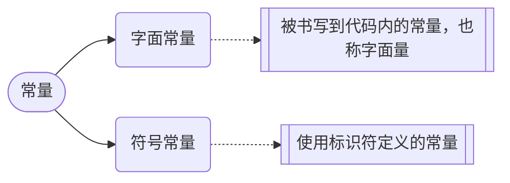

C++ 是一种静态类型的、编译式的、通用的、大小写敏感的、不规则的编程语言，支持过程化编程、面向对象编程和泛型编程。
C++ 被认为是一种<u>中级</u>语言，它综合了高级语言和低级语言的特点。
C++ 是由 Bjarne Stroustrup 于 1979 年在新泽西州美利山贝尔实验室开始设计开发的。C++ 进一步扩充和完善了 C 语言，最初命名为带类的C，后来在 1983 年更名为 C++。
C++ 是 C 的一个超集，事实上，任何合法的 C 程序都是合法的 C++ 程序。

> [!caution] 
> 使用静态类型的编程语言是在编译时执行类型检查，而不是在运行时执行类型检查。

标准的 C++ 由三个重要部分组成：
- 核心语言，提供了所有构件块，包括变量、数据类型和常量，等等。
- C++ 标准库，提供了大量的函数，用于操作文件、字符串等。
- 标准模板库（STL），提供了大量的方法，用于操作数据结构等。

---
C++ 有多种编译器可供选择，常见的有：
- GCC（GNU Compiler Collection）：一个开源的编译器集合，支持多种编程语言，包括 C++。GCC 在类 Unix 系统（如 Linux 和 macOS）上广泛使用。
- Clang：另一个开源的编译器，作为 LLVM 项目的一部分。Clang 以其快速的编译速度和良好的错误诊断而闻名，常用于 macOS 和 iOS 开发。
- Microsoft Visual C++（MSVC）：微软提供的 C++ 编译器，集成在 Visual Studio 开发环境中。MSVC 是 Windows 平台上最常用的 C++ 编译器之一。
- Intel C++ Compiler（ICC）：由英特尔公司开发的高性能 C++ 编译器，专为英特尔处理器优化，适用于需要高性能计算的应用程序。
- MinGW（Minimalist GNU for Windows）：一个在 Windows 上使用的 GCC 编译器集合，允许开发者在 Windows 平台上编译和运行 C++ 程序。


# 程序结构

```cpp
#include <iostream>
using namespace std;
int main()
{
    cout <<"Hello World!"<< endl;
    cout << "I'm" << 10 << "years old." << endl;
    return 0;
}
```

- C++ 语言定义了一些头文件，这些头文件包含了程序中必需的或有用的信息。上面这段程序中，包含了头文件`<iostream>`。

> [!note]
> 用`<>`包裹的一般是系统提供的代码，编译器会在专门的系统路径中查找；用`""`包裹的一般是自己写的代码文件，编译器会优先在当前文件所在目录下查找，找不到才会去系统目录查找


- 下一行 **using namespace std;** 告诉编译器使用 std 命名空间，这样在cin、cout前就不用加上std::了。命名空间是 C++ 中一个相对新的概念。
- 下一行 **// main() 是程序开始执行的地方** 是一个单行注释。单行注释以 // 开头，在行末结束。
- 下一行 **int main()** 是主函数，程序从这里开始执行。
- 下一行 **cout << "Hello World";** 会在屏幕上显示消息 "Hello World"。
- 下一行 **return 0;** 终止 main( )函数，并向调用进程返回值 0。事实上，在main函数中这一句可以省略

```c++
#include <iostream>
#include <Windows.h>
using namespace std;
int main()
{
    //system("chcp 65001");或者使用这句代码也可以解决中文乱码
    SetConsoleOutputCP(CP_UTF8);
    cout << "对于中文，我们需要用UTF-8编码" << '\n';
    cout << "你好，世界！";
    return 0;
}
```


**分号/语句块**
在 C++ 中，分号是语句结束符。也就是说，每个语句必须以分号结束。它表明一个逻辑实体的结束。
语句块是一组使用大括号括起来的按逻辑连接的语句。
C++ 不以行末作为结束符的标识，因此，您可以在一行上放置多个语句。

**三字符组**
三字符组就是用于表示另一个字符的三个字符序列，又称为三字符序列。三字符序列总是以两个问号开头。
三字符序列不太常见，但 C++ 标准允许把某些字符指定为三字符序列。以前为了表示键盘上没有的字符，这是必不可少的一种方法。
三字符序列可以出现在任何地方，包括字符串、字符序列、注释和预处理指令。

下面列出了最常用的三字符序列：

| 三字符组 | 替换 |
| :------- | :--- |
| ??=      | #    |
| ??/      | \    |
| ??'      | ^    |
| ??(      | [    |
| ??)      | ]    |
| ??!      | \|   |
| ??<      | {    |
| ??>      | }    |
| ??-      | ~    |

如果希望在源程序中有两个连续的问号，且不希望被预处理器替换，这种情况出现在字符常量、字符串字面值或者是程序注释中，可选办法是用字符串的自动连接："...?""?..."或者转义序列："...?\?..."。

从Microsoft Visual C++ 2010版开始，该编译器默认不再自动替换三字符组。如果需要使用三字符组替换（如为了兼容古老的软件代码），需要设置编译器命令行选项/Zc:trigraphs

g++仍默认支持三字符组，但会给出编译警告。

**空格**
只包含空格的行，被称为空白行，可能带有注释，C++ 编译器会完全忽略它。
在 C++ 中，空格用于描述空白符、制表符、换行符和注释。空格分隔语句的各个部分，让编译器能识别语句中的某个元素（比如 int）在哪里结束，下一个元素在哪里开始。

**代码注释**
程序的注释是解释性语句，您可以在 C++ 代码中包含注释，这将提高源代码的可读性。所有的编程语言都允许某种形式的注释。
C++ 支持单行注释和多行注释。注释中的所有字符会被 C++ 编译器忽略。

C++ 注释一般有两种：
- **//** - 一般用于单行注释。
- /*** ... \*/** - 一般用于多行注释。

注释以 **//** 开始，直到行末为止。也可以放在语句后面。


**标识符**
C++ 标识符是用来标识变量、函数、类、模块，或任何其他用户自定义项目的名称。一个标识符以字母 A-Z 或 a-z 或下划线 _ 开始，后跟零个或多个字母、下划线和数字（0-9）。
C++ 标识符内不允许出现标点字符，比如 @、& 和 %。C++ 是区分大小写的编程语言。因此，在 C++ 中，`Manpower` 和 `manpower` 是两个不同的标识符。
保留字不能作为常量名、变量名或其他标识符名称。

# 常量与变量

## 常量
常量是固定值，在程序执行期间不会改变。




**常量类型**：

整型/整数常量
整数常量可以是十进制、八进制或十六进制的常量。前缀指定基数：0x 或 0X 表示十六进制，0 表示八进制，不带前缀则默认表示十进制。
整数常量也可以带一个后缀，后缀是 U 和 L 的组合，U 表示无符号整数（unsigned），L 表示长整数（long）。后缀可以是大写，也可以是小写，U 和 L 的顺序任意。

实型/浮点常量
浮点常量由整数部分、小数点、小数部分和指数部分组成。您可以使用小数形式或者指数形式来表示浮点常量。
当使用小数形式表示时，必须包含整数部分、小数部分，或同时包含两者。当使用指数形式表示时， 必须包含小数点、指数，或同时包含两者。带符号的指数是用 e 或 E 引入的。

布尔常量
布尔常量共有两个，它们都是标准的 C++ 关键字：true 值代表真，false 值代表假。

字符常量
字符常量是括在<u>单引号</u>中。如果常量以 L（仅当大写时）开头，则表示它是一个宽字符常量（例如 L'x'），此时它必须存储在 wchar_t 类型的变量中。否则，它就是一个窄字符常量（例如 'x'），此时它可以存储在 char 类型的简单变量中。

字符常量可以是一个普通的字符（例如 'x'）、一个转义序列（例如 '\\t'），或一个通用的字符（例如 '\\u02C0'）。

在 C++ 中，有一些特定的字符，当它们前面有反斜杠时，它们就具有特殊的含义，被用来表示如换行符（\\n）或制表符（\\t）等。下表列出了一些这样的转义序列码：

| 转义序列       | 含义            |
| :--------- | :------------ |
| \\         | \ 字符          |
| \\'        | ' 字符          |
| \\"        | " 字符          |
| \\?        | ? 字符          |
| \a         | 警报铃声          |
| \b         | 光标退格键         |
| \f         | 换页符           |
| \n         | 换行符           |
| \r         | 回车            |
| \t         | 水平制表符         |
| \v         | 垂直制表符         |
| \ooo       | 一到三位的八进制数     |
| \xhh . . . | 一个或多个数字的十六进制数 |
| \\0        | 空字符           |
|            |               |

字符串常量
字符串字面值或常量是括在双引号 **""** 中的。一个字符串包含类似于字符常量的字符：普通的字符、转义序列和通用的字符。
您可以使用 `\`做分隔符，把一个很长的字符串常量进行分行。

---

在 C++ 中，有两种简单的定义常量的方式：

- 使用  `#define` 预处理器。
- 使用 `const` 关键字。

下面是使用 `#define` 预处理器定义常量的形式：

```cpp
#define identifier value
```

您可以使用 `const` 前缀声明指定类型的常量，如下所示：

```c++
const type variable = value;
```

> [!NOTE]
>
> 通常把常量定义为大写字母形式。


## 变量
以下是几种基本的变量类型：

| 类型    | 描述                                                         |
| :------ | :----------------------------------------------------------- |
| bool    | 布尔类型，存储值 true 或 false，占用 1 个字节。              |
| char    | 字符类型，用于存储 ASCII 字符，通常占用 1 个字节。           |
| int     | 整数类型，通常用于存储普通整数，通常占用 4 个字节。          |
| float   | 单精度浮点值，用于存储单精度浮点数。单精度是这样的格式，1 位符号，8 位指数，23 位小数，通常占用4个字节。 |
| double  | 双精度浮点值，用于存储双精度浮点数。双精度是 1 位符号，11 位指数，52 位小数，通常占用 8 个字节。 |
| void    | 表示类型的缺失。                                             |
| wchar_t | 宽字符类型，用于存储更大范围的字符，通常占用 2 个或 4 个字节。 |

> [!tip]
>
> 在C++中有两种风格的字符串使用形式：
>
> - C语言风格
>
>   ```c++
>       char str[] = "Hello World!";//字符数组形式
>       char *c = "cast";//指针形式
>   ```
>
> - C++风格
>
>   ```c++
>   string s = "cpp";
>   ```
>
>   

C++ 也允许定义各种其他类型的变量，比如**枚举、指针、数组、引用、数据结构、类**等等。

1. 整数类型（Integer Types）：
   - `int`：用于表示整数，通常占用4个字节。
   - `short`：用于表示短整数，通常占用2个字节。
   - `long`：用于表示长整数，通常占用4个字节。在Linux系统中占用8个字节。可以加上后缀`l`或`L`，明确变量类型。
   - `long long`：用于表示更长的整数，通常占用8个字节。
2. 浮点类型（Floating-Point Types）：
   - `float`：用于表示单精度浮点数，通常占用4个字节。声明时要在后面加上`f`或`F`，因为C++中的浮点数默认是double。能存储6或7位有效数字，超过后就会四舍五入；用cout打印浮点数，会默认转换成6位有效数字的精度输出内容。
   - `double`：用于表示双精度浮点数，通常占用8个字节。能存储15或16位有效数字。
   - `long double`：用于表示更高精度的浮点数，占用字节数可以根据实现而变化。能存储18到21、35到16位有效数字(不同操作系统不一样)。需要加上后缀l或L。
3. 字符类型（Character Types）：
   - `char`：用于表示字符，通常占用1个字节。C++中被当做整型对待，即对应的ASCII编码值。
   - `wchar_t`：用于表示宽字符，通常占用2或4个字节。
   - `char16_t`：用于表示16位Unicode字符，占用2个字节。
   - `char32_t`：用于表示32位Unicode字符，占用4个字节。
4. 布尔类型（Boolean Type）：
   - `bool`：用于表示布尔值，只能取`true`或`false`。在C++中往往被当做整数对待。
5. 枚举类型（Enumeration Types）：
   - `enum`：用于定义一组命名的整数常量。
6. 指针类型（Pointer Types）：
   - `type*`：用于表示指向类型为`type`的对象的指针。
7. 数组类型（Array Types）：
   - `type[]`或`type[size]`：用于表示具有相同类型的元素组成的数组。
8. 结构体类型（Structure Types）：
   - `struct`：用于定义包含多个不同类型成员的结构。
9. 类类型（Class Types）：
   - `class`：用于定义具有属性和方法的自定义类型。
10. 共用体类型（Union Types）：
    - `union`：用于定义一种特殊的数据类型，它可以在相同的内存位置存储不同的数据类型。

> [!NOTE]
>
> 在 C++ 中，类型的长度（即占用的字节数）取决于编译器和计算机架构，然而，C++ 标准规定了不同整数类型的最小范围，而不是具体的字节数，这是为了确保代码在不同的系统上都能正确运行。
>
> 请注意，以上类型的范围只是 C++ 标准规定的最小要求，实际上，许多系统上这些类型可能占用更多的字节，例如，很多现代计算机上 int 通常占用 4 字节，而 long 可能占用 8 字节。


---
变量定义就是告诉编译器在何处创建变量的存储，以及如何创建变量的存储。


变量定义指定一个数据类型，并包含了该类型的一个或多个变量的列表，如下所示：

```
type variable_list;
```

在这里，**type** 必须是一个有效的 C++ 数据类型，可以是 char、wchar_t、int、float、double、bool 或任何用户自定义的对象，**variable_list** 可以由一个或多个标识符名称组成，多个标识符之间用逗号分隔。


---
C++ 允许在 **char、int 和 double** 数据类型前放置修饰符。
修饰符是用于改变变量类型的行为的关键字，它更能满足各种情境的需求。

下面列出了数据类型修饰符：
- signed：表示变量可以存储负数。对于整型变量来说，signed 可以省略，因为整型变量默认为有符号类型。
- unsigned：表示变量不能存储负数。对于整型变量来说，unsigned 可以将变量范围扩大一倍。
- short：表示变量的范围比 int 更小。short int 可以缩写为 short。
- long：表示变量的范围比 int 更大。long int 可以缩写为 long。
- long long：表示变量的范围比 long 更大。C++11 中新增的数据类型修饰符。
- float：表示单精度浮点数。
- double：表示双精度浮点数。
- bool：表示布尔类型，只有 true 和 false 两个值。
- char：表示字符类型。
- wchar_t：表示宽字符类型，可以存储 Unicode 字符。

修饰符 **signed、unsigned、long 和 short** 可应用于整型，**signed** 和 **unsigned** 可应用于字符型，**long** 可应用于双精度型。
这些修饰符也可以组合使用，修饰符 **signed** 和 **unsigned** 也可以作为 **long** 或 **short** 修饰符的前缀。例如：**unsigned long int**。
C++ 允许使用速记符号来声明**无符号短整数**或**无符号长整数**。您可以不写 int，只写单词 **unsigned、short** 或 **long**，**int** 是隐含的。


---
一般来说有三个地方可以定义变量：
- 在函数或一个代码块内部声明的变量，称为**局部变量**。
- 在函数参数的定义中声明的变量，称为**形式参数**。
- 在所有函数外部声明的变量，称为**全局变量**。

作用域是程序的一个区域，变量的作用域可以分为以下几种：
- **局部作用域**：在函数内部声明的变量具有局部作用域，它们只能在函数内部访问。局部变量在函数每次被调用时被创建，在函数执行完后被销毁。
- **全局作用域**：在所有函数和代码块之外声明的变量具有全局作用域，它们可以被程序中的任何函数访问。全局变量在程序开始时被创建，在程序结束时被销毁。
- **块作用域**：在代码块内部声明的变量具有块作用域，它们只能在代码块内部访问。块作用域变量在代码块每次被执行时被创建，在代码块执行完后被销毁。
- **类作用域**：在类内部声明的变量具有类作用域，它们可以被类的所有成员函数访问。类作用域变量的生命周期与类的生命周期相同。

**注意：** 如果在内部作用域中声明的变量与外部作用域中的变量同名，则内部作用域中的变量将覆盖外部作用域中的变量。


---
变量的存储类型
存储类定义 C++ 程序中变量/函数的范围（可见性）和生命周期。这些说明符放置在它们所修饰的类型之前。下面列出 C++ 程序中可用的存储类：
- `auto`：这是默认的存储类说明符，通常可以省略不写。auto 指定的变量具有自动存储期，即它们的生命周期仅限于定义它们的块（block）。auto 变量通常在栈上分配。
- `register`：用于建议编译器将变量存储在CPU寄存器中以提高访问速度。在 C++11 及以后的版本中，register 已经是一个废弃的特性，不再具有实际作用。
- `static`：用于定义具有静态存储期的变量或函数，它们的生命周期贯穿整个程序的运行期。在函数内部，static变量的值在函数调用之间保持不变。在文件内部或全局作用域，static变量具有内部链接，只能在定义它们的文件中访问。
- `extern`：用于声明具有外部链接的变量或函数，它们可以在多个文件之间共享。默认情况下，全局变量和函数具有 extern 存储类。在一个文件中使用extern声明另一个文件中定义的全局变量或函数，可以实现跨文件共享。
- `mutable` (C++11)：用于修饰类中的成员变量，允许在const成员函数中修改这些变量的值。通常用于缓存或计数器等需要在const上下文中修改的数据。
- `thread_local` (C++11)：用于定义具有线程局部存储期的变量，每个线程都有自己的独立副本。线程局部变量的生命周期与线程的生命周期相同。

从 C++ 17 开始，auto 关键字不再是 C++ 存储类说明符，且 register 关键字被弃用。
C++中的存储类说明符为程序员提供了控制变量和函数生命周期及可见性的手段，合理使用存储类说明符可以提高程序的可维护性和性能。
从 C++11 开始，register 已经失去了原有的作用，而 mutable 和 thread_local 则是新引入的特性，用于解决特定的编程问题。

## 类型转换
**隐式转换**
在使用赋值运算符'='时，(A=B) 若两侧的类型不匹配，C++会尝试将右侧的值转换成左侧变量的类型。

1. B 的精度比 A 低：称为向上转换，通常不会有任何问题，不会丢失数据，也不会出现未定义行为
2. B 的精度比 A 高：会导致数据丢失或溢出，若追求准确性，应避免
3. 字符串不能转换成其他类型；数值转换字符串，会被当做 char (ASCII) 处理。
4. 无符号和有符号之间转换

在数学运算中，若出现不同类型，编译器会进行精度提升，按照精度最高的类型运算。

---
**显式转换**
1. 括号强转：可以在计算过程中强制改变隐式转换的规则
```C++
int i;  
i = 2/1.1+3/1.1;  
cout << i << endl;  // 4
i = (int)(2/1.1)+3/1.1;  
cout << i << endl; // 3
```

2. `to_string()` 方法，需要引入 `#include <string>`。对于 bool、char 等类型，会先隐式转换成最接近的类型 (01 和 ASCII 码)，再进行转换。
```C++
int j = 1075321;  
string s1 = to_string(j);  
cout << s1 << endl; // 1075321
```

3. `sto..()` 方法，同样需要引入 `#include <string>`。转换失败会报错 (溢出或类型不匹配)。
```C++
string str = "333";
int i = stoi(str);
long l = stol(str);
long long ll = stoll(str);
...
```


# 运算符
## 算术运算符
假设变量 A 的值为 10，变量 B 的值为 20，则：

| 运算符 | 描述                             | 实例             |
| :----- | :------------------------------- | :--------------- |
| +      | 把两个操作数相加                 | A + B 将得到 30  |
| -      | 从第一个操作数中减去第二个操作数 | A - B 将得到 -10 |
| *      | 把两个操作数相乘                 | A * B 将得到 200 |
| /      | 分子除以分母                     | B / A 将得到 2   |
| %      | 取模运算符，整除后的余数         | B % A 将得到 0   |
| ++     | 自增运算符，整数值增加 1         | A++ 将得到 11    |
| --     | 自减运算符，整数值减少 1         | A-- 将得到 9     |

对于自增（减）运算符，前缀形式与后缀形式之间有一点不同。如果使用前缀形式，则会在表达式计算之前完成自增或自减，如果使用后缀形式，则会在表达式计算之后完成自增或自减。

请看下面的实例，理解二者之间的区别：

```c++
#include <iostream>
using namespace std;
int main()
{
   int a = 21;
   int c ;
   // a 的值在赋值之前不会自增
   c = a++;   
   cout << "Line 1 - Value of a++ is :" << c << endl ;
 
   // 表达式计算之后，a 的值增加 1
   cout << "Line 2 - Value of a is :" << a << endl ;
 
   // a 的值在赋值之前自增
   c = ++a;  
   cout << "Line 3 - Value of ++a is  :" << c << endl ;
   return 0;

   // 连续运算，先算右侧的值再赋给左侧
   int i = 10;
   i = 5 + i + i;// 结果为 i=5+10+10
}
```


当上面的代码被编译和执行时，它会产生下列结果：

```
Line 1 - Value of a++ is :21
Line 2 - Value of a is :22
Line 3 - Value of ++a is  :23
```

> [!caution]
>
> 如果定义`int a = 16/10`，将会得到1，整型情况下是向下取整的。

## 关系运算符
假设变量 A 的值为 10，变量 B 的值为 20，则：

| 运算符 | 描述                                                         | 实例              |
| :----- | :----------------------------------------------------------- | :---------------- |
| ==     | 检查两个操作数的值是否相等，如果相等则条件为真。             | (A == B) 不为真。 |
| !=     | 检查两个操作数的值是否相等，如果不相等则条件为真。           | (A != B) 为真。   |
| >      | 检查左操作数的值是否大于右操作数的值，如果是则条件为真。     | (A > B) 不为真。  |
| <      | 检查左操作数的值是否小于右操作数的值，如果是则条件为真。     | (A < B) 为真。    |
| >=     | 检查左操作数的值是否大于或等于右操作数的值，如果是则条件为真。 | (A >= B) 不为真。 |
| <=     | 检查左操作数的值是否小于或等于右操作数的值，如果是则条件为真。 | (A <= B) 为真。   |

>[!tip] 
>string同类型之间可使用`==`和`!=`进行比较，虽然也可以使用`<`、`>`等，但一般不使用
>char和bool存储的实际是数值(ASCII码和01)，因此它们可以比较，但一般不使用

## 位运算符
位运算符作用于位，并逐位执行操作。&、 | 和 ^ 的真值表如下所示：

| p    | q    | p & q | p \| q | p ^ q |
| :--- | :--- | :---- | :----- | :---- |
| 0    | 0    | 0     | 0      | 0     |
| 0    | 1    | 0     | 1      | 1     |
| 1    | 1    | 1     | 1      | 0     |
| 1    | 0    | 0     | 1      | 1     |

假设变量 A 的值为 60，变量 B 的值为 13，则(A=0011 1100 B=0000 1101)：

| 运算符 | 描述                                                                    | 实例                                         |
| :-- | :-------------------------------------------------------------------- | :----------------------------------------- |
| &   | 按位与操作，按二进制位进行"与"运算。运算规则：<br>`0&0=0;    0&1=0;     1&0=0;      1&1=1;` | (A & B) 将得到 12，即为 0000 1100                |
| \|  | 按位或运算符，按二进制位进行"或"运算。                                                  | (A \| B) 将得到 61，即为 0011 1101               |
| ^   | 异或运算符，按二进制位进行"异或"运算。<br>运算规则：`0^0=0;    0^1=1;    1^0=1;   1^1=0;`    | (A ^ B) 将得到 49，即为 0011 0001                |
| ~   | 取反运算符，按二进制位进行"取反"运算。运算规则：<br>`~1=-2;    ~0=-1;`                       | (~A ) 将得到 -61，即为 1100 0011，一个有符号二进制数的补码形式。 |
| <<  | 二进制左移运算符。将一个运算对象的各二进制位全部左移若干位（左边的二进制位丢弃，右边补0）。                        | A << 2 将得到 240，即为 1111 0000                |
| >>  | 二进制右移运算符。将一个数的各二进制位全部右移若干位，正数左补0，负数左补1，右边丢弃。                          | A >> 2 将得到 15，即为 0000 1111                 |

>[!tip] 
>位运算符支持复合运算符，即`a = a & 1`等价于`a &= 1`，但取反不存在

## 逻辑运算符
假设变量 A 的值为 1，变量 B 的值为 0，则：

| 运算符  | 描述                                                  | 实例                 |
| :--- | :-------------------------------------------------- | :----------------- |
| &&   | 称为逻辑与运算符。如果两个操作数都 true，则条件为 true。                   | (A && B) 为 false。  |
| \|\| | 称为逻辑或运算符。如果两个操作数中有任意一个 true，则条件为 true。              | (A \|\| B) 为 true。 |
| !    | 称为逻辑非运算符。用来逆转操作数的逻辑状态，如果条件为 true 则逻辑非运算符将使其为 false。 | !(A && B) 为 true。  |
事实上，只要A非零它均代表true

由于逻辑与是有真则真，逻辑或是有假则假。因此对于逻辑与，只要左边为真，表达式就为真，右边就不会进行运算，逻辑或类似。这种现象称为**逻辑运算符短路**。

## 赋值运算符

| 运算符 | 描述                                                         | 实例                            |
| :----- | :----------------------------------------------------------- | :------------------------------ |
| =      | 简单的赋值运算符，把右边操作数的值赋给左边操作数             | C = A + B 将把 A + B 的值赋给 C |
| +=     | 加且赋值运算符，把右边操作数加上左边操作数的结果赋值给左边操作数 | C += A 相当于 C = C + A         |
| -=     | 减且赋值运算符，把左边操作数减去右边操作数的结果赋值给左边操作数 | C -= A 相当于 C = C - A         |
| *=     | 乘且赋值运算符，把右边操作数乘以左边操作数的结果赋值给左边操作数 | C *= A 相当于 C = C * A         |
| /=     | 除且赋值运算符，把左边操作数除以右边操作数的结果赋值给左边操作数 | C /= A 相当于 C = C / A         |
| %=     | 求模且赋值运算符，求两个操作数的模赋值给左边操作数           | C %= A 相当于 C = C % A         |
| <<=    | 左移且赋值运算符                                             | C <<= 2 等同于 C = C << 2       |
| >>=    | 右移且赋值运算符                                             | C >>= 2 等同于 C = C >> 2       |
| &=     | 按位与且赋值运算符                                           | C &= 2 等同于 C = C & 2         |
| ^=     | 按位异或且赋值运算符                                         | C ^= 2 等同于 C = C ^ 2         |
| \|=    | 按位或且赋值运算符                                           | C \|= 2 等同于 C = C \| 2       |

## 其它运算符

| 运算符               | 描述                                                                     |
| :---------------- | :--------------------------------------------------------------------- |
| sizeof            | sizeof 运算符。返回变量的大小。例如，sizeof(a) 将返回 4，其中 a 是整数。                        |
| Condition ? X : Y | 条件运算符(三目运算符)。如果 Condition 为真 ? 则值为 X : 否则值为 Y。<br>(精度会自动提升)(会抛弃不执行的代码) |
| ,                 | 逗号运算符。会顺序执行一系列运算。整个逗号表达式的值是以逗号分隔的列表中的最后一个表达式的值。                        |
| .（点）和 ->（箭头）      | 成员运算符用于引用类、结构和共用体的成员。                                                  |
| Cast              | 强制转换运算符把一种数据类型转换为另一种数据类型。例如，int(2.2000) 将返回 2。                         |
| &                 | 指针运算符 & 返回变量的地址。例如 &a; 将给出变量的实际地址。                                     |
| *                 | 指针运算符 * 指向一个变量。例如，\*var; 将指向变量 var。                                    |

## 运算符优先级
下表将按运算符优先级从高到低列出各个运算符：

| 类别      | 运算符                               | 结合性  |
| :------ | :-------------------------------- | :--- |
| 后缀      | () [] -> . ++ - -                 | 从左到右 |
| 一元      | + - ! ~ ++ - - (type)* & sizeof   | 从右到左 |
| 乘除      | * / %                             | 从左到右 |
| 加减      | + -                               | 从左到右 |
| 移位      | << >>                             | 从左到右 |
| 关系      | < <= > >=                         | 从左到右 |
| 相等      | == !=                             | 从左到右 |
| 位与 AND  | &                                 | 从左到右 |
| 位异或 XOR | ^                                 | 从左到右 |
| 位或 OR   | \|                                | 从左到右 |
| 逻辑与 AND | &&                                | 从左到右 |
| 逻辑或 OR  | \|\|                              | 从左到右 |
| 条件      | ?:                                | 从右到左 |
| 赋值      | = += -= *= /= %=>>= <<= &= ^= \|= | 从右到左 |
| 逗号      | ,                                 | 从左到右 |

>[!note] 
>即算术运算符>关系运算符>位运算符>逻辑运算符>赋值运算符
>运算时，若数据类型不同，结果会取最高的类型，以保证精度不损失


# 逻辑语句
## 循环
C++ 中 **while** 循环的语法：

```c++
while(condition)
{
   statement(s);
}
```

在这里，**statement(s)** 可以是一个单独的语句，也可以是几个语句组成的代码块。**condition** 可以是任意的表达式，当为任意非零值时都为真。当条件为真时执行循环。

当条件为假时，程序流将继续执行紧接着循环的下一条语句。

>[!note] 
> 如果大括号内只有一行代码的话，可以省略大括号，for语句、if语句等类似。

---
C++ 中 **for** 循环的语法：

```c++
for ( init; condition; increment )
{
   statement(s);
}
```

下面是 for 循环的控制流：
1. **init** 会首先被执行，且只会执行一次。这一步允许您声明并初始化任何循环控制变量。您也可以不在这里写任何语句，只要有一个分号出现即可。
2. 接下来，会判断 **condition**。如果为真，则执行循环主体。如果为假，则不执行循环主体，且控制流会跳转到紧接着 for 循环的下一条语句。
3. 在执行完 for 循环主体后，控制流会跳回上面的 **increment** 语句。该语句允许您更新循环控制变量。该语句可以留空，只要在条件后有一个分号出现即可。
4. 条件再次被判断。如果为真，则执行循环，这个过程会不断重复（循环主体，然后增加步值，再然后重新判断条件）。在条件变为假时，for 循环终止。

```C++
for(int i=1,j=1; i<10 && j>0; i--,j++)
{

}
for(;;)
{
   //死循环
}
```

---
C++ 中 **do...while** 循环的语法：

```c++
do
{
   statement(s);
}while( condition ); // 这里有一个分号
```

请注意，条件表达式出现在循环的尾部，所以循环中的 statement(s) 会在条件被测试之前**至少执行一次**。
如果条件为真，控制流会跳转回上面的 do，然后重新执行循环中的 statement(s)。这个过程会不断重复，直到给定条件变为假为止。

---
循环控制语句
循环控制语句更改执行的正常序列。当执行离开一个范围时，所有在该范围中创建的自动对象都会被销毁。

| 控制语句        | 描述                                                            |
| :---------- | :------------------------------------------------------------ |
| break 语句    | 终止 **loop** 或 **switch** 语句，程序流将继续执行紧接着 loop 或 switch 的下一条语句。 |
| continue 语句 | 引起循环跳过主体的剩余部分，立即重新开始测试条件。                                     |
| goto 语句     | 将控制转移到被标记的语句。但是不建议在程序中使用 goto 语句。                             |

如果您使用的是嵌套循环（即一个循环内嵌套另一个循环），break 语句会停止执行最内层的循环，然后开始执行该块之后的下一行代码。
**continue** 语句有点像 **break** 语句。但它不是强迫终止，continue 会跳过当前循环中的代码，强迫开始下一次循环。
对于 **for** 循环，**continue** 语句会导致执行条件测试和循环增量部分。对于 **while** 和 **do...while** 循环，**continue** 语句会导致程序控制回到条件测试上。
**goto** 语句允许把控制无条件转移到同一函数内的被标记的语句。

>[!attention] 
>goto语句会使程序逻辑混乱且运行效率低，实际开发中不建议使用。


C++ 中 **goto** 语句的语法：
```
goto label;
..
.
label: statement;
```

在这里，**label** 是识别被标记语句的标识符，可以是任何除 C++ 关键字以外的纯文本。标记语句可以是任何语句，放置在标识符和冒号（:）后边。
goto语句不允许跳过变量声明，无论该变量是否使用。除非将变量通过加上大括号的方式限定使用范围，然后跳过变量的整个使用范围。


## 判断
if与if else
```c++
if(boolean_expression 1)
{
   // 当布尔表达式 1 为真时执行
}
else if( boolean_expression 2)
{
   // 当布尔表达式 2 为真时执行
}
else if( boolean_expression 3)
{
   // 当布尔表达式 3 为真时执行
}
else 
{
   // 当上面条件都不为真时执行
}
```

---
switch
C++ 中 **switch** 语句的语法：

```c++
switch(expression){
    case constant-expression  :
       statement(s);
       break; // 可选的
    case constant-expression  :
       statement(s);
       break; // 可选的
  
    // 您可以有任意数量的 case 语句
    default : // 可选的
       statement(s);
}
```

**switch** 语句必须遵循下面的规则：
- **switch** 语句中的 **expression** 必须是一个整型或枚举类型，或者是一个 class 类型，其中 class 有一个单一的转换函数将其转换为整型或枚举类型。
- case 的 **constant-expression** 必须与 switch 中的变量具有相同的数据类型，且必须是一个常量或字面量。
- 当被测试的变量等于 case 中的常量时，case 后跟的语句将被执行，直到遇到 **break** 语句为止。
- 当遇到 **break** 语句时，switch 终止，控制流将跳转到 switch 语句后的下一行。
- 不是每一个 case 都需要包含 **break**。如果 case 语句不包含 **break**，控制流将会 *继续* 后续的 case，直到遇到 break 为止(**贯穿**)。
- 一个 **switch** 语句可以有一个可选的 **default** case，出现在 switch 的结尾。default case 可用于在上面所有 case 都不为真时执行一个任务。default case 中的 **break** 语句不是必需的。
- C++中每个case没有独立的作用域，如果直接在case中声明临时变量，编译器会报错。为避免这种情况，可以在case加上语句块$\{  \}$

# 异常捕获 
异常是程序在执行期间产生的问题。C++ 异常是指在程序运行时发生的特殊情况，比如尝试除以零的操作。

异常提供了一种转移程序控制权的方式。C++ 异常处理涉及到三个关键字：**try、catch、throw**。
- **throw:** 当问题出现时，程序会抛出一个异常。这是通过使用 **throw** 关键字来完成的。
- **catch:** 在您想要处理问题的地方，通过异常处理程序捕获异常。**catch** 关键字用于捕获异常。
- **try:** **try** 块中的代码标识将被激活的特定异常。它后面通常跟着一个或多个 catch 块。

如果有一个块抛出一个异常，捕获异常的方法会使用 **try** 和 **catch** 关键字。try 块中放置可能抛出异常的代码，try 块中的代码被称为保护代码。使用 try/catch 语句的语法如下所示：
```C++
try
{
   // 保护代码
}catch( ExceptionName e1 )
{
   // catch 块
}catch( ExceptionName e2 )
{
   // catch 块
}catch( ExceptionName eN )
{
   // catch 块
}
```

# 特殊数据类型
## 枚举
枚举类型(enumeration)是 C++ 中的一种派生数据类型，它是由用户定义的若干枚举常量的集合。

枚举类型的定义格式为：
```
enum <类型名> {<枚举常量表>};
```

定义枚举类型的主要目的是：增加程序的可读性。
枚举变量只能参与赋值和关系运算以及输出操作，参与运算时用其本身的整数值。
可以手动指定枚举值，未指定的枚举值默认比前面的枚举值大1，枚举值可以重复。
枚举常与switch语句进行搭配

## 数组
C++ 支持数组数据结构，它可以存储一个固定大小的相同类型元素的顺序集合。数组是用来存储一系列数据，但它往往被认为是一系列相同类型的变量。

所有的数组都是由内连续的存位置组成(<u>即数组的存储序列是线性的</u>)。最低的地址对应第一个元素，最高的地址对应最后一个元素。
数组变量(实例中为"balance")本身不记录所有数据，而是记录了数组0号元素的内存地址。
在 C++ 中要声明一个数组，需要指定元素的类型和元素的数量，如下所示：
```
type arrayName [ arraySize ];
```

这叫做一维数组。**arraySize** 必须是一个大于零的整数常量，**type** 可以是任意有效的 C++ 数据类型。例如，要声明一个类型为 double 的包含 10 个元素的数组 **balance**，声明语句如下：
```
double balance[10];
```

在 C++ 中，您可以逐个初始化数组，也可以使用一个初始化语句，如下所示：
```
double balance[5] = {1000.0, 2.0, 3.4, 7.0, 50.0};
```


大括号 { } 之间的值的数目不能大于我们在数组声明时在方括号` [ ] `中指定的元素数目。
如果您省略掉了数组的大小，数组的大小则为初始化时元素的个数。因此，如果：
```
double balance[] = {1000.0, 2.0, 3.4, 7.0, 50.0};
```

您将创建一个数组，它与前一个实例中所创建的数组是完全相同的。
数组元素可以通过数组名称加索引进行访问。元素的索引是放在方括号内，跟在数组名称的后边。
如果想要遍历数组,C++提供了另一种写法:

```c++
int arr[] = {1,2,3,4,5};
for (const int element:arr)
{
   cout << setw(2)<< element << " ";
}
```

可以通过以下方式获取数组长度：
```C++
int arr[6] = {1,2,3,4,5,6}
int length = sizeof(arr) / sizeof(int)
```


---

C++ 支持多维数组。多维数组声明的一般形式如下：
```
type name[size1][size2]...[sizeN];
```


---

## 字符串
下面两种C语言风格的字符串，是将每一个字符作为一个元素存储进字符数组中，并且会在字符数组中额外在最后添加一个null字符`\0`，作为结束标记

```c
    char str[] = "Hello World!";//字符数组形式
    char *c = "cast";//指针形式
```

C++ 中有大量的函数用来操作以 null 结尾的字符串:

| 序号 | 函数 & 目的                                                  |
| :--- | :----------------------------------------------------------- |
| 1    | **strcpy(s1, s2);** 复制字符串 s2 到字符串 s1。              |
| 2    | **strcat(s1, s2);** 连接字符串 s2 到字符串 s1 的末尾。连接字符串也可以用 **+** 号，例如: `string str1 = "runoob"; string str2 = "google"; string str = str1 + str2;` |
| 3    | **strlen(s1);** 返回字符串 s1 的长度。                       |
| 4    | **strcmp(s1, s2);** 如果 s1 和 s2 是相同的，则返回 0；如果 s1<s2 则返回值小于 0；如果 s1>s2 则返回值大于 0。 |
| 5    | **strchr(s1, ch);** 返回一个指针，指向字符串 s1 中字符 ch 的第一次出现的位置。 |
| 6    | **strstr(s1, s2);** 返回一个指针，指向字符串 s1 中字符串 s2 的第一次出现的位置。 |


C++ 标准库提供了 **string** 类类型，支持C语言字符串的所有操作，并且增加了其他的功能。

- 字符串拼接
可以使用算数运算符(+,+=)进行拼接，注意不能和数值类型直接进行拼接，可以和char类型拼接
```C++
string s = "Hello";
s = s + "World"
```
不能使用-、* 等方式进行拼接 

也可以使用`string.append()`方法进行拼接

## 数字
通常，当我们需要用到数字时，我们会使用原始的数据类型，如 int、short、long、float 和 double 等等。


在C++标准库中rand()函数是生成0到RAND_MAX之间的随机整数，RAND_MAXs是定义一个宏定义，在库中定义为一个大于32767的整数。但是rand()函数生成的随机数是一个伪随机数（每次代码运行都是相同的数字除非重启），需要设置随机数种子。

在C++标准库中srand()函数可以传递一个整数值作为种子，从而改变rand()的随机序列，一般可以使用time(NULL)作为时间种子，根据当前时间作为随机数种子。

```c++
    // 使用系统时钟作为硬件种子
    srand(time(0));
    // 使用进程ID作为随机数种子
    srand(getpid());
    // 设置随机数种子为4
    srand(4);
    //rand()取得0~RAND_MAX的随机数【左闭右闭】
    //取模运算使其范围缩小到0~991【左闭右开】
    //加上min从而实现min~max+1【左闭右开】
	int max = 1000;
	int min = 10;
	int b = min+rand()%(max-min+1);
	//static_cast(RAND_MAX)代码表示将RAND_MAX转换double类型。
	//由于 rand() 的范围是0~RAND_MAX,所以最终的范围是0到1的浮点数。
    double randomFloat = rand() / static_cast<double>(RAND_MAX); // 生成一个范围在 0 到 1 之间的随机浮点数
	//如果想取大于1的浮点数    
	double randomFloat = rand() / static_cast<double>(RAND_MAX)+rand(); 
```

## 日期&时间
C++ 标准库没有提供所谓的日期类型。C++ 继承了 C 语言用于日期和时间操作的结构和函数。为了使用日期和时间相关的函数和结构，需要在 C++ 程序中引用 `<ctime>`头文件。

有四个与时间相关的类型：**clock_t、time_t、size_t** 和 **tm**。类型 clock_t、size_t 和 time_t 能够把系统时间和日期表示为某种整数。
结构类型 **tm** 把日期和时间以 C 结构的形式保存，tm 结构的定义如下：

```c++
struct tm {
  int tm_sec;   // 秒，正常范围从 0 到 59，但允许至 61
  int tm_min;   // 分，范围从 0 到 59
  int tm_hour;  // 小时，范围从 0 到 23
  int tm_mday;  // 一月中的第几天，范围从 1 到 31
  int tm_mon;   // 月，范围从 0 到 11
  int tm_year;  // 自 1900 年起的年数
  int tm_wday;  // 一周中的第几天，范围从 0 到 6，从星期日算起
  int tm_yday;  // 一年中的第几天，范围从 0 到 365，从 1 月 1 日算起
  int tm_isdst; // 夏令时
};
```


下面是 C/C++ 中关于日期和时间的重要函数。所有这些函数都是 C/C++ 标准库的组成部分，您可以在 C++ 标准库中查看一下各个函数的细节。

| 序号  | 函数 & 描述                                                                                                                                                                                                   |
| :-- | :-------------------------------------------------------------------------------------------------------------------------------------------------------------------------------------------------------- |
| 1   | [**time_t time(time_t \*time);**](https://www.runoob.com/cplusplus/c-function-time.html) 该函数返回系统的当前日历时间，自 1970 年 1 月 1 日以来经过的秒数。如果系统没有时间，则返回 -1。                                                          |
| 2   | [**char \*ctime(const time_t \*time);**](https://www.runoob.com/cplusplus/c-function-ctime.html) 该返回一个表示当地时间的字符串指针，字符串形式 `*day month year hours:minutes:seconds year\n\0*`。                               |
| 3   | [**struct tm \*localtime(const time_t \*time);**](https://www.runoob.com/cplusplus/c-function-localtime.html) 该函数返回一个指向表示本地时间的 **tm** 结构的指针。                                                              |
| 4   | [**clock_t clock(void);**](https://www.runoob.com/cplusplus/c-function-clock.html) 该函数返回程序执行起（一般为程序的开头），处理器时钟所使用的时间。如果时间不可用，则返回 -1。                                                                       |
| 5   | [**char \* asctime ( const struct tm \* time );**](https://www.runoob.com/cplusplus/c-function-asctime.html) 该函数返回一个指向字符串的指针，字符串包含了 time 所指向结构中存储的信息，返回形式为：day month date hours:minutes:seconds year\n\0。 |
| 6   | [**struct tm \*gmtime(const time_t \*time);**](https://www.runoob.com/cplusplus/c-function-gmtime.html) 该函数返回一个指向 time 的指针，time 为 tm 结构，用协调世界时（UTC）也被称为格林尼治标准时间（GMT）表示。                                   |
| 7   | [**time_t mktime(struct tm \*time);**](https://www.runoob.com/cplusplus/c-function-mktime.html) 该函数返回日历时间，相当于 time 所指向结构中存储的时间。                                                                           |
| 8   | [**double difftime ( time_t time2, time_t time1 );**](https://www.runoob.com/cplusplus/c-function-difftime.html) 该函数返回 time1 和 time2 之间相差的秒数。                                                             |
| 9   | [**size_t strftime();**](https://www.runoob.com/cplusplus/c-function-strftime.html) 该函数可用于格式化日期和时间为指定的格式。                                                                                                 |


# 存储类关键字
存储类关键字定义变量/函数的存储位置、作用域和生命周期。

| 关键字        | 描述                                             |
| ---------- | ---------------------------------------------- |
| `auto`     | 默认存储类，自动存储时期，本地变量在其作用域内分配内存（**局部变量默认为 auto**）。 |
| `register` | 提示编译器将变量存储在寄存器中以提高访问速度（编译器可能忽略此建议）。            |
| `static`   | 静态存储时期，表示变量在函数结束后也保持其值；在文件内部具有内部链接性。           |
| `extern`   | 声明变量或函数是外部定义的（跨文件共享全局变量或函数）。                   |
| `typedef`  | 为现有数据类型定义别名（类型重命名）。                            |

## `typedef`
`typedef` 是 Type Definition 的简写，意思是定义类型别名。通过 `typedef`，可以为已有的数据类型创建一个新名字。


---
**简化代码**
在代码中，尤其是复杂指针和嵌套结构中，`typedef` 可以用于让代码更简洁。
```c
#include <stdio.h>

typedef char* string;  // 为 char* 定义别名 string

int main() {
    string name = "Alice";  // 等价于 char* name = "Alice";
    printf("Name: %s\n", name);

    return 0;
}
```
- `typedef char* string;` 定义 `string` 为 `char*` 的别名。
- 在后续代码中，可以用 `string` 表示指向字符串的指针，这让代码更加直观。


---
**提高代码可读性**
通过定义别名，可以更清楚地表达变量的用途或意义。
```c
#include <stdio.h>

typedef unsigned int Age;  // 表示年龄
typedef float Temperature;  // 表示温度

int main() {
    Age user_age = 25;
    Temperature room_temp = 22.5;

    printf("User Age: %u\n", user_age);
    printf("Room Temperature: %.1f°C\n", room_temp);

    return 0;
}
```
- `Age` 与 `unsigned int` 功能相同，但从语义上更明确地表示这个变量是用来存储年龄。

---
**定义复杂数据类型的别名**
`typedef` 非常适用于结构体（`struct`）、枚举（`enum`）和联合体（`union`），让这些复杂类型更易用。
```c
#include <stdio.h>

// 定义结构体
typedef struct {
    int id;
    char name[50];
    float score;
} Student;  // 为 struct Student 定义别名 Student

int main() {
    Student s1 = {101, "Alice", 95.5};  // 直接使用 "Student" 定义变量
    printf("ID: %d, Name: %s, Score: %.1f\n", s1.id, s1.name, s1.score);

    return 0;
}
```
- 原始写法需要写 `struct Student`： `struct Student s1`。
- 使用 `typedef` 后，可以简化为 `Student`，避免冗长的 `struct` 关键字。

---
**提高代码的可移植性**
`typedef` 常用于预定义数据类型，以保持代码的可移植性——使代码容易在不同平台上编译。
```c
#include <stdio.h>

typedef long long int64;  // 为 long long 定义简短的别名 int64

int main() {
    int64 number = 123456789012345LL;  // 使用 int64
    printf("Number: %lld\n", number);

    return 0;
}
```

---
**定义函数指针的别名**
函数指针通常比较复杂，使用 `typedef` 可以简化它们的声明。

不使用：
```c
#include <stdio.h>

int add(int a, int b) {
    return a + b;
}

int main() {
    int (*func_ptr)(int, int) = &add;  // 定义函数指针
    printf("Result: %d\n", func_ptr(3, 5));

    return 0;
}
```

使用：
```c
#include <stdio.h>

typedef int (*Operation)(int, int);  // 给函数指针定义别名

int add(int a, int b) {
    return a + b;
}

int main() {
    Operation func_ptr = add;  // 用 Operation 替代复杂语法
    printf("Result: %d\n", func_ptr(3, 5));

    return 0;
}
```
1. `typedef int (*Operation)(int, int);` 定义了一个函数指针别名 `Operation`。
2. 原本复杂的语法 `int (*func_ptr)(int, int)` 简化为 `Operation func_ptr`。


---

- `typedef` 是一个 C 语言关键字，在编译时生效，用于定义类型的别名。它是类型安全的，编译器会检查类型匹配。
- `#define` 是预处理指令，在预处理阶段简单替换代码中的名字。它是简单文本替换，不检查类型，可能导致错误。

# 宏
在 C 语言中，宏（Macro） 是一种由预处理器提供的功能，用于在源代码编译前执行文本替换操作。它是由宏定义创建的，通过使用 `define `  指令定义和管理。本质上，宏是编译器预处理阶段的一种机制，有助于提高代码效率和可读性。

```c
#define 宏名 替换文本
```
- `宏名`：宏的名字，通常用全大写字母（约定俗成）。
- `替换文本`：宏名字被替换的内容，可以是值、表达式、代码片段等。

宏和函数的区别：

| 宏（Macro）                | 函数（Function）        |
| ----------------------- | ------------------- |
| 在预处理阶段展开，执行的是简单文本替换。    | 在运行时被执行。            |
| 没有类型检查，容易引发替换错误或优先级问题。  | 具有严格的类型检查，有助于避免错误。  |
| 代码替换会增加程序大小，可能减慢程序运行效率。 | 函数只有调用开销，代码可复用，效率高。 |
| 快速、代码嵌入，适合简短操作。         | 适合复杂操作，且代码更严谨可读。    |

**优点**
- 提高代码可读性：通过常量宏或代码块宏，代码更简洁明了。
- 可移植性：对于跨平台代码，只需通过修改宏定义来适应不同平台。
- 编译期效率：宏是预处理器的一部分，替换操作在编译前完成，运行时没有任何额外开销。
- 灵活性：带参数的宏允许实现类似 "内联函数" 的功能。

**缺点**
- 缺乏类型检查：在宏的使用中，编译器不会对宏展开的内容进行类型检查，容易引发错误。
- 调试困难：宏的替换发生在编译前，造成问题时，难以直接从程序源码定位错误。
- 代码膨胀：使用带参数的宏时，会多次展开，导致程序代码体积增加。

## 常量宏
常量宏用于给常量值定义别名。开发中常用于表达常量，如数学常量、物理常量等。

```c
#include <stdio.h>

#define GRAVITY 9.8   // 定义重力加速度

int main() {
    printf("Gravity: %.1f m/s^2\n", GRAVITY);
    return 0;
}
```
这里 `GRAVITY` 被替换为 `9.8`。

## 表达式宏
宏可以用来定义表达式或逻辑操作，简化程序中复杂表达式的书写。

```c
#define 宏名(参数1, 参数2, ...)  替换表达式
```
- `宏名`：宏的名称，通常用大写字母命名。
- `参数1, 参数2, ...`：传递给宏的参数，用来动态替换。
- `替换表达式`：定义宏的内容，它会用宏参数替换实际值并进行普通替换。


带参数的宏非常灵活，允许宏像函数一样接受参数。
```c
#include <stdio.h>

#define MAX(a, b) ((a) > (b) ? (a) : (b))  // 一个求最大值的宏

int main() {
    int x = 10, y = 20;
    printf("Max of %d and %d is %d\n", x, y, MAX(x, y));
    return 0;
}
```

给宏参数加括号 `(a)` 防止发生优先级问题：
```c
#define SQUARE(x) x * x
int result = SQUARE(3+2); // 错误替换：3+2*3+2 => 3+6+2 = 11
```
解决办法是：
```c
#define SQUARE(x) ((x) * (x))
```

这样能保证替换后的表达式优先级正确。
表达式宏没有类型检查，也没有函数调用的开销。


宏的参数在展开中可能被重复计算，导致函数调用多次。
```c
#include <stdio.h>

#define SQUARE(x) ((x) * (x))  // 定义宏计算平方

int increment(int *x) {
    return ++(*x);
}

int main() {
    int num = 3;
    printf("Square of num: %d\n", SQUARE(increment(&num)));  // 错误展开
    return 0;
}
```
宏会被简单替换为：`((increment(&num)) * (increment(&num)))`，即函数调用了两次，导致 `num` 被两次 `++`。

## 代码块宏
代码宏允许用来替代一段常用的代码，增加可读性，同时减少重复。
```c
#include <stdio.h>

#define PRINT_DEBUG(msg) printf("DEBUG: %s\n", msg)

int main() {
    PRINT_DEBUG("This is a debug message");  // 使用代码块宏
    return 0;
}
```

```
DEBUG: This is a debug message
```


## 条件编译宏
条件编译是根据宏定义的存在或某些表达式的值来控制代码段是否包含在最终的编译结果中。它通过预处理指令实现，方便实现跨平台开发或调试控制。

| 指令        | 描述                                  |
| --------- | ----------------------------------- |
| `#ifdef`  | 如果宏被定义（存在）。                         |
| `#ifndef` | 如果宏未被定义（不存在）。                       |
| `#if`     | 如果表达式为真。                            |
| `#else`   | 如果 `#if`, `#ifdef`, 或 `#ifndef` 为假。 |
| `#elif`   | `else if`，扩展的条件检查。                  |
| `#endif`  | 条件指令结束。                             |

## 预定义宏
C语言提供了一些预定义宏，这些预定义宏可以直接使用，适合调试和编程。

| 预定义宏       | 描述                       |
| ---------- | ------------------------ |
| `__FILE__` | 当前文件名                    |
| `__LINE__` | 当前行号                     |
| `__DATE__` | 文件被编译的日期                 |
| `__TIME__` | 文件被编译的时间                 |
| `__STDC__` | 如果定义为 1，表示编译器遵循 ANSI 标准。 |


