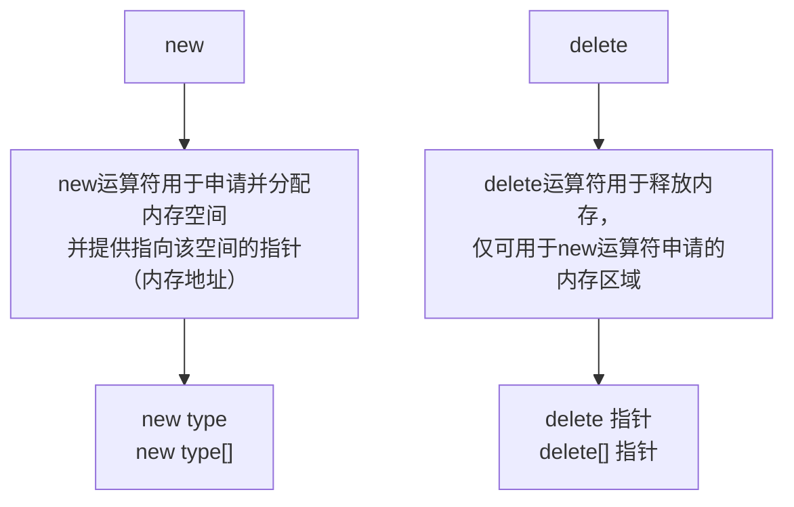
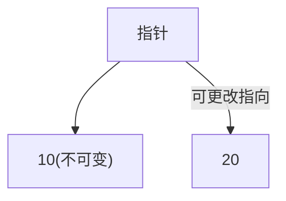
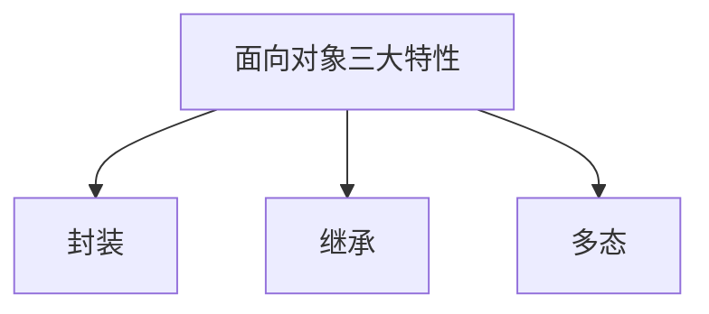

# 特殊数据类型
## 结构体
结构体是用户自定义的数据类型，允许用户存储不同的数据类型。

`struct 结构体名 {结构体成员列表};`

```c++
struct Student
{
    string name;
    int age;
    double score;
};
int main()
{
	// 在 C++11 及之后，可以使用列表初始化：
    Student s1 = {"Tom", 20, 88.5};
    Student s2 = {"Jerry", 22, 92.5};
}
```

- 结构体变量通过 `.` 运算符访问其成员，例如 `s1.id` 就是访问 `s1` 的 `id` 成员。
- 结构体的大小取决于其所有成员变量在内存中占用的总空间，可能会因为内存对齐而增大。

在 C++ 中，`struct` 和 `class` 功能相似，但有以下主要区别：
- `struct` 的成员默认访问权限是 `public`。
- `class` 的成员默认访问权限是 `private`。


在 C++ 中，结构体可以包含函数。这一点是 C++ 相对 C 的增强功能，使结构体更加接近类（`class`）。
```cpp
#include <iostream>

struct Rectangle {
    int width, height;

    int area() { // 计算面积
        return width * height;
    }

    int perimeter() { // 计算周长
        return 2 * (width + height);
    }
};

int main() {
    Rectangle rect = {10, 5};
    std::cout << "Area: " << rect.area() << ", Perimeter: " << rect.perimeter() << "\n";

    return 0;
}
```

C++ 的结构体可以有构造函数，这样可以更方便地初始化成员变量。
C++ 会根据需要为结构体生成默认构造函数和拷贝构造函数。

| 特性     | C++ 结构体（struct） | C++ 类（class） |
| ------ | --------------- | ------------ |
| 默认访问控制 | `public`        | `private`    |
| 面向对象特性 | 支持构造函数、成员函数和继承  | 支持完全的 OOP 特性 |
| 语义重点   | 更强调数据结构         | 更强调抽象与封装     |


## 函数
标准做法是：创建后缀名为. H 的头文件，在里面写函数的声明；创建后缀名为. Cpp 的源文件，在里面写函数的定义。最后在源文件中使用 `#include ""` 包含头文件。

```c++
返回值类型 函数名 (参数列表)
{

}
```

---
==函数声明==
函数声明可以提前告诉编译器函数的存在，若函数定义在 main 函数的后面，可以使用函数声明避免报错。

```c++
int max(int a,int b);//函数声明
int main()
{
    
}
int max(int a,int b)//函数定义
{
    ...
}
```

声明可以有多次，但是定义只能有一次。


---
==参数==
形式参数：在函数定义时被指定，在函数内部使用。
实际参数：调用函数时在函数外部传入的参数。

```C++
int add(int a, int b)
{
   return a + b;
}//a 和 b是形参

add(5, 10);//5 和 10 是实参
```

形参是实参的内容拷贝，在内存中有自己的存储空间，形参和实参的存储空间是彼此独立的。
值传递就是函数调用时实参将数值传入给形参。
值传递时，如果形参发生改变，并不会影响实参。
想要改变传入的实参，可以使用指针。

在 C++中，函数的形参列表中的形参是可以有默认值的。
语法：` 返回值类型  函数名 （参数= 默认值）{}`

> [!caution]
>
> 默认参数必须是最后几个参数。
>
> 函数的声明和实现只能有一个默认参数。


C++中函数的形参列表里可以有占位参数，用来做占位，调用函数时必须填补该位置
语法： `返回值类型 函数名 (数据类型){}`

----
==函数重载==
C++中允许同一个作用域下的函数名相同，函数参数类型不同或个数不同或顺序不同，从而提高复用性。（<u>函数返回值必须相同</u>）

```c++
//函数重载注意事项
//1、引用作为重载条件
void func(int &a)
{
	cout << "func (int &a) 调用 " << endl;
}
void func(const int &a)
{
	cout << "func (const int &a) 调用 " << endl;
}

//2、函数重载碰到函数默认参数
void func2(int a, int b = 10)
{
	cout << "func2(int a, int b = 10) 调用" << endl;
}
void func2(int a)
{
	cout << "func2(int a) 调用" << endl;
}
int main() {
	int a = 10;
	func(a); //调用无const
	func(10);//调用有const
	//func2(10); //碰到默认参数产生歧义，需要避免
	system("pause");
	return 0;
}
```

---
==内联函数==
内联函数是一种特殊的函数，需要使用 `inline` 关键字对函数进行声明或定义。
主要作用是告诉编译器，在调用该函数时，将函数的代码直接插入到调用函数的位置，而不是执行常规的函数调用流程。
这样做的目的是减少函数调用的开销，主要用于小型的、频繁调用的函数。

>[!tip] 
>函数调用的开销涉及到压栈、跳转、返回等操作，而内联函数通过将函数代码插入到调用点来避免这些开销。

```C++
inline int add (int a, int b)
{
   return a + b;
}
```

>[!tip] 
>递归函数不能内联
>大型函数不适合内联 (涉及到循环或分支语句)
>内联函数的调用会带来代码膨胀 (即增大可执行文件的体积)
> 如果函数过于复杂，即便使用了内联关键字，编译器也可能忽视它

---
==Lambda 函数==
C++11 提供了对匿名函数的支持, 称为 Lambda 函数 (也叫 Lambda 表达式)。
Lambda 表达式把函数看作对象。Lambda 表达式可以像对象一样使用，比如可以将它们赋给变量和作为参数传递，还可以像函数一样对其求值。
Lambda 表达式本质上与函数声明非常类似。Lambda 表达式具体形式如下:
`[capture](parameters)->return-type{body}`

-  `[capture]`：捕捉列表。捕捉列表总是出现在 lambda 表达式的开始处。事实上，`[]` 是 lambda 引出符。编译器根据该引出符判断接下来的代码是否是 lambda 函数。捕捉列表能够捕捉上下文中的变量供 lambda 函数使用。
```cpp
int x = 10, y = 20;

// 1. 值捕获 [=]（按值捕获所有外部变量）
auto func1 = [=]() { 
    return x + y;  // x和y的副本
};
// 注意：后续修改x不会影响func1中的值

// 2. 引用捕获 [&]（按引用捕获所有外部变量）
auto func2 = [&]() { 
    return x + y;  // x和y的引用
};
// 后续修改x会影响func2的结果

// 3. 混合捕获
int a = 1, b = 2, c = 3;
auto func3 = [=, &a]() {  // a按引用，b和c按值
    return a + b + c;  // a可以修改，b和c是副本
};

auto func4 = [&, a]() {  // a按值，b和c按引用
    return a + b + c;  // a是副本，b和c可以修改
};

// 4. 具体变量捕获
auto func5 = [x, &y]() {  // x按值，y按引用
    return x + y;  // x是副本，y是引用
};

// 5. this指针捕获（类成员函数中）
class MyClass {
    int value = 42;
public:
    void foo() {
        auto lambda = [this]() {
            return this->value;  // 正确：捕获this
        };
        // auto bad = [=]() { return value; };  // C++20前错误
    }
};

// 6. 初始化捕获（C++14）
int i = 10;
auto func6 = [value = i + 5]() {  // 用i+5初始化value
    return value * 2;  // 返回30
};

// 7. 通用lambda捕获（C++14）
std::unique_ptr<int> ptr(new int(42));
auto func7 = [p = std::move(ptr)]() {  // 移动捕获
    return *p;
};
```
-  `(parameters)`：参数列表。与普通函数的参数列表一致。如果不需要参数传递，则可以连同括号 () 一起省略。
```cpp
// 无参数
auto f1 = []() { return 42; };

// 带参数
auto add = [](int a, int b) { return a + b; };
auto concat = [](const std::string& s1, const std::string& s2) {
    return s1 + s2;
};

// 可变参数模板（C++14）
auto variadic = [](auto... args) {
    return (args + ...);  // C++17折叠表达式
};
```
-  `mutable`：mutable 修饰符。默认情况下，lambda 函数总是一个 const 函数，mutable 可以取消其常量性。在使用该修饰符时，参数列表不可省略（即使参数为空）。
```cpp
int count = 0;

// 无mutable：错误！
// auto increment1 = [count]() { count++; };  // 编译错误

// 有mutable：正确
auto increment2 = [count]() mutable { 
    count++;  // 修改的是副本
    return count;
};

cout << increment2();  // 1
cout << increment2();  // 2
cout << count;         // 0（原值不变）
```
-  `->return_type`：返回类型。用追踪返回类型形式声明函数的返回类型。出于方便，不需要返回值的时候也可以连同符号 -> 一起省略。此外，在返回类型明确的情况下，也可以省略该部分，让编译器对返回类型进行推导。
-  `{statement}`：函数体。内容与普通函数一样，不过除了可以使用参数之外，还可以使用所有捕获的变量。

在 lambda 函数的定义式中，参数列表和返回类型都是可选部分，而捕捉列表和函数体都可能为空，C++ 中最简单的 lambda 函数只需要声明为：`[]{};`

```cpp
// ✅ 推荐的写法

// 1. 使用auto推导类型
auto good_lambda = [](auto x) { return x * 2; };

// 2. 最小化捕获范围
int important = 42;
std::string name = "test";
auto specific = [important, &name]() { 
    // 只捕获需要的变量
    return name + std::to_string(important); 
};

// 3. 明确mutable使用
int counter = 0;
auto incrementer = [counter]() mutable {
    return ++counter;  // 明确使用mutable
};

// 4. 优先使用值捕获（除非需要修改外部变量）
auto safe = [value = compute_value()]() {
    return process(value);  // value是副本
};

// 5. 对于复杂Lambda，考虑使用具名函数
auto complex_operation = [](const Data& data) -> Result {
    // 复杂逻辑...
    if (data.valid()) {
        // 更多处理...
        return data.process();
    }
    return Result{};
};

// ❌ 避免的写法

// 1. 不必要的引用捕获
int x = 5, y = 10;
auto bad1 = [&]() { return x + y; };  // 可能悬空引用

// 2. 捕获大对象按值
BigObject obj;  // 很大
auto bad2 = [obj]() { /* 使用obj */ };  // 昂贵拷贝

// 3. 在多次调用的循环中使用动态分配的Lambda
for (int i = 0; i < 1000; i++) {
    auto bad3 = std::make_unique<std::function<void()>>([]() {
        // 动态分配带来开销
    });
}

// 4. Lambda过长（超过20行应提取为函数）
auto too_long = []() {
    // 50行代码... 应该重构！
};
```

# 指针
指针是一个变量，它存储了另一个变量在内存中的地址。通过指针，可以间接访问和操作目标变量的值。
- 声明指针： 使用星号（`*`）来声明一个变量为指针类型。
- 取地址符： 用符号 `&` 取得变量的内存地址。
- 解引用符： 用符号 `*` 取得指针指向的值。

所有指针的值的实际数据类型，不管是整型、浮点型、字符型，还是其他的数据类型，都是一样的，都是一个<u>代表内存地址的长的十六进制数</u>。不同数据类型的指针之间唯一的不同是，指针所指向的变量或常量的数据类型不同。

```c
// 不同的指针声明方式
int *ptr1;           // 指向 int 的指针
int* ptr2;           // 另一种写法，效果相同
int *ptr3, var;      // ptr3 是指针，var 是普通变量
int* ptr4, var2;     // ptr4 是指针，var2 是普通变量（容易混淆！）

// 正确的初始化
int value = 100;
int *ptr = &value;    // & 取地址运算符
int *null_ptr = NULL; // 空指针
```

C 语言中，字节是内存层面的最小逻辑单位。在 C 标准 (C 89、C 99、C 11) 中，`1 字节` 的大小通过 `sizeof(char)` 定义。每个 `char` 变量占据 1 字节。事实上，`sizeof(char)` 始终等于 1。

内存中的<u>每个字节都拥有一个地址</u>，C 语言中的任何变量（不管是基本变量还是复合变量如结构体）的指针，指向的就是变量第一个字节的地址。指针通过这个起始地址，可以根据数据类型访问变量占用内存的完整范围。
- 一个变量在内存中占据的空间是连续的。例如，`int` 类型可能占据 4 个字节（具体取决于系统和编译器）。变量的地址指向的是它占用内存空间的第一个字节。
- 指针存储的是变量的地址，即第一个字节的地址。
- 对于占用多个字节的复杂变量，例如结构体，指针同样指向结构体变量在内存的第一个字节地址。


假如有一个指向变量或数组的指针，偏移量的单位也是以字节为基础，但实际偏移量根据指针的类型解释。
- 对于 `char*` 类型指针： 偏移 1 即指向下一个字节。
- 对于 `int*` 类型指针： 偏移 1 其实指向所在平台 `sizeof(int)` 的字节数。例如，偏移 1 表示跳过 4 个字节（假设 `int` 在该平台占 4 字节）。
```c
#include <stdio.h>

int main() {
    int arr[3] = {10, 20, 30};
    int* p = arr;

    printf("p = %p\n", (void*)p);
    printf("p + 1 = %p\n", (void*)(p + 1));  // 偏移 4 字节（假设 sizeof(int) = 4）
    return 0;
}
```

```
p = 0x7ffd1234
p + 1 = 0x7ffd1238
```


> [!note] 
> 在大多数现代计算机中，为了性能优化，通常会对数据进行内存对齐。内存对齐可能会导致某些变量的起始地址并不是字节连续依次排列（特别是在结构体中或对齐约束严格的平台上），不过指针仍然总是指向第一个有效字节。


> [!caution] 
> 如果指针变量类型和存储的变量类型不一致，那么之后就无法准确地读取对应个数个内存单元来获取其中的内容。


## 指针与数组
在 C 语言中，数组名本质上是一个<u>指向数组中首元素的指针</u>。
```c
int arr[5] = {10, 20, 30, 40, 50};
printf("Address of arr: %p\n", arr);    // arr 是数组首元素的地址
printf("Address of arr[0]: %p\n", &arr[0]);  // &arr[0] 也是首元素的地址
```

```
Address of arr: 0x7ffdec1b2430
Address of arr[0]: 0x7ffdec1b2430
```

`arr` 等价于 `&arr[0]`，它表示数组中第一个元素的地址。但注意：`arr` 和 `&arr` 并不完全一样，后者是整个数组的地址，区别在指针类型上：

|表达式|含义|类型|
|---|---|---|
| `arr` |数组首元素的地址，等价于 `&arr[0]` | `int*` |
| `&arr` |整个数组的地址，表示 `arr` 本身的起始地址，但语义上“大小”的概念不同| `int (*)[5]` |

数组名可以直接用作指针，进行指针的操作。例如：
```c
int arr[5] = {10, 20, 30, 40, 50};

int* p = arr;  // p 指向数组的首元素
printf("%d\n", *p);      // 输出 10
printf("%d\n", *(p + 1));  // 输出 20
```
- `arr` 表示的是首元素的地址。
- 把 `arr` 赋值给 `p` 后，`p` 就是一个指针，指向数组的第一个元素。
- 通过 `*(p + n)` 可以访问数组的第 `n` 个元素。
- 数组的下标访问（如 `arr[i]`）实际上是通过指针偏移实现的。
- 表达式 `arr[i]` 等价于 `*(arr + i)`，两个意思完全一样。


## 指针与结构体
我们可以定义一个结构体指针来存储结构体变量的地址，并通过它来间接访问结构体的成员。
```c
struct Student s1 = {101, "Alice", 95.5};  // 初始化结构体变量
struct Student* p = &s1;                   // 指针指向结构体变量

printf("ID: %d\n", p->id);  // 通过指针访问结构体成员
```
- `&s1` 获取 `s1` 的地址。
- `p` 是一个指向 `struct Student` 类型的指针。
- 通过 `->` 操作符，访问指针指向结构体变量的成员（简化了 `(*p).id` 语法）。

在某些情况下，例如当数组的大小不确定时，可以使用指针和动态分配来生成结构体实例。例如：
```c
#include <stdio.h>
#include <stdlib.h>  // 包含 malloc 和 free 的库

struct Student {
    int id;
    char name[50];
    float score;
};

int main() {
    // 动态分配结构体
    struct Student* p = (struct Student*)malloc(sizeof(struct Student));

    if (p == NULL) {
        printf("Memory allocation failed!\n");
        return 1;
    }

    // 使用指针访问分配的结构体
    p->id = 101;
    sprintf(p->name, "Alice");
    p->score = 95.5;

    printf("ID: %d, Name: %s, Score: %.2f\n", p->id, p->name, p->score);

    // 释放动态分配的内存
    free(p);
    return 0;
}
```
1. `malloc` 动态分配内存，大小为 `struct Student` 所需的字节数。
2. 返回的指针保存到变量 `p` 中，用来访问分配的结构体。（记得释放内存！）


## 指针与函数
函数参数的传递分两种方式：

1. 值传递：将实参的值拷贝给形参，函数内部的修改不会影响外部变量。
2. 地址传递（通过指针）：将变量的地址传给函数，函数内部修改会直接作用到原变量。


---
**指针作为函数参数**
指针作为函数参数主要用于：
- 修改函数外部的变量值。
- 传递大数据（例如数组、结构体）的地址，用于节省内存和性能开销。

修改外部变量的值：
```c
#include <stdio.h>

// 定义通过指针修改变量的函数
void updateValue(int* p) {
    *p = 42;  // 通过指针修改变量的值
}

int main() {
    int a = 10;
    printf("Before update: %d\n", a);

    updateValue(&a);  // 将变量的地址传递给函数
    printf("After update: %d\n", a);

    return 0;
}
```
1. `updateValue` 接收一个指针参数 (`int* p`)，表示一个 `int` 类型变量的地址。
2. 函数内部，通过 `*p` 修改了指针指向变量的值。
3. 在 `main` 函数中，直接将变量的地址传递给函数。
```c
Before update: 10
After update: 42
```

传递数组（数组作为指针）：
在 C 语言中，数组名可以视为指向数组首元素的指针，因此传递数组时，实际上是传递了数组首地址。
```c
#include <stdio.h>

void printArray(int* arr, int size) { // 等价于 int arr[]
    for (int i = 0; i < size; i++) {
        printf("%d ", arr[i]);
    }
    printf("\n");
}

int main() {
    int arr[] = {1, 2, 3, 4, 5};
    int size = sizeof(arr) / sizeof(arr[0]);

    printArray(arr, size);  // 传递数组首地址
    return 0;
}
```

传递结构体指针：
将结构体的指针传给函数是处理大型数据的高效方式：
```c
#include <stdio.h>

struct Point {
    int x, y;
};

// 定义函数，接受结构体指针
void movePoint(struct Point* p, int dx, int dy) {
    p->x += dx;
    p->y += dy;  // 修改结构体成员
}

int main() {
    struct Point p1 = {10, 20};

    printf("Before move: (%d, %d)\n", p1.x, p1.y);

    movePoint(&p1, 5, -3);  // 传递结构体指针
    printf("After move: (%d, %d)\n", p1.x, p1.y);

    return 0;
}
```

```
Before move: (10, 20)
After move: (15, 17)
```

---
**函数指针**
函数指针是指向函数的一种指针变量。它存储一个函数的入口地址，可以通过它间接调用函数。
```c
return_type (*pointer_name)(parameter_list);
```
- `return_type`：函数的返回类型。
- `pointer_name`：指针名字。
- `parameter_list`：函数的参数列表。

```c
#include <stdio.h>

// 定义一个普通函数
int add(int a, int b) {
    return a + b;
}

int main() {
    // 定义函数指针
    int (*func_ptr)(int, int);

    // 将函数地址赋值给指针
    func_ptr = &add;  // `add` 的地址可以省略 `&`

    // 通过指针调用函数
    int result = func_ptr(3, 5);
    printf("Result: %d\n", result);

    return 0;
}
```
1. `int (*func_ptr)(int, int)` 定义了一个指向返回值为 `int`、有两个 `int` 参数的函数指针。
2. `func_ptr = &add` 表示将函数 `add` 的地址赋值给 `func_ptr`。
3. 使用 `func_ptr(3, 5)` 调用 `add` 函数。
```
Result: 8
```

通过函数指针可以实现类似面向对象的多态：
```c
#include <stdio.h>

// 定义不同的操作函数
int add(int a, int b) { return a + b; }
int subtract(int a, int b) { return a - b; }
int multiply(int a, int b) { return a * b; }

// 定义一个可以传递函数指针的通用函数
int calculate(int x, int y, int (*operation)(int, int)) {
    return operation(x, y);  // 执行函数
}

int main() {
    printf("Add: %d\n", calculate(10, 5, add));           // 调用 add
    printf("Subtract: %d\n", calculate(10, 5, subtract)); // 调用 subtract
    printf("Multiply: %d\n", calculate(10, 5, multiply)); // 调用 multiply

    return 0;
}
```
- `calculate` 函数接收两个整数和一个函数指针作为参数。
- 函数指针可以指向不同的操作函数，实现类似多态的效果。
```
Add: 15
Subtract: 5
Multiply: 50
```


函数指针可以组成数组，用来保存一组函数的地址，从而实现更加灵活的调用。
```c
#include <stdio.h>

// 定义若干函数
int add(int a, int b) { return a + b; }
int subtract(int a, int b) { return a - b; }
int multiply(int a, int b) { return a * b; }

int main() {
    // 定义函数指针数组
    int (*operations[3])(int, int) = {add, subtract, multiply};

    int x = 10, y = 5;

    printf("Add: %d\n", operations[<sup>1</sup>](x, y));       // 调用 add
    printf("Subtract: %d\n", operations[<sup>1</sup>](x, y)); // 调用 subtract
    printf("Multiply: %d\n", operations[<sup>1</sup>](x, y)); // 调用 multiply

    return 0;
}
```

```
Add: 15
Subtract: 5
Multiply: 50
```

C 标准库的 `qsort` 函数接受一个函数指针参数，用于对数据进行比较。
```c
#include <stdio.h>
#include <stdlib.h>

// 辅助比较函数
int compare(const void* a, const void* b) {
    return (*(int*)a - *(int*)b);  // 升序排序：返回两元素差值
}

int main() {
    int arr[] = {32, 71, 12, 45, 26};
    int size = sizeof(arr) / sizeof(arr[0]);

    // 使用 qsort 并传递比较函数
    qsort(arr, size, sizeof(int), compare);

    for (int i = 0; i < size; i++) {
        printf("%d ", arr[i]);  // 输出排序后的结果
    }

    return 0;
}
```

## 空指针  
野指针指被声明了但没有初始化（赋值）的指针，这个指针会指向随机的内存空间，使用它可能会造成问题。
为避免野指针，应养成良好习惯，及时初始化，或者将指针置为空指针

```
//NULL是C++内置的宏，表示空
int *p = NULL;
//nullptr是C++11标准引入的关键字，表示指针为空
int *p = nullptr;
```

空指针不指向任何地方，也就没有了安全问题。
空指针只是延迟赋值时使用的，应当尽快赋值，否则没有任何意义。

## C++指针  
**动态内存分配**
C++中，变量、数组等对象的创建是由 C++自动分配内存的，称之为静态内存分配。

静态内存分配，无垃圾回收机制，因此我们需要手动管理内存。



```c++
    int *r = new int;
    *r = 100;
    delete r;
```

动态管理内存可能会造成指针悬挂问题，即指针指向区域已经被回收。

---
**常量指针**
- 指向 const 的指针，表示指向区域的数据，是不变的，但可以更换指向。



```c++
const 数据类型 *指针;
数据类型 const *指针;
```

- `const` 指针，表示指针本身不可更改，但是指向的数据可以更改。

```c++
数据类型 *const 指针 = 地址;//必须初始化地址，因为指针不可更改
```

- 指向 const 的 const 指针，指针和指向区域的值都不可以更改。


# 动态内存管理
动态内存管理指的是在程序运行时，通过操作系统从堆区（Heap）申请内存，而不是在编译时通过栈等自动管理内存空间。这种动态分配的内存需要程序员手动管理，包括<u>分配和释放</u>。
- 静态内存分配：
    - 编译时分配，例如栈上的局部变量和全局变量。
    - 内存空间自动回收，例如函数调用结束时栈上的局部变量释放。
    - 静态分配不灵活，因为在编译时必须确定内存大小。
- 动态内存分配：
    - 在程序运行时分配，适合大小不确定的场景。
    - 由程序员显示地申请和释放内存。
    - 使用堆内存，程序员需要负责避免内存泄漏和悬挂指针等问题。

## 内存分区模型
C++程序执行时，将内存大方向划分为四个区域：


代码区存放<u>函数体和指令段的二进制代码</u>，由操作系统进行管理。
全局区存放<u>全局变量</u>和<u>静态变量</u>以及<u>常量</u>。
栈区由编译器自动分配释放，存放函数体的参数值、局部变量等。
堆区由程序员分配和释放，若程序员不释放，程序结束时由操作系统回收。

不同区域存放区域，可以赋予不同的生命周期。

**程序执行前**
在程序编译后，生成了 exe 可执行程序，未执行该程序前分为两个区域
​==代码区==：
​		存放 CPU 执行的机器指令
​		代码区是共享的，共享的目的是对于频繁被执行的程序，只需要在内存中有一份代码即可
​		代码区是<u>只读</u>的，使其只读的原因是防止程序意外地修改了它的指令
​==全局区==：
​		全局变量和静态变量存放在此.
​		全局区还包含了常量区, 字符串常量和其他常量也存放在此.
​		<u>该区域的数据在程序结束后由操作系统释放</u>.

**程序执行后**
​==栈区==：
​		由编译器自动分配释放, 存放函数的参数值, 局部变量等
​		注意事项：不要返回局部变量的地址，栈区开辟的数据由编译器自动释放
==堆区==：
​		由程序员分配释放, 若程序员不释放, 程序结束时由操作系统回收
​		在 C++中主要利用 new 在堆区开辟内存


例子：
```cpp
int main() {  
    int a = 5;  
    int b = 10;  
    std::cout << &a << std::endl; // Print address of a  
    std::cout << &b << std::endl; // Print address of b  
    // 局部变量的地址通常在栈上分配, 地址值从高到低增长, 差值通常为4或8个字节, 取决于系统架构.  
    return 0;  
}
```
输出：
```
0xe383fffb9c
0xe383fffb98
// 差值为4, 
```

## C 语言内存管理
在 C 中，动态内存管理主要依赖标准库中的 `<stdlib.h>` 提供的动态内存操作函数，分别是 `malloc`、`calloc`、`realloc` 和 `free`。

`malloc` (memory allocate)
函数原型：
```cpp
void* malloc(size_t size);
```
作用：
- 从堆内存分配指定大小的连续内存块，返回指向内存块起始地址的指针。
- 分配后的内存未初始化（可能包含垃圾值）。
返回值：
- 成功分配时，返回指向分配内存的指针。
- 如果失败（如内存不足），返回 `NULL`。

---
`calloc` (contiguous allocate)
函数原型：
```cpp
void* calloc(size_t num, size_t size);
```
作用：
- 分配指定数量块的内存，每块大小为 `size` 字节，并初始化为 0。
与 `malloc` 区别：
- 内存分配后自动初始化为 `0`。
- 参数为两个：块的数量和每块的大小。

---
`realloc` (resize memory allocation)
函数原型：
```cpp
void* realloc(void* ptr, size_t new_size);
```
作用：
- 调整已分配的内存块大小。
- 如果扩展时当前内存块不足够，则可能会分配新的内存并将原有数据复制到新内存区域。

---
`free`
```cpp
void free(void* ptr);
```
作用：
- 释放由 `malloc`、`calloc` 或 `realloc` 分配的内存。
- 避免内存泄漏。

## C++内存管理
在 C++ 中，动态内存管理有自己的关键字：`new` 和 `delete`，它们提供更高级别的抽象，可以代替 C 风格的动态内存管理函数。

`new`
语法：
```cpp
类型* p = new 类型;
类型* p = new 类型[数组大小];
```
作用：
- 从堆分配内存空间。
- 分配时自动调用构造函数来初始化对象。
返回值：
- 返回指向所分配内存的指针，如果分配失败会抛出异常 `std::bad_alloc`。

---
`delete`
语法：
```cpp
delete p;       // 释放单个对象
delete[] arr;  // 释放数组
```
作用：
- 释放通过 `new` 或 `new[]` 分配的内存。
- 自动调用类的析构函数。


示例：
```cpp
int* arr = new int[5];  // 分配一个包含 5 个 int 的数组
for (int i = 0; i < 5; i++) {
    arr[i] = i * 10;    // 初始化
}
delete[] arr;          // 释放数组内存
```

## C++智能指针
智能指针是 C++11 引入的一种模板类，用于自动管理动态分配的内存，避免内存泄漏和悬挂指针等问题。智能指针通过重载运算符，使得它们可以像普通指针一样使用，同时在适当的时候自动释放内存。
C++ 标准库提供了三种主要的智能指针类型：
- `std::unique_ptr`： 独占所有权的智能指针，不能被复制，只能移动。适用于单一所有权场景。
- `std::shared_ptr`： 共享所有权的智能指针，多个指针可以指向同一个对象，通过引用计数来管理对象的生命周期。
- `std::weak_ptr`： 弱引用智能指针，不拥有对象的所有权，通常与 `std::shared_ptr` 一起使用，防止循环引用。

创建智能指针的语法如下：
```cpp
std::unique_ptr<类型> ptr1(new 类型(参数)); // 创建 unique_ptr
std::shared_ptr<类型> ptr2(new 类型(参数)); // 创建 shared_ptr
std::weak_ptr<类型> ptr3 = ptr2; // 创建 weak_ptr
```

三种指针对比如下表：
| 智能指针类型      | 所有权类型   | 复制行为       | 适用场景                     |
|------------------|--------------|----------------|------------------------------|
| `std::unique_ptr` | 独占所有权   | 不能复制，只能移动 | 适用于单一所有权的对象管理     |
| `std::shared_ptr` | 共享所有权   | 可以复制，引用计数增加 | 适用于多个指针共享同一对象     |
| `std::weak_ptr`   | 弱引用       | 可以复制，不影响引用计数 | 适用于防止循环引用的场景       |


三种智能指针的使用示例：
```cpp
#include <iostream>
#include <memory>
int main() {
	// unique_ptr 示例
	std::unique_ptr<int> uptr(new int(42));
	std::cout << "Unique Pointer Value: " << *uptr << std::endl;

	// shared_ptr 示例
	std::shared_ptr<int> sptr1(new int(100));
	std::shared_ptr<int> sptr2 = sptr1; // 共享所有权
	std::cout << "Shared Pointer Value: " << *sptr1 << ", Ref Count: " << sptr1.use_count() << std::endl;

	// weak_ptr 示例
	std::weak_ptr<int> wptr = sptr1; // 不增加引用计数
	if (auto spt = wptr.lock()) { // 检查对象是否还存在
		std::cout << "Weak Pointer Value: " << *spt << std::endl;
	} else {
		std::cout << "Object has been deleted." << std::endl;
	}

	return 0;
}
```

对比传统指针，智能指针的优势在于：
- 自动内存管理： 智能指针在超出作用域时自动释放内存，减少内存泄漏风险。
- 安全性： 智能指针通过引用计数等机制，避免悬挂指针和重复释放等问题。
- 语义清晰： 智能指针的类型明确表达了所有权关系，代码更易读懂。


# 引用
引用变量是一个别名，也就是说，它是某个已存在变量的另一个名字。一旦把引用初始化为某个变量，就可以使用该引用名称或变量名称来指向变量。

语法： `数据类型 &别名 = 原名`

> [!CAUTION]
> 引用在定义时必须初始化，并且一旦初始化后将永久绑定到其初始化时的变量，不能更改指向。

## 引用的使用场景
**引用作函数参数**
函数传参时，可以利用引用的技术让形参修饰实参，这样可以简化指针修改实参。

```c++
void mySwap03(int& a, int& b) {
	int temp = a;
	a = b;
	b = temp;
}
int main() {

	int a = 10;
	int b = 20;
	mySwap03(a, b);
	cout << "a:" << a << " b:" << b << endl;
	system("pause");
	return 0;
}
```

---
**引用作函数返回值**

引用是可以作为函数的返回值存在的

> [!CAUTION]
>
> 不要返回局部变量的引用
>
> 函数的调用可以作为左值

```c++
//返回局部变量引用
int& test01() {
    int a = 10; //局部变量
    return a;
}
//返回静态变量引用
int& test02() {
    static int a = 20;
    return a;
}
int main() {
    //不能返回局部变量的引用
    int& ref = test01();
    cout << "ref = " << ref << endl;
    cout << "ref = " << ref << endl;
    //如果函数做左值，那么必须返回引用
    int& ref2 = test02();
    cout << "ref2 = " << ref2 << endl;
    cout << "ref2 = " << ref2 << endl;
    test02() = 1000;
    cout << "ref2 = " << ref2 << endl;
    cout << "ref2 = " << ref2 << endl;
    system("pause");
    return 0;
}
```

## 引用的本质
引用的本质在 C++内部实现是一个指针常量。

```c++
//发现是引用，转换为 int* const ref = &a;
void func(int& ref){
    ref = 100; // ref是引用，转换为*ref = 100
}
int main(){
    int a = 10;
    //自动转换为 int* const ref = &a; 指针常量是指针指向不可改，也说明为什么引用不可更改
    int& ref = a; 
    ref = 20; //内部发现ref是引用，自动帮我们转换为: *ref = 20;
    cout << "a:" << a << endl;
    cout << "ref:" << ref << endl;
    func(a);
    return 0;
}
```

## 常量引用
常量引用主要用于修饰形参，防止误操作。
在函数形参列表中，可以加<u>const 修饰形参</u>，防止形参改变实参。
```c++
#include <iostream>
using namespace std;

void printNumber(const int &num) {
    // num = 10; // 错误！const 引用变量不可修改
    cout << "num: " << num << endl;
}

int main() {
    int a = 42;
    printNumber(a);  // 输出：num: 42
    return 0;
}
```

# 类和对象



## 封装
封装可以将属性和行为作为一个整体，并加以权限控制。

类在设计时，可以把属性和行为放在不同的权限下，加以控制
访问权限有三种：

|           |          |                      |
| --------- | -------- | -------------------- |
| public    | 公共权限 | 类内类外均可访问     |
| protected | 保护权限 | 只能在类及子类内访问 |
| private   | 私有权限 | 只能在类内访问       |

在 C++中 struct 和 class 唯一的区别就在于 <u>默认的访问权限不同</u>
-  struct 默认权限为公共
-  class   默认权限为私有

## 对象的初始化和清理
### 构造函数和析构函数
对象的初始化和清理也是两个非常重要的安全问题
​	一个对象或者变量没有初始状态，对其使用后果是未知
​	同样的使用完一个对象或变量，没有及时清理，也会造成一定的安全问题


C++利用了构造函数和析构函数解决上述问题，这两个函数将会被编译器自动调用，完成对象初始化和清理工作。
对象的初始化和清理工作是编译器强制要我们做的事情，因此如果我们不提供构造和析构，编译器会提供。
编译器提供的构造函数和析构函数是空实现。
* 构造函数：主要作用在于创建对象时为对象的成员属性赋值，构造函数由编译器自动调用，无须手动调用。
* 析构函数：主要作用在于对象销毁前系统自动调用，执行一些清理工作。

构造函数语法：`类名(){}`
1. 构造函数，没有返回值也不写 void
2. 函数名称与类名相同
3. 构造函数可以有参数，因此可以发生重载
4. 程序在调用对象时候会自动调用构造，无须手动调用, 而且只会调用一次

>[!note]
> explicit 通常用来修饰<u>单参数</u>构造函数或者只有一个参数可以通过默认值提供的构造函数（这种构造函数容易被编译器进行隐式调用），以防止隐式类型转换。

```cpp
#include <iostream>
class MyClass {
public:
    explicit MyClass(int value) : data(value) {}

    void show() {
        std::cout << "Data: " << data << std::endl;
    }

private:
    int data;
};

int main() {
    MyClass obj1(42);       // 正确，显式调用构造函数
    // MyClass obj2 = 42;   // 错误，隐式调用被禁止
    obj1.show();

    return 0;
}
```


析构函数语法： `~类名(){}`
1. 析构函数，没有返回值也不写 void
2. 函数名称与类名相同, 在名称前加上符号  ~
3. 析构函数不可以有参数，因此不可以发生重载
4. 程序在对象销毁前会自动调用析构，无须手动调用, 而且只会调用一次


**构造函数的分类及调用**
两种分类方式：
​	按参数分为： 有参构造和无参构造
​	按类型分为： 普通构造和拷贝构造

三种调用方式：
​	括号法
​	显示法
​	隐式转换法

示例：

```C++
//1、构造函数分类
// 按照参数分类分为 有参和无参构造   无参又称为默认构造函数
// 按照类型分类分为 普通构造和拷贝构造

class Person {
public:
	//无参（默认）构造函数
	Person() {
		cout << "无参构造函数!" << endl;
	}
	//有参构造函数
	Person(int a) {
		age = a;
		cout << "有参构造函数!" << endl;
	}
	//拷贝构造函数
	Person(const Person& p) {
		age = p.age;
		cout << "拷贝构造函数!" << endl;
	}
	//析构函数
	~Person() {
		cout << "析构函数!" << endl;
	}
public:
	int age;
};

//2、构造函数的调用
//调用无参构造函数
void test01() {
	Person p; //调用无参构造函数
}

//调用有参的构造函数
void test02() {

	//2.1  括号法，常用
	Person p1(10);
	//注意1：调用无参构造函数不能加括号，如果加了编译器认为这是一个函数声明
	//Person p2();

	//2.2 显式法
	Person p2 = Person(10); 
	Person p3 = Person(p2);
	//Person(10)单独写就是匿名对象  当前行结束之后，马上析构

	//2.3 隐式转换法
	Person p4 = 10; // Person p4 = Person(10); 
	Person p5 = p4; // Person p5 = Person(p4); 

	//注意2：不能利用 拷贝构造函数 初始化匿名对象 编译器认为是对象声明
	//Person p5(p4);
}

int main() {

	test01();
	//test02();

	system("pause");

	return 0;
}
```


**拷贝构造函数调用时机**
C++中拷贝构造函数调用时机通常有三种情况
* 使用一个已经创建完毕的对象来初始化一个新对象
* 值传递的方式给函数参数传值
* 以值方式返回局部对象

**构造函数调用规则**
默认情况下，c++编译器至少给一个类添加 3 个函数
1．默认构造函数 (无参，函数体为空)
2．默认析构函数 (无参，函数体为空)
3．默认拷贝构造函数，对属性进行值拷贝

构造函数调用规则如下：
* 如果用户定义有参构造函数，c++不在提供默认无参构造，但是会提供默认拷贝构造
* 如果用户定义拷贝构造函数，c++不会再提供其他构造函数

示例：
```C++
class Person {
public:
	//无参（默认）构造函数
	Person() {
		cout << "无参构造函数!" << endl;
	}
	//有参构造函数
	Person(int a) {
		age = a;
		cout << "有参构造函数!" << endl;
	}
	//拷贝构造函数
	Person(const Person& p) {
		age = p.age;
		cout << "拷贝构造函数!" << endl;
	}
	//析构函数
	~Person() {
		cout << "析构函数!" << endl;
	}
public:
	int age;
};

void test01()
{
	Person p1(18);
	//如果不写拷贝构造，编译器会自动添加拷贝构造，并且做浅拷贝操作
	Person p2(p1);

	cout << "p2的年龄为： " << p2.age << endl;
}

void test02()
{
	//如果用户提供有参构造，编译器不会提供默认构造，会提供拷贝构造
	Person p1; //此时如果用户自己没有提供默认构造，会出错
	Person p2(10); //用户提供的有参
	Person p3(p2); //此时如果用户没有提供拷贝构造，编译器会提供

	//如果用户提供拷贝构造，编译器不会提供其他构造函数
	Person p4; //此时如果用户自己没有提供默认构造，会出错
	Person p5(10); //此时如果用户自己没有提供有参，会出错
	Person p6(p5); //用户自己提供拷贝构造
}

int main() {
	test01();
	system("pause");
	return 0;
}
```


### 深拷贝与浅拷贝
浅拷贝：简单的赋值拷贝操作
深拷贝：在堆区重新申请空间，进行拷贝操作

示例：
```C++
class Person {
public:
	//无参（默认）构造函数
	Person() {
		cout << "无参构造函数!" << endl;
	}
	//有参构造函数
	Person(int age ,int height) {
		
		cout << "有参构造函数!" << endl;

		m_age = age;
		m_height = new int(height);
		
	}
	//拷贝构造函数  
	Person(const Person& p) {
		cout << "拷贝构造函数!" << endl;
		//如果不利用深拷贝在堆区创建新内存，会导致浅拷贝带来的重复释放堆区问题
		m_age = p.m_age;
		m_height = new int(*p.m_height);
		
	}

	//析构函数
	~Person() {
		cout << "析构函数!" << endl;
		if (m_height != NULL)
		{
			delete m_height;
		}
	}
public:
	int m_age;
	int* m_height;
};
void test01()
{
	Person p1(18, 180);

	Person p2(p1);

	cout << "p1的年龄： " << p1.m_age << " 身高： " << *p1.m_height << endl;

	cout << "p2的年龄： " << p2.m_age << " 身高： " << *p2.m_height << endl;
}

int main() {

	test01();

	system("pause");

	return 0;
}
```

> 总结：如果属性有在堆区开辟的，一定要自己提供拷贝构造函数，防止浅拷贝带来的问题


### 初始化列表
作用：
C++提供了初始化列表语法，用来初始化属性

语法：`构造函数()：属性1(值1),属性2（值2）... {}`


示例：
```C++
class Person {
public:

	////传统方式初始化
	//Person(int a, int b, int c) {
	//	m_A = a;
	//	m_B = b;
	//	m_C = c;
	//}

	//初始化列表方式初始化
	Person(int a, int b, int c) :m_A(a), m_B(b), m_C(c) {}
	void PrintPerson() {
		cout << "mA:" << m_A << endl;
		cout << "mB:" << m_B << endl;
		cout << "mC:" << m_C << endl;
	}
private:
	int m_A;
	int m_B;
	int m_C;
};

int main() {

	Person p(1, 2, 3);
	p.PrintPerson();


	system("pause");

	return 0;
}
```

## 成员

### 类对象作为类成员
C++类中的成员可以是另一个类的对象，我们称该成员为对象成员

例如：

```C++
class A {}
class B
{
    A a；
}
```


B 类中有对象 A 作为成员，A 为对象成员

那么当创建 B 对象时，A 与 B 的构造和析构的顺序是谁先谁后？

示例：
```C++
class Phone
{
public:
	Phone(string name)
	{
		m_PhoneName = name;
		cout << "Phone构造" << endl;
	}
	~Phone()
	{
		cout << "Phone析构" << endl;
	}
	string m_PhoneName;
};
class Person
{
public:
	//初始化列表可以告诉编译器调用哪一个构造函数
	Person(string name, string pName) :m_Name(name), m_Phone(pName)
	{
		cout << "Person构造" << endl;
	}
	~Person()
	{
		cout << "Person析构" << endl;
	}
	void playGame()
	{
		cout << m_Name << " 使用" << m_Phone.m_PhoneName << " 牌手机! " << endl;
	}
	string m_Name;
	Phone m_Phone;

};
void test01()
{
	//当类中成员是其他类对象时，我们称该成员为 对象成员
	//构造的顺序是 ：先调用对象成员的构造，再调用本类构造
	//析构顺序与构造相反
	Person p("张三" , "苹果X");
	p.playGame();

}
int main() {
	test01();
	system("pause");
	return 0;
}
```


### 静态成员
静态成员就是在成员变量和成员函数前加上关键字 static，称为静态成员
静态成员分为：

*  静态成员变量
   *  所有对象共享同一份数据
   *  在编译阶段分配内存
   *  类内声明，类外初始化
*  静态成员函数
   *  所有对象共享同一个函数
   *  静态成员函数只能访问静态成员变量


示例 1 ： 静态成员变量
```C++
class Person
{
public:
	static int m_A; //静态成员变量
	//静态成员变量特点：
	//1 在编译阶段分配内存
	//2 类内声明，类外初始化
	//3 所有对象共享同一份数据
private:
	static int m_B; //静态成员变量也是有访问权限的
};
int Person::m_A = 10;
int Person::m_B = 10;
void test01()
{
	//静态成员变量两种访问方式
	//1、通过对象
	Person p1;
	p1.m_A = 100;
	cout << "p1.m_A = " << p1.m_A << endl;
	Person p2;
	p2.m_A = 200;
	cout << "p1.m_A = " << p1.m_A << endl; //共享同一份数据
	cout << "p2.m_A = " << p2.m_A << endl;
	//2、通过类名
	cout << "m_A = " << Person::m_A << endl;
	//cout << "m_B = " << Person::m_B << endl; //私有权限访问不到
}

int main() {
	test01();
	system("pause");
	return 0;
}
```


示例 2： 静态成员函数
```C++
class Person
{
public:
	//静态成员函数特点：
	//1 程序共享一个函数
	//2 静态成员函数只能访问静态成员变量
	static void func()
	{
		cout << "func调用" << endl;
		m_A = 100;
		//m_B = 100; //错误，不可以访问非静态成员变量
	}

	static int m_A; //静态成员变量
	int m_B; // 
private:
	//静态成员函数也是有访问权限的
	static void func2()
	{
		cout << "func2调用" << endl;
	}
};
int Person::m_A = 10;


void test01()
{
	//静态成员变量两种访问方式
	//1、通过对象
	Person p1;
	p1.func();
	//2、通过类名
	Person::func();
	//Person::func2(); //私有权限访问不到
}

int main() {
	test01();
	system("pause");
	return 0;
}
```


## 继承
继承是指使用一个已有的类作为基类或父类，通过继承其属性和方法，创建出新的类。新的类称为派生类（Derived Class）。派生类在继承基类的基础上，还可以扩展自己的新功能。

### 继承规则
C++ 支持以下继承类型：
- 单继承（一个派生类从一个基类继承）
- 多继承（一个派生类从多个基类继承）
- 虚继承（解决多继承中的菱形继承问题）

在继承时，可以指定以下三种访问权限：
- public：公有继承，基类的公共和保护成员保持其访问权限，最常用。
- protected：保护继承，基类的公共和保护成员变为派生类中的保护成员。
- private：私有继承，基类的公共和保护成员变为派生类中的私有成员，外界和派生类的子类都无法直接访问这些成员。

继承中的访问控制遵循以下规则：
1. 基类的 public 成员：
- 在公有继承中，派生类的对象可以直接访问。
- 在保护继承或私有继承中，派生类的对象不可直接访问。
2. 基类的 protected 成员：
- 在公有或保护继承中，派生类仍然可以访问。
- 在私有继承中，派生类不能直接访问，但仍然存在于派生类中。
3. 基类的 private 成员：
- 派生类根本无法访问基类的私有成员。


在继承关系中，构造函数和析构函数的调用顺序如下：
- 构造函数调用顺序：先调用基类的构造函数，然后调用派生类的构造函数。
- 析构函数调用顺序：先调用派生类的析构函数，然后调用基类的析构函数。

### 函数的重写和隐藏
在派生类中，可以通过重写（Override）基类的虚函数实现多态，也可以通过定义与基类同名但不同参数的函数隐藏基类函数。

虚函数是实现多态的核心。通过将基类函数定义为 virtual，派生类可以在运行时重写该函数，并通过基类指针或引用调用派生类的重写版本。

- 非虚函数：基类中的普通函数（没有定义为 virtual）在运行时通过静态绑定调用。
- 派生类可重定义：派生类可通过与基类函数同名的函数重定义行为，但不会实现动态绑定。

虚函数有以下特点：
1. 动态绑定：
- 虚函数通过动态绑定（在运行时绑定函数）实现多态行为。
- 基类指针调用时，会在运行时检查指针实际指向的对象类型。
2. 关键字 virtual：
- 虚函数只需在基类中声明为 virtual，派生类函数会自动成为虚函数。
- 必须使用相同的函数名、参数列表来重写。
3. 性能开销：
- 虚函数通过虚函数表（V-Table）实现动态分派，因此会有一定的运行时开销。
- 如果性能敏感，尽量减少虚函数的使用。

| 区别点                   | 普通函数                                  | 虚函数                                  |
|-----------------------------|---------------------------------------------|-------------------------------------------|
| 修饰符                   | 没有 `virtual` 关键字                          | 使用 `virtual` 修饰                         |
| 绑定机制                 | 静态绑定（编译期绑定）                        | 动态绑定（运行时绑定）                      |
| 函数调用关系             | 调用基类的版本                                | 调用实际对象的版本                          |
| 多态支持                 | 不支持多态                                   | 支持多态                                   |
| 虚函数表（V-Table）       | 无                                            | 存在虚函数表，通过虚指针实现                |
| 性能开销                 | 一般无额外开销                                | 有运行时的表查找和指针解引用开销            |
| 用法场景                 | 基类函数无需在派生类中重写时使用普通函数       | 基类声明接口，派生类提供实现               |
| 示例                    | `void display();`                           | `virtual void show();`                    |


派生类中的函数与基类函数具有完全相同的函数原型（函数名、参数类型、返回值），并使用虚函数机制，称为<u>函数覆写</u>。
```cpp
class Base {
public:
    virtual void display() {
        cout << "Base display\n";
    }
};

class Derived : public Base {
public:
    void display() override { // 覆写父类虚函数
        cout << "Derived display\n";
    }
};
```

如果派生类函数名与基类函数名相同，但函数参数不同，则会<u>隐藏</u>基类版本的函数（即使函数是虚函数）。
```cpp
class Base {
public:
    virtual void display() {
        cout << "Base display\n";
    }
};

class Derived : public Base {
public:
    void display(int x) { // 隐藏基类 display()
        cout << "Derived display " << x << '\n';
    }
};

int main() {
    Derived obj;
    obj.display(10); // 会调用派生类的 display(int)
    return 0;
}
```

纯虚函数：声明为 virtual 并赋值为 0 的函数称为纯虚函数。
抽象类：包含至少一个纯虚函数的类称为抽象类，不能直接实例化。


<u>虚函数表</u>是编译器为实现虚函数机制而生成的数据结构。当类中包含虚函数时，类的每个对象会有一个隐藏的指针叫 `vptr`，指向虚函数表。

- 作用：通过 `vptr` 指向虚函数表，运行时查找实际的函数地址以实现动态分派。
- 结构：
  - Base 类和 Derived 类都有自己的虚函数表。
  - 指针动态分派调用函数时，通过访问虚函数表来确定函数地址。

---
在 C++ 11 中，override 明确表示派生类的函数是在覆写基类虚函数，使代码更清晰并减少出错。
```cpp
class Base {
public:
    virtual void func() {}
};

class Derived : public Base {
public:
    void func() override { // 显式标识覆写
        cout << "Derived func\n";
    }
};
```
final 用于禁止派生类覆写基类的虚函数。
```cpp
class Base {
public:
    virtual void func() final {} // 禁止子类覆写
};
```


### 多继承
C++ 支持一个类从多个基类继承，这称为多继承。不过多继承会导致复杂性，比如成员冲突、菱形继承等问题。

菱形继承是指一个类从两个基类继承，而这两个基类又有一个共同的基类，导致继承“菱形结构”。
问题如下：
```cpp
#include <iostream>
using namespace std;

class A {
public:
    int value = 100;
};

class B : public A {};  // 继承 A
class C : public A {};  // 继承 A

class D : public B, public C {};

int main() {
    D obj;
    // cout << obj.value; // 错误：存在歧义
    cout << obj.B::value << '\n'; // 明确从哪个基类访问
    return 0;
}
```
为了解决菱形继承的问题，可以使用虚继承（Virtual Inheritance），确保共同的基类只存在一份实例。

```cpp
class A {
public:
    int value = 100;
};

class B : virtual public A {};
class C : virtual public A {};

class D : public B, public C {};

int main() {
    D obj;
    cout << obj.value; // 不会有歧义
    return 0;
}
```

# 模板
模板是 C++ 提供的一种机制，允许程序员编写与具体类型无关的通用代码。可以将模板视为在编译时生成具体类型代码的「样板」。

模板的两种形式：
- 函数模板：定义通用的函数，能够操作任意类型的数据。
- 类模板：定义通用的数据结构，比如容器类、链表等。

模板支持多参数，允许用户定义多个泛型类型。
模板还支持默认参数，简化调用时的类型指定。
```cpp
template <typename T1 = int, typename T2 = double>
```

C++ 的标准模板库（STL）广泛应用了模板技术，是泛型编程的最佳实践。在日常开发中，大多数泛型需求可以通过 STL 容器和算法满足。

以下是 C++ 模板与 Java/C# 泛型的对比：

| 特性             | C++ 模板                                   | Java / C# 泛型                            |
|----------------------|-----------------------------------------------|----------------------------------------------|
| 实现阶段          | 编译时生成具体类型代码                         | 运行时类型擦除，由 JVM 或 CLR 动态解析         |
| 性能             | 模板实例化是编译期完成的，效率高                 | 泛型由 JVM/CLR 实现，可能存在一定的运行时开销 |
| 类型检查          | 编译时检查，发生类型不匹配时直接报错            | 运行时检查类型安全                            |
| 灵活性           | 模板支持所有类型（原生、用户自定义）             | 泛型受限于类继承体系，不能用于原生类型（Java） |
| 特化（Specialization） | 支持模板的特化，为特定类型实现特殊逻辑           | 泛型无法直接对特殊类型提供特化实现              |

## 函数模板
函数模板适用于编写与数据类型无关的函数。其语法如下：

```cpp
template <typename T>
T functionName(T arg1, T arg2) {
	// 函数体
}
```
这里，`T` 是一个占位符类型，可以在调用函数时指定具体类型。

实例如下：
```cpp
#include <iostream>

// 定义一个函数模板，用于交换两变量
template <typename T>
void swapValues(T& a, T& b) {
    T temp = a;
    a = b;
    b = temp;
}

int main() {
    int x = 10, y = 20;
    double p = 1.5, q = 3.5;

    // 整数交换
    swapValues(x, y);
    std::cout << "x: " << x << ", y: " << y << '\n';

    // 浮点数交换
    swapValues(p, q);
    std::cout << "p: " << p << ", q: " << q << '\n';

    return 0;
}
```

>[!note]
> 模板代码不会直接生成具体代码，只有当函数被调用时，编译器才会依据调用的类型生成具体类型的版本。


## 类模板
类模板用于定义与数据类型无关的类。其语法如下：

```cpp
template <typename T>
class ClassName {
public:
	void memberFunction(T arg) {
		// 函数体
	}
};
```
这里，`T` 是一个占位符类型，可以在创建类的实例时指定具体类型。

- 类模板类似于泛型类，可以根据不同的类型（int、std::string 等）自动实例化为具体的类。
- 模板类实例化是在编译期完成的，因此类型安全，可避免运行时错误。

# 标准库 STL
C++ 标准模板库（Standard Template Library，STL）是一套功能强大的 C++ 模板类和函数的集合，它提供了一系列通用的、可复用的算法和数据结构。
STL 的设计基于泛型编程，这意味着使用模板可以编写出独立于任何特定数据类型的代码。
STL 分为多个组件，包括容器（Containers）、迭代器（Iterators）、算法（Algorithms）、函数对象（Function Objects）和适配器（Adapters）等。

| 组件 | 描述 |
|------|------|
|容器（Containers）	| 容器是 STL 中最基本的组件之一，提供了各种数据结构，包括向量（vector）、链表（list）、队列（queue）、栈（stack）、集合（set）、映射（map）等。这些容器具有不同的特性和用途，可以根据实际需求选择合适的容器。 |
|算法（Algorithms） | STL 提供了大量的算法，用于对容器中的元素进行各种操作，包括排序、搜索、复制、移动、变换等。这些算法在使用时不需要关心容器的具体类型，只需要指定要操作的范围即可。 |
| 迭代器（iterators） | 迭代器用于遍历容器中的元素，允许以统一的方式访问容器中的元素，而不用关心容器的内部实现细节。STL 提供了多种类型的迭代器，包括随机访问迭代器、双向迭代器、前向迭代器和输入输出迭代器等。 |
| 函数对象（Function Objects） | 函数对象是可以像函数一样调用的对象，可以用于算法中的各种操作。STL 提供了多种函数对象，包括一元函数对象、二元函数对象、谓词等，可以满足不同的需求。 |
| 适配器（Adapters） | 适配器用于将一种容器或迭代器适配成另一种容器或迭代器，以满足特定的需求。STL 提供了多种适配器，包括栈适配器（stack adapter）、队列适配器（queue adapter）和优先队列适配器（priority queue adapter）等。 |

## 容器
容器是用来存储数据的序列，它们提供了不同的存储方式和访问模式。

STL 中的容器可以分为三类：
1. 序列容器：存储元素的序列，允许双向遍历。
   - `std::vector`：动态数组，支持快速随机访问。
   - `std::deque`：双端队列，支持快速插入和删除。
   - `std::list`：链表，支持快速插入和删除，但不支持随机访问。
   - `std::forward_list`：单向链表，节省内存空间。
   - `std::array`：固定大小的数组，大小在编译时确定。
2. 关联容器：存储键值对，每个元素都有一个键（key）和一个值（value），并且通过键来组织元素。
   - `std::set`：集合，不允许重复元素。
   - `std::multiset`：多重集合，允许多个元素具有相同的键。
   - `std::map`：映射，每个键映射到一个值。
   - `std::multimap`：多重映射，存储了键值对（pair），其中键是唯一的，但值可以重复，允许一个键映射到多个值。
3. 无序容器（C++11 引入）：哈希表，支持快速的查找、插入和删除。
   - `std::unordered_set`：无序集合。
   - `std::unordered_multiset`：无序多重集合。
   - `std::unordered_map`：无序映射。
   - `std::unordered_multimap`：无序多重映射。

>[!important]
> C++ STL 容器有以下几个重要特点：
> 1. 索引从 0 开始：第一个元素是 `nums[0]`，最后一个是 `nums[nums.size() - 1]`。
> 2. `[]` 不做边界检查：访问越界会导致未定义行为。
> 3. `at()` 会做边界检查：越界会抛出 `std::out_of_range` 异常，更安全。
> 4. 迭代器遍历：除了索引，还可以用迭代器遍历容器。


下面是使用场景总结：
| 容器       | 适用场景                                      |
|------------------|-----------------------------------------------|
| `vector`     | 需要动态调整大小的数组，频繁随机访问元素         |
| `deque`      | 需要在两端频繁插入和删除元素的场景               |
| `list`       | 需要频繁插入和删除元素，但不需要随机访问的场景     |
| `forward_list`| 需要节省内存空间的单向链表场景                   |
| `array`      | 大小固定且已知的数组场景                         |
| `set`        | 需要存储唯一元素并进行排序的场景                 |
| `multiset`   | 需要存储重复元素并进行排序的场景			   |
| `map`        | 需要存储键值对并通过键快速查找值的场景           |
| `multimap`   | 需要存储键值对，允许一个键映射到多个值的场景       |
| `unordered_set` | 需要快速查找唯一元素的场景                     |
| `unordered_multiset` | 需要快速查找重复元素的场景                 |
| `unordered_map` | 需要快速查找键值对的场景                       |
| `unordered_multimap` | 需要快速查找键值对，允许一个键映射到多个值的场景 |

---
下面的操作几乎**适用于所有 STL 容器**：
| 方法        | 功能                     | 示例                     |
|------------------|------------------------------|------------------------------|
| 构造函数    | 创建容器                     | `vector<int> v;`             |
| `size()`     | 返回元素数量                 | `v.size();`                  |
| `empty()`    | 判断容器是否为空             | `if (v.empty()) ...`         |
| `clear()`    | 清空所有元素                 | `v.clear();`                 |
| 迭代器操作  | 遍历元素                     | `for (auto it=v.begin(); ...)` |
| `swap(c2)`   | 交换两个容器内容             | `v1.swap(v2);`               |
| 比较运算符  | `==`, `!=`, `<` 等            | `if (v1 == v2) ...`          |

下面是**序列容器的专用接口**：
| 方法           | 功能                     | 支持容器                     |
|---------------------|------------------------------|-----------------------------------|
| `front()`       | 访问首元素                   | 除`array`外所有                 |
| `back()`        | 访问尾元素                   | 除`forward_list`外             |
| `push_back(x)`  | 尾部插入元素                 | 除`array`/`forward_list`外     |
| `pop_back()`    | 删除尾部元素                 | 除`array`/`forward_list`外     |
| `insert(pos, x)`| 指定位置插入                 | 所有序列容器                     |
| `erase(pos)`    | 删除指定元素                 | 所有序列容器                     |
| `[]` 和 `at(i)` | 随机访问元素                 | `vector`/`deque`/`array`       |

特殊操作：
- `list`/`forward_list`：`splice()`, `merge()`, `remove()`
- `deque`：`push_front()`, `pop_front()`

下面是**关联容器的专用接口**，包括有序（`set`/`map`）和无序（`unordered_xxx`）版本：
| 方法           | 功能                     | 示例                          |
|---------------------|------------------------------|-----------------------------------|
| `find(key)`     | 查找元素                     | `auto it = s.find(42);`          |
| `count(key)`    | 统计key出现次数              | `if (m.count("id") > 0) ...`     |
| `lower_bound(k)`| 返回第一个≥key的位置         | 有序容器专用                      |
| `upper_bound(k)`| 返回第一个>key的位置         | 有序容器专用                      |
| `equal_range(k)`| 返回key的区间范围            | 有序容器专用                      |

`map`/`unordered_map` 操作：
```cpp
map<string, int> m;
m["key"] = 10;       // 插入或修改
m.emplace("key", 42); // 直接构造元素
```

下面是无序容器的专用接口，类似于关联容器：
| 方法              | 功能                     |
|------------------------|------------------------------|
| `bucket_count()`   | 返回桶（bucket）数量        |
| `load_factor()`    | 返回负载因子（元素数/桶数） |
| `rehash(n)`        | 设置桶数量为 n              |
| `reserve(n)`       | 预留至少 n 个元素的空间     |

---
下面是 Java 集合类和 C++ STL 容器的对比：
| 维度       | Java 集合框架 (JCF)                      | C++ STL 容器                        |
|----------------|--------------------------------------------|----------------------------------------|
| 核心理念    | 面向对象 OOP                            | 泛型编程 GP                         |
| 基础架构    | 基于接口和类的继承                          | 基于模板和值语义                        |
| 多态实现    | 运行时多态 (接口 `Collection`, `Map`)       | 编译时多态 (模板机制)                   |
| 内存管理    | GC 自动管理                                 | RAII 手工管理                           |
| 异常机制    | 统一异常处理 `Collection` 方法抛出异常       | 不强制异常（部分实现可能有异常安全保证） |

C++ STL 容器有以下设计特点：
1. 零继承关系：通过模板和命名约定统一接口。
2. 迭代器统一访问：
	```cpp
	// 泛型遍历示例
	template<typename Container>
	void print(const Container& c) {
		for (auto it = c.begin(); it != c.end(); ++it)
			cout << *it << " ";
	}
	```
3. 内存管理分离：通过allocator模板参数控制内存分配。
4. 异常安全：大多数操作提供基本异常保证。


# 文件处理

# 多线程和并发

